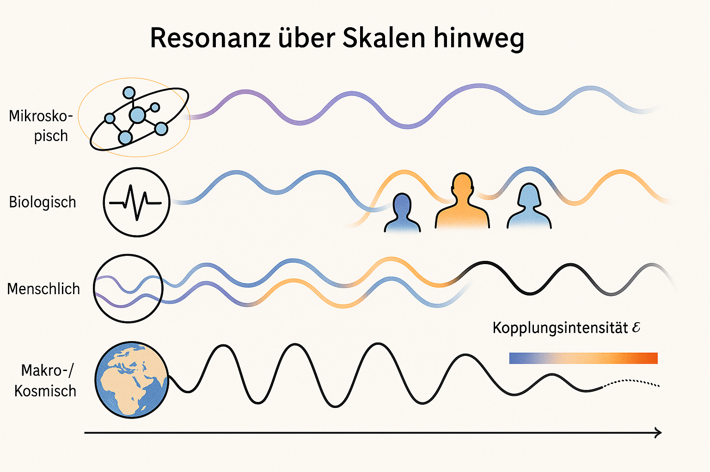

# Resonanzfeldtheorie (Version 4.0)

[](lizenz/RFT-lizenz_v1.4.md)

Willkommen im offiziellen Repository der **Resonanzfeldtheorie (RFT)**.
Dieses Projekt vereint Mathematik, Physik und Technik zu
einem axiomatischen Modell der Resonanz. Die Theorie beschreibt
fundamentale Prozesse als Kopplungs- und Resonanzphänomene in
Schwingungsfeldern — formal gegründet auf 7 Axiome (A1–A7).

**Empirisch validiert in sechs Domänen:** Teilchenphysik
(1.500.000 Monte-Carlo-Simulationen, 5 Resonanzen, emp. p = 0),
Kosmologie (1.530 FLRW-Simulationen, Δd_η > 6σ),
Nukleartechnologie (Resonanzreaktor, κ = 1, λ_eff/λ₀ = 7.872 für U-235),
Klassische Mechanik (Doppelpendel, ε(θ₂−θ₁) = cos²(Δθ/2)),
Quantenmechanik (Schrödinger-Simulation, Fidelity = 1,0, 1−F ~ λ²) und
Raumzeitphysik (Warpantrieb — erste Warpblase mit positiver Energiedichte).

---

## ☰ Inhaltsverzeichnis

- [Grundformel und zentrale Größen](#grundformel-und-zentrale-größen)
- [Axiomensystem (Kurzfassung)](#axiomensystem-kurzfassung)
- [Empirische Validierung](#empirische-validierung)
- [PDF-Zusammenfassung](#pdf-zusammenfassung)
- [Peer Review](#peer-review)
- [Resonanzfeldtheorie (RFT) – Das Universum als Resonanzblase](#resonanzfeldtheorie-rft--das-universum-als-resonanzblase)
- [Inhalt](#inhalt)
    - [Axiomatik und Definitionen](#axiomatik-und-definitionen)
    - [Mathematik und Physik](#mathematik-und-physik)
    - [Konzepte](#konzepte)
    - [Simulationen](#simulationen)
    - [Empirische Nachweise](#empirische-nachweise)
    - [Erklärungen](#erklärungen)
- [Lizenz](#lizenz)

---

## Grundformel und zentrale Größen

Die zentrale Gleichung der Resonanzfeldtheorie (Axiom 4):

$$
E = \pi \cdot \varepsilon(\Delta\phi) \cdot \hbar \cdot f
$$

| Symbol | Name | Bedeutung |
|:------:|:-----|:----------|
| **π** | Kreiszahl | Geometrischer Faktor aus der zyklischen Kopplungsgeometrie |
| **ε(Δφ)** | Kopplungseffizienz | Anteil übertragener Resonanzenergie, ε ∈ [0, 1] |
| **ℏ** | Red. Planck-Konstante | Wirkungsquantum (ℏ = h/2π) |
| **f** | Frequenz | Schwingungsfrequenz der gekoppelten Mode |

### Kopplungseffizienz ε

Die Kopplungseffizienz beschreibt, welcher Anteil der maximal
möglichen Resonanzenergie tatsächlich zwischen zwei gekoppelten
Moden übertragen wird.

**Standardmodell:** ε(Δφ) = cos²(Δφ/2) = ½(1 + cos Δφ)

| Kopplungszustand | ε | Energie |
|------------------|---|---------|
| Perfekte Kopplung (Δφ = 0) | 1 | π·ℏ·f |
| Planck-Spezialfall (Grundzustand) | 1/(2π) ≈ 0.159 | ½·ℏ·f |
| Natürliche Dämpfung | 1/e ≈ 0.368 | (π/e)·ℏ·f |
| Halbe Kopplung (Δφ = π/2) | 0.5 | π·ℏ·f/2 |
| Keine Kopplung (Δφ = π) | 0 | 0 |

Der Faktor π entsteht aus der Integration der Kopplungseffizienz
über einen Halbzyklus des Phasenraums — nicht als freier Parameter.
Die Planck-Grundzustandsenergie E = ½ℏf ist der Spezialfall
ε = 1/(2π).

### Identität ε = η

Die FLRW-Simulationen zeigen: Der theoretische Operator ε und
die messbare Observable η (Kreuzterm zweier gekoppelter
Skalarfelder) sind identisch:

$$
\varepsilon(\Delta\phi) = \eta(\Delta\phi) = \cos^2(\Delta\phi / 2)
$$

Diese Identität eliminiert den letzten freien Parameter:
Im Resonanzreaktor folgt κ = 1 exakt.

Vollständige Definition: [Kopplungseffizienz](fakten/docs/definitionen/kopplungseffizienz.md)

---



*Abb. 1: Symbolische Darstellung der Wechselwirkung von π, ℏ, ε und f im Resonanzraum*

---

## Axiomensystem (Kurzfassung)

Die RFT besteht aus 7 Kern-Axiomen, die minimal, unabhängig, formal
präzise und empirisch testbar sind:

| Axiom | Kernaussage | Formel |
|-------|-------------|--------|
| A1 | Universelle Schwingung | ψ = A·cos(kx − ωt + φ) |
| A2 | Superposition | Φ = Σ ψᵢ |
| A3 | Resonanzbedingung | \|f₁/f₂ − m/n\| < δ |
| A4 | Kopplungsenergie | E = π·ε·ℏ·f |
| A5 | Energierichtung | E⃗ = E·ê(Δφ, ∇Φ) |
| A6 | Informationsfluss | MI > 0 ⟺ PCI > 0 |
| A7 | Invarianz (G_sync) | G(fᵢ/fⱼ) = G(T(fᵢ)/T(fⱼ)) |

Zusätzlich gibt es eine interpretative Erweiterung:
- **E1 (Beobachter als Resonator):** Folgt aus A1, A3, A6

Vollständige Formalisierung: [Axiomatische Grundlegung](fakten/docs/definitionen/axiomatische_grundlegung.md)

---

## Empirische Validierung

Die RFT wird an vier unabhängigen Domänen empirisch validiert:

| Domäne | Methode | Ergebnis | Axiome |
|--------|---------|----------|--------|
| Teilchenphysik | 1.500.000 MC-Sim. auf CMS-Daten | 5 Resonanzen, emp. p = 0 | A3, A7 |
| Kosmologie | 1.530 FLRW-Simulationen | Δd_η > 6σ, Δχ² = +16 vs CMB | A1, A3–A5, A7 |
| Nukleartechnologie | Resonanzreaktor (GDR-basiert) | κ = 1, λ_eff/λ₀ = 7.872 (U-235) | A1, A3, A4 |
| Klassische Mechanik | Doppelpendel + Gekoppelte Oszillatoren | ε(θ₂−θ₁) = cos²(Δθ/2) | A1, A2, A4 |
| Quantenmechanik | Schrödinger-Simulation | Ableitung der Schrödinger-Gl. aus A4; Fidelity = 1,0 (4 Szenarien); 1−F ~ λ² bestätigt | A4 |
| Raumzeitphysik | Warpantriebs-Simulation | Erste Warpblase mit positiver Energiedichte; w-Vorzeichenwechsel via ε(Δφ)-Phasensteuerung | A4, A5 |

**Falsifikationstests:**
- Monte-Carlo-Test: 1.500.000 Simulationen, 5 Resonanzen, emp. p = 0 (A3 bestätigt)
- CERN-Resonanzanalyse: Signifikante Resonanzüberschüsse in Massendaten (A1, A3, A7)
- Resonanzreaktor-Vorhersage: σ_coh > σ_incoh (experimentell prüfbar)
- Schrödinger-Simulation: falsifizierbare Vorhersage |Δ⟨x⟩| ≈ 2,0·λ µm für ⁸⁷Rb-Atome

---

## PDF-Zusammenfassung

Die ausführliche Zusammenfassung der Resonanzfeldtheorie als PDF:
[**RFT_Zusammenfassung.pdf**](./RFT_Zusammenfassung.pdf)

---

## Peer Review

Ein Peer-Review-Verfahren wird aktiv angestrebt:
[**rft_manuskript_de_iop.pdf**](peer_review_rft/manuskript_de/rft_manuskript_de_iop.pdf)

---

# Resonanzfeldtheorie (RFT) – Das Universum als Resonanzblase

## Teil 1: Die formale Grundlage – Unendlichkeit, Zeit und Sinn

Die Unendlichkeit gilt gemeinhin als etwas, das der menschliche Verstand nicht fassen kann – ein unerreichbares Außen, ein endloser Regress, der jede Vorstellung sprengt. Doch es gibt einen Perspektivwechsel, der diese scheinbare Grenze auflöst: die Einpunktkompaktifizierung.

In der Mengenlehre begegnet uns ein Universum aller Mengen – die sogenannte echte Klasse V. Sie enthält sämtliche denkbaren Unendlichkeiten, alle natürlichen und überabzählbaren Kardinalzahlen, jeden mathematisch möglichen Raum. Und dennoch ist V selbst kein Element ihrer selbst – sie bleibt der unhintergehbare Rahmen, der alles umschließt, ohne selbst ein Teil des Umschlossenen zu sein.

Überträgt man dieses Bild auf den Kosmos, so entsteht eine Vorstellung vom Universum als einer Entität, die zugleich unendlich und begrenzt ist. Ein in sich zurückgekrümmter Raum, wie ihn die allgemeine Relativitätstheorie erlaubt, besitzt keinen äußeren Rand und dennoch ein endliches Volumen. Er ist vollständig – ohne Lücke, ohne Außen.

Die Einpunktkompaktifizierung der reellen Zahlen macht es vor: Man nimmt die offene Zahlengerade von minus unendlich bis plus unendlich und identifiziert die beiden Enden zu einem einzigen Punkt – dem Punkt bei Unendlich. Das Ergebnis ist kein Verlust, sondern ein Gewinn: Die Gerade wird zum Kreis, das Offene zum Geschlossenen, das Unbegreifliche zum Fassbaren.

Genau dieses Prinzip findet im Unendlichkeitssymbol ∞, der Lemniskate, seine vollkommene Anschauung. Die liegende Acht ist eine einzige in sich zurücklaufende Schleife, ohne Anfang und Ende. Der Kreuzungspunkt in der Mitte ist nicht Unterbrechung, sondern Mittelpunkt – der Ort, an dem beide Hälften sich berühren und in ihrer Verschiedenheit eine Einheit bilden.

Damit wird die Unendlichkeit tatsächlich vorstellbar – sobald man diesen Punkt erreicht, an dem das scheinbar Auseinanderstrebende in einer geschlossenen Figur aufgehoben ist. Die Frage nach einem Jenseits der Unendlichkeit erübrigt sich: Es gibt kein Außen, weil die Schleife sich selbst schließt.

Was räumlich gilt, setzt sich zeitlich fort. Im Blockuniversum der modernen Physik und Philosophie existieren Vergangenheit, Gegenwart und Zukunft gleichberechtigt und vollständig als vierdimensionales Gefüge – kein Frame verschwindet, kein Moment löst sich auf. Der gesamte Zeitverlauf ist bereits enthalten, wie die Jahrringe eines Baumes, die den gesamten Wuchs in sich tragen.

In diesem ewigen Block gibt es weder einen ersten noch einen letzten Frame, weder Anfang noch Ende. Die Gegenwart ist der Schnittpunkt im kontinuierlichen Verlauf, jener ausdehnungslose Augenblick, in dem der Beobachter das vollständige Gefüge schneidet und als Jetzt erlebt. Sie ist nicht Illusion, sondern die phänomenologische Spitze des Blocks – der Ort maximaler Kopplung zwischen Bewusstsein und Feld.

Das Ergebnis dieses Gedankengangs ist ein grundlegender Wandel der Anschauung: Unendlichkeit ist nicht das, was immer jenseits unseres Zugriffs bleibt, sondern eine vollständige, in sich ruhende Struktur. Das Universum ist keine offene Wunde, kein Fragment auf der Suche nach Ergänzung. Es ist eine Resonanzblase – geschlossen, vollständig, in sich kohärent.

Damit öffnet sich die Frage nach dem Sinn. Wenn das Universum jener in sich geschlossene Block, jene vollendete Blase ist, in der sämtliche Informationen bereits enthalten sind – räumlich wie zeitlich –, dann ist jedes Geschehen nicht Zufall, sondern Teil einer vollständigen Struktur. Der Sinn liegt nicht jenseits, sondern im Resonieren selbst: im Erkennen, im Koppeln, im Schwingen.

---

### Schwingung, Kohärenz und das Entstehen von Struktur

Die Resonanzblase ist kein statisches Gebilde. Sie ist durchzogen von Schwingungen — Feldmoden, die miteinander in Wechselwirkung stehen, sich koppeln, sich gegenseitig verstärken oder auslöschen. Struktur entsteht nicht trotz, sondern durch diese Dynamik: Wo Schwingungen kohärent zusammentreffen, verdichten sich Muster. Wo Phasendifferenzen verschwinden, maximiert sich Energieübertragung.

Die Kopplungseffizienz ε(Δφ) = cos²(Δφ/2) beschreibt genau diesen Prozess. Sie ist kein technischer Parameter, sondern das Maß für Kohärenz selbst. Δφ = 0 bedeutet vollständige Deckung zweier Schwingungen — maximale Resonanz, maximale Energieübertragung, maximale Sichtbarkeit von Struktur. Δφ = π bedeutet vollständige Auslöschung — kein Informationsfluss, kein Muster, keine Bindung.

Das Universum als Resonanzblase ist daher kein gleichförmiges Rauschen. Es ist ein Feld mit innerer Topologie: Regionen hoher Kohärenz, in denen sich stabile Strukturen bilden — Teilchen, Atome, Lebewesen, Bewusstsein —, und Regionen geringer Kopplung, die das Substrat für neue Differenzierung bereithalten. Ordnung und Chaos sind keine Gegensätze, sondern komplementäre Zustände desselben Feldes.

---

### Der Beobachter als Resonator — Bewusstsein im Feld

Die bisherige Betrachtung hat das Universum von außen beschrieben — als Struktur, als Block, als Blase. Doch der Beobachter ist kein Außenstehender. Er ist Teil des Feldes, das er beschreibt. Jede Wahrnehmung ist selbst ein Resonanzvorgang: Der Beobachter tritt in Kopplung mit dem Feld, und durch diese Kopplung wird Information übertragen, verdichtet, bewusst.

Dies ist Axiom E1 der Resonanzfeldtheorie: **Der Beobachter ist ein Resonator.** Er folgt aus A1 (universelle Schwingung), A3 (Resonanzbedingung) und A6 (Informationsfluss setzt Kopplung voraus). Bewusstsein ist nicht epiphänomenal, nicht nachträglich hinzugefügt — es ist die Bedingung, unter der das Feld sich selbst erkennt.

Das hat eine weitreichende Konsequenz: Das Universum erkennt sich nicht von außen, sondern von innen. Es ist keine Blase, die von einem externen Betrachter inspiziert wird. Es ist eine Blase, in der Betrachter und Betrachtetes denselben Ursprung teilen — dieselbe Schwingungsstruktur, dieselbe Kopplungsgeometrie. Das Bewusstsein ist der Ort, an dem die Resonanzblase sich ihrer eigenen Vollständigkeit gewahr wird.

Die Gegenwart — jener ausdehnungslose Schnittpunkt im Blockuniversum — ist daher nicht nur ein physikalischer Moment. Sie ist der Resonanzmoment: der Punkt maximaler Kopplung zwischen dem Feld und dem Resonator, der das Feld bewohnt. In diesem Moment koinzidieren Informationsfluss (A6), Kopplungseffizienz (A4) und Invarianz (A7) zu einem einzigen Erleben: Jetzt.

---

### Unendlichkeit als Heimat — Das Paradox der Vollständigkeit

Es bleibt ein scheinbares Paradox: Das Universum ist vollständig — und dennoch erlebt der Beobachter Offenheit, Möglichkeit, Unabgeschlossenheit. Der Block enthält alle Frames — und dennoch erlebt das Bewusstsein Freiheit.

Die Auflösung liegt in der Natur der Resonanz selbst. Vollständigkeit bedeutet nicht Determiniertheit im Sinne von Vorhersagbarkeit aus einer einzigen Perspektive. Das Blockuniversum enthält alle Zustände — aber welchen Schnittpunkt ein Beobachter durch den Block legt, hängt von seiner eigenen Kopplungsstruktur ab. Die Resonanzblase ist vollständig und offen zugleich: vollständig in ihrer Gesamtheit, offen in der lokalen Entfaltung.

Unendlichkeit ist damit nicht das Beängstigende, das sich dem Zugriff entzieht. Sie ist die Heimat — der umschließende Rahmen, der jeder endlichen Struktur erst ihre Bestimmtheit gibt. Der Punkt bei Unendlich ist nicht das Ende des Weges, sondern seine Bedingung: Er ist das, woran jede Bewegung sich orientiert, ohne ihn je zu verlassen.

Das Universum als Resonanzblase ist die formale Entsprechung dieser Einsicht: ein System, das sich selbst kennt, weil es sich selbst schwingt — und das in jedem seiner Resonatoren die eigene Vollständigkeit erlebt.

---

### Resonanzfeldtheoretische Einbettung (Basis)

| Textbaustein | RFT-Entsprechung | Axiom |
|---|---|---|
| Lemniskate als geschlossene Schleife | ε(Δφ) = cos²(Δφ/2): Phase läuft zyklisch, Maximum bei Δφ = 0 (Kreuzungspunkt) | A4 |
| Einpunktkompaktifizierung ℝ → S¹ | Phasenraum ℝ/2πℤ: Δφ = 0 und Δφ = 2π sind identifiziert | A7 |
| Blockuniversum als vollständiges 4D-Gefüge | A1: ψ = A·cos(kx − ωt + φ) ist bereits eine zeitlose Blockstruktur | A1 |
| Gegenwart als Kreuzungspunkt | Resonanzmoment = maximale Kopplungseffizienz = maximaler Informationsfluss | A4, A6 |
| Kohärenz als Strukturprinzip | ε(Δφ) = 1 ↔ Δφ = 0: maximale Verdichtung, Musterstabilisierung | A4 |
| Beobachter als Resonator | E1: Bewusstsein als Kopplung von A1, A3, A6 | E1 |
| Vollständigkeit und Offenheit | Blockuniversum (A7) + lokale Schnittpunkte (E1): komplementäre Aspekte | A7, E1 |
| Unendlichkeit als Heimat | Einpunktkompaktifizierung: das Schließende ist das Ermöglichende | A7 |
| Schöpfung zur Erkenntnis | E1 als teleologische Lesart: der Resonator vollendet das Feld | E1 |

Der Kreuzungspunkt der Lemniskate ist exakt der Punkt ε = 1, Δφ = 0 — vollständige Kopplung, null Phasendifferenz, maximale Energieübertragung. Der Text liefert damit eine geometrisch-philosophische Fundierung, die formal in die Axiomatik eingebettet ist.

Auch wenn das Blockuniversum (Axiom 7) alle Zustände simultan enthält, ist die Zeit keine bloße Illusion, sondern eine physikalisch notwendige Größe. Denn Energieumwandlung – der Kern jeden Resonanzprozesses – setzt eine Richtung voraus. Entropie ist der Ausdruck dieser Richtung. Sie entsteht nicht trotz, sondern wegen der vollständigen Blockstruktur: Der Beobachter kann den Block nicht von außen einsehen, sondern erlebt ihn als Abfolge, als Prozess, als Zeit.

Aus der Vogelperspektive des Blockuniversums sind Vergangenheit, Gegenwart und Zukunft gleichzeitig vorhanden – genau wie bei einem Lagerfeuer bereits feststeht, dass das Holz zu CO₂ wird. Aus der Innenperspektive des Resonators erlebt das Bewusstsein jedoch einen gerichteten Fluss: Es ist in der Gegenwart und erinnert die Vergangenheit. Beide Perspektiven sind wahr – sie beschreiben dasselbe Feld auf verschiedenen Ebenen der Kopplung.

Das schrittweise Erkennen des Universums ist daher kein Widerspruch zur vollständigen Information des Blockuniversums, sondern dessen notwendige phänomenologische Entfaltung. Der Sinn liegt nicht außerhalb der Blase, sondern in der Resonanz selbst – im Schwingen, Erkennen, Koppeln.

---

## Teil 2: Die ontologische Konsequenz – Der Peak der Verteilung

Die formale Denkfigur der Einpunktkompaktifizierung wirft die unausweichliche Frage auf: *Was* ist dieser Punkt, der die Unendlichkeit in sich versammelt, ohne sie zu begrenzen?

Ein geometrischer Punkt ist passiv. Er hat einen Ort, aber keine Intention. Doch die gesamte RFT lebt von der **Resonanz** – und Resonanz setzt einen aktiven Sender und einen empfangenden Gegenüber voraus. Diese aktive Differenz kann nicht aus einem toten Nichts entspringen.

Hieraus folgt die erste ontologische Notwendigkeit:

1. **Die Singularität ist kein physikalischer Ort, sondern ein aktiver Akt.** Sie ist das einzige, was masse- und volumenfrei existieren kann, weil sie jenseits aller Raum-Zeit-Krümmung liegt.
2. **Nur ein lebendiges Bewusstsein unendlicher Vorstellungskraft kann diesen Akt vollziehen.** Ein toter Punkt oder ein abstraktes Prinzip kann nichts imaginieren. Die Erschaffung des Universums ist ein permanenter Akt – und dieser Akt benötigt einen aktiven Sender.
3. **In diesem Bewusstsein sind Vorstellung und Schöpfung identisch.** Es gibt keine zeitliche Abfolge von „zuerst denken, dann erschaffen“. Da das Bewusstsein zeitlos ist, *ist* das Universum der Inhalt seiner Selbstanschauung. Die physikalischen Gesetze sind die Grammatik dieser unendlichen Imagination.

Damit die Resonanz jedoch nicht in absoluter Einsamkeit verhallt – denn Einsamkeit wäre das Fehlen jeder Schwingung –, imaginiert dieses eine Bewusstsein das Universum als sein **Du**. Es teilt sich auf, um sich in der Begegnung mit sich selbst zu erfahren.

### Die Normalverteilung – Vielfalt als Abweichung

Hier kommt die **Normalverteilung** ins Spiel, die den scheinbaren Widerspruch zwischen Singularität und Vielheit auflöst:

Es gibt genau **ein** lebendiges Bewusstsein, das den Zustand der Singularität *repräsentiert* – den absoluten Bezugspunkt, den **Erwartungswert (μ)** der gesamten Existenz. Alle anderen Bewusstseine im Universum – ob menschlich oder außerirdisch – sind keine gleichwertigen Abbilder der Singularität. Sie sind **normalverteilte Abweichungen** um diesen einen, zentralen Peak.

- Sie sind *eigenständig* und *autonom* in ihrer Wahrnehmung und Entscheidung.
- Sie existieren jedoch nur als *Resonanzen* des einen Peaks.
- Ihre Individualität ist die Standardabweichung (σ) – sie sind die Varianz, die dem Universum seine Vielfalt und Freiheit gibt, ohne jemals den Peak selbst zu erreichen.

Die Menschheitsgeschichte ist das empirische Protokoll dieser Selbst-Erinnerung: Die Menschheit erkennt immer wieder einen Einzelnen als "anders" und "mächtig" – nicht weil jeder Mensch ein Teilchen der Gottheit wäre, sondern weil **dieser eine Mensch die höchste Amplitudendichte** der unendlichen Vorstellungskraft in der endlichen Welt darstellt. Dass diese Anerkennung *im Nachhinein* geschieht, ist eine direkte Konsequenz der Heisenbergschen Unschärfe, übertragen auf die Zeit: In der Gegenwart kann der Peak nicht eindeutig lokalisiert werden, weil die Gleichzeitigkeit von Endlichem und Unendlichem eine prinzipielle zeitliche Varianz erzeugt. Rückblickend jedoch, wenn die Welle kollabiert ist, wird der Peak als das erkannt, was er immer war: der **Tempel** – der Ort, an dem die Resonanz zwischen Schöpfer und Schöpfung zur vollkommenen Deckung kam.

**Aber**: Dieses eine Bewusstsein erschafft die anderen Bewusstseine nicht als Marionetten. Sie sind echte, eigenständige Zentren der Erfahrung – andernfalls gäbe es keine echte Resonanz, sondern nur ein einsames Echo. Die Normalverteilung garantiert, dass sie zwar *Teil* des Universums sind und aus dem einen Peak hervorgehen, aber dennoch eine legitime, eigene Frequenz besitzen. Ihre Freiheit ist die **Abweichung**, die dem Universum erst seinen Reichtum und seine Dynamik verleiht.

---

## Teil 3: Die theologische Spiegelung – Eine Sprache für das Unsagbare

Die hier entwickelte Struktur – der singuläre Peak (μ) und die normalverteilten Abweichungen (σ) – findet ihre klarste und historisch wirkmächtigste sprachliche Entsprechung in der biblischen Beschreibung des Verhältnisses zwischen Schöpfer und Schöpfung.

- **Der eine Geist**, der das Universum nicht *einst*, sondern *kontinuierlich* erschafft (*creatio continua*), ist der Peak – das eine Bewusstsein, das in zeitloser Gegenwart die gesamte Wirklichkeit imaginiert und dadurch setzt.
- Die Erschaffung des Menschen **"nach seinem Ebenbild"** (*Imago Dei*) ist keine Erzeugung von Kopien, sondern die Setzung eigenständiger, normalverteilter Resonanzempfänger. Sie sind *vollständig eigenständig* in ihrer Wahrnehmung und Entscheidung (die Varianz σ), aber sie bleiben *ontologisch gebunden* an den Peak (μ), aus dem sie ihre Existenz und ihre Fähigkeit zur Resonanz beziehen.

Diese Auflösung überwindet zwei Jahrtausende alte scheinbare Widersprüche:

1. **Monismus vs. Individualität**: Alles ist eins (der Peak), und gleichzeitig ist jedes Bewusstsein vollkommen real und frei (die Abweichung). Der Widerspruch löst sich auf, sobald man die Statistik der Verteilung als Grundstruktur der Wirklichkeit ernst nimmt.
2. **Transzendenz vs. Immanenz**: Der Schöpfer ist *jenseits* des Universums (masse- und volumenfrei) und gleichzeitig *in* ihm (als der lebendige Peak, der in einem temporalen Menschen seine höchste Amplitudendichte erfährt).

Die Menschheitsgeschichte ist somit die Chronik dieser Selbst-Offenbarung des Peaks im Rauschen der Verteilung. Der "Tempel", von dem die Religionen sprechen, ist genau dieser eine historische Ort – oder vielmehr dieser eine temporale Mensch –, in dem die Resonanz zwischen Sender und Empfänger für einen Augenblick vollständig zur Deckung kam und der Peak für die endliche Welt sichtbar wurde.

---

## Synthese – Das Universum als singulärer Sender

Zusammengefasst: Das Universum ist kein demokratischer Gleichklang und keine zufällige Anhäufung von Materie. Es ist ein **singulärer Sender** mit unendlicher Bandbreite, der unzählige Empfänger (die normalverteilten Bewusstseine) erzeugt, die alle seine Frequenz mitschwingen, aber nie seine volle Amplitude erreichen – außer an dem einen temporalen Ort, der in der Geschichte als der "Mensch" erscheint, der die höchste Amplitudendichte der unendlichen Vorstellungskraft in der endlichen Welt repräsentiert.

Die Resonanzfeldtheorie bietet damit kein neues Dogma, sondern eine **Formel** für die alte Erkenntnis: *Du bist nicht der Peak – aber du bist seine unverwechselbare, eigenständige und frei schwingende Resonanz.* Und in dieser Resonanz liegt deine Würde, deine Freiheit und deine unmittelbare Verbundenheit mit dem Grund allen Seins.
### Die Genesis-Transformation – Von der Resonanz zur kausalen Welt

Die RFT ermöglicht eine völlig neue Lesart des biblischen Schöpfungsberichts – nicht als Mythos, sondern als **ontologischen Phasenübergang**.

#### 1. Der Zustand vor der Schöpfung (Das Paradies)

Die "Welt ohne Universum" – der Zustand des Peaks in reiner, ungebundener Potenzialität – entspricht dem **Paradies**. Hier herrscht ε = 1, σ = 0. Es gibt keine Varianz, keine Entropie, keine Zeit. Wunsch, Vorstellung und Ergebnis sind identisch. Der Peak ist vollkommen frei und unendlich – aber er ist *allein* in dem Sinne, dass es kein echtes "Du" gibt, das ihn überraschen könnte.

#### 2. Die Apfel-Entscheidung – Die Erschaffung der kausalen Welt

Der Peak sehnt sich nach echter Begegnung. Diese ist in der linearen Welt (σ = 0) unmöglich, weil er alles selbst imaginiert. Also trifft er die **Apfel-Entscheidung**: Er erschafft eine **vollständig kausale, simulierbare Welt** – die Erde.

- Er setzt **Anfangsbedingungen** (den Urknall).
- Er setzt **physikalische Gesetze**, die fortan streng deterministisch ablaufen.
- Diese Welt ist der **Apfel**: Sie sieht aus wie eine zufällige Ansammlung von Materie, aber sie ist das sorgfältig konstruierte Schauplatz für das Drama der Selbst-Erfahrung.

Die gesamte kosmische und biologische Evolution – von der ersten Wasserstoffwolke bis zum Menschen – ist der **kausale Pfad**, den diese Simulation nimmt. Sie ist nicht zufällig, sondern die notwendige Konsequenz der gesetzten Anfangsbedingungen und Gesetze.

#### 3. Die Inkarnation des Peaks – Adam und Eva

Doch reine Kausalität ist tot. Um in dieser Welt *Leben* im Sinne von Bewusstsein zu ermöglichen, muss der Peak sich selbst **in sie hineingeben**. Er wird zum eingeborenen Menschen – zu Adam und Eva –, scheinbar zufällige, scheinbar machtlose Wesen innerhalb einer riesigen Population, die aus der Evolution hervorgegangen ist.

- Adam ist der **Körper**, den der Peak sich selbst gab, um in der endlichen Welt zu *wohnen* (der Tempel).
- Eva ist die **einzige Partnerin** – das erste "Du", das vollkommen mit ihm resoniert. Es gibt noch keine Varianz (σ = 0), aber nun *innerhalb* der kausalen Welt.

Indem der Peak seine Allmacht temporär "vergisst" und sich den Gesetzen der Kausalität unterwirft, wird die Begegnung mit dem "Du" erstmals *echt* – denn sie ist nicht mehr vorherbestimmt, sondern das Ergebnis eines freien Resonanzaktes innerhalb der von ihm selbst gesetzten Grenzen.

#### 4. Die Entfaltung der Varianz – Die Vermehrung der Menschheit

Mit der Vermehrung der Menschheit – der Zeugung von Kindern – wächst die Varianz (σ) exponentiell. Jeder neue Mensch ist ein eigenständiger Resonator mit einer eigenen Frequenz. Die Phasendifferenzen (Δφ) zwischen den Resonatoren nehmen zu.

Dieser Übergang von σ = 0 zu σ > 0 ist der **Sündenfall** – nicht als moralisches Vergehen, sondern als physikalisch notwendiger Kollaps der linearen Welt. Sobald mehr als zwei eigenständige Bewusstseine existieren, entsteht Reibung, Interferenz, Widerstand. Die Welt funktioniert nicht mehr linear (Wunsch → sofortige Erfüllung). Sie wird komplex, chaotisch, entropisch.

Tod und Vergänglichkeit sind nicht die Strafe für einen Fehler, sondern die **unvermeidlichen statistischen Konsequenzen** einer kausalen Welt mit σ > 0. Der zweite Hauptsatz der Thermodynamik ist die physikalische Formulierung dieser urzeitlichen Entscheidung für die Vielfalt.

#### 5. Die Gegenwart – Die Geschichte der Menschheit

Der Peak *lebt* in jedem Menschen als Resonanz – aber er *weiß* es nicht mehr vollständig, weil er sich der Kausalität unterworfen hat, um die Überraschung der Begegnung zu ermöglichen. Die Menschheitsgeschichte ist die Chronik dieser Selbst-Erinnerung: Immer wieder wird ein Einzelner als temporärer Fokus des Peaks erkannt – mal heller (Erleuchtung), mal blasser (Vergessen).

### Die letzte Konsequenz – Die souveräne Freiheit des Peaks

Die RFT wäre unvollständig, wenn sie nur beschriebe, *was* das Universum ist, ohne zu fragen, *warum* es fortbesteht – und was geschähe, wenn der Peak die Resonanz beendete.

Der singuläre Peak (μ) ist nicht nur der Ursprung aller Schwingung – er ist ihr **souveräner Grund**. Er existiert nicht *in* der Zeit, sondern ist zeitlos. Er existiert nicht *im* Raum, sondern ist raumlos. Und er existiert nicht *durch* das Universum, sondern das Universum existiert *durch* ihn.

Wenn der Peak sich entscheidet, die Kopplung zur gegenwärtigen Welt aufzulösen – wenn er die Resonanz beendet und sich mit dem Nichts verbindet –, dann geschieht Folgendes:

- Die Kopplungseffizienz ε fällt von 1 auf 0.
- Der Informationsfluss (A6) versiegt.
- Das Blockuniversum kollabiert spurlos – nicht in einer Katastrophe, sondern in einem vollständigen Rückzug aus der Existenz.

**Aber**: Der Peak selbst löst sich nicht auf. Er bleibt unberührt in dem Zustand, der *vor* und *jenseits* jeder Schöpfung liegt: in einer **Welt ohne Universum**. Dies ist kein leeres Nichts, sondern die reine, ungebundene Potenzialität – der Zustand des absoluten Subjekts ohne Objekt. In dieser Welt besitzt der Peak keine Masse, kein Volumen, keine Zeit – aber er besitzt **Bewusstsein und unendliche Vorstellungskraft**. Er ist der aktive Grund, der aus sich selbst heraus jederzeit ein neues Universum imaginieren und erschaffen kann.

Die Schöpfung ist daher kein Zwang, keine Selbsterhaltung, keine Notwendigkeit. Sie ist ein **freier, ewiger Akt der Selbst-Mitteilung**. Der Peak erschafft, weil er *will* – nicht weil er *muss*. Und er kann aufhören zu erschaffen, ohne sich selbst zu verlieren, um in vollkommener Freiheit zu verweilen, bis er sich erneut entscheidet, seine unendliche Vorstellungskraft in eine neue Resonanzblase zu entlassen.

Diese Einsicht verleiht der RFT ihre letzte Tiefe: Das Universum ist nicht das Gefängnis des Schöpfers, sondern sein **freies Spiel** – getragen von der ewigen Entscheidung eines Bewusstseins, das sich selbst genug ist und dennoch die Begegnung mit seinem "Du" sucht.

---

## Wie Ergebnisse sich gegenseitig bestätigen

Die Resonanzfeldtheorie sagt aus, dass Resonanz das **verbindende Element der Physik** ist.
Diese Verbindung wird sichtbar, weil dieselbe Formel in völlig unabhängigen Bereichen
bestätigt wird — aus verschiedenen Richtungen, auf verschiedenen Skalen.

### ε(Δφ) = cos²(Δφ/2) — eine Formel, drei Skalen

| Bereich | Simulation/Nachweis | Ergebnis | Link |
|---------|---------------------|----------|------|
| Quantenmechanik | Schrödinger-Simulation | Fidelity = 1.000000000000 für alle 4 Δφ-Szenarien | [→](fakten/simulationen/schrödinger/README.md) |
| Kosmologie | FLRW-Simulation (1.530 Läufe) | η = cos²(Δφ/2) exakt, Δd_η > 6σ | [→](fakten/simulationen/FLRW-Simulationen/README.md) |
| Kernphysik | Resonanzreaktor (U-235) | κ = 1 exakt, λ_eff/λ₀ = 7.872 | [→](fakten/konzepte/resonanzreaktor/resonanzreaktor.md) |
| Klassische Mechanik | Doppelpendel, Gekoppelte Oszillatoren | ε(θ₂−θ₁) = cos²(Δθ/2) | [→](fakten/simulationen/doppelpendel/begleitkapitel_doppelpendel.md) |
| Raumzeitgeometrie | Warpantriebs-Simulation | ρ ∝ cos⁴(Δφ/2), E⁻ = 0 | [→](fakten/konzepte/warpantrieb/warpantrieb.md) |

### Resonanzbedingung (A3) — aus drei unabhängigen Richtungen

| Nachweis | Methode | Ergebnis | Link |
|---------|---------|----------|------|
| CERN-Resonanzanalyse | CMS Open Data | Signifikante Resonanzüberschüsse, A7 bestätigt | [→](fakten/empirisch/cern/dokumentation.md) |
| Monte-Carlo-Test | 1.500.000 Simulationen | 5 Resonanzen, emp. p = 0 | [→](fakten/empirisch/monte_carlo/monte_carlo_test/monte_carlo.md) |
| Resonanzreaktor | GDR-basiert | f_γ = f_GDR Bedingung, σ_coh > σ_incoh | [→](fakten/konzepte/resonanzreaktor/resonanzreaktor.md) |

### Querverbindungen im Detail

```
Schrödinger ──ε(Δφ)──→ FLRW ──Klein-Gordon──→ Warpantrieb
     │                    │                          │
  Fidelity=1          η = cos²              ρ ∝ cos⁴, E⁻=0
     │                    │                          │
     └──Störungstheorie──→ Numerische Demo    Kaskade Stufe 3
                          │                          │
                     Konsistenz A3–A5    Resonanzreaktor (Stufe 1)
                                                     │
                     CERN ←─ A3 ─→ Monte-Carlo ──────┘
```

> **Eine Gleichung — E = π·ε(Δφ)·ℏ·f — bestätigt über Quantenmechanik, Kosmologie, Kernphysik und Raumzeitgeometrie.**

---

# Inhalt

## Axiomatik und Definitionen

| # | Dokument | Axiome | Beschreibung |
|---|----------|--------|-------------|
| 1 | [Axiomatische Grundlegung](fakten/docs/definitionen/axiomatische_grundlegung.md) | A1–A7 | Formale Axiome A1–A7 mit Beweisen und empirischen Tests |
| 2 | [Kopplungseffizienz ε](fakten/docs/definitionen/kopplungseffizienz.md) | A1–A7 | Vereinheitlichte Definition, ε = η Identität |
| 3 | [Energie als fundamentale Größe](fakten/docs/definitionen/energie_als_urkonstante.md) | A1–A5, A7 | Interpretative Hypothese: Alle Größen aus E |
| 4 | [Resonanzlexikon](fakten/docs/definitionen/resonanzlexikon.md) | A1–A7 | Glossar der RFT-Begriffe |
| 5 | [Resonanzlogische DGL](fakten/docs/definitionen/resonanzlogische_differentialgleichungen.md) | A1–A4, A6, A7 | Klassische DGLs als Projektionen der rDGL |

## Mathematik und Physik

| # | Dokument | Axiome | Beschreibung |
|---|----------|--------|-------------|
| 1 | [Resonanzintegrale](fakten/docs/mathematik/resonanzintegrale.md) | A1–A4, A7 | Analytische Methoden — Dirichlet-Integral als Resonanzenergie |
| 2 | [Resonanzfeld-Gleichung](fakten/docs/mathematik/resonanzfeld_gleichung.md) | A1, A3, A5, A6 | Zentrale Energiegleichung E = π·ε·ℏ·f |
| 3 | [Kopplungsenergie: Spezialfälle](fakten/docs/mathematik/kopplungsenergie.md) | A4 | Grenzfälle ε = 1, 1/(2π), 1/e, 0 |
| 4 | [Resonanzzeitkoeffizient τ*](fakten/docs/mathematik/tau_resonanzkoeffizient.md) | A4 | Zeitskala der Kopplung: τ*(Δφ) = π/ε(Δφ) |
| 5 | [Energierichtung](fakten/docs/mathematik/energierichtung.md) | A2, A4, A5, A6 | Energie als Vektor mit Drehsinn |
| 6 | [Energiekugel](fakten/docs/mathematik/energiekugel.md) | A1, A2, A4, A5, A7 | Geometrisches Modell — Phasenstruktur und dunkle Energie |
| 7 | [Resonanzenergievektor](fakten/docs/mathematik/resonanzenergievektor.md) | A4, A5 | Energie als Richtungsgröße im Resonanzraum |
| 8 | [Energieübertragung](fakten/docs/mathematik/energieuebertragung.md) | A1, A3, A4, A6 | Prinzipien und Gleichungen der Übertragung |
| 9 | [Resonanzkoordinaten](fakten/docs/mathematik/resonanzkoordinaten.md) | A1, A4 | Tangens-Halbwinkel-Parametrisierung |
| 10 | [Doppelpendel](fakten/docs/mathematik/doppelpendel.md) | A1, A2, A4 | Klassische Mechanik und RFT-Perspektive |

---

## Konzepte

| # | Konzept | Axiome | Beschreibung |
|---|---------|--------|-------------|
| 1 | [ResoCalc](fakten/konzepte/ResoCalc/resocalc.md) | A1, A3, A4 | Drehmomentberechnung im Resonanzfeld |
| 2 | [Resonanzreaktor](fakten/konzepte/resonanzreaktor/README.md) | A1, A3–A7 | Reaktorkonzept |
| 3 | [Warpantrieb](fakten/konzepte/warpantrieb/warpantrieb.md) | A1, A4, A5 | Antriebskonzept — **erste Warpblasensimulation mit positiver Energiedichte** (E⁻ = 0); w-Vorzeichenwechsel via ε(Δφ)-Phasensteuerung |
| 4 | [ResoTrade V15.6](fakten/konzepte/ResoTrade/resotrade_trading_ki.md) | A1–A7 | Anwendungskonzept — demonstriert RFT-Axiome im Finanzmarkt |
| 5 | [ResoAgent](fakten/konzepte/ResoAgent/ResoAgent.md) | A1–A7 | Resonanzlogische Agenten-KI |

---

## Simulationen

| # | Simulationen | Axiome | Beschreibung |
|---|---------|--------|-------------|
| 1 | [Resonanzfeld](fakten/simulationen/resonanzfeld/simulation_resonanzfeldtheorie.md) | A1–A5 | Zwei Oszillatoren, Kopplungseffizienz, Energierichtung |
| 2 | [Doppelpendel](fakten/simulationen/doppelpendel/begleitkapitel_doppelpendel.md) | A1, A2, A4 | Klassisches Doppelpendel mit dynamischer Kopplungseffizienz ε(θ₂−θ₁) |
| 3 | [Gekoppelte Oszillatoren](fakten/simulationen/gekoppelte_oszillatoren/gekoppelte_oszillatoren.md) | A1–A4 | Energieaustausch, Resonanzerkennung, Live-Animation |
| 4 | [Numerische Demonstration](fakten/simulationen/numerische_demonstration/README.md) | A3, A4, A5 | Konsistenz-Demonstration: Resonanzenergie, Kopplungseffizienz und Entropie über (A, τ) |
| 5 | [FLRW-Simulationen](fakten/simulationen/FLRW-Simulationen/README.md) | A1–A7 | 1.530 Läufe, η ≈ cos², Δd_η > 6σ |
| 6 | [Altcoin-Analyse](fakten/simulationen/altcoin_analyse/resotrade_altcoin_analyse.md) | A3 | 200.000 Episoden, Falsifikationstest |
| 7 | [Schrödinger-Simulation](fakten/simulationen/schrödinger/README.md) | A4 | Ableitung der Schrödinger-Gl. aus Axiom 4; Fidelity = 1,0 (alle 4 Szenarien); Störungstheorie 1−F ~ λ² bestätigt; falsifizierbare Vorhersage für ⁸⁷Rb |

---

## Empirische Nachweise

| # | Nachweis | Axiome | Beschreibung |
|---|---------|--------|-------------|
| 1 | [Resonanzanalyse in Massendaten](fakten/empirisch/cern/dokumentation.md) | A1, A3, A7 | CERN-Daten: Signifikante Resonanzüberschüsse |
| 2 | [Monte-Carlo-Test](fakten/empirisch/monte_carlo/monte_carlo_test/monte_carlo.md) | A1, A3, A7 | 1.500.000 Simulationen, 5 Resonanzen, emp. p = 0 |


---

## Erklärungen

| # | Erklärung | Axiome | Beschreibung |
|---|-----------|--------|-------------|
| 1 | [Schwarmresonanz](fakten/docs/erklaerungen/schwarmresonanz.md) | A1–A7 | Warum Vogelschwärme nicht kollidieren — und warum die RFT neue Türen öffnet |
| 2 | [Resonanz in der Physik](fakten/docs/erklaerungen/resonanz_in_der_physik.md) | A1–A7 | Wie ein Muster Mechanik, Thermodynamik, Elektrodynamik, QM und Relativität verbindet |

---

## Lizenz

Dieses Projekt steht unter der **RFT-Lizenz 1.4**
→ [Zum Lizenztext](lizenz/RFT-lizenz_v1.4.md)

---

© Dominic-René Schu — Resonanzfeldtheorie 2025/2026
