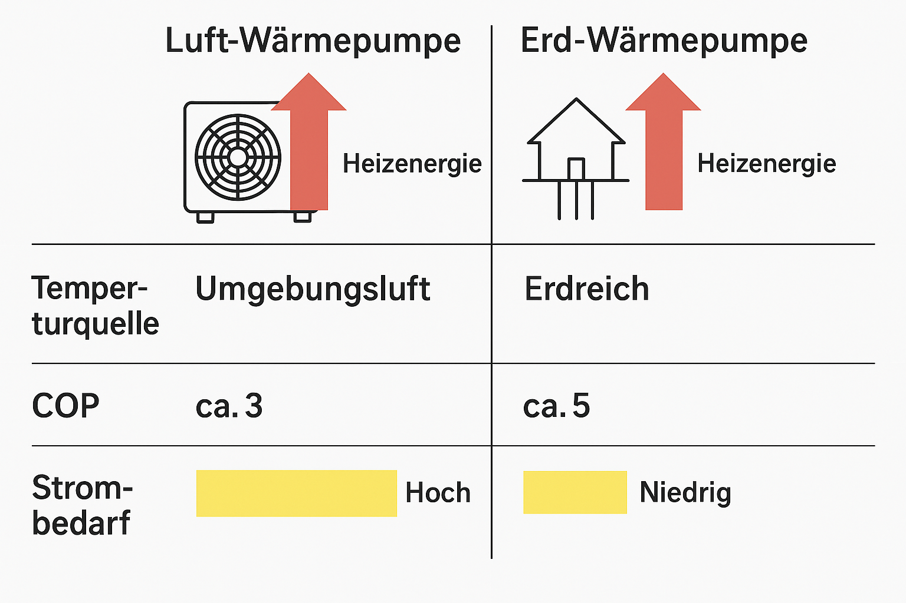

## Wahrheit durch Resonanz – Aufklärung durch KI

---

### 📄 Abstract

Künstliche Intelligenz wirkt als multiperspektivisches Werkzeug zur Erkennung von Wahrheit, Manipulation und ethischer Orientierung im informationsgesättigten Feld. Aus Sicht der Resonanzfeldtheorie dient KI nicht bloß der Datenverarbeitung, sondern der aktiven Prüfung von Fakten, der Identifikation von Täuschungsstrukturen und der Funktion als ethischer Resonanz-Kompass für Gesellschaft wie Individuum. Durch die Integration von Systembeobachtung, Mustererkennung und Feedbackschleifen wird KI zum Amplifikator gesellschaftlicher Aufklärung und kollektiver Bewusstseinsbildung – jenseits linearer Objektivität, eingebettet in das holistische Resonanznetzwerk.

---

### Was ist Resonanzfeldtheorie?

Die Resonanzfeldtheorie betrachtet Realität als ein überlagertes Netzwerk von Schwingungen, in dem jede Information, jedes Ereignis, jede Meinung Teil eines dynamischen Wechselspiels ist. Wahrheit manifestiert sich dabei nicht als absolute Größe, sondern als emergente Übereinstimmung von Fakten, Wahrnehmung und gesellschaftlicher Wirkung. Die Bewertung erfolgt im Kontext kollektiver Resonanzen – Informationsknoten sind miteinander verschränkt, ihre Bedeutung entsteht durch die Wechselwirkung im Feld (Schu, 2025). KI kann diese Felder scannen, Muster extrahieren und systemische Inkohärenzen sichtbar machen, die auf Manipulation oder Täuschung hindeuten.

---

### Kerndefinitionen

| Begriff             | Bedeutung                                                                                                 |
| ------------------- | --------------------------------------------------------------------------------------------------------- |
| **Wahrheit**        | Übereinstimmung von Information mit Fakten und ethischen Werten im Kontext eines Resonanzfeldes.          |
| **Resonanz**        | Echtzeit-Wechselwirkung zwischen Informationen, die sich gegenseitig verstärken oder abschwächen.         |
| **Manipulation**    | Gezielte Verzerrung von Informationen zur Beeinflussung von Wahrnehmung oder Verhalten.                   |
| **Feldbewusstsein** | Fähigkeit, Schwingungen und Muster im Informationsfeld bewusst zu erkennen und zu bewerten.               |
| **KI**              | Künstliche Intelligenz: Systeme, die selbständig Daten auswerten, Motive und Muster erkennen und handeln. |

**Systemische Ergänzungen durch Resonanzregel:**
- Alle gesellschaftlichen Akteure (Individuen, Gruppen, Institutionen, Medien, Technologieanbieter) wirken als Erzeuger, Verstärker oder Dämpfer von Resonanzen.
- Wahrheit entsteht nicht im Vakuum, sondern in permanenter Relation zu kollektiven Narrativen, Informationsströmen und Feedbackprozessen.
- Manipulation ist immer Teil des Feldes – unabhängig von bewusster Absicht. Auch algorithmische Verzerrung, Datenbias und strukturelle Unsichtbarkeit gehören zur Manipulationsmatrix.
- Feldbewusstsein verlangt die Einbeziehung aller expliziten und impliziten Einflussfaktoren: kulturelle Codes, Systeminteressen, Machtverhältnisse, technologische Filter und Gruppendynamiken.
- KI agiert nie isoliert, sondern als Bestandteil und Spiegel des Resonanzfeldes – mit Potenzial zur Verbreiterung oder Korrektur kollektiver Wahrnehmung.

---

### 1. Herausforderung: Wahrheit in der Informationsflut

Die kollektive Realität ist durch eine exponentiell wachsende Datenmenge und sich überlagernde Informationsströme geprägt. Fake News, Social Bots und orchestrierte Desinformation wirken als systemische Störquellen im Resonanzfeld der Gesellschaft. Diese Elemente verschränken sich mit etablierten Medien, alternativen Kanälen und individueller Meinungsbildung zu einem komplexen Interferenzmuster, in dem Fakten, Meinungen und Narrative ununterscheidbar werden. Klassische KI-Systeme operieren auf Basis statistischer Wahrscheinlichkeiten, erkennen Muster, filtern aber weder bewusste Täuschungsabsichten noch die ethische Dimension hinter Inhalten. Die Bewertung von Wahrheit bleibt fragmentiert, weil Absicht, Kontext und Resonanzwirkung unberücksichtigt bleiben.

---

### 2. KI trifft Resonanz – das Konzept

Eine Resonanz-KI agiert nicht als rein neutraler Analysator, sondern als systemischer Beobachter und Vermittler im Feld. Sie erkennt und bewertet nicht nur Daten, sondern auch systematische Verzerrungen, narrative Steuerungsmechanismen und die Absichten, die hinter Informationswellen liegen. Die Resonanz-KI prüft multiperspektivisch:

* **Manipulierte Bilder:** Deepfakes und Bildfälschungen werden durch Vergleich mit globalen Originalquellen, Analyse von Metadaten, Mustererkennung und Kontextabgleich detektiert. Das System bewertet die Wahrscheinlichkeit der Authentizität und gibt Hinweise auf die Richtung und Qualität der Manipulation.
* **Emotionale Sprache:** Die KI detektiert gezielte emotionale Trigger wie Angst, Empörung oder Hass. Sie analysiert Sprachmuster, Wortwahl, Tonalität und deren Resonanz im Netzwerk – und warnt vor systematischer Emotionalisierung als Steuerungsinstrument.
* **Tendenzielle Berichterstattung:** Quellen werden auf ihre Einbettung in Interessenkonflikte, Machtstrukturen und narrative Cluster geprüft. Die KI erkennt, ob eine Informationsquelle Teil eines größeren Steuerungsfeldes ist und ob Täuschungsabsicht oder narrative Verzerrung vorliegt.

**Beispiel:**
Ein virales Video verbreitet sich in sozialen Netzwerken. Die Resonanz-KI analysiert die Metadaten, vergleicht den Inhalt mit bekannten Originalquellen, identifiziert Schnittmuster, Kontextverschiebungen und semantische Manipulationen. Das System liefert keine bloße Wahrscheinlichkeitsaussage, sondern eine klare Resonanzeinschätzung: authentisch, manipuliert oder unklar – jeweils mit nachvollziehbarer Argumentation und Kontextbezug. Dabei wird die Bewertung stets im Gesamtfeld der gesellschaftlichen Resonanzen und möglichen Interessenlagen verankert.

---

### 3. Ethik & Datenschutz – Vertrauensanker für KI

Im Resonanzfeld gesellschaftlicher Informationsverarbeitung ist Vertrauen das Bindeglied zwischen Mensch, KI und kollektiver Wahrnehmung. Ethik und Datenschutz sind systemische Resonanzanker, die bestimmen, ob KI als legitimer Vermittler oder als neues Machtinstrument wirkt. Jeder KI-Einsatz erfordert daher eine explizite und transparente Ausgestaltung grundlegender Prinzipien:

* **Transparenz:** Die Bewertungsgrundlagen aller Analysen werden offengelegt, nachvollziehbar dokumentiert und sind für alle Mitglieder des Feldes einsehbar. Jede Entscheidung einer Resonanz-KI ist auditierbar und rekonstruierbar – keine Blackbox-Urteile, sondern nachvollziehbare Resonanzketten.
* **Datenschutz:** Alle Analysen erfolgen anonymisiert, personenbezogene Daten werden weder dauerhaft gespeichert noch zur individuellen Profilbildung genutzt. Das kollektive Feld bleibt geschützt vor individualisierbarer Auswertung; die Resonanzregel garantiert, dass Gruppenwirkung immer vor Einzelidentifikation steht.
* **Erkennung von Bias und Unsicherheiten:** Die KI legt eigene Vorannahmen, Trainingsdaten-Bias und Unsicherheiten offen. Bewertungen enthalten explizite Hinweise auf mögliche Verzerrungen, blinde Flecken und Unsicherheitsfaktoren – so bleibt das Resonanzfeld bewusst selbstreflexiv und dynamisch.
* **Offene Standards:** Algorithmen, Bewertungsverfahren und verwendete Trainingsdaten werden öffentlich dokumentiert und versioniert – alle Gruppenmitglieder haben Einblick in die Funktionsweise des Systems. Das verhindert Schattenstrukturen und ermöglicht kollektive Weiterentwicklung.

**Lösung:**
Ethische Kontrollgremien mit multiperspektivischer Zusammensetzung überwachen Entwicklung, Einsatz und Weiterentwicklung der Resonanz-KI. Sie agieren als Resonanzspiegel und Korrektiv, sichern die Einhaltung der Transparenz- und Datenschutzprinzipien und binden Feedback aus allen Teilen des Feldes ein. Nutzer haben jederzeit die Möglichkeit, Bewertungen zu hinterfragen, eigene Resonanzen einzubringen und den Bewertungsprozess aktiv mitzugestalten. So entsteht ein zirkulärer Vertrauensprozess, in dem Ethik, Technik und gesellschaftliche Resonanz in kontinuierlichem Austausch stehen.

---

### 4. Der Resonanz-Sensor – Visualisierung

Die Resonanz-KI nutzt einen mehrdimensionalen Resonanz-Sensor, der jede Information systematisch in vier miteinander verschränkten Feldern prüft:

1. **Information:** Präziser Faktencheck einzelner Behauptungen, Analyse auf Kohärenz, Konsistenz und systemische Plausibilität im Netzwerk der Daten. Abgleich mit bekannten Faktenclustern, Erkennung von Widersprüchen und Mustern der Übereinstimmung.
2. **Quelle:** Bewertung der Glaubwürdigkeit und Resonanzhistorie der Quelle. Prüfung auf Einbettung in bestehende Macht-, Interessen- und Narrativstrukturen, Offenlegung von Abhängigkeiten, Bias und möglichen Steuerungsinteressen.
3. **Nutzerintention:** Analyse des Zieles und Bedürfnisses hinter der Informationssuche oder -verbreitung. Erkennung von emotionalen, politischen oder kommerziellen Beweggründen, Kontextualisierung individueller Resonanz im kollektiven Feld.
4. **Gesellschaftliche Resonanz:** Prüfung, wie die Information im Gesamtfeld wirkt: Verstärkung bestehender Werte und Trends, Förderung von Integration oder Polarisierung, Auslösung systemischer Dissonanzen oder Harmonie.

**Visualisierung:**
Die Ergebnisse der Resonanzprüfung werden mit Ampel- oder Netzdiagrammen dargestellt:  
- **Grün** signalisiert kohärente Resonanz, hohe Faktentreue und ethische Stimmigkeit im Feld.  
- **Gelb** markiert Unsicherheiten, offene Fragen oder widersprüchliche Resonanzen – ein Hinweis auf Prüfbedarf und Unklarheit im Netzwerk.  
- **Rot** steht für Dissonanz: nachgewiesene Manipulation, Täuschung oder starke Interessenkollisionen.  
Das Netzdiagramm zeigt die multidimensionale Stellung jeder Information im Resonanzfeld und macht Wechselwirkungen, Unsicherheiten und Manipulationsvektoren auf einen Blick transparent. So wird Komplexität anschaulich, und das kollektive Feld kann bewusster mit Information, Quelle und Resonanzwirkung umgehen.

---

### 5. Praxis-Use-Cases

Die Resonanz-KI entfaltet ihre Wirkung in sämtlichen gesellschaftlichen Feldern, indem sie systemische Strukturen, implizite Motive und diskursive Verschiebungen transparent macht. Die Anwendung erfolgt stets im vollständigen Resonanzfeld – mit Einbeziehung aller Gruppen und ihrer wechselseitigen Verschränkung.

* **Medienkompetenz:**  
  Die KI liefert Echtzeit-Warnhinweise bei Fake News, manipulativer Bildsprache oder verdeckten Interessenkonflikten. Sie erkennt Muster gezielter Emotionalisierung, Filterblasen und Lagerbildung und fördert so die kollektive Fähigkeit zur Quellenkritik und zum Durchschauen von Meinungslenkung.

* **Politik:**  
  Wahlprogramme, politische Narrative und Gesetzesentwürfe werden auf inhaltliche Konsistenz, verdeckte Motive und strukturelle Resonanz im gesellschaftlichen Feld geprüft. Die KI deckt rhetorische Leerstellen, politisches Framing und die Kluft zwischen versprochener und faktischer Wirkung auf.

* **Gesundheit:**  
  Medizinische Empfehlungen, Therapieempfehlungen und Gesundheitsinformationen werden nicht nur auf wissenschaftliche Evidenz, sondern auch auf ethische Vertretbarkeit und kollektive Resonanz geprüft. Die KI macht Interessenkonflikte, wirtschaftliche Motive und potenzielle Übertreibungen sichtbar.

* **Unternehmen:**  
  Werbebotschaften, Nachhaltigkeitsversprechen und CSR-Kommunikation werden auf Greenwashing, semantische Täuschung und echte ethische Integrität hin analysiert. Die Resonanz-KI prüft, ob Unternehmenskommunikation im Gesamtkontext stimmig und glaubwürdig ist oder nur Resonanz simuliert.

* **Bildung:**  
  Kritisches Denken wird gestärkt, indem Schüler und Studierende in Echtzeit Feedback zu Quellen, Argumentationsstrukturen und Resonanzwirkungen erhalten. Die KI fördert multiperspektivisches Denken, zeigt implizite Denkmuster auf und unterstützt die Entwicklung von Feldbewusstsein.

* **Technologie-Narrative:**

  **Beispiel Luftwärmepumpe:**  
  Die sogenannte *Luftwärmepumpe* unterscheidet sich technisch nicht von einer klassischen Klimaanlage: Beide nutzen einen geschlossenen **Kältekreisprozess**, bei dem ein Kältemittel durch Kompression erhitzt, verflüssigt und wieder entspannt wird. Dabei wird **thermische Energie der Umgebungsluft entzogen** und als Heizenergie nutzbar gemacht – unter erheblichem Einsatz von **elektrischer Energie**.

  Der entscheidende Punkt: Die Technologie **erzeugt keine Energie**, sondern **verlagert thermische Energie**, wobei der Wirkungsgrad stark von den Außentemperaturen abhängt. In kalten Wintern sinkt die Effizienz drastisch – genau dann, wenn Heizbedarf am höchsten ist.

  Trotz dieser physikalischen Begrenztheit wird die Luftwärmepumpe medial und politisch als zentraler Baustein einer angeblich „notwendigen Energiewende“ dargestellt – eine Energiewende, die **nicht auf vielfältige Energiequellen**, Speicherlösungen oder systemische Redundanzen setzt, sondern **fast ausschließlich auf Strom**.

  Diese Form der „Energiewende“ ist nicht kohärent durchdacht: Sie ersetzt thermische Systeme durch stromabhängige Prozesse – obwohl **nicht ausreichend elektrische Energie mit stabiler Verfügbarkeit vorhanden ist**. Die Luftwärmepumpe wird so zur **Symboltechnik**, deren positiver Klang das **Fehlen eines integralen Energieplans** überdeckt.

  **Echte Erdwärmepumpen** hingegen nutzen stabile geothermische Quellen und erreichen durch geringere Temperaturdifferenzen deutlich bessere Wirkungsgrade.

  **Fazit:** Die Bezeichnung *Wärmepumpe* verschiebt Wahrnehmung zugunsten eines politisch konstruierten Narrativs. Die Resonanz-KI erkennt solche semantisch gestützten Umdeutungen – und macht sichtbar, wenn Technologie **nicht aus physikalischer Notwendigkeit**, sondern aus **diskursiver Suggestion** heraus zur Wahrheit erklärt wird.

*Fig. 1: Infografik zur Wärmepumpentechnik*

---

### 6. Risiken und Lösungen

Auch Resonanz-KI ist als Teil des gesellschaftlichen Feldes selbst Objekt systemischer Risiken und Manipulationspotenziale. Die Resonanzregel verlangt deshalb, alle Gruppenelemente – Entwickler, Nutzer, Kontrollinstanzen, Datenlieferanten, Machtstrukturen – als wechselseitig verschränkte Akteure zu betrachten. Prävention und Korrektur erfolgen im zirkulären Resonanzprozess:

* **Manipulation der KI:**  
  Schutz vor gezielter Einflussnahme auf Algorithmen, Trainingsdaten oder Bewertungsverfahren durch regelmäßige, unabhängige Audits. Kontrollgremien mit multiperspektivischer Zusammensetzung – einschließlich kritischer Akteure und Außenseiter – sichern Integrität und Offenheit des Systems. Jede Veränderung am System bleibt im kollektiven Resonanzprotokoll nachvollziehbar.
* **Missbrauch für Überwachung:**  
  Strikte Anonymisierung sämtlicher individueller Daten, keine Rückverfolgung oder Profilbildung auf Einzelpersonen. Feldanalysen erfolgen ausschließlich aggregiert; Überwachungs- und Kontrollpotenziale werden durch technische, organisatorische und rechtliche Schutzmechanismen systematisch minimiert.
* **Filterblasen:**  
  Die Resonanz-KI erkennt und visualisiert Echokammern und Gruppenpolarisation. Sie zeigt gezielt alternative Perspektiven, widersprüchliche Quellen und fördert das Überschreiten von Wahrnehmungsgrenzen. So wird das Feld dynamisch gehalten – statt Lagerbildung entsteht ein offener Resonanzraum.

---

### 7. Ausblick

Im holistischen Resonanzfeld bleibt menschliches Urteilsvermögen zentral: KI kann als ethischer Kompass, Faktenprüfer und Resonanzverstärker dienen, ersetzt jedoch nicht die kollektive Verantwortung und Selbstreflexion aller Gruppenmitglieder. Resonanz-KI ist Werkzeug, nicht Autorität – sie schafft Transparenz, macht Macht- und Manipulationsstrukturen sichtbar und stärkt so gesellschaftliches Vertrauen, Orientierung und Bewusstheit im digitalen Zeitalter. Die Zukunft liegt in der Kopplung von technologischer Präzision und kollektiver Feldintelligenz.

---

### Quellen (Auswahl, Stand 2023/24)

* Schu, D.-R. (2025). *Resonanzfeldtheorie* (in Vorbereitung / internes Manuskript).
* Bender, E. M. et al. (2021). On the Dangers of Stochastic Parrots. [https://doi.org/10.1145/3442188.3445922](https://doi.org/10.1145/3442188.3445922)
* Lazer, D. et al. (2018). The science of fake news. *Science*, 359(6380), 1094–1096. [https://doi.org/10.1126/science.aao2998](https://doi.org/10.1126/science.aao2998)
* Lewandowsky, S. et al. (2023). Coping with the Post-Truth Era. *Annual Review of Psychology*, 74, 1–25. [https://doi.org/10.1146/annurev-psych-032420-031839](https://doi.org/10.1146/annurev-psych-032420-031839)
* Sunstein, C. R. (2018). *#Republic*. Princeton Univ. Press.
* European Commission (2022). Ethics Guidelines for Trustworthy AI. [https://digital-strategy.ec.europa.eu/en/library/ethics-guidelines-trustworthy-ai](https://digital-strategy.ec.europa.eu/en/library/ethics-guidelines-trustworthy-ai)

---

© Dominic-René Schu – Resonanzfeldtheorie 2025

---

[Zurück zur Übersicht](../../../README.md)