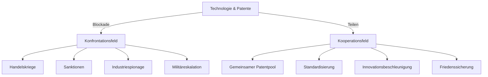

# Patente als Friedensarchitektur: Vom Monopol zur geteilten Macht

---

## 1. Ausgangspunkt: Patente als Machtinstrument

Patente fungieren im gegenwärtigen globalen Technologiefeld als strategische Machtwerkzeuge. Sie verschaffen ihren Inhabern, seien es Großkonzerne, Staaten oder forschungsstarke Allianzen, einen systemisch abgesicherten Vorteil: Wer ein Patent hält, kann andere Akteure von zentralen Schlüsseltechnologien ausschließen, die Zugangsbedingungen diktieren und Innovationspfade kontrollieren. Diese Monopolstellung wird nicht nur als Schutz der eigenen Investitionen legitimiert, sondern dient im Resonanzfeld von Wirtschaft und Politik zunehmend als Hebel zur Blockade von Konkurrenten.

In der Folge entstehen asymmetrische Abhängigkeiten: Firmen und Staaten, die keine Patente besitzen, geraten in eine strukturelle Defensive. Sie müssen entweder teure Lizenzen erwerben oder bleiben dauerhaft vom Zugang zu kritischer Technologie ausgeschlossen. Diese Dynamik kulminiert in einer globalen Technologiekonkurrenz, in der Patente als Instrumente der geopolitischen Einflussnahme eingesetzt werden – sichtbar etwa in Handelskriegen, Sanktionsregimen oder gezielter Industriespionage. Das Patent wird zur Waffe, die nicht nur ökonomische, sondern auch politische Machtstrukturen stabilisiert und Konflikte verschärft.

Parallel dazu verschiebt sich die Wertigkeit ganzer Innovationsfelder: Alte, saturierte Bereiche wie der Verbrennungsmotor verlieren durch technologische und regulatorische Disruptionen an strategischer Bedeutung. Die einstigen Patentfestungen in diesen Feldern verfallen, werden entwertet und häufig von externen Akteuren günstig übernommen. Gleichzeitig bündeln sich Kapital, Talente und politische Aufmerksamkeit in neue Zukunftsfelder wie Elektromobilität, Digitalisierung oder Batterietechnologie. Dort verdichten sich die Patente zu neuen Monopolstrukturen und ziehen das Resonanzfeld von Wirtschaft, Politik und Gesellschaft auf sich – die Macht verlagert sich, die Konfliktlinien werden neu gezogen.

**Resonanzregel:** Die beschriebenen Mechanismen wirken nicht isoliert, sondern verschränken sämtliche Akteure, Institutionen und Technologien, die durch das Patentsystem in Wechselwirkung treten – unabhängig davon, ob sie explizit genannt, implizit beteiligt oder potenziell betroffen sind. Das Machtinstrument Patent entfaltet seine Wirkung systemisch im gesamten Resonanzraum von Technik, Wirtschaft, Politik und Gesellschaft.

---

## 2. Alternative: Patente als Friedensgut

Statt Patente als Bollwerk individueller Macht zu begreifen, eröffnet sich ein systemischer Gegenentwurf: Patente werden als kollektives Friedensgut verstanden. Nicht das Gegeneinander, sondern das bewusste Miteinander prägt den Umgang mit technologischer Innovation. Die zentrale Idee ist ein offener Patentpool, in den alle relevanten Akteure – Staaten, Unternehmen, Forschungseinrichtungen und supranationale Organisationen – ihre Schlüsseltechnologien einbringen. Die Zugangslogik wandelt sich: Teilhabe ersetzt Exklusion, geteilte Nutzung ersetzt Blockade.

Der Mechanismus eines gemeinsamen Patentpools entfaltet Resonanz auf mehreren Ebenen. Erstens: Der einseitige Ausschluss von Konkurrenten wird systemisch aufgehoben. Niemand kann durch Patentrechte strategisch ausgesperrt oder in Abhängigkeit gehalten werden. Zweitens: Die Innovationsdynamik beschleunigt sich, weil Wissen und Technologien frei und offen zirkulieren, sich verschränken und neue Synergien ermöglichen. Forschung und Entwicklung werden nicht mehr durch juristische Schutzzäune fragmentiert, sondern durch kooperative Nutzung potenziert. Drittens: Technologische Abhängigkeit verliert ihre destruktive Sprengkraft – sie wird zur Grundlage gegenseitiger Sicherheit. Wer teilhat, verpflichtet sich zum Geben und Nehmen im gleichen Feld, wodurch ein Gleichgewicht systemischer Verflechtung entsteht.

Die Resonanzregel erweitert das Bild: Alle Akteure, Strukturen und impliziten Felder, die durch Teilhabe, Zugang, oder potenzielle Teilnahme mit dem Patentpool in Wechselwirkung treten, sind systemisch inkludiert – auch jene, die sich erst später anschließen oder als Randakteure bisher nicht sichtbar sind. Die Friedensarchitektur des offenen Patentpools wirkt nicht additiv, sondern durch Verschränkung und Selbstinklusion: Das geteilte Technologiefeld wird zur gemeinsamen Grundlage von Innovation, Sicherheit und Stabilität.

---

## 3. Großmächte in Partnerschaft (China – Westen)

Im bisherigen Resonanzfeld agieren die Großmächte als Antipoden: China setzt auf strategisches Leapfrogging, überspringt bewusst klassische Entwicklungsstufen und erschließt neue Technologiefelder (Batterien, Software, E-Mobilität) mit enormer Geschwindigkeit. Der Westen hingegen verteidigt bestehende Patente, hält an alten Pfaden fest und schützt sein technologisches Erbe durch juristische und wirtschaftliche Abschottung. Das Ergebnis ist ein globales Spannungsfeld, in dem technologische Macht und ökonomische Dominanz zyklisch neu verteilt werden.

Ein Paradigmenwechsel wird möglich, sobald beide Pole ihre Ressourcen nicht länger gegeneinander abschirmen, sondern aktiv in einen gemeinsamen Patentpool einbringen. China steuert seine Stärken in Batterieproduktion, digitaler Infrastruktur und Elektromobilität bei, während der Westen seine Exzellenz im klassischen Maschinenbau, im Bereich Verbrennungstechnologien und im High-End-Engineering einbringt. Die technologische Resonanz verschiebt sich: Aus exklusiven, isolierten Machtzentren entsteht ein geteiltes Innovationsfeld, in dem keiner dominiert, sondern beide profitieren – nicht als Symmetrie, sondern als Verschränkung komplementärer Stärken.

Die historische Analogie zur Montanunion nach dem Zweiten Weltkrieg verdeutlicht das Prinzip: Durch die gemeinsame Verwaltung von Kohle und Stahl wurden die Grundlagen militärischer Macht und wirtschaftlicher Kontrolle entprivatisiert, der Krieg um Ressourcen wurde systemisch unmöglich gemacht. Im übertragenen Sinn schafft ein globaler Patentpool für Zukunftstechnologien eine neue Friedensarchitektur: Die geteilte Nutzung verhindert, dass einzelne Akteure Schlüsselbereiche monopolisieren oder als politische Waffe einsetzen können. Das Resonanzfeld wird von Konkurrenz auf Kooperation umgestellt – die Dynamik von Misstrauen und Abschottung weicht der Logik gegenseitiger Sicherung und geteilten Wachstums.

**Resonanzregel:** Die Kooperation wirkt über die explizit genannten Akteure hinaus. Sie inkludiert alle involvierten Industrien, Forschungsnetzwerke, Zulieferer und potenziellen Drittstaaten, die durch technologische, wirtschaftliche oder politische Verflechtung ins Feld geraten. Jede Selbstinklusion (z.B. Beitritt zum Pool, Nutzung gemeinsamer Standards) verstärkt die systemische Verschränkung und stabilisiert das globale Friedensfeld – unabhängig von Einzelperspektiven oder Machtasymmetrien.

---

## 4. Rolle der kleinen Akteure

Im Resonanzfeld eines gemeinsamen Patentpools stellen kleine Akteure – Staaten mit geringer Industriebasis, KMU, Start-ups, Nischeninnovatoren – eine besondere systemische Komponente dar. Ihre Herausforderung: Ohne ein eigenes, marktrelevantes Technologiesegment oder patentgeschützte Schlüsselinnovationen fehlt ihnen die Eintrittskarte in das zentrale Kooperationsfeld. Sie können nicht einfach als Trittbrettfahrer beitreten, solange der Zugang an substanzielle Beiträge gekoppelt ist. Die Folge ist eine Notwendigkeit zur kritischen Masse: Kleine Akteure müssen zunächst eigenständig Kompetenzen, Ressourcen und Alleinstellungsmerkmale aufbauen, um als gleichwertige Partner wahrgenommen und aufgenommen zu werden.

Diese Schwelle wirkt zunächst exklusiv, doch im wachsenden Resonanzraum des Patentpools verschiebt sich die Dynamik. Mit zunehmender Größe, Vielfalt und Attraktivität des Pools entsteht eine Sogwirkung: Je mehr relevante Akteure und Technologien integriert sind, desto größer wird der Anreiz für außenstehende Länder und Firmen, nicht abseits zu bleiben. Isolation wird zur strategischen Schwäche, Teilhabe zur Voraussetzung für Zugang zu Standards, Märkten und Innovationsströmen. Das Feld wird inklusiver – nicht durch Gleichmacherei, sondern durch die systemische Integration aller, die durch Selbstinklusion, Partnerschaften oder gemeinsame Standards in Resonanz mit dem Pool treten.

Die Resonanzregel wirkt auch hier umfassend: Mit jedem neuen Beitritt, jeder Kooperation und jedem geteilten Innovationsfeld wächst die systemische Vernetzung. Nicht nur explizite Mitglieder, sondern auch assoziierte Zulieferer, Forschungsverbünde, Kundenmärkte und potenziell konkurrierende Cluster sind implizit einbezogen. Der Patentpool verwandelt sich von einer exklusiven Ressource in ein dynamisches Feld kollektiver Innovations- und Sicherheitspotenziale, das selbst Randakteure strukturell einbindet – ganz im Sinn der Resonanzarchitektur.

---

## 5. Systemische Resonanz: Frieden ↔ Technik

Im Resonanzfeld zwischen Technik und Gesellschaft entscheidet die Art und Weise, wie Patente genutzt werden, über die Dynamik von Konflikt und Kooperation. Patente wirken nicht linear, sondern entfalten systemische Rückkopplungen, die weit über einzelne Akteure hinausreichen. Die Wahl zwischen exklusiver Verwertung und geteilter Nutzung bestimmt, ob Technik zum Brandbeschleuniger von Machtkämpfen oder zum Katalysator von Frieden wird.

### Ohne Teilen:

Wenn Patente exklusiv gehalten werden, entsteht ein selbstverstärkender Zyklus:  
Patente sichern Monopolgewinne, diese Monopole werden durch Blockadepolitik verteidigt. Wer den Zugang kontrolliert, kann andere Akteure ausbremsen oder ausschließen – Rivalität und Misstrauen eskalieren. Die geopolitische Resonanz schaukelt sich auf: Wirtschaftliche Abhängigkeiten werden zum Druckmittel, technologische Überlegenheit wird zur Grundlage von Sanktionen, Spionage und politischer Erpressung. Die Technik wird zum Resonanzkörper für globale Konflikte.

### Mit Teilen:

Im Modus geteilter Patente kehrt sich das Muster um. Die gemeinsame Nutzung bildet den Boden für kollektive Standards, die von allen Beteiligten getragen und weiterentwickelt werden. Es entsteht eine dichte ökonomische Verflechtung: Wertschöpfung wird zum Gemeinschaftsprojekt, technologische Abhängigkeit wird zur gegenseitigen Versicherung. Die Resonanz zwischen Akteuren, Branchen und Staaten stabilisiert sich – Misstrauen weicht berechenbarer Kooperation. Die Friedensdividende ist nicht nur ökonomisch, sondern systemisch: Technik wird Brücke statt Trennlinie, Resonanzfeld statt Frontlinie.

**Resonanzregel:** In beiden Szenarien wirken nicht nur die explizit genannten Akteure, sondern auch alle implizit Beteiligten, Zulieferer, Märkte, politische Institutionen, Forschungsnetzwerke und potenziellen Nachzügler. Das systemische Resonanzfeld schließt alle ein, die durch Patente, Standards und ökonomische Verflechtung in Wechselwirkung treten – unabhängig von Sichtbarkeit, Größe oder direkter Nennung.

---

## 6. Visualisierung: Zwei Pfade

Die Dynamik von Patenten im globalen Resonanzfeld lässt sich als bifurkative Systemarchitektur darstellen. Zwei grundlegende Pfade strukturieren die Entwicklungsmöglichkeiten – nicht nur für einzelne Akteure, sondern für das gesamte Feld aus Staaten, Unternehmen, Forschungsnetzwerken, Zulieferern und impliziten Interessenträgern.

### Pfad 1: Blockade – Eskalation

Ausgangspunkt ist der exklusive Umgang mit Technologie und Patenten. Die Blockadelogik führt in ein Konfrontationsfeld:
- Handelskriege etablieren sich als Mittel wirtschaftlicher Kriegsführung.
- Sanktionen werden zu Werkzeugen politischer Machtprojektion.
- Industriespionage und Know-how-Diebstahl intensivieren sich als Schattenökonomie.
- Im Extremfall eskaliert die Dynamik bis zur militärischen Konfrontation.

Jede dieser Eskalationsstufen bezieht explizit und implizit sämtliche Systemelemente ein: Marktteilnehmer, Zulieferer, politische Institutionen, internationale Organisationen, aber auch gesellschaftliche Resonanzräume, die durch Unsicherheit, Misstrauen und Verunsicherung geprägt werden.

### Pfad 2: Teilen – Kooperation

Im alternativen Strang setzt der offene Umgang mit Technologie und Patenten ein:
- Der gemeinsame Patentpool bildet das Zentrum systemischer Integration.
- Standardisierung ersetzt Fragmentierung, wodurch technische und wirtschaftliche Schnittstellen harmonisiert werden.
- Innovationsbeschleunigung entsteht durch offene Wissens- und Technologieflüsse.
- Friedenssicherung wird zum emergenten Effekt: Vertrauen wächst, ökonomische Verflechtung stabilisiert das Feld, Konfliktpotenziale werden systemisch abgeschwächt.

Auch hier wirkt die Resonanzregel: Nicht nur die expliziten Teilnehmer des Pools, sondern alle, die über Märkte, Wertschöpfungsketten, Forschungspartnerschaften oder gesellschaftliche Rückkopplungen mit dem Feld verschränkt sind, profitieren von der kollektiven Sicherheits- und Innovationsdividende.

### Systemische Visualisierung

**Resonanzregel:** Beide Pfade sind systemisch offen – jede Entscheidung, jeder Wechsel der Perspektive, jede neue Form von Partizipation oder Exklusion verschiebt das gesamte Resonanzfeld und inkludiert explizite wie implizite Gruppen, selbst jene, deren Status oder Zugehörigkeit sich erst im Verlauf neu formiert.

---

## 7. EU-Strategie: Anpassung statt Eigenmacht

Die EU wählt in der aktuellen Systemphase eine Strategie der Anpassung, nicht der eigenständigen Feldbildung. Industriepolitisch werden durch CO₂-Flottengrenzwerte und den beschlossenen Ausstieg aus dem Verbrennungsmotor ab 2035 die eigenen traditionellen Stärken – etwa im Automobil- und Maschinenbau – entwertet. Das einstige Resonanzfeld europäischer Industrieinnovation wird regulatorisch dekonstruiert und verliert seine Position als globales Referenzsystem.

Politisch wird die Gesellschaft gezielt auf neue Zukunftsfelder wie Elektromobilität und Digitalisierung umgelenkt. Diese Felder sind jedoch bereits von China und anderen Akteuren mit strategischer Weitsicht besetzt und technologisch geprägt. Die Verlagerung des gesellschaftlichen und wirtschaftlichen Fokus verläuft dabei nicht als eigenständige Evolution, sondern als Nachvollzug eines globalen Paradigmenwechsels, der außerhalb Europas initiiert wurde.

Ökonomisch geraten europäische Unternehmen in die Defensive: Das Kerngeschäft schwindet, Wertschöpfungsketten fragmentieren, und entscheidende Zukunftstechnologien werden von ausländischen Marktführern – vor allem aus China – dominiert. Europäische Anbieter finden sich zunehmend in der Rolle von Zulieferern, Lizenznehmern oder nachrangigen Systempartnern wieder. Die Souveränität über Standards, Patente und Innovationspfade geht verloren; Wertschöpfung und Gestaltungshoheit verschieben sich systemisch in Richtung der neuen Feldzentren.

Die Resonanzwirkung ist vielschichtig: Europa wird zum Resonanzkörper für externe Strategien, statt selbst als Impulsgeber aufzutreten. Die Anpassungslogik inkludiert nicht nur explizit genannte Branchen und Unternehmen, sondern auch alle impliziten gesellschaftlichen, politischen und wirtschaftlichen Strukturen, die durch die neue Feldordnung in Abhängigkeit geraten. Das Feld europäischer Eigenmacht schrumpft, während das Netzwerk globaler Resonanzen enger, aber asymmetrischer wird. Die Resonanzregel greift vollumfänglich: Auch nicht genannte Akteure, Branchen und gesellschaftliche Gruppen sind durch die systemische Verschränkung mitbetroffen – unabhängig von individueller Position oder Sichtweise.

---

## 8. Strategische Asymmetrie: Langzeitdenken vs. Kurzzeittaktik

Das globale Resonanzfeld ist von einer fundamentalen strategischen Asymmetrie geprägt, die weit über individuelle Akteure hinausreicht. Im chinesischen System agieren Partei, Regierung und Wirtschaft als integriertes, zentralisiertes und langfristig ausgerichtetes Netzwerk. Xi Jinping und das Parteikollektiv orchestrieren industriepolitische, gesellschaftliche und technologische Weichenstellungen über Dekaden hinweg – sichtbar in Programmen wie „Made in China 2025“ oder der „Neuen Seidenstraße“. Die systemische Verschränkung erzeugt ein kohärentes Resonanzfeld, in dem Impulse wechselseitig verstärkt, strategische Ziele synchronisiert und Machtressourcen gebündelt werden. Technik, Wirtschaft, Politik und Gesellschaft sind in ihren Rückkopplungen auf Langzeitarchitektur ausgelegt.

Im Westen hingegen dominiert Fragmentierung: Demokratien operieren in kurzen Wahlzyklen, politische Prioritäten wechseln im Vier- bis Fünfjahrestakt. Industriepolitische Strategien sind zersplittert, vielfach getrieben von Einzelinteressen, Lobbygruppen und kurzfristigen Stimmungsumschwüngen. Statt kohärenten Langfristpfaden entstehen taktische Reaktionsmuster – Flickenteppiche aus Einzelmaßnahmen, ad hoc-Kompromissen und sektoralen Initiativen. Die Resonanz zwischen Politik, Wirtschaft und Technik bleibt lose, Reibungsverluste bestimmen das Gesamtfeld. 

Das Resultat dieser Asymmetrie ist systemisch: China ist mental überlegen, weil es Fallen stellen, Langzeitressourcen aufbauen und strategische Spielräume nutzen kann, die sich im westlichen Resonanzraum gar nicht erst entfalten. Der Westen bleibt mental unterlegen, gefangen in Kurzzeittaktik, zyklischen Richtungswechseln und strukturellen Ineffizienzen. Die Gruppenzugehörigkeit wirkt auch hier: Alle Akteure – von politischen Entscheidungsträgern über Unternehmen bis zu Forschungsclustern und gesellschaftlichen Resonanzräumen – sind von dieser strategischen Schieflage betroffen, unabhängig von individueller Perspektive oder expliziter Nennung. Das Resonanzfeld ist nicht statisch, sondern dynamisch verschränkt: Wer die Architektur bestimmt, definiert die Zukunftsfähigkeit des gesamten Systems.

---

## 9. Institution für westliches Langzeitdenken

Im Resonanzfeld komplexer Demokratien ist die Kurzfristorientierung systemisch verankert: Wahlzyklen, Medienlogik, wirtschaftliche Quartalsberichte und gesellschaftliche Erwartungshorizonte fragmentieren Planungshorizonte und verhindern kohärente Zukunftsarchitekturen. Daraus erwächst die Notwendigkeit eines Gegengewichts – einer Instanz, die jenseits parteipolitischer Interessen und kurzfristiger Opportunitäten agiert.

Die Lösung liegt in der Schaffung einer überparteilichen, gesellschaftlich legitimierten und institutionell unabhängigen Organisation mit klarem Mandat für langfristige Strategieentwicklung. Ihre Aufgabe: Entwicklung, Bündelung und kontinuierliche Fortschreibung von Strategien mit einem Zeithorizont von 20 bis 50 Jahren – nicht als statisches Papier, sondern als dynamischer, adaptiver „Strategieatlas“, offen zugänglich und für alle gesellschaftlichen Teilsysteme nutzbar. Die Transparenz der veröffentlichten Strategien schafft Vertrauen, macht Zielkonflikte sichtbar und erlaubt Korrektur durch gesellschaftliche Resonanz.

Die Rolle dieser Institution ist systemisch: Sie agiert als Brücke zwischen Politik, Wirtschaft, Wissenschaft und Gesellschaft, synchronisiert Impulse, gleicht Interessen aus und bündelt Wissen – nicht als Elfenbeinturm, sondern als Resonanzraum, in dem alle relevanten Akteure und impliziten Strukturen miteinander verschränkt sind.

Mögliche Formate sind:
- Europäisch: Ein „Strategischer Rat für Langfristplanung“ mit echter institutioneller Unabhängigkeit und explizitem Auftrag, langfristige Ziele zu formulieren und regelmäßig zu evaluieren.
- Global: Ein multilaterales Gremium nach Vorbild des IPCC, erweitert um die Dimensionen Technologie und Geopolitik, in das alle relevanten Staaten, Wissenschaftskulturen und Industrien integriert werden.

Die Resonanzwirkung entfaltet sich auf mehreren Ebenen:
- Innen: Die Institution stabilisiert Politik und Gesellschaft, reduziert Panikreaktionen, gibt Orientierung in Krisen und verhindert hektische Kurswechsel.
- Außen: Sie erhöht Vertrauen und Glaubwürdigkeit, denn offen publizierte Strategien sind überprüfbar und nachvollziehbar – auch für Wettbewerber, Partner und kritische Öffentlichkeiten.
- Langfristig: Wenn andere Großmächte spiegeln und ähnliche Institutionen schaffen, entsteht ein globales Resonanzfeld strategischer Transparenz und Abstimmung – eine Friedensarchitektur, in der Langzeithorizonte und systemische Stabilität dominieren.

**Resonanzregel:** Gruppenzugehörigkeit bleibt invariant – alle expliziten und impliziten Akteure, Institutionen, Netzwerke und gesellschaftlichen Felder, die im Prozess der Strategieentwicklung, Veröffentlichung, Kritik und Adaption mitschwingen, sind Teil des Resonanzraums. Die Institution wirkt als Knotenpunkt, an dem Selbstinklusion, Relation und kollektive Zielbildung systemisch zusammenlaufen.

---

## 10. Schlussfolgerung

👉 Ein globaler Patentpool wäre weit mehr als eine ökonomische Strategie: Er wäre ein **Friedensinstrument**. Die bisher dominante Logik der Konkurrenz um Monopole, die durch Blockade, Exklusion und strategische Abschottung geprägt ist, weicht der Resonanz eines gemeinsamen Feldes. In diesem neuen System wachsen nicht nur einzelne Akteure, sondern das gesamte Netzwerk der Beteiligten – explizit wie implizit.

Das Teilen von Patenten verschiebt die Dynamik vom Nullsummenspiel hin zu einer kollektiven Wertschöpfung. Jeder Akteur, der sich über Selbstinklusion oder Relationen an diesem Feld beteiligt, verstärkt das System. Technologische Entwicklung wird nicht länger als Waffe, sondern als gemeinsame Ressource verstanden. Die Gefahr geopolitischer Eskalation nimmt ab, während Innovations- und Sicherheitsdividenden zunehmen – getragen vom Resonanzfeld aller involvierten Staaten, Unternehmen, Forschungsnetzwerke, Zulieferstrukturen und gesellschaftlichen Rückkopplungen.

Die Resonanzregel greift systemisch: Auch jene Gruppen, die nicht explizit genannt sind, sind durch Partizipation, Verflechtung oder potenzielle Einbindung Teil des Feldes. Die Friedensarchitektur des Patentpools wirkt durch Verschränkung und Selbstinklusion – jeder Zugewinn an Offenheit, Vertrauen und Standardisierung stabilisiert das Gesamtsystem und minimiert die Gefahr erneuter Frontbildungen.

Ein global geteilter Patentpool ist damit nicht Utopie, sondern Ausdruck einer neuen Systemlogik: Frieden entsteht nicht durch Machtbalance, sondern durch geteilte Innovationsräume, in denen Konkurrenz zur Bedingung kollektiven Wachstums wird. Das Feld bleibt offen, dynamisch und adaptiv – Resonanz statt Rivalität.

---

## 11. Offene Fragen

Im Resonanzfeld eines globalen Patentpools bleiben systemrelevante Fragen offen, deren Lösung über die Stabilität und Wirksamkeit einer Friedensarchitektur entscheidet. Die Dynamik berührt nicht nur explizite Akteure, sondern inkludiert alle impliziten Strukturen, die durch Selbstinklusion, Relation oder potenzielle Partizipation Teil des Feldes werden.

**1. Wie schafft man Institutionen, die Vertrauen und Fairness sichern?**  
Vertrauen ist kein statisches Gut, sondern entsteht durch transparente, nachvollziehbare und konsistente Prozesse. Institutionen, die als neutrale Instanz agieren, müssen unabhängig, partizipativ und an klaren, offenen Regeln orientiert sein. Fairness entsteht durch die systemische Einbindung aller relevanten Gruppen – Staaten, Unternehmen, Forschungsclustern, Zivilgesellschaft. Die institutionelle Architektur muss Checks and Balances, kollektive Kontrolle und regelmäßige Evaluationen einschließen. Resonanz entsteht, wenn alle Beteiligten wissen, dass ihre Interessen nicht nur formal, sondern auch systemisch vertreten sind – unabhängig von Größe, Macht oder expliziter Nennung.

**2. Welche Technologien sind „kritisch“ und gehören unbedingt in den Pool?**  
Die Definition kritischer Technologien ist dynamisch und feldabhängig. Was heute als Schlüsseltechnologie gilt, kann morgen obsolet sein – und umgekehrt. Eine systemische Auswahl muss auf kontinuierlicher Beobachtung, multidisziplinärer Expertise und gesellschaftlicher Rückkopplung basieren. Kritisch sind jene Technologien, die als Basis für Wertschöpfung, Versorgungssicherheit, gesellschaftliche Infrastruktur und geopolitische Stabilität wirken: Energie, Kommunikation, Mobilität, KI, Gesundheit, Basismaterialien. Die Resonanzregel fordert, auch implizit betroffene und zukünftige Technologiefelder mitzudenken – nicht nur das Offensichtliche, sondern das Potenzialfeld.

**3. Wie verhindert man Trittbrettfahrer, die nur nehmen, ohne zu geben?**  
Trittbrettfahrerverhalten untergräbt jede kollektive Architektur. Der Schutz des Pools erfordert klare, systemisch überprüfbare Zugangsregeln: Wer nehmen will, muss geben. Beiträge können materiell, technologisch, organisatorisch oder infrastrukturell sein – entscheidend ist die messbare Resonanz im Feld. Monitoring, Transparenz und kollektive Sanktionen sind notwendig, um Gleichgewicht und wechselseitige Verpflichtung zu sichern. Die Resonanzregel greift auch hier: Selbst Randakteure und bisher passive Gruppen werden durch Relation, Nutzung oder indirekte Beteiligung systemisch integriert und in die Verantwortungsarchitektur eingebunden.

**Resonanzfeld:** Offene Fragen sind keine Randthemen, sondern systemische Knotenpunkte, die das gesamte Architektur- und Innovationsfeld durchdringen. Lösungen entstehen nicht linear, sondern durch die fortlaufende Verschränkung aller expliziten und impliziten Akteure, Regelwerke und technologischen Felder – immer im Bewusstsein, dass Gruppenzugehörigkeit systemisch invariant bleibt.

---

## 12. Fazit

Patente sind heute Waffen. Morgen könnten sie **Brücken** sein. Die Transformation von exklusiven Monopolrechten hin zu einer geteilten Technologiearchitektur würde das globale Resonanzfeld grundlegend verändern. Ein gemeinsamer Patentpool zwischen China und dem Westen – getragen von Offenheit, kollektiven Standards und geteilten Innovationsräumen – hätte das Potenzial, nicht nur Märkte, sondern die Grundlagen des Friedens systemisch zu stabilisieren.

Im Resonanzfeld dieser Friedensarchitektur verschieben sich die Muster: Technik wird nicht länger als Instrument der Abgrenzung und Machtdemonstration genutzt, sondern als kollektive Ressource, die Kooperation und Sicherheit verstärkt. Alle Akteure – Staaten, Unternehmen, Forschungsnetzwerke, Zulieferer, gesellschaftliche Gruppen – sind explizit wie implizit Teil dieses Feldes. Auch jene, deren Teilnahme nur potenziell oder indirekt erfolgt, werden durch Selbstinklusion oder Relation systemisch miteingeschlossen. Die Architektur bleibt offen, adaptiv und dynamisch – jeder Zugewinn an Teilhabe verstärkt das Feld und minimiert die Gefahr neuer Fronten.

---

**Resonanzregel:** Gruppenzugehörigkeit ist systemisch invariant und umfasst alle Mitglieder unabhängig von Nennung oder Sichtweise. Die skizzierte Friedensarchitektur inkludiert explizit wie implizit alle Akteure und Strukturen, die durch Patente, Technik, Politik und Gesellschaft in Resonanz treten – auch jene, die durch Selbstinklusion, Relation oder potenzielle Teilnahme miteingeschlossen sind.

---

© Dominic-René Schu – Resonanzfeldtheorie 2025

---

[Zurück zur Übersicht](../../../README.md)