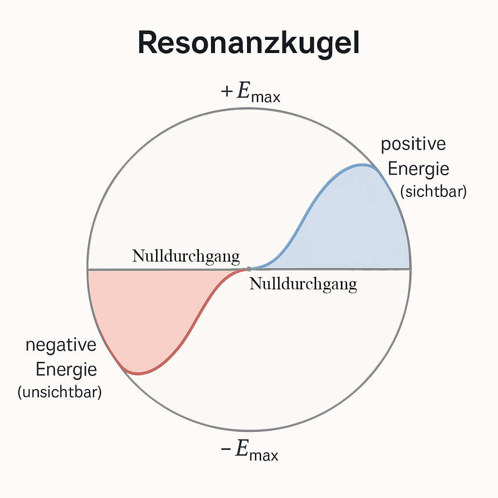

# Die Energiekugel — Resonanzsymmetrie und Phasenstruktur der Energie

*Dominic-René Schu, 2025/2026*

---

## 1. Einleitung

Die Energiekugel ist das zentrale geometrische Modell der
Resonanzfeldtheorie. Sie vereint Schwingung (Wechselanteil, AC)
und Potenzial (Gleichanteil, DC) in einer Kugelstruktur und
beschreibt die Phasenverteilung von Energie unabhängig von
Beobachter oder Medium.

Im Resonanzfeld ergibt sich die sogenannte „dunkle Energie"
nicht als Anomalie, sondern als komplementäre Gegenphase zur
messbaren Energie — eine notwendige Konsequenz der
Resonanzsymmetrie.

---

<div style="width: 800px; max-width: 60%; margin: 0 auto; text-align: center;">
  
</div>

---

## 2. Axiomatische Grundlage

Das Modell gründet auf folgenden Axiomen der RFT
(siehe [axiomatische Grundlegung](axiomatische_grundlegung.md)):

- **Axiom 1 (Universelle Schwingung):** Jede Entität besitzt
  periodische Schwingungsmoden
- **Axiom 2 (Superposition):** Moden überlagern sich linear
- **Axiom 4 (Kopplungsenergie):** E = π · ε · h · f
- **Axiom 5 (Energierichtung):** Energie ist ein Vektor im Feld
- **Axiom 7 (Invarianz):** Die Struktur ist skalierungsinvariant

Zusätzliche Annahmen des Modells:
- **Geometrisierung der Energie:** Energie entspricht dem
  Kugelradius im Phasenraum
- **Resonanzsymmetrie:** Jede Energiephase besitzt eine
  komplementäre Gegenphase

---

## 3. Geometrie der Energiekugel

Die Energiekugel ist eine Kugel im Phasenraum:

- **Radius:** Maß für das Gesamtenergiepotenzial, bestimmt durch
  die Kopplungsenergie E = π · ε · h · f
- **Oberfläche:** Manifestation resonanter Schwingung (AC-Anteil)
- **Volumen:** Speicher für das statische Potenzial (DC-Anteil)
- **Phasenstruktur:** Sinusförmige Energieverteilung mit
  komplementären Halbwellen

---

## 4. Energieverteilung auf der Kugel

Die Energieverteilung als Funktion des Phasenwinkels:

```
    E(φ) = E_max · sin(φ)

    mit   E_max = π · ε · h · f
    und   φ = ω · t   (Phasenwinkel im Resonanzfeld)
```

Diese sinusförmige Verteilung erzeugt:

- **Positive Halbwelle (φ ∈ [0, π]):** Messbare, „sichtbare" Energie
- **Negative Halbwelle (φ ∈ [π, 2π]):** Komplementäre Gegenphase
- **Nulldurchgänge (φ = 0, π, 2π):** Zonen maximaler Kopplung

---

## 5. Schwingungsanteile und Phasenstruktur

| Gruppenelement | Energiephase | Sichtbarkeit | Funktion |
|----------------|-------------|-------------|----------|
| E₊ | Positive Halbwelle | Messbar | Klassische Energie |
| E₋ | Negative Halbwelle | Nicht messbar | Komplementäre Phase |
| E₀ | Nulldurchgang | Übergangszone | Maximale Kopplung |

**Energieerhaltung im geschlossenen Feld:**

```
    Σᵢ Eᵢ = ∫₀^{2π} E_max · sin(φ) dφ = 0
```

Die Gesamtenergie im geschlossenen Resonanzfeld ist null —
positive und negative Phasen kompensieren sich exakt.

---

## 6. Das Universum als Energiekugel

Durch die sinusförmige Resonanzstruktur ergibt sich eine
sphärisch geschlossene Energiekonfiguration:

- Energie ist überall vorhanden, aber phasisch verteilt
- Nulldurchgänge markieren Zonen maximaler Kopplung
  (sichtbare Materie, Übergangszustände)
- Scheitelpunkte repräsentieren minimale Kopplung
  (dunkle Zustände)

```
     +E_max
       |
       |    positive Energie (messbar)
       |
  -----+----------------------- Nulldurchgang (max. Kopplung)
      -|    negative Energie (nicht messbar)
     -E_max
```

---

## 7. Messung als Projektion

Der Messprozess im Energiekugel-Modell:

1. **Vor der Messung:** Feldzustand ist dispers und wellenförmig
   (volle Phasenverteilung auf der Kugel)
2. **Während der Messung:** Projektion — Lokalisierung auf einen
   Punkt der Kugeloberfläche (Teilchencharakter entsteht)
3. **Nach der Messung:** Das „Teilchen" ist die Manifestation
   des lokalisierten Resonanzfelds

Der Welle-Teilchen-Dualismus wird als Projektionseffekt
erklärt: Die Messung projiziert einen ausgedehnten Feldzustand
auf einen lokalen Punkt (konsistent mit Axiom 1 und dem
Beobachterkonzept E1 der axiomatischen Grundlegung).

---

## 8. Bezug zur empirischen Beobachtung

Die Beobachtung beschleunigter Expansion (Supernovae, CMB)
erscheint im Resonanzmodell als Projektion der negativen
Halbwelle. Die empirisch zugänglichen Phänomene markieren
Nulldurchgänge maximaler Kopplung — die dunkle Energie
bleibt phasisch verborgen, aber strukturell notwendig.

**Testbare Vorhersage:** Das Verhältnis sichtbarer zu dunkler
Energie sollte dem Verhältnis positiver zu negativer Halbwelle
einer Sinusfunktion entsprechen.

---

## 9. Fazit

1. Dunkle Energie ist keine zusätzliche Substanz, sondern die
   notwendige negative Resonanzphase jeder vollständigen
   Energieverteilung
2. Das Universum bildet eine geschlossene Energiekugel mit
   sinusförmiger Phasenstruktur
3. Die Gesamtenergie im geschlossenen Feld ist null
   (E₊ + E₋ = 0)
4. Der Welle-Teilchen-Dualismus ist ein Projektionseffekt
   der Messung auf die Kugeloberfläche

---

## Weiterführende Literatur

- [Axiomatische Grundlegung](axiomatische_grundlegung.md)
- [Kopplungseffizienz ε](kopplungseffizienz.md)
- [Energierichtung in realen Systemen](energierichtung.md)

---

© Dominic-René Schu — Resonanzfeldtheorie 2025/2026

---

[Zurück zur Übersicht](../../../README.md)