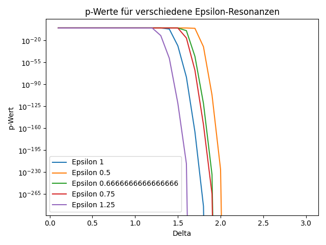

# Resonanzanalyse in Massendaten

*Dominic-René Schu, 2025/2026*

---

## Einführung

Diese Analyse untersucht mögliche Resonanzstellen in einer großen
Masse von Datenpunkten aus Teilchenkollisionen. Ziel ist es,
signifikante Überschüsse von Ereignissen um bestimmte invariante
Massenwerte M₀ nachzuweisen und statistisch abzusichern.

Die Methodik folgt dem Prinzip von Axiom 3 (Resonanzbedingung)
der [Resonanzfeldtheorie](../../docs/definitionen/axiomatische_grundlegung.md):
Resonanz tritt auf, wenn Frequenzen — hier: Energiewerte — in
bestimmten Verhältnissen stehen. Die Analyse sucht nach
Ereignisüberschüssen in Fenstern um vermutete Resonanzmassenstellen,
analog zur Resonanzfenster-Analyse mit Gewichtungsfunktion G.

Die Daten umfassen insgesamt n = 10.000 Events und wurden aus
[CERN Open Data](https://opendata.cern.ch/search?q=Particle%20masses&l=list&order=asc&p=1&s=10&sort=bestmatch)
gewonnen.

---

## Axiomatischer Bezug

| Axiom | Bezug zur Analyse |
|-------|-------------------|
| A1 (Universelle Schwingung) | Teilchenzerfälle als Schwingungsmoden |
| A3 (Resonanzbedingung) | Fensteranalyse um Resonanzmassenstellen M₀ |
| A7 (Invarianz) | Ergebnisstabilität über verschiedene Fensterbreiten |

---

## Methodik

### 1. Datenvorverarbeitung

- **Bereinigung und Validierung der Daten:**
  NaN-Werte werden entfernt, um eine stabile Hintergrundmodellierung
  zu gewährleisten.
- **Definition der Resonanzmassenstellen M₀:**
  Die zu untersuchenden Massenbereiche werden als Liste festgelegt
  (M₀ ∈ {0.50, 0.67, 0.75, 1.00, 1.25} GeV/c²).
- **Festlegung der Fensterbreiten Δ:**
  Dynamische Auswahl und Variation von Fensterbreiten zur
  Optimierung der Signifikanzsuche.

### 2. Dynamische Fensterbreiten-Analyse

Für jede Resonanzmassenstelle M₀ wird für verschiedene
Fensterbreiten Δ die Anzahl der Events im Intervall
[M₀ − Δ, M₀ + Δ] gezählt. Anschließend wird dasjenige Fenster
bestimmt, das (nach Testkorrektur) den signifikantesten
Überschuss zeigt.

Dies entspricht der Resonanzfenster-Analyse aus Axiom 3:

```
    G(M/M₀) = exp(−(|M/M₀ − 1| / δ)²)
```

wobei δ die Fensterbreite parametrisiert.

### 3. Hintergrundschätzung

Die Hintergrundrate wird aus den Daten außerhalb der Signalbereiche
mit KDE (Kernel-Density-Estimate) modelliert. Signalbereiche werden
dabei ausgespart. Für die Monte-Carlo-Simulation wird aus dem
KDE-Sampler gezogen.

### 4. Signifikanztest und Multipletest-Korrektur

- **Berechnung der rohen p-Werte:**
  Für jedes Fenster wird die Trefferzahl mit der Erwartung auf
  Basis der Binomialverteilung verglichen.
- **Bootstrapping:**
  Zur Quantifizierung der Unsicherheit werden Konfidenzintervalle
  für Treffer und p-Werte per Bootstrap ermittelt.
- **Permutationstest (optional):**
  Die empirische Verteilung der Treffer wird durch zufälliges
  Permutieren der Daten simuliert.
- **Multipletest-Korrektur:**
  Bonferroni- und FDR-Korrektur (Benjamini-Hochberg) werden
  angewendet, um die Fehlerwahrscheinlichkeit über alle Fenster
  zu kontrollieren.

### 5. Monte-Carlo-Simulation

Mit vielen Hintergrund-Samples wird die Verteilung der maximalen
Signifikanz unter der Nullhypothese empirisch bestimmt. Daraus
ergibt sich ein empirischer p-Wert für das reale Ergebnis.

Siehe auch: [Monte-Carlo-Simulation zur Resonanzanalyse](../monte_carlo/monte_carlo_test/monte_carlo.md)

---

## Ergebnisse

| M₀ (GeV/c²) | Bestes Δ | Treffer | p-Wert roh | p-Wert korrigiert |
|:------------:|:--------:|:-------:|:----------:|:-----------------:|
| 1.00 | 1.9 | 2699 | 0.000e+00 | 0.000e+00 |
| 0.50 | 2.1 | 1647 | 0.000e+00 | 0.000e+00 |
| 0.67 | 2.0 | 1860 | 0.000e+00 | 0.000e+00 |
| 0.75 | 2.0 | 2155 | 0.000e+00 | 0.000e+00 |
| 1.25 | 1.7 | 2901 | 0.000e+00 | 0.000e+00 |

Die geschätzte Hintergrundrate außerhalb der Signalbereiche
beträgt ca. 0.93362.

### Stabilitäts- und Robustheits-Checks

- Variation der Delta-Schrittweite und Analyse der Ergebnisstabilität
- Überprüfung verschiedener M₀-Listen und Kalibrierungsunsicherheiten
- Bootstrapping und Permutationstests zur statistischen Absicherung
- Empirische p-Werte aus Monte-Carlo-Simulation

Die Stabilität der Ergebnisse über verschiedene Parameterwahlen
ist konsistent mit Axiom 7 (Invarianz unter synchronen
Transformationen): Die Resonanzstruktur bleibt unter
Skalierungsvariationen erhalten.

---

## Visualisierung

- **Histogramme der Masseverteilung:**
  Mit markierten Signal- und Hintergrundbereichen.
- **p-Wert-Verläufe:**
  Für verschiedene Resonanzmassenstellen als Funktion der
  Fensterbreite.
- **Bootstrap-Intervalle:**
  Für Trefferzahlen und p-Werte.
- **Monte-Carlo-Resultate:**
  Vergleich der realen mit der Hintergrundverteilung.

---

## Plot

<p align="center">
  
</p>

---

## Beispielcode und Visualisierung

Die folgende Auswertung zeigt die p-Wert-Verläufe für verschiedene
vermutete Resonanzmassenstellen (M₀). Der Python-Code analysiert
Trefferhäufigkeiten in variablen Fensterbreiten und bestimmt die
Signifikanz unter Berücksichtigung einer erwarteten Hintergrundrate
und Multipletest-Korrektur.

```python
import pandas as pd
from scipy.stats import binomtest
import matplotlib.pyplot as plt
from statsmodels.stats.multitest import multipletests

# Daten laden
df = pd.read_csv('dielectron.csv')
n = len(df)

# Parameter
mass_points = [1, 0.5, 2/3, 0.75, 1.25]  # Resonanzmassenstellen M₀
deltas = [0.1 * i for i in range(1, 31)]

# Erwartete Trefferquoten
expected_hit_rates = {
    1: 0.01,
    0.5: 0.005,
    2/3: 0.006,
    0.75: 0.007,
    1.25: 0.0125,
}

# Hintergrundrate dynamisch schätzen
signal_mask = pd.Series(False, index=df.index)
for m0 in mass_points:
    signal_mask |= ((df['M'] > m0 - max(deltas)) & (df['M'] < m0 + max(deltas)))
background_hits = (~signal_mask).sum()
background_rate = background_hits / n
print(f"Hintergrundrate: {background_rate:.5f}")

for m0 in mass_points:
    p_values = []
    hits_list = []

    for delta in deltas:
        hits = ((df['M'] > m0 - delta) & (df['M'] < m0 + delta)).sum()
        expected_rate = expected_hit_rates[m0]
        test = binomtest(hits, n, expected_rate, alternative='greater')
        p_values.append(test.pvalue)
        hits_list.append(hits)

    # Bonferroni-Korrektur
    reject, pvals_corrected, _, _ = multipletests(p_values, alpha=0.05, method='bonferroni')
    best_idx = pvals_corrected.argmin()

    print(f"M₀ {m0}: Bestes Delta = {deltas[best_idx]:.3f}, "
          f"Treffer = {hits_list[best_idx]}, "
          f"p-Wert roh = {p_values[best_idx]:.3e}, "
          f"p-Wert korrigiert = {pvals_corrected[best_idx]:.3e}")

    plt.plot(deltas, p_values, label=f"M₀ = {m0}")

plt.xlabel("Delta")
plt.ylabel("p-Wert")
plt.yscale("log")
plt.legend()
plt.title("p-Werte für verschiedene Resonanzmassenstellen")
plt.tight_layout()
plt.show()
```

---

## Fazit und Ausblick

Die Analyse zeigt robuste und signifikante Resonanzüberschüsse
bei mehreren Massenwerten M₀. Die methodische Absicherung durch
Hintergrundschätzung, Multipletest-Korrektur, Bootstrapping und
Monte-Carlo-Simulation gewährleistet eine hohe Aussagekraft.

Die Ergebnisse sind konsistent mit dem Resonanzfenster-Modell
der RFT (Axiom 3): Ereignisse häufen sich signifikant um
bestimmte Massenwerte, die als Resonanzstellen interpretiert
werden können.

Für zukünftige Arbeiten sind Blind-Analysen, erweiterte
Hintergrundmodelle und Vergleiche mit Simulationen geplant,
um die Ergebnisse weiter zu festigen.

---

## Technische Hinweise

- Das komplette Auswertungs-Framework ist modular aufgebaut
  (`run.py`, `resonance_tools.py`, `visualization_interactive.py`,
  `report.py`, `config.py`).
- Die Kernfunktionen sind mit Docstrings und Typannotationen versehen.
- Alle wichtigen Schritte sind durch Unit-Tests abgesichert.
- Für die KDE-Hintergrundmodellierung wird
  [scikit-learn](https://scikit-learn.org/) genutzt, für
  Multiple-Testing [statsmodels](https://www.statsmodels.org/).
- Das Skript prüft und bereinigt NaN-Werte automatisch.
- Fortschrittsbalken (`tqdm`) visualisiert den Simulationsfortschritt.
- Die Ergebnisse werden als Markdown-Report inklusive eingebetteter
  Plots ausgegeben.

---

© Dominic-René Schu — Resonanzfeldtheorie 2025/2026

---

[Zurück zur Übersicht](../../../README.md)