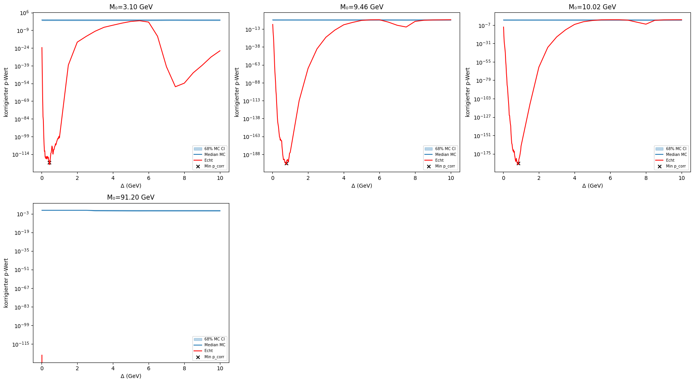
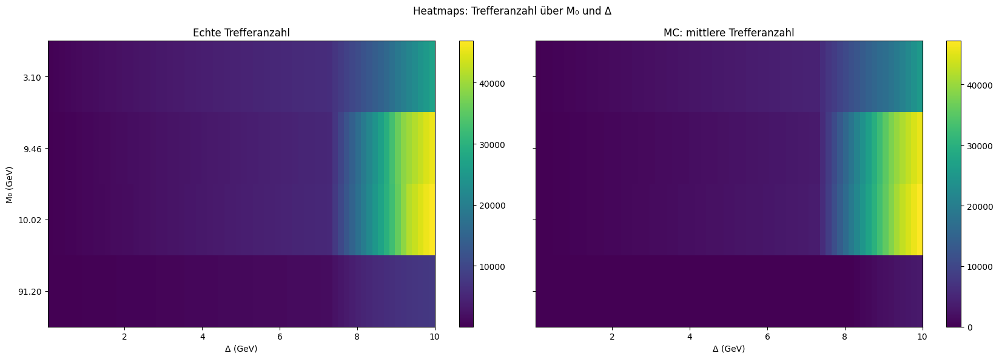

# Resonanzanalyse Report
Erstellt am: 2026-02-26 22:25

## Übersicht der wichtigsten Kennzahlen

| M₀ (GeV) | Δ (opt.) | Hits | [16%, 84%] | p_raw | p_corr | empir. p |
|----------|---------|------|------------|-------|--------|----------|
| 3.10 | 0.440 | 3256 | [3200, 3313] | 1.51e-123 | 1.02e-121 | 0 |
| 9.46 | 0.780 | 4186 | [4122, 4248] | 4.42e-203 | 3.01e-201 | 0 |
| 10.02 | 0.840 | 4625 | [4559, 4691] | 7.58e-190 | 5.16e-188 | 0 |
| 91.20 | 0.040 | 52 | [45, 59] | 0.00e+00 | 0.00e+00 | 0 |

### Monte-Carlo-Hits vs. echte Hits

### p-Wert-Verläufe über Δ

### Heatmaps Trefferanzahl

## Interpretation

- Für M₀=3.10 GeV ist der empirische p-Wert 0 (hoch signifikant). Gefundene Treffer: 3256 (Erwartung im Hintergrund: 3256.0 [16%: 3200, 84%: 3313]).
- Für M₀=9.46 GeV ist der empirische p-Wert 0 (hoch signifikant). Gefundene Treffer: 4186 (Erwartung im Hintergrund: 4186.0 [16%: 4122, 84%: 4248]).
- Für M₀=10.02 GeV ist der empirische p-Wert 0 (hoch signifikant). Gefundene Treffer: 4625 (Erwartung im Hintergrund: 4625.0 [16%: 4559, 84%: 4691]).
- Für M₀=91.20 GeV ist der empirische p-Wert 0 (hoch signifikant). Gefundene Treffer: 52 (Erwartung im Hintergrund: 52.0 [16%: 45, 84%: 59]).