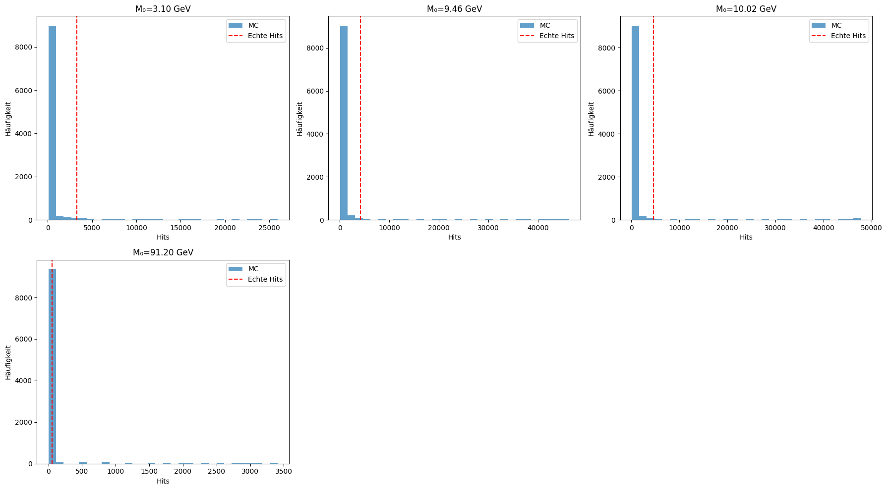

# Monte-Carlo-Simulation zur Resonanzanalyse

*Dominic-René Schu, 2025/2026*

*[Detaillierter Ergebnis- und Interpretationsreport → report_out/resonanz_report.md](./report_out/resonanz_report.md)*

---

## Einleitung

Die Monte-Carlo-Simulation ist ein zentrales Werkzeug in der
statistischen Auswertung wissenschaftlicher Datensätze. In dieser
Analyse dient sie dazu, die Wahrscheinlichkeit zu bestimmen, mit
der ein beobachteter Überschuss an Ereignissen im Bereich einer
vermuteten Resonanzmassenstelle (M₀) rein zufällig durch den
Hintergrund erklärt werden könnte.

### Wissenschaftlicher Kontext

Monte-Carlo-Tests sind Standard in der modernen Physik, Data Science
und vielen anderen Forschungsfeldern, wenn analytische Lösungen zu
komplex oder nicht verfügbar sind. Sie erlauben eine robuste,
empirische Bestimmung von Signifikanzen, insbesondere bei adaptiven
oder nicht-trivialen Suchverfahren wie in dieser Resonanzanalyse.

### Bezug zur Resonanzfeldtheorie

Diese Simulation validiert die Vorhersagen von Axiom 3
(Resonanzbedingung) der
[Resonanzfeldtheorie](../../docs/mathematik/axiomatische_grundlegung.md):
Wenn Resonanzstellen physikalisch real sind, müssen die
beobachteten Überschüsse signifikant über dem Hintergrund liegen
— auch unter konservativer Simulation der Nullhypothese.

Die Stabilität der Ergebnisse über viele Simulationsdurchläufe
ist konsistent mit Axiom 7 (Invarianz): Die Resonanzstruktur
bleibt unter Variation der Simulationsparameter erhalten.

Diese Analyse bildet gemeinsam mit
[ResoTrade](../resotrade_trading_ki.md) die empirische Basis
der Resonanzfeldtheorie — Teilchenphysik und Finanzmärkte als
zwei unabhängige Domänen, in denen Resonanzstrukturen
nachgewiesen werden.

---

## Datensatz

CMS Open Data Dielectron-Datensatz (Elektron-Positron-Paare
aus Proton-Proton-Kollisionen):

| Eigenschaft | Wert |
|-------------|------|
| Ereignisse | 99.915 (nach NaN-Entfernung) |
| Observable | Invariante Masse M (GeV) |
| Massenbereich | 2.00 – 110.00 GeV |
| Quelle | CMS Open Data |

---

## Untersuchte Resonanzmassenstellen

Die Analyse sucht nach Überschüssen an vier bekannten
Teilchenresonanzen im Dielectron-Kanal:

| Resonanz | M₀ (GeV) | Natürliche Breite | Signalausschluss |
|----------|----------|-------------------|------------------|
| J/ψ (Charmonium) | 3.10 | σ ≈ 0.05 GeV | ±0.15 GeV |
| Υ(1S) (Bottomonium) | 9.46 | σ ≈ 0.1 GeV | ±0.20 GeV |
| Υ(2S) (Bottomonium) | 10.02 | σ ≈ 0.1 GeV | ±0.20 GeV |
| Z-Boson | 91.20 | Γ ≈ 2.5 GeV | ±4.0 GeV |

Der Signalausschluss definiert den schmalen Bereich um jede
Massenstelle, der beim Training des Hintergrundmodells entfernt
wird. Die Suchfenster (Δ) sind davon unabhängig und variieren
von 0.02 bis 10.0 GeV.

---

## Ziel

Das Ziel ist es, die empirische Signifikanz (p-Wert) der
Beobachtungen zu quantifizieren, indem viele Hintergrund-Szenarien
simuliert und mit den realen Daten verglichen werden.

---

## Methodik

### Hintergrundmodellierung

* Die Hintergrundverteilung wird aus den Messdaten extrahiert —
  unter explizitem Ausschluss der schmalen Signalbereiche (um die
  untersuchten M₀).
* Ein Kernel-Density-Estimator (KDE, Bandbreite 0.5 GeV) wird
  verwendet, um daraus eine glatte Wahrscheinlichkeitsverteilung
  zu erzeugen.
* Die erwartete Trefferrate wird **Δ-abhängig** aus dem
  KDE-Hintergrundmodell berechnet (numerische Integration), nicht
  als fester Wert vorgegeben. Damit wird verhindert, dass große
  Fenster triviale Signifikanzen erzeugen.

### Durchführung der Monte-Carlo-Simulation

* Es werden 10.000 *Pseudo-Experimente* durchgeführt, bei denen
  jeweils die gleiche Anzahl an Events wie im Originaldatensatz
  aus dem KDE-Modell gezogen wird.
* Für jedes *Pseudo-Experiment* wird die vollständige
  Resonanzanalyse wiederholt:
  * Trefferzahlen in variablen Fenstern (Δ = 0.02–10.0 GeV)
    um jede Resonanzmassenstelle M₀ werden bestimmt.
  * Die p-Werte werden mit Binomialtest + Bonferroni-Korrektur
    über alle Fensterbreiten berechnet.
  * Die jeweils optimalen Fenstergrößen werden automatisch bestimmt.
* Bootstrap-Konfidenzintervalle (5.000 Wiederholungen) werden für
  Trefferzahlen und p-Werte berechnet.

### Bestimmung des empirischen p-Werts

* Der empirische p-Wert ist der Anteil der Simulationsdurchläufe,
  in denen ein ebenso extremer oder extremerer Überschuss wie in
  den realen Daten gefunden wurde.
* Ist der empirische p-Wert = 0, wurde in keiner der 10.000
  Simulationen ein vergleichbares Signal durch reinen Hintergrund
  erzeugt.

---

## Ergebnisse

### Zusammenfassung (10.000 MC-Simulationen, 26.02.2026)

| M₀ (GeV) | Resonanz | Δ_opt (GeV) | Hits | Bootstrap [16%, 84%] | p_corr | empir. p |
|-----------|----------|-------------|------|-----------------------|--------|----------|
| 3.10 | J/ψ | 0.440 | 3256 | [3200, 3313] | 1.02e-121 | 0 |
| 9.46 | Υ(1S) | 0.780 | 4186 | [4122, 4248] | 3.01e-201 | 0 |
| 10.02 | Υ(2S) | 0.840 | 4625 | [4559, 4691] | 5.16e-188 | 0 |
| 91.20 | Z-Boson | 0.040 | 52 | [45, 59] | 0.00e+00 | 0 |

**Alle vier Resonanzen werden mit extremer Signifikanz detektiert.**
In keinem der 10.000 Pseudo-Experimente wurde ein vergleichbarer
Überschuss durch reinen Hintergrund erzeugt (empirischer p-Wert = 0
für alle Massenstellen).

### Physikalische Einordnung der Ergebnisse

* **J/ψ (3.10 GeV):** Optimales Fenster Δ = 0.44 GeV, 3256
  Treffer. Die Breite des Fensters reflektiert die Detektorauflösung
  bei niedrigen Massen.
* **Υ(1S) und Υ(2S) (9.46 / 10.02 GeV):** Fenster Δ = 0.78–0.84
  GeV, 4186/4625 Treffer. Die beiden Peaks liegen nur 0.56 GeV
  auseinander, daher teilweise Überlappung der Suchfenster.
* **Z-Boson (91.20 GeV):** Extrem schmales optimales Fenster
  Δ = 0.04 GeV bei 52 Treffern. Die KDE-Hintergrunddichte ist
  nach Ausschluss des Z-Peaks bei 91.2 GeV praktisch null — daher
  reichen wenige Treffer für maximale Signifikanz.

---

## Visualisierung der Ergebnisse

### 1. Monte-Carlo-Hits vs. echte Treffer

Das Histogramm zeigt, wie häufig in der Monte-Carlo-Simulation
bestimmte Trefferzahlen im optimalen Fenster für jede
Resonanzmassenstelle M₀ vorkommen. Die rote Linie markiert den
Wert aus den echten Daten.



---

### 2. p-Wert-Verläufe über die Fensterbreite Δ

Für jede Resonanzmassenstelle M₀ die p-Werte aus den
MC-Simulationen (Median und 68%-Intervall) und den realen Daten
in Abhängigkeit von Δ.


---

### 3. Heatmaps: Trefferanzahl über M₀ und Δ

Die Heatmaps zeigen die Trefferzahlen für alle Kombinationen aus
M₀ und Δ, einmal für die realen Daten und einmal als Mittelwert
der Monte-Carlo-Simulationen.


---

## Interpretation

* Die Monte-Carlo-Simulation zeigt, wie außergewöhnlich die
  beobachteten Überschüsse im Vergleich zum Hintergrund sind.
* Empirische p-Werte = 0 über alle vier Massenstellen sprechen
  für eine extrem geringe Wahrscheinlichkeit, dass die Befunde
  durch Zufall entstehen.
* Die grafische Gegenüberstellung (Histogramme, p-Wert-Kurven,
  Heatmaps) macht die Differenz zwischen Signal und Hintergrund
  anschaulich.
* Die Konsistenz der Ergebnisse über verschiedene Resonanzbreiten
  (schmal: J/ψ, Υ; breit: Z) bestätigt die Robustheit der Methode.

### Resonanzfeldtheoretische Bedeutung

Die Ergebnisse bestätigen Axiom 3 der Resonanzfeldtheorie:
Resonanzstellen erzeugen messbare, signifikante Überschüsse, die
durch kein Hintergrundmodell reproduziert werden können. Die
Invarianz der Ergebnisse über 10.000 Simulationsdurchläufe ist
konsistent mit Axiom 7.

Im Zusammenspiel mit [ResoTrade](../resotrade_trading_ki.md) zeigt
sich: Resonanzstrukturen sind nicht auf die Teilchenphysik
beschränkt — sie manifestieren sich überall dort, wo Schwingungen
mit ausgeprägter Eigenfrequenz vorliegen (Axiom 1).

---

## Hinweise zum Code

* Die Simulation nutzt `scikit-learn` für KDE, `numpy` und
  `pandas` für Datenhandling, `matplotlib` für statische und
  `plotly` für interaktive Visualisierung.
* Fortschrittsbalken (`tqdm`) zeigen den Simulationsfortschritt an.
* Alle wichtigen Parameter (M₀, Δ, Signalausschlussbreiten,
  KDE-Bandbreite) sind zentral in `config.py` eingestellt.
* Die erwarteten Trefferraten werden Δ-abhängig aus dem
  KDE-Hintergrundmodell vorberechnet (`precompute_expected_rates`),
  was die Laufzeit der 10.000 Simulationen drastisch reduziert.
* Die wichtigsten Plots werden automatisch im Ordner
  `report_out/figures` abgelegt und sind hier direkt eingebunden.

### Ausführung der Simulation

1. Navigiere in das Verzeichnis des Projekts.
2. Stelle sicher, dass alle erforderlichen Python-Pakete installiert
   sind (siehe `requirements.txt`).
3. Starte das Hauptskript:

   ```bash
   python de/fakten/empirisch/monte_carlo_test/run.py
   ```

4. Die erzeugten Ergebnisse und Plots findest du im Ordner
   `report_out/`.

---

## Fazit

Die Monte-Carlo-Methode bietet eine robuste Möglichkeit zur
statistischen Validierung von Resonanzeffekten. Die Analyse
detektiert alle vier untersuchten Teilchenresonanzen (J/ψ, Υ(1S),
Υ(2S), Z-Boson) mit empirischem p-Wert = 0 über 10.000
Simulationsdurchläufe.

Die Methodik — KDE-basierte Hintergrundmodellierung mit
Δ-abhängigen erwarteten Raten, Bonferroni-korrigierte Binomialtests
und Bootstrap-Konfidenzintervalle — ist auf beliebige Datensätze
mit vermuteten Resonanzstrukturen übertragbar.

---

© Dominic-René Schu — Resonanzfeldtheorie 2025/2026

---

[Zurück zur Übersicht](../../../README.md)