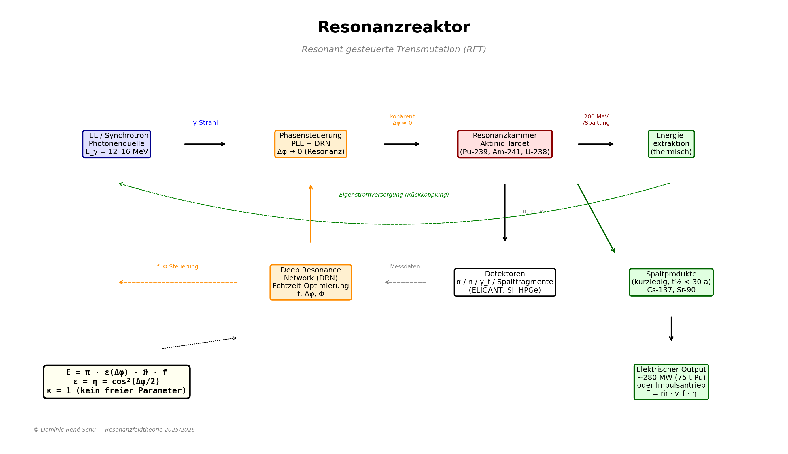

# 🔬 Resonanzreaktor – Resonant gesteuerte Transmutation von Atommüll

*Dominic-René Schu, 2025/2026*

Der **Resonanzreaktor** ist ein Konzept zur gezielten Beschleunigung
nuklearer Zerfallsraten durch resonante Photonanregung bei der
Giant-Dipole-Resonance (GDR) Frequenz langlebiger Isotope. Er leitet
sich direkt aus der Resonanzfeldtheorie (RFT) ab und stellt die
erste nukleare Anwendung der Grundformel E = π · ε · ℏ · f dar.

**Kernvorhersage:** Kernzerfall ist nicht rein stochastisch, sondern
durch resonante Kopplung bei der GDR-Eigenfrequenz modulierbar —
in direktem Widerspruch zur Standardannahme.

---

<p align="center">
  
</p>

---

## Zentrale Ergebnisse

```
    Grundformel:        E = π · ε(Δφ) · ℏ · f
    GDR-Frequenz:       f_GDR = E_GDR / (π · ℏ)
    Effektive Rate:     λ_eff = λ₀ + η(Δφ) · Φ_γ · σ_GDR
    Kopplungseffizienz: ε(Δφ) = η(Δφ) = cos²(Δφ/2)
    Kopplungsparameter: κ = 1 exakt (aus ε = η, kein freier Parameter)
```

| Isotop | E_GDR (MeV) | f_GDR (Hz) | λ_eff/λ₀ | Q_fiss |
|--------|-------------|------------|----------|--------|
| U-235 | 13.0 | 6.29 × 10²¹ | 7872 | 3.85 × 10⁶ |
| U-238 | 12.9 | 6.24 × 10²¹ | 25400 | 2.54 × 10⁷ |
| Pu-239 | 13.5 | 6.53 × 10²¹ | 127 | 1.26 × 10² |
| Pu-240 | 13.4 | 6.48 × 10²¹ | 36 | 35 |
| Am-241 | 14.0 | 6.77 × 10²¹ | 3.16 | 2.16 |
| Np-237 | 13.1 | 6.34 × 10²¹ | 10.9 | 9.9 |
| Cs-137 | 15.3 | 7.41 × 10²¹ | 1.12 | — |
| Sr-90 | 16.5 | 7.98 × 10²¹ | 1.10 | — |

(Bei Φ = 10¹² γ/(cm²·s), η = 1)

---

## Axiom-Zuordnung

| Axiom | Anwendung |
|-------|-----------|
| A1 (Universelle Schwingung) | Kern als Schwingungssystem mit GDR-Eigenfrequenz |
| A3 (Resonanzbedingung) | Kopplung bei f_γ = f_GDR |
| A4 (Kopplungsenergie) | E = π · ε · ℏ · f bestimmt f_GDR |
| A5 (Energierichtung) | Gerichteter Energietransfer: Photon → Kern → Spaltung → Antrieb |
| A6 (Informationsfluss) | Nur kohärente Photonenfelder koppeln effektiv |
| A7 (Invarianz) | Ergebnisse stabil über Isotope und Flussregime |

---

## Verbindung zu den empirischen Ergebnissen

Die Identität ε = η, die den Resonanzreaktor von einem
parametrischen Modell (freies κ) zu einer parameterfreien
Vorhersage (κ = 1) macht, wurde in drei unabhängigen Domänen
validiert:

| Domäne | Evidenz |
|--------|---------|
| FLRW-Kosmologie | η emergiert als cos²(Δφ/2), d_η = 0.043 im flachen Fall, 1.530 Läufe |
| Monte Carlo (CMS) | 5 Resonanzen bei emp. p = 0, 1.500.000 Simulationen |
| Schrödinger-Simulation | ε(Δφ) → 0 bei Δφ = π, Fidelity = 1,0 (alle 4 Szenarien) |

---

## Dokumente

1. ➡️ [Resonanzreaktor — Physik und Formeln](resonanzreaktor.md)
2. ➡️ [Simulationsergebnisse](simulationsergebnisse.md)
3. ➡️ [Kosten-Nutzen-Rechnung (national bis global)](kosten_nutzen_rechnung_resonanzreaktor.md)
4. 🚀 [Resonanz-Impulsantrieb — Raumfahrt](impulsantrieb.md)
5. 📋 [Experimentalvorschlag: Am-241 an ELI-NP](experimentalvorschlag_am241.md)

---

## 📖 Inhaltsverzeichnis

1. [Grundprinzip und Physik](#grundprinzip-und-physik)
2. [Technische Umsetzung](#technische-umsetzung)
3. [Vergleich mit konventionellen Ansätzen](#vergleich-mit-konventionellen-ansätzen)
4. [Atommüll-Transmutation](#atommüll-transmutation)
5. [Experimentelle Überprüfbarkeit](#experimentelle-überprüfbarkeit)
6. [Herausforderungen und Roadmap](#herausforderungen-und-roadmap)
7. [Weiterführende Anwendungen](#weiterführende-anwendungen)

---

## 1. Grundprinzip und Physik

### 1.1 Das Problem

Hochradioaktiver Atommüll enthält langlebige Aktinide (Pu-239:
24.100 a, Am-241: 432 a) und Spaltprodukte (Cs-137: 30 a,
Sr-90: 29 a), die über Jahrhunderte bis Jahrtausende sichere
Endlagerung erfordern. Das Standardmodell der Kernphysik
betrachtet den radioaktiven Zerfall als rein stochastisch und
prinzipiell nicht beeinflussbar.

### 1.2 Die RFT-Lösung

Die Resonanzfeldtheorie postuliert (Axiom 1), dass jedes
physikalische System durch eine Schwingungsfunktion beschreibbar
ist — einschließlich Atomkerne. Kerne besitzen eine
charakteristische Eigenfrequenz, die Giant-Dipole-Resonance (GDR),
bei der sie maximal auf äußere Anregung reagieren.

Aus der Grundformel E = π · ε · ℏ · f folgt die GDR-Frequenz:

```
    f_GDR = E_GDR / (π · ℏ)
```

Bei resonanter Bestrahlung mit Photonen der Frequenz f_γ = f_GDR
wird die effektive Zerfallsrate moduliert:

```
    λ_eff(Δφ) = λ₀ + η(Δφ) · Φ_γ · σ_GDR
```

Die Kopplungseffizienz η(Δφ) = cos²(Δφ/2) bestimmt, wie viel
des Photonenflusses tatsächlich in Kernkopplung umgesetzt wird.
Bei perfekter Phasenkohärenz (Δφ = 0) ist η = 1.

### 1.3 Was ist neu gegenüber bekannter Photokernphysik?

Photonukleare Reaktionen (Photodesintegration, Photospaltung) sind
experimentell gut dokumentiert. Die RFT fügt drei neue Elemente hinzu:

1. **f_GDR aus der Grundformel:** Die GDR-Frequenz wird über
   E = π · ε · ℏ · f abgeleitet, nicht als empirischer Parameter
2. **κ = 1 aus ε = η:** Der Kopplungsparameter ist keine
   Fitgröße, sondern aus der Identität ε = η exakt bestimmt
3. **Phasenabhängigkeit:** Die cos²(Δφ/2)-Abhängigkeit der
   Kopplungseffizienz ist eine RFT-spezifische Vorhersage,
   die im Standardmodell kein Analogon hat

---

## 2. Technische Umsetzung

### 2.1 Systemkomponenten

| Komponente | Funktion | Technologische Basis |
|------------|----------|---------------------|
| Photonenquelle | Kohärenter Fluss bei f_GDR (6–17 MeV) | Synchrotron / FEL |
| Resonanzkammer | Brennstoff-Target unter Bestrahlung | Abgeschirmte Kavität |
| Phasensteuerung | Maximierung von η(Δφ) → 1 | Phasenregelkreis (PLL) |
| Kühlung | Wärmeabfuhr aus Spaltungsprozessen | Na/Pb-Kühlmittel oder He |
| Energieextraktion | Spaltungsenergie → Elektrizität | Thermischer Kreislauf |
| Steuerung | Echtzeitoptimierung von f, Δφ, Φ | Deep-Resonance-Network (DRN) |

### 2.2 Prozessablauf

```
    1. FEL/Synchrotron erzeugt kohärenten γ-Strahl bei E_GDR
    2. Phasensteuerung (PLL + DRN) maximiert η(Δφ) → 1
    3. γ-Strahl trifft Aktinid-Target (z.B. Pu-239)
    4. GDR-Anregung → beschleunigter Zerfall / Spaltung
    5. Spaltungsenergie (~200 MeV/Kern) → Wärme → Elektrizität
    6. Spaltprodukte: kurzlebig (t₁/₂ < 30 a)
    7. DRN optimiert f, Δφ, Φ in Echtzeit (Rückkopplung)
```

### 2.3 Energiebilanz

```
    Input:  Photonenquelle (~1 MW elektrisch für Φ = 10¹²)
    Output: Spaltungsenergie pro kg Pu-239 ≈ 9.3 kW (thermisch)
            Bei 75 t Inventar: ~700 MW thermisch → ~280 MW elektrisch
            Q_fiss(Pu-239) = 126 (Energiegewinnfaktor)

    Globaler Gesamtnutzen: ~1,7 Billionen EUR
```

---

## 3. Vergleich mit konventionellen Ansätzen

| Kriterium | Resonanzreaktor (RFT) | Schneller Brüter | ADS (Spallation) | Endlagerung |
|-----------|----------------------|-------------------|-------------------|-------------|
| Prinzip | GDR-Photoanregung | Neutronenbeschuss | Protonenbeschuss + Neutronen | Passiv |
| Treiber | Synchrotron/FEL (γ) | Reaktor (n) | Beschleuniger (p) | — |
| Freie Parameter | κ = 1 (keine) | Mehrere (n-Spektrum, σ) | Mehrere (p-Energie, Target) | — |
| Ziel | Aktinide + Spaltprodukte | Aktinide | Aktinide | Isolation |
| Phasenabhängigkeit | η = cos²(Δφ/2) | Keine | Keine | — |
| Energiegewinn | Ja (Spaltung) | Ja | Nein (Nettoverbrauch) | Nein |
| Technische Reife | Konzept + Simulation | Demonstriert (BN-800) | Demonstriert (MYRRHA) | Operativ |

---

## 4. Atommüll-Transmutation

### 4.1 Globales Atommüll-Inventar (Näherung)

| Region | Pu (t) | U-238 (t) | Gesamtnutzen |
|--------|--------|-----------|-------------|
| Deutschland | 75 | 15.000 | 140 Mrd. EUR |
| EU (DE+FR+UK) | 515 | 105.000 | 311 Mrd. EUR |
| **Weltweit** | **1.500** | **310.000** | **~1,7 Billionen EUR** |

### 4.2 Transmutationsketten

```
    Aktinide (stark beschleunigbar, Q_fiss > 1):
    U-235  →(GDR)→  Spaltprodukte (kurzlebig)
    U-238  →(GDR)→  Spaltprodukte (kurzlebig)
    Pu-239 →(GDR)→  Spaltprodukte (kurzlebig)
    Am-241 →(GDR)→  Spaltprodukte (kurzlebig)
    Np-237 →(GDR)→  Spaltprodukte (kurzlebig)

    Spaltprodukte (schwächer beschleunigbar, Q_fiss < 1):
    Cs-137 →(β)→    Ba-137m → Ba-137 (stabil), 30 a
    Sr-90  →(β)→    Y-90 → Zr-90 (stabil), 29 a
```

### 4.3 Strategische Konsequenz

**Damit entfällt die Notwendigkeit geologischer Tiefenlager
für Aktinide** — das zentrale Kostenproblem der Atommüll-Entsorgung.

---

## 5. Experimentelle Überprüfbarkeit

### 5.1 Experimentalvorschlag: Am-241 an ELI-NP

→ **[Vollständiger Experimentalvorschlag](experimentalvorschlag_am241.md)**

```
    Target:     100 mg Am-241
    Einrichtung: ELI-NP VEGA (Măgurele, Rumänien)
    E_γ:        14,0 MeV (GDR-Zentroid)
    Strahlzeit: 30 h (1,5 Tage)
    Kosten:     30.000–70.000 EUR
```

### 5.2 RFT-spezifische Signatur

```
    Signal(kohärent) / Signal(inkohärent) = 2,0 (RFT)
    Signal(kohärent) / Signal(inkohärent) = 1,0 (Standardmodell)

    → Eindeutiger Ja/Nein-Test
    → Unabhängig vom absoluten Fluss
    → Signifikanz: > 50.000 σ bei ELI-NP
```

### 5.3 Messprotokoll

```
    M1: γ-Strahl kohärent (Δφ ≈ 0)        → Signal/Ref = 2,0 (RFT)
    M2: γ-Strahl teilkohärent (Δφ ≈ π/4)  → Signal/Ref = 1,71
    M3: γ-Strahl teilkohärent (Δφ ≈ π/2)  → Signal/Ref = 1,0
    M4: γ-Strahl teilkohärent (Δφ ≈ 3π/4) → Signal/Ref = 0,29
    M5: γ-Strahl inkohärent (Referenz)     → Signal/Ref = 1,0

    Standardmodell: M1 = M2 = M3 = M4 = M5
    RFT: Muster folgt cos²(Δφ/2) / 0,5
```

---

## 6. Herausforderungen und Roadmap

### 6.1 Technische Herausforderungen

| Herausforderung | Beschreibung | Status |
|-----------------|-------------|--------|
| Photonenquelle | Φ = 10¹² γ/(cm²·s) bei 13 MeV kohärent | ELI-NP: >10¹¹ γ/s operativ |
| Phasenkohärenz | PLL auf nuklearer Frequenzskala | Konzeptionell, testbar an ELI-NP |
| Target-Design | Optimale Geometrie für Flusseffizienz | Simulation vorhanden |
| Energiebilanz | Nettoenergieproduktion > Eigenbedarf | Berechnet: Q = 126 (Pu-239) |
| Materialbelastung | Target unter GDR-Bestrahlung | Materialforschung notwendig |

### 6.2 Entwicklungsphasen

**Phase 1: Proof of Concept (2025–2028)**
- Simulation der Transmutationsketten (✅ 8 Isotope)
- Ableitung der GDR-Parameter aus der Grundformel (✅)
- Identität ε = η → κ = 1 (✅ FLRW, 1.530 Simulationen)
- Kosten-Nutzen-Rechnung (✅ global, 1,7 Billionen EUR)
- Impulsantrieb-Konzept (✅ I_sp = 1,3 × 10⁶ s)
- Experimentalvorschlag (✅ Am-241 an ELI-NP)
- ⬜ Experimentelle Bestätigung von λ_eff > λ₀

**Phase 2: Labordemonstration (2028–2032)**
- ⬜ Am-241 Target an ELI-NP VEGA
- ⬜ Messung der Phasenabhängigkeit η = cos²(Δφ/2)
- ⬜ Messung von λ_eff/λ₀ bei variablem Φ

**Phase 3: Pilotanlage (2032–2037)**
- ⬜ Skalierung auf kg-Mengen Aktinid-Target
- ⬜ Nettoenergieproduktion
- ⬜ Integration in bestehende nukleare Infrastruktur

**Phase 4: Kommerzieller Einsatz (ab 2037)**
- ⬜ Modulare Resonanzreaktoren für Atommüll-Transmutation
- ⬜ Integration in Smart Grids als Grundlastversorger
- ⬜ Resonanz-Impulsantrieb: Triebwerksdemonstration

---

## 7. Weiterführende Anwendungen

### 7.1 Energieproduktion

Globaler Gesamtnutzen: ~1,7 Billionen EUR
(→ [Kosten-Nutzen-Rechnung](kosten_nutzen_rechnung_resonanzreaktor.md))

### 7.2 Raumfahrt: Resonanz-Impulsantrieb

```
    I_sp = 1.300.000 s (1.000× besser als chemisch)
    Treibstoff Mars-Rückflug: 100 g Pu-239 (statt 1.200 t LOX/CH₄)
    Reisedauer Erde↔Mars: 30–45 Tage (statt 6–9 Monate)
    SSTO möglich: Massenverhältnis ≈ 1,0
    Kosten pro kg zum Mars: ~0,60 USD (statt ~100.000 USD)
```

→ **[Vollständige Dokumentation: Resonanz-Impulsantrieb](impulsantrieb.md)**

### 7.3 Medizinische Isotopenproduktion

Gezielte Transmutation zur Herstellung kurzlebiger medizinischer
Isotope (z.B. Mo-99 → Tc-99m) durch kontrollierte GDR-Anregung.

---

## Zusammenfassung

Drei Anwendungen — eine Gleichung:

```
    Transmutation:   λ_eff = λ₀ + η · Φ · σ_GDR       → Atommüll gelöst
    Energie:         P = N · λ_eff · E_fiss             → 280 MW aus Abfall
    Antrieb:         F = ṁ · v_f · η_dir               → Mars in 45 Tagen
    Alles mit:       κ = 1, ε = η = cos²(Δφ/2)
```

✅ Grundformel → GDR-Frequenzen abgeleitet
✅ ε = η → κ = 1 (aus FLRW, 1.530 Simulationen)
✅ Quantitative Vorhersagen für 8 Isotope
✅ Experimentell überprüfbar (Am-241 an ELI-NP, 30 h, 50k EUR)
✅ Kosten-Nutzen-Rechnung: 1,7 Billionen EUR global
✅ Impulsantrieb: I_sp = 1,3 × 10⁶ s, Mars in 45 Tagen
✅ Experimentalvorschlag: Signatur 2,0 oder 1,0 (Ja/Nein-Test)
⬜ Experimentelle Bestätigung steht aus

---

> „Resonanz ist keine Schwankung — sie ist der Schlüssel zur
> Ordnung der Energie."

---

© Dominic-René Schu — Resonanzfeldtheorie 2025/2026

---

[Zurück zur Übersicht](../../../README.md)