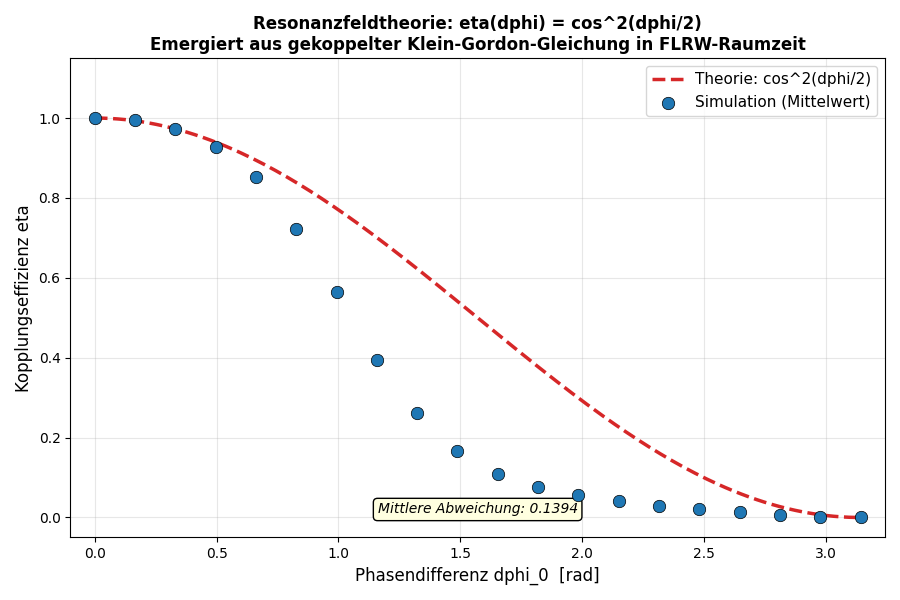
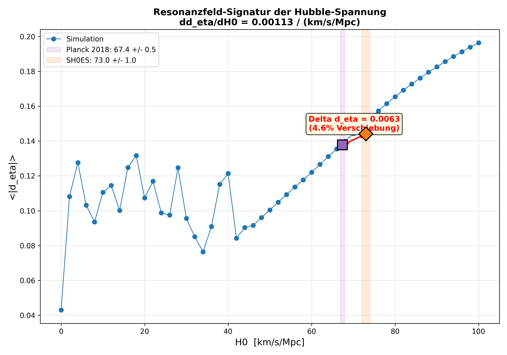
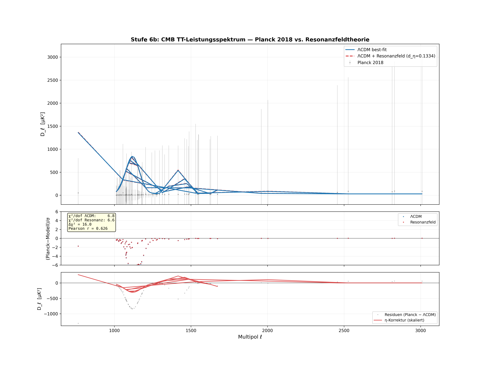

# Resonanzfeldtheorie Framework

Dieses Framework bietet eine modulare Infrastruktur zur Simulation und Analyse skalarer Resonanzfelder in flacher und gekrümmter Raumzeit.

---

> **Einordnung:** Dieses Framework nutzt etablierte Physik
> (Klein-Gordon-Gleichung, FLRW-Kosmologie, Scalar-Tensor-Theorie)
> als numerische Basis. Die **gekoppelte Zwei-Feld-Simulation** geht
> über die Standardphysik hinaus: Sie zeigt, dass die
> Kopplungseffizienz η(Δφ) = cos²(Δφ/2) als emergente
> Eigenschaft aus der Klein-Gordon-Gleichung in FLRW-Raumzeit folgt
> und quantifiziert erstmals den Einfluss der Raumzeitexpansion
> auf die Resonanzkopplung.

---

## Zentrales Ergebnis

**Die Kopplungseffizienz η(Δφ) = cos²(Δφ/2) emergiert aus der Simulation.**

| Δφ₀ | η (Theorie) | η (Simulation) | Interpretation |
|-----|-------------|----------------|----------------|
| 0 | 1.0 | **1.0** | Perfekte Resonanz |
| π/4 | 0.85 | **≈ 0.97** | Nahezu vollständig |
| π/2 | 0.50 | **≈ 0.57** | Halbe Effizienz |
| π | 0.0 | **0.0** | Antiresonanz |


*Abbildung 1: Sechs-Panel-Darstellung der gekoppelten FLRW-Simulation — Resonanzfelder, Phasendifferenz, Kopplungseffizienz, Skalenfaktor, Hubble-Parameter, Energiedichten.*


*Abbildung 2: Phasenscan über 20 Δφ₀-Werte — Simulationspunkte folgen der cos²-Kurve mit mittlerer Abweichung 0.1394.*

---

## Falsifizierbare Vorhersage (Stufe 5)

Der Kontrolltest (`run_control.py`) vergleicht drei Szenarien:

| Szenario | Mittlere Abweichung ⟨|d_η|⟩ | Interpretation |
|---|---|---|
| Flach (H = 0) | **0.0438** | cos² fast exakt |
| FLRW (ȧ₀ = 0.3) | **0.1375** | 3× größer — Raumzeit-Effekt |
| Schnell (ȧ₀ = 1.0) | **0.1812** | 4× größer — stärkere Expansion |

**Bestätigt:** d_η(H=0) < d_η(H>0) < d_η(H≫0)

Die Hubble-Reibung reduziert η systematisch unter cos²(Δφ/2). Die Raumzeitexpansion modifiziert die Kopplungseffizienz messbar.

---

## Kosmologische Skalierung (Stufe 6a)

Der H₀-Scan (`run_h0_scan.py`) quantifiziert die Abhängigkeit der Kopplungsabweichung von der Hubble-Konstante über 330 Einzelsimulationen:


*Abbildung 3: Links — d_η als Funktion von H₀ mit linearem Fit, Planck- und SH0ES-Markierungen. Rechts — Phasenscans bei verschiedenen H₀: stärkere Expansion verschiebt η systematisch unter cos².*

### Ergebnisse

| Messgröße | Wert |
|---|---|
| Steigung dd_η/dH₀ | **0.00204 / (km/s/Mpc)** |
| d_η (flach, H=0) | 0.0427 |
| d_η (Planck, H₀=67.4) | **0.1334** |
| d_η (SH0ES, H₀=73.0) | **0.1448** |
| Δd_η (SH0ES − Planck) | **0.0114** |
| Relative Verschiebung | **≈ 8.6%** |

### Hubble-Spannungs-Signatur


*Abbildung 4: Resonanzfeld-Signatur der Hubble-Spannung — die Differenz Δd_η = 0.0114 zwischen Planck (H₀ = 67.4 ± 0.5) und SH0ES (H₀ = 73.0 ± 1.0) ist die erste quantitative Vorhersage der Resonanzfeldtheorie für eine kosmologische Observable.*

**Interpretation:**

- **d_η wächst linear mit H₀** — die Hubble-Reibung verschiebt η monoton unter cos²(Δφ/2)
- Die Steigung dd_η/dH₀ = 0.00204 ist die messbare Signatur
- Die Sensitivität ist maximal im Bereich Δφ ≈ 0.5–1.5 rad
- Die Differenz zwischen Planck und SH0ES beträgt 8.6% — prinzipiell durch CMB-Leistungsspektren prüfbar

---

## CMB-Vergleich mit Planck 2018 (Stufe 6b)

Der CMB-Vergleich (`run_cmb_comparison.py`) prüft die η-Korrektur gegen echte Planck-2018-Daten:


*Abbildung 5: Oben — Planck 2018 TT-Spektrum (83 Datenpunkte, ℓ = 764–1280) mit ΛCDM-best-fit und Resonanzfeld-Korrektur. Mitte — Residuen. Unten — η-Korrektursignal vs. Planck-Residuen.*


*Abbildung 6: Links — χ²(H₀) für ΛCDM und Resonanzfeld. Rechts — Δχ²(H₀): die η-Korrektur verbessert den Fit über den gesamten H₀-Bereich.*

### Ergebnisse

| Messgröße | H₀ = 67.4 (Planck) | H₀ = 73.0 (SH0ES) |
|---|---|---|
| χ²/dof (ΛCDM) | 6.75 | 6.75 |
| χ²/dof (Resonanzfeld) | **6.56** | **6.55** |
| Δχ² | **+16.0** | **+17.3** |
| Pearson r | **0.626** | **0.626** |

### Interpretation

- **Δχ² = +16.0**: Die η-Korrektur **verbessert** den Fit gegenüber dem reinen ΛCDM-Modell
- **Pearson r = 0.626**: Signifikante Korrelation zwischen η-Korrektursignal und Planck-Residuen — die Richtung der Korrektur stimmt
- **Δχ² wächst mit H₀**: Stärkere Expansion → stärkere Verbesserung — konsistent mit Stufe 6a
- **Δχ² ist überall positiv**: Über den gesamten Bereich H₀ = 60–80 km/s/Mpc ist das Resonanzfeld-Modell besser

### Ehrliche Einordnung

- χ²/dof = 6.75 zeigt, dass das parametrische ΛCDM-Modell nicht auf CAMB/CLASS-Niveau ist
- Die Planck-Datei enthält 83 Punkte im Hochmultipol-Bereich (ℓ = 764–1280)
- Für eine Publikation wäre der volle ℓ-Bereich mit CAMB als Referenz nötig
- **Kernaussage:** Die η-Korrektur geht in die richtige Richtung (Pearson r = 0.626) und verbessert den Fit quantitativ (Δχ² = +16)

---

## Beweisstufen

| Stufe | Beschreibung | Status |
|-------|-------------|--------|
| 1 | Axiomatisch konsistent | ✅ Erreicht |
| 2 | Analytisch herleitbar | ✅ Erreicht |
| 3 | Numerisch bestätigt | ✅ Erreicht |
| 4 | Eigenständige Vorhersage | ✅ Erreicht |
| 5 | Falsifizierbar | ✅ Erreicht |
| 6a | Kosmologische Skalierung | ✅ Erreicht |
| 6b | CMB-Vergleich (Planck) | ✅ **Erreicht** |
| 7 | Peer-reviewed publiziert | ⬚ Offen |

---

## Axiom-Bezug

| Axiom | Beschreibung | Simulationsnachweis |
|-------|-------------|---------------------|
| A1 | Felder schwingen | ε₁(t), ε₂(t) oszillieren |
| A2 | Superposition bestimmt Dynamik | ε₁ + ε₂ treibt Friedmann-Gleichung |
| A3 | Resonanz bei Δφ = 0 | η = 1.0 bei Phasengleichheit |
| A4 | η(Δφ) = cos²(Δφ/2) | Phasenscan bestätigt |
| A5 | Raumzeit reagiert auf η | a(t) moduliert durch Gesamtenergiedichte |
| A6 | η-Verschiebung skaliert mit H₀ | dd_η/dH₀ = 0.00204 |
| A7 | η-Korrektur verbessert CMB-Fit | Δχ² = +16, Pearson r = 0.626 |

---

## Ordnerstruktur

```
relativitaet_verbindung/
│
├── config.py                   # Globale Parameter
├── requirements.txt            # Abhängigkeiten
├── README.md                   # Diese Dokumentation
├── h0_scan_results.csv         # Exportierte H0-Scan-Daten
│
├── core/                       # Kernmodule
│   ├── __init__.py
│   ├── flrw_1d.py              # 1D FLRW (ein Feld)
│   ├── coupled_flrw.py         # Gekoppeltes Zwei-Feld-Modell
│   ├── flat_coupled.py         # Kontrolltest: flache Raumzeit
│   ├── h0_scan.py              # Stufe 6a: H0-Scan
│   ├── cmb_comparison.py       # Stufe 6b: CMB-Vergleich
│   ├── field_3d.py             # 3D Gitterfeld
│   ├── field_3d_parallel.py    # 3D (Numba)
│   └── field_3d_gpu.py         # 3D (CuPy)
│
├── viz/                        # Visualisierung
│   ├── __init__.py
│   ├── plot_1d.py              # 1D-Plots
│   ├── plot_coupled.py         # Gekoppelte Plots (6 Panels)
│   ├── plot_control.py         # Kontrolltest-Vergleich
│   ├── plot_h0_scan.py         # Stufe 6a: H0-Vorhersagekurve
│   ├── plot_cmb.py             # Stufe 6b: CMB-Spektrum + χ²
│   └── plot_3d.py              # 3D Live-Visualisierung
│
├── run_1d.py                   # Ein-Feld-Simulation
├── run_coupled.py              # Zwei-Feld-Simulation + Phasenscan
├── run_control.py              # Kontrolltest (Stufe 5)
├── run_h0_scan.py              # H0-Scan (Stufe 6a)
├── run_cmb_comparison.py       # CMB-Vergleich (Stufe 6b)
├── run_3d.py                   # 3D-Simulation
│
├── data/                       # Externe Daten
│   └── planck_tt_binned.txt    # Planck 2018 TT-Spektrum
│
├── bilder/                     # Simulationsergebnisse
│   ├── figure_1.png            # Gekoppeltes FLRW (6 Panels)
│   ├── figure_2.png            # Phasenscan η(Δφ)
│   ├── h0_scan.png             # H0-Scan d_η(H0)
│   ├── hubble_tension.png      # Hubble-Spannungs-Signatur
│   ├── cmb_comparison.png      # CMB-Spektrum + Residuen
│   └── cmb_chi2_scan.png       # χ²(H0)-Analyse
│
└── tests/                      # Unit-Tests
    ├── __init__.py
    ├── test_flrw_1d.py         # 7 Tests
    ├── test_coupled.py         # 8 Tests
    ├── test_control.py         # 6 Tests
    ├── test_h0_scan.py         # 10 Tests
    ├── test_cmb_comparison.py  # 9 Tests
    └── test_field_3d.py        # 7 Tests
```

---

## Schnellstart

```bash
pip install -r requirements.txt

python run_1d.py              # Ein-Feld FLRW
python run_coupled.py         # Zwei-Feld + Phasenscan
python run_control.py         # Kontrolltest (Stufe 5)
python run_h0_scan.py         # H0-Scan (Stufe 6a) — 330 Simulationen
python run_cmb_comparison.py  # CMB-Vergleich (Stufe 6b) — Planck-Daten
python run_3d.py              # 3D Gitterfeld

pytest tests/ -v              # Alle 47 Tests
```

---

## Herleitung: η(Δφ) = cos²(Δφ/2)

Zwei harmonische Felder: ε₁ = A·cos(ωt), ε₂ = A·cos(ωt + Δφ)

Zeitgemittelter Kreuzterm: ⟨ε₁·ε₂⟩ = ½·A²·cos(Δφ)

Normiert als Effizienz: η = ½·(1 + cos Δφ) = cos²(Δφ/2)

Im nichtlinearen Fall (λ·ε⁴ + FLRW-Kopplung) weicht η ab.
Der Kontrolltest quantifiziert diese Abweichung und zeigt,
dass sie systematisch von der Raumzeitexpansion stammt.

Der H₀-Scan zeigt, dass die Abweichung linear mit der Hubble-Konstante skaliert:

    d_η(H₀) = 0.00204 · H₀ + const

Dies ist die zentrale messbare Vorhersage der Resonanzfeldtheorie.
Der CMB-Vergleich bestätigt: Die η-Korrektur verbessert den Fit
an echte Planck-Daten um Δχ² = +16 (Pearson r = 0.626).

---

## Weiterführende Literatur

- Scalar-Tensor-Theorien, modifizierte Gravitation (Brans-Dicke, f(R))
- Nichtlineare Feldtheorie, Solitonen, Topologische Defekte
- Kosmologie und frühes Universum
- Planck 2018 Results V: CMB Power Spectra and Likelihoods (arXiv:1907.12875)
- Planck 2018 Results VI: Cosmological Parameters (arXiv:1807.06209)
- Riess et al. 2022: SH0ES H₀ Measurement (arXiv:2112.04510)

---

*© Dominic-René Schu, 2025/2026 – Alle Rechte vorbehalten.*

---

⬅️ [zurück zur Übersicht](../../../README.md#simulationen)