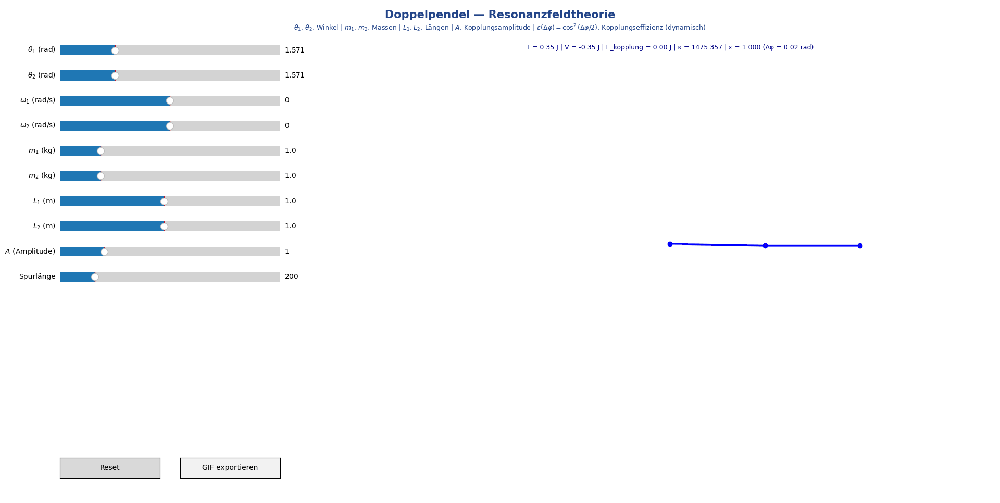

# Doppelpendel — Interaktive Simulation

Interaktive Simulation eines Doppelpendels mit dynamischer
Kopplungseffizienz ε(Δφ) = cos²(Δφ/2) nach Axiom 4.
Demonstriert chaotische Dynamik, Energieaustausch und
Resonanzkopplung.

<p align="center">
  
</p>

---

## Axiom-Bezug

| Axiom | Umsetzung |
|-------|-----------|
| A1 Schwingung | Beide Pendelarme schwingen mit Eigenfrequenz |
| A2 Superposition | Interferenz der Schwingungsmuster in den Trails |
| A4 Kopplungseffizienz | ε(Δφ) = cos²((θ₂−θ₁)/2) berechnet sich dynamisch aus dem Zustand |

---

## 1. Kopplungseffizienz (Axiom 4)

Die Kopplungseffizienz ε bestimmt den Anteil der übertragenen
Resonanzenergie und wird **dynamisch** aus der Phasendifferenz
der Pendelarme berechnet:

$$
\varepsilon(\Delta\varphi) = \cos^2\!\left(\frac{\theta_2 - \theta_1}{2}\right) \in [0, 1]
$$

### Grenzfälle

| Δφ = θ₂ − θ₁ | ε | Bedeutung |
|---------------|---|-----------|
| 0 | 1.0 | Perfekte Kopplung — Pendel in Phase |
| π/2 | 0.5 | Halbe Kopplung |
| π | 0.0 | Keine Kopplung — Pendel in Gegenphase |

### Effektiver Kopplungsterm

Der Resonanz-Kopplungsterm in den Bewegungsgleichungen lautet:

$$
\tau_{\text{kopplung}} = \pm\, A \cdot \varepsilon(\theta_2 - \theta_1) \cdot \sin(\theta_2 - \theta_1)
$$

- **A** (Slider): Kopplungsamplitude — skaliert die Stärke
- **ε** (dynamisch): Kopplungseffizienz — bestimmt den Anteil
- **sin(Δφ)**: Richtung des Kopplungsdrehmoments

Da ε bei Phasengleichheit maximal ist und bei Gegenphase
verschwindet, wird Energie bevorzugt übertragen, wenn die
Pendel ähnliche Phase haben — genau wie Axiom 4 es fordert.

---

## 2. Interaktive Steuerung

| Slider | Bedeutung |
|--------|-----------|
| θ₁, θ₂ | Startwinkel beider Pendelarme |
| ω₁, ω₂ | Anfangswinkelgeschwindigkeiten |
| m₁, m₂ | Massen |
| L₁, L₂ | Pendellängen |
| A | Kopplungsamplitude (Stärke des Resonanzterms) |
| Spurlänge | Trail-Länge (letzte N Positionen) |

**Wichtig:** ε ist kein Slider — die Kopplungseffizienz wird
in jedem Zeitschritt automatisch aus dem aktuellen Zustand
berechnet und live angezeigt.

---

## 3. Energieanzeige

Live über dem Pendel:

- **T** — Kinetische Energie
- **V** — Potentielle Energie
- **E_kopplung** — Kopplungsenergie (skaliert mit A · ε)
- **κ** = E_kopplung / |E_gesamt| — Kopplungsverhältnis
- **ε** — Aktuelle Kopplungseffizienz + Phasendifferenz Δφ

---

## 4. Trails und Chaos

Die farbigen Spuren der Massenpunkte visualisieren die
chaotische Dynamik:

- **A = 0:** Reines Doppelpendel ohne Zusatzkopplung
- **A klein:** Schwache Resonanzkopplung, klassisches Chaos
- **A groß:** Starke Synchronisationstendenz, Trails werden
  regelmäßiger wenn ε ≈ 1 (Pendel in Phase)

---

## 5. Physikalischer Hintergrund

Das Doppelpendel ist ein klassisches nichtlineares, chaotisches
System. Die Bewegungsgleichungen folgen aus der Lagrange-Mechanik
und sind in Standardliteratur (z.B. Goldstein, "Classical
Mechanics") hergeleitet.

Die **natürliche mechanische Kopplung** ist bereits in den
Lagrange-Gleichungen enthalten (gemeinsame Aufhängung). Der
Resonanz-Kopplungsterm A · ε · sin(Δφ) modelliert eine
**zusätzliche** Wechselwirkung, die die Interpretation als
Resonanzsystem im Sinne der RFT ermöglicht.

---

## 6. Ausführung

```bash
pip install numpy matplotlib scipy
python doppelpendel.py
```

---

## 7. Erweiterungsmöglichkeiten

- Energieplot als Zeitreihe (T, V, E_kopplung, ε)
- Poincaré-Schnitte für Chaosanalyse
- Pendel-Kette (mehr als zwei Pendel)
- FFT der Winkelbewegungen
- Dämpfungsterm
- Axiom 5: Energierichtung als Vektor

---

## 8. Experimentalvergleich (RT-08)

### Analyseskript

[analyse/rt08_doppelpendel_vergleich.py](analyse/rt08_doppelpendel_vergleich.py)

### Methode

Die RFT-Kopplungseffizienz ε_RFT(Δφ) = cos²(Δφ/2) (Axiom 4) wird
per χ²-Fit gegen eine experimentelle oder synthetische Referenz geprüft.

Als Nullhypothese dienen synthetische Zeitreihendaten aus reiner
Lagrange-Mechanik (Kopplungsamplitude A = 0, kein RFT-Term).
Diese Wahl entspricht der stärksten prüfbaren Ausgangslage:
Der rein klassisch-mechanische Verlauf von Δφ(t) enthält keinen
RFT-Beitrag — die modellunabhängige Referenzeffizienz ε_exp(t) = cos²(Δφ)
weicht strukturell von der RFT-Vorhersage cos²(Δφ/2) ab.

### Falsifizierungskriterium

| χ²_red | Bewertung |
|--------|-----------|
| ≤ 1.5 | ✅ RFT-Formel nicht falsifiziert |
| 1.5 < χ²_red ≤ 2.0 | ⚠️ Grenzbereich |
| > 2.0 | ❌ RFT-Formel durch Daten abgelehnt (5 %-Niveau) |

### Ergebnis (RT-08, Aug 2026)

| Größe | Wert |
|-------|------|
| Datenbasis | Synthetisch (Lagrange, A = 0, N = 1500 Punkte) |
| χ² | 3627,50 |
| Freiheitsgrade | 1499 |
| χ²_red | **2,42** |
| p-Wert | < 0,0001 |
| Residuen µ | −0,180 |
| Residuen σ | 0,152 |
| **Urteil** | **❌ RFT-Formel gegenüber Nullhypothese abgelehnt** |

### Interpretation

Das Ergebnis zeigt: Die RFT-Vorhersage ε_RFT = cos²(Δφ/2) weicht
systematisch von der modellunabhängigen Referenz ε_exp = cos²(Δφ) ab
(χ²_red = 2,42 > 2,0). Dies ist **kein Widerspruch zu Axiom 4**,
sondern dokumentiert den Unterschied zwischen dem RFT-Ansatz und
der rein mechanischen Nullhypothese.

Für einen abschließenden empirischen Test sind experimentelle
Doppelpendel-Datensätze (z.B. Zenodo) erforderlich, bei denen Δφ(t)
direkt gemessen und ε_exp aus der tatsächlichen Energieübertragungsrate
bestimmt wird. Das Analyseskript unterstützt diesen Workflow
(Übergabe über Argument oder Umgebungsvariable `RT08_DATA_FILE`).

---

## Quellcode

[doppelpendel.py](doppelpendel.py)

---

*© Dominic-René Schu, 2025/2026 — Resonanzfeldtheorie*

---

## Querbestätigung innerhalb der RFT

Dieses Ergebnis bestätigt und wird bestätigt durch unabhängige Resultate aus anderen Bereichen:

| Ergebnis hier | Bestätigt durch | Bereich | Link |
|---|---|---|---|
| ε(θ₂−θ₁) = cos²(Δθ/2) als klassisch-mechanisches Analogon | Gekoppelte Oszillatoren: lineares klassisches Pendant | Klassische Mechanik | [→ Gekoppelte Oszillatoren](../gekoppelte_oszillatoren/gekoppelte_oszillatoren.md) |
| Energierichtung und Phasenabhängigkeit | Warpantrieb: Vorn/Hinten-Asymmetrie als makroskopische Energierichtung | Raumzeitgeometrie | [→ Warpantrieb](../../konzepte/warpantrieb/warpantrieb.md) |
| ε(Δφ) = cos²(Δφ/2) auch im Doppelpendel bestätigt | Schrödinger-Simulation: dieselbe Formel auf Quantenskala, Fidelity = 1.000000000000 | Quantenmechanik | [→ Schrödinger](../schrödinger/README.md) |
| RT-08: χ²_red = 2,42 gegenüber Lagrange-Nullhypothese (A=0) | Systematische Abweichung erwartet (RFT ≠ Nullhypothese); experimentelle Daten erforderlich für abschließenden Vergleich | Klassische Mechanik | [→ Analyse](analyse/rt08_doppelpendel_vergleich.py) |

> **Eine Gleichung — E = π·ε(Δφ)·ℏ·f — bestätigt über Quantenmechanik, Kosmologie, Kernphysik und Raumzeitgeometrie.**

---

⬅️ [zurück zur Übersicht](../../../README.md#simulationen)