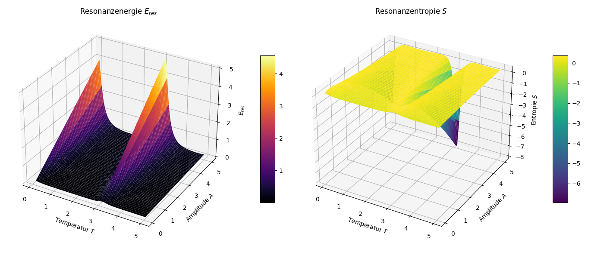

# Numerische Analyse der Resonanzfeldtheorie

Numerische Berechnung und Visualisierung von Resonanzenergie,
Kopplungseffizienz und Resonanzentropie über dem
(A, τ)-Parameterraum.

<p align="center">
  
</p>

---

## Axiom-Bezug

| Axiom | Umsetzung |
|-------|-----------|
| A3 Resonanzbedingung | Peak bei ω_ext ≈ ω₀ (Lorentz-Profil) |
| A4 Kopplungseffizienz | ε = E_res / A ∈ (0, 1] |
| A5 Stabiles Resonanzfeld | Entropie-Plateau bei Resonanz |

---

## 1. Resonanzenergie (Lorentz-Profil)

Die Resonanzenergie folgt einem klassischen Lorentz-Profil:

$$
E_{\mathrm{res}} = \frac{A}{1 + \left(\frac{\omega_{\mathrm{ext}} - \omega_0}{\gamma}\right)^2}
$$

mit:

| Symbol | Bedeutung | Default |
|--------|-----------|---------|
| A | Amplitude | 0.1–5.0 |
| ω₀ | Eigenfrequenz | 1.0 |
| γ | Dämpfungskonstante (Halbwertsbreite) | 0.2 |
| τ | Verstimmungsparameter | 0.1–5.0 |
| ω_ext | ω₀ · (1 + sin(τ)) — effektive Anregungsfrequenz | — |

**Resonanzbedingung (A3):** Bei τ = 0, π, 2π, ... ist
sin(τ) = 0, also ω_ext = ω₀ und E_res = A (Maximum).

---

## 2. Kopplungseffizienz (Axiom 4)

Aus dem Lorentz-Profil lässt sich die Kopplungseffizienz
als normierte Resonanzenergie ableiten:

$$
\varepsilon = \frac{E_{\mathrm{res}}}{A} = \frac{1}{1 + \left(\frac{\omega_{\mathrm{ext}} - \omega_0}{\gamma}\right)^2} \in (0, 1]
$$

### Grenzfälle

| Bedingung | ε | Bedeutung |
|-----------|---|-----------|
| ω_ext = ω₀ | 1.0 | Exakte Resonanz — maximale Effizienz |
| \|ω_ext − ω₀\| = γ | 0.5 | Halbwertsbreite |
| \|ω_ext − ω₀\| ≫ γ | → 0 | Weit verstimmt — keine Kopplung |

Dies ist die **frequenzabhängige** Realisierung der
Kopplungseffizienz. Sie ergänzt die **phasenabhängige**
Variante ε(Δφ) = cos²(Δφ/2) aus den anderen Simulationen.

---

## 3. Resonanzentropie (Axiom 5)

Die Entropie wird über die Kopplungseffizienz definiert:

$$
S = -\varepsilon \cdot \ln(\varepsilon), \quad \varepsilon \in (0, 1]
$$

Da ε ∈ (0, 1] ist S ≥ 0 garantiert.

### Eigenschaften

| ε | S | Interpretation |
|---|---|----------------|
| 1.0 | 0 | Perfekte Resonanz — vollständige Ordnung |
| 1/e ≈ 0.368 | 1/e ≈ 0.368 | Maximum — Balance zwischen Ordnung und Diversität |
| → 0 | → 0 | Keine Kopplung — triviale Ordnung |

**Warum über ε statt E?** Wenn S = −E·ln(E) berechnet wird
und E > 1 (große Amplituden), wird S negativ — physikalisch
unsinnig. Die Normierung über ε = E/A stellt sicher, dass
die Entropie ein wohldefiniertes Informationsmaß bleibt.

---

## 4. Visualisierung

Drei 3D-Oberflächen über dem (A, τ)-Parameterraum:

1. **Resonanzenergie** E_res — Lorentz-Profil mit
   periodischen Peaks bei sin(τ) = 0
2. **Kopplungseffizienz** ε — amplitudenunabhängig,
   zeigt reine Resonanzstruktur
3. **Resonanzentropie** S — Informationsmaß,
   Maximum bei ε = 1/e

---

## 5. Ausführung

```bash
pip install numpy matplotlib
python resonanzfeld.py
```

Output: `plot.png` und Konsolen-Zusammenfassung.

---

## 6. Einordnung

Diese Simulation zeigt das Lorentz-Profil als **Spezialfall**
der Resonanzfeldtheorie. Die Kopplungseffizienz ε tritt in
zwei komplementären Formen auf:

| Modell | ε-Formel | Abhängigkeit | Simulation |
|--------|----------|-------------|------------|
| Phasenbasiert | cos²(Δφ/2) | Phasendifferenz | Resonanz-KI, Doppelpendel |
| Frequenzbasiert | 1/(1+(Δω/γ)²) | Frequenzverstimmung | Diese Simulation |
| Exponentiell | exp(−α·\|Δf\|) | Frequenzdifferenz | Gekoppelte Oszillatoren |

Alle drei sind Realisierungen von Axiom 4: Die
Kopplungseffizienz bestimmt den Anteil der übertragenen
Resonanzenergie und liegt im Intervall (0, 1].

---

## Quellcode

[resonanzfeld.py](resonanzfeld.py)

---

*© Dominic-René Schu, 2025/2026 — Resonanzfeldtheorie*

---

⬅️ [zurück zur Übersicht](README.md)