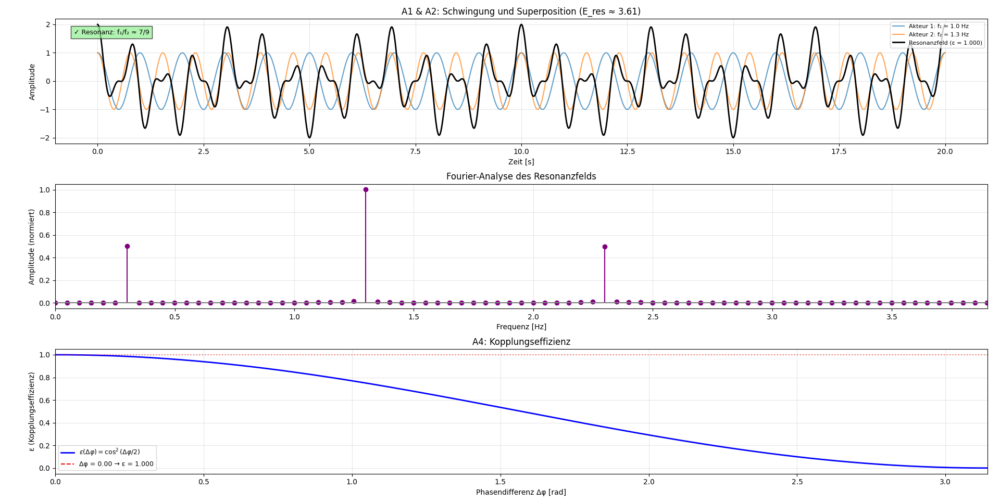

# Resonanz-KI-Modell — Zwei gekoppelte Akteure

Simulation der Kopplung zweier schwingender Akteure im Rahmen
der Resonanzfeldtheorie (Axiome A1–A4). Die numerische Analyse
verknüpft Schwingungsphysik mit Signalverarbeitung und
KI-naher Modellbildung.

<p align="center">
  
</p>

---

## Axiom-Bezug

| Axiom | Umsetzung in der Simulation |
|-------|----------------------------|
| A1 Schwingung | ψᵢ(t) = cos(2πfᵢt + φᵢ) |
| A2 Superposition | Φ = (1−ε)·ψ₁ + ε·ψ₂ + ε·ψ₁·ψ₂ |
| A3 Resonanzbedingung | Prüfung ob f₁/f₂ ≈ n/m |
| A4 Kopplungseffizienz | ε(Δφ) = cos²(Δφ/2), E_eff = π·ε·h·f_res |

---

## 1. Modellidee

Zwei Akteure (Oszillatoren, Agenten, Systeme) schwingen mit
eigenen Frequenzen f₁ und f₂. Die Kopplungseffizienz ε(Δφ)
bestimmt den Anteil der übertragenen Resonanzenergie:

$$
\varepsilon(\Delta\varphi) = \cos^2(\Delta\varphi / 2) \in [0, 1]
$$

Das Resonanzfeld ist die symmetrische Kopplung beider Akteure
mit einem nichtlinearen Kreuzterm:

$$
\Phi = (1 - \varepsilon) \cdot \psi_1 + \varepsilon \cdot \psi_2
      + \varepsilon \cdot \psi_1 \cdot \psi_2
$$

---

## 2. Resonanzenergie (Axiom 4)

$$
E_{\text{eff}} = \pi \cdot \varepsilon(\Delta\varphi) \cdot h \cdot f_{\text{res}}
$$

mit f_res = (f₁ + f₂) / 2 als mittlere Resonanzfrequenz
des gekoppelten Systems.

### Grenzfälle

| Δφ | ε | Bedeutung |
|----|---|-----------|
| 0 | 1.0 | Maximale Effizienz (Phasengleichheit) |
| π/2 | 0.5 | Halbe Effizienz |
| π | 0.0 | Keine Kopplung (Gegenphase) |

---

## 3. Fourier-Analyse

Die Fourier-Analyse des Resonanzfelds zeigt:

- **Zwei Peaks** bei f₁ und f₂ (Grundfrequenzen der Akteure)
- **Summen- und Differenzfrequenzen** durch den nichtlinearen
  Kreuzterm ε·ψ₁·ψ₂
- Bei Resonanz (f₁/f₂ ≈ n/m) verschmelzen die Peaks und
  die Kopplungsenergie wird maximal

---

## 4. Visualisierung

Drei Plots:

1. **Zeitverlauf** — Einzelschwingungen und Resonanzfeld mit
   Resonanz-Anzeige (Axiom 3)
2. **Frequenzspektrum** — Normiertes Amplitudenspektrum,
   begrenzt auf den relevanten Frequenzbereich
3. **Kopplungseffizienz** — ε(Δφ) = cos²(Δφ/2) mit
   Markierung des aktuellen Arbeitspunkts

---

## 5. Parameter

Alle Parameter sind in `init_parameter()` zentral konfigurierbar:

| Parameter | Default | Bedeutung |
|-----------|---------|-----------|
| f_akteur1 | 1.0 Hz | Frequenz Akteur 1 |
| f_akteur2 | 1.3 Hz | Frequenz Akteur 2 |
| phi1, phi2 | 0.0 rad | Phasenverschiebungen |
| h | 1.0 | Planck-Konstante (normiert) |
| t | 0–20 s | Zeitbereich (2000 Punkte) |

Die Kopplungseffizienz ε wird aus der Phasendifferenz
Δφ = φ₂ − φ₁ automatisch berechnet — kein manueller
Parameter, sondern eine physikalische Konsequenz des
Systemzustands.

---

## 6. Ausführung

```bash
pip install numpy matplotlib
python resonanz_ki.py
```

---

## 7. Bedeutung und Ausblick

Das Resonanz-KI-Modell zeigt, wie durch Kopplung von
Einzelsystemen emergente Felder entstehen. Erweiterungen:

- Mehr als zwei Akteure (Netzwerk-Resonanz)
- Adaptive Kopplungen (zeitabhängiges ε)
- KI-gesteuerte Optimierung der Resonanzbedingungen
- Integration von Axiom 5 (Energierichtung) und A6 (Informationsfluss)

---

## Quellcode

[resonanz_ki.py](resonanz_ki.py)

---

*© Dominic-René Schu, 2025/2026 — Resonanzfeldtheorie*

---

⬅️ [zurück zur Übersicht](../README.md)