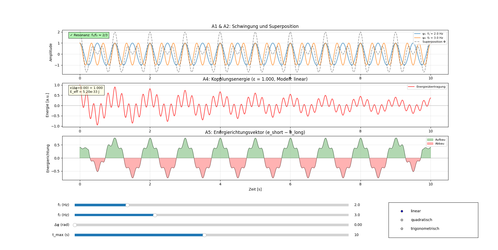

# Resonanzfeld-Simulation mit Resonanzfeld-Gleichung

Diese interaktive Simulation visualisiert die Energieübertragung zwischen zwei schwingenden Oszillatoren basierend auf der **Resonanzfeld-Gleichung**:

$$
**E = \pi \cdot 𝓔 \cdot h \cdot (f_1 + f_2)**
$$

---

## 🧭 Axiome der Resonanzfeldtheorie

1. **Alles ist Schwingung.**  
   Jede Form von Energie und Materie basiert auf Schwingungen eines zugrunde liegenden Resonanzfeldes.

2. **Resonanz koppelt.**  
   Systeme treten dann in Wechselwirkung, wenn ihre Schwingungen in ein ganzzahliges Verhältnis treten – das ist Resonanz.

3. **Energieübertragung folgt der Kopplung.**  
   Die effektive Energie einer resonanten Kopplung ist $$E = \pi \cdot \varepsilon(\Delta\varphi) \cdot h \cdot f$$, wobei die Kopplungseffizienz $$\varepsilon \in [0, 1]$$ den Anteil der übertragenen Resonanzenergie beschreibt.

4. **π ist der Maßstab für zyklische Kopplungsgeometrie.**  
   Der Faktor $$\pi$$ entsteht aus der Integration der Kopplungseffizienz über einen Halbzyklus des Resonanzpfads — er ist kein freier Parameter, sondern geometrisch hergeleitet.

5. **h ist die Informationsquantelung des Feldes.**  
   Das Plancksche Wirkungsquantum $$h$$ beschreibt die minimale Wirkungseinheit im Resonanzfeld.

6. **ε bestimmt die Kopplungsqualität.**  
   Die Kopplungseffizienz $$\varepsilon(\Delta\varphi) = \cos^2(\Delta\varphi/2)$$ ist phasenabhängig: maximal bei Phasengleichheit ($$\varepsilon = 1$$), null bei Gegenphase ($$\varepsilon = 0$$). Der Spezialfall $$\varepsilon = 1/e \approx 0.368$$ beschreibt natürliche Dämpfung nach einer Relaxationszeit.

---

## Features

Auswahl der Kopplungsart:

- **Linear**:  
  
$$
E_\mathrm{trans} = 𝓔 \cdot \psi_1 \cdot \psi_2
$$
	
- **Quadratisch**:  
    
$$
E_\mathrm{trans} = 𝓔 \cdot \psi_1^2 \cdot \psi_2
$$
- **Trigonometrisch**:  
    
$$
E_\mathrm{trans} = 𝓔 \cdot \sin(\psi_1) \cdot \sin(\psi_2)
$$

- Anzeige der **Resonanzbedingung** bei rationalem Frequenzverhältnis  
  
$$
\frac{f_1}{f_2} = \frac{n}{m}
$$

- Optionale Verwendung einer neuen Naturkonstante $$\eta$$ statt $$h$$  
- Interaktive Visualisierung mit `ipywidgets`

---

<p align="center">
  
</p>

---

[Link zur Python](../../simulationen/resonanzfeld/simulation_resonanzfeldtheorie.py)

---

## Voraussetzungen

- Python ≥ 3.8  
- Jupyter Notebook / JupyterLab  
- Installierte Pakete:

```bash
pip install numpy matplotlib ipywidgets
```

---

*© Dominic Schu, 2025 – Alle Rechte vorbehalten.*

---

⬅️ [zurück zur Übersicht](../README.md)
