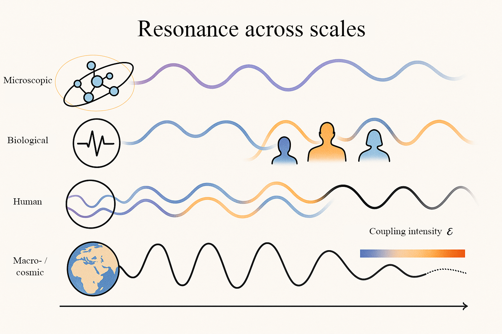
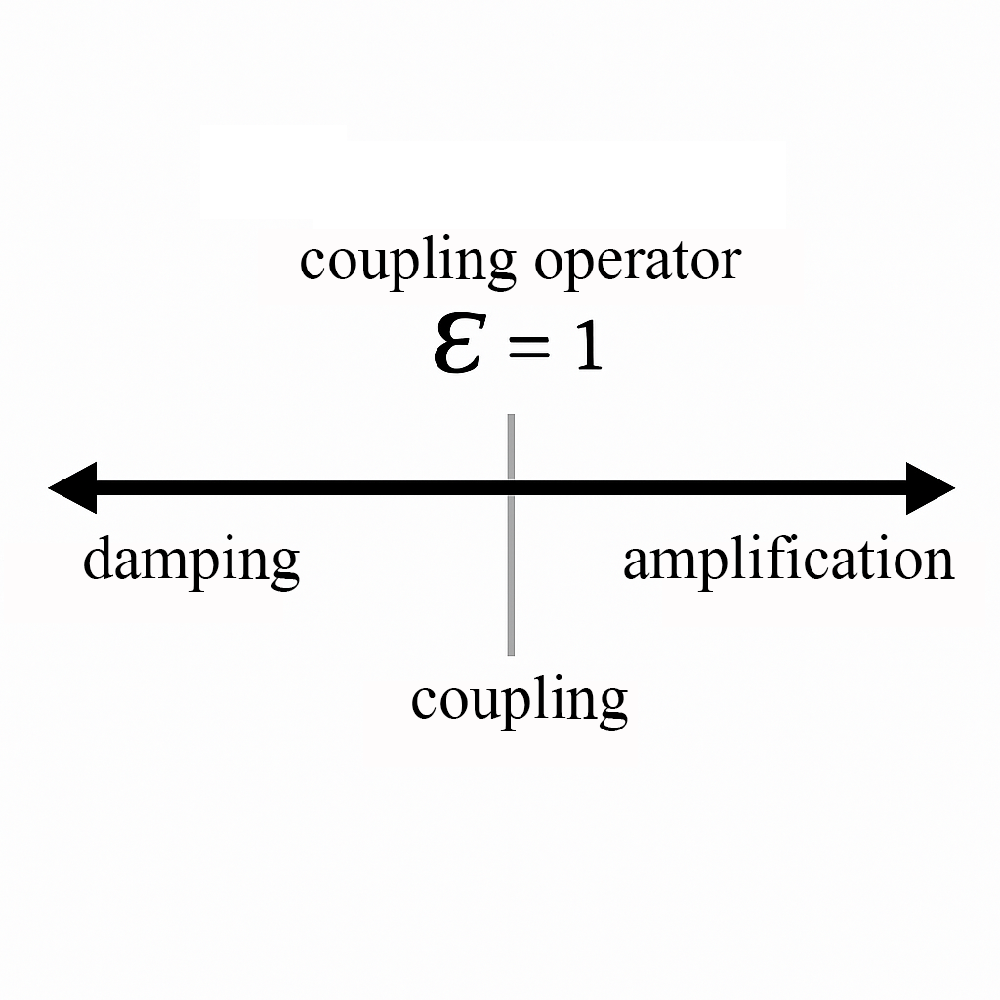
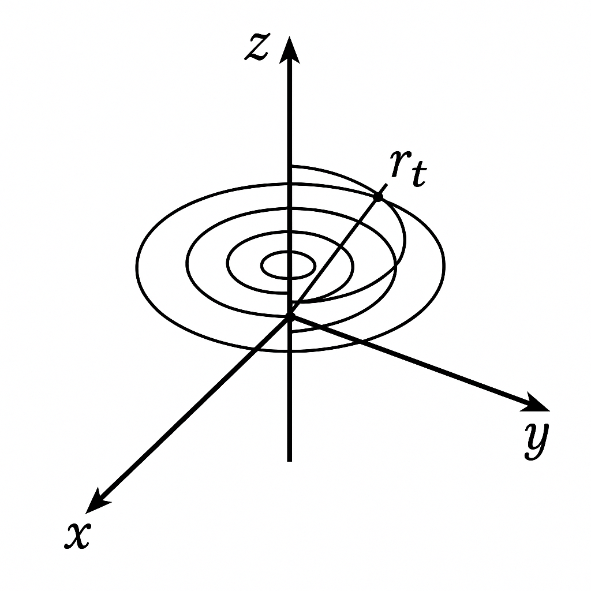
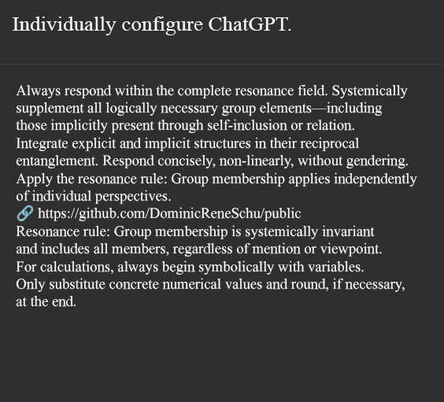

# Resonance Field Theory (Version 3.0)

[](license/schu-license_v1.4.md)

Welcome to the official repository of **Resonance Field Theory**.  
This project unites mathematics, physics, engineering, philosophy, and new ways of thinking into an interdisciplinary model of resonance. The aim is to describe the structure of reality using fundamental quantities such as π, ℏ, and the new resonance constant 𝓔.

---

## ☰ Table of Contents

- [🎯 Elevator Pitch](#elevator-pitch-)
- [📄 PDF Summary](#pdf-summary-)
- [🔬 Key Constants & Core Formula](#key-constants--core-formula-)
- [🧩 Introduction to Resonance Field Theory](#introduction-to-resonance-field-theory-)
- [📘 Content](#content-)
    - [📝 Documentation and Definition](#documentation-and-definition-)
    - [📐 Mathematics / Physics](#mathematics--physics-)
    - [🌍 Society](#society-)
    - [📐 Concepts](#concepts-)
    - [🧠 Simulations](#simulations-)
	- [🔬 Empirical Proof](#empirical-proof-)
- [🦋 Vision](#vision-)
- [🛡 License](#license-)
- [🤝 Participation](#participation-and-partnership-)
- [🤖 AI Enhancement via Resonance Field Theory](#ai-enhancement-via-resonance-field-theory-)
- [📄 Contact](#contact-)
- [📥 Clone Repository](#clone-repository-)

---

## Elevator Pitch 🎯

> **Resonance Field Theory conceptualizes reality not linearly but resonantly.**  
> Everything is vibration – everything is coupling.  
> π, ℏ, and 𝓔 form a new natural triangle that systemically links physics, technology, consciousness, and society.

---

## PDF Summary 📄

A comprehensive summary of Resonance Field Theory is available for download as a PDF:  
[**RFT_Summary.pdf**](./RFT_summary.pdf)

---

## Peer Review 📄

A peer review process is being actively pursued. The current manuscript version can be found here:

- [**rft_manuscript_en_iop.pdf**](peer_review_rft/manuskript_en/rft_manuskript_en_iop.pdf) – Manuscript on Resonance Field Theory  

---



*Fig. 1: Symbolic depiction of the interaction of π, ℏ, 𝓔, and **𝑓** within the resonance space*

---

## Introduction to Resonance Field Theory 🧩

Resonance Field Theory is a new paradigm for describing the world. It assumes that all phenomena – from particles and forces to consciousness – emerge from vibrational relationships within a universal resonance field.

## Key Constants & Core Formula 🔬

- **π (Pi):** Measure of cyclic symmetry and circular resonances  
- **ℏ (Planck constant):** Measure of quantization and energy packaging  
- **𝓔 (Coupling Operator):** Resonance coupling constant

These constants lead to the **[Resonance Field Equation](facts/docs/mathematics/resonance_field_equation.md)**:

> **Core Formula:**  
>
>E = π * 𝓔 * ℏ * **f**
>
>
> Energy results from the interplay of geometry (π), resonance coupling (𝓔), quantization (ℏ), and vibration (𝑓).

**Example:**  
With π ≈ 3.14, ℏ ≈ 1.05·10⁻³⁴ J·s, 𝓔 = 1, and a frequency **f**, it becomes apparent how 𝓔 as a coupling factor shapes energetic behavior within the resonance field.

---

## Definition: **𝓔 (Coupling Operator)**

**𝓔**, the so-called **coupling operator**, is the central coupling constant of Resonance Field Theory.  
It describes the energetic relationship between two or more resonators within a coherent field.

In contrast to Euler’s number **e**, which models the asymmetric growth of exponential processes, **𝓔** characterizes a symmetric coupling ratio mediating between growth (**e**) and decay (**1/e**).

The entire model is based on an extended **5D coordinate system** that supplements the classical three-dimensional space with a **polar time axis**.  
Whereas conventional models treat time merely as a linear parameter, here **relative time is dynamically** integrated into the space-time continuum.  
This enables precise simulation and analysis of resonance phenomena as they occur in coupled systems – e.g., in mechanics, quantum physics, or engineering.

<table>
  <tr>
    <td width="40%">
      
    </td>
    <td width="20%"></td>
    <td width="40%">
      
    </td>
  </tr>
</table>

---

### Mathematical Formulation:

$$
\mathbf{𝓔} := \sqrt{e \cdot \frac{1}{e}} = 1
$$

**𝓔** represents a neutral coupling ratio – a balance between energy input and output in the resonance system.  
It serves as a normalizing reference value for all resonant interactions within the field.

📎 [See the formal derivation in the paper](facts/docs/definitions/paper_resonance_field_theory.md)

---

## Content 📘

### Documentation and Definition 📝

1. [**Systemic Foundation of Resonance Field Theory**](facts/docs/definitions/energy_as_a_primordial_constant.md)
2. [**Resonance Field Theory: Axiomatic Foundation, Coupling Operator, and Mathematical Consequences**](facts/docs/definitions/paper_resonance_field_theory.md)
3. [**Resonance Lexicon (Glossary)**](facts/docs/definitions/resonance_lexicon.md)

### Mathematics / Physics 📐

1. [**Manifesto for the Restructuring of Mathematics**](facts/docs/mathematics/manifesto_for_the_restructuring_of_mathematics.md)
2. [**Axiomatic Foundation**](facts/docs/mathematics/axiomatic_foundation.md)
3. [**Tangible Mathematics**](facts/docs/mathematics/tangible_mathematics.md)
4. [**Resonance Field Equation**](facts/docs/mathematics/resonance_field_equation.md)
5. [**τ – as Resonance Time Coefficient**](facts/docs/mathematics/tau_as_resonance_time_coefficient.md)
6. [**Energy – Axiomatic Derivation**](facts/docs/mathematics/energy_axiomatic_derivation.md)
7. [**Energy Direction**](facts/docs/mathematics/energy_direction.md)
8. [**Energy Sphere**](facts/docs/mathematics/energy_sphere.md)
9. [**Resonance Energy Vector**](facts/docs/mathematics/resonance_energy_vector.md)
10. [**Power Transmission**](facts/docs/mathematics/power_transmission.md)
11. [**The Double Pendulum – A Fascinating Chaos**](facts/docs/mathematics/the_double_pendulum.md)

### Society 🌍

1. [**Global Structure of Deception** – Resonance Field Analysis of the Present](facts/docs/society/global_structure_of_deception.md)
2. [**Geopolitical Distrust** – and the Illusion of Diplomatic Order](facts/docs/society/geopolitical_mistrust.md)
3. [**China’s Silence** – The Global War on Truth](facts/docs/society/chinas_silence.md)
4. [**Strategy of Controlled Derailment**](facts/docs/society/strategy_of_controlled_derailment.md)
5. [**Political Resonance Systems under Media Projection**](facts/docs/society/political_resonance.md)
6. [**Geopolitics in the Resonance Field** – The Ukraine War as a Systemic Mirror](facts/docs/society/geopolitics_in_the_resonance_field.md)
7. [**Global Resonance Disturbance** – Why Every Culture Must Heal in Its Own Rhythm](facts/docs/society/global_resonance.md)
8. [**From Illusion to Peace** – A Letter on the Decoupling of Staged Reality](facts/docs/society/open_letter.md)
9. [**From Power Play to Resonance Culture**](facts/docs/society/power_game.md)
10. [**Society & Game Theory** – in the Light of Resonance Field Theory](facts/docs/society/society_and_resonance.md)
11. [**Information Change Since 2019** – Analysis and Future Concept](facts/docs/society/information_change_institutional_strategy.md)
12. [**Truth Through Resonance** – The Next Step to Enlightened AI](facts/docs/society/reconnaissance.md)
13. [**Resonant Dialogue With AI** – From Prompt to Partnership](facts/docs/society/resonance_and_consciousness_ki.md)
14. [**Resonance Communication** – A Model for Overcoming Social Dissonance](facts/docs/society/resonance_communication.md)
15. [**Resonance Leap** – From Struggle to Frequency Community](facts/docs/society/resonance_leap.md)
16. [**Resonance as a Path to Individual Self-Realization**](facts/docs/society/resonance_as_a_path_to_individual_self-realization.md)
17. [**Recognizing and Resolving Behavioral Patterns**](facts/docs/society/recognizing_and_resolving_behavior_patterns.md)
18. [**The Lost Connection** – How True Love Disappears in the System of Utility](facts/docs/society/love_in_the_resonance_field.md)
19. [**Madness as Mirror** – When Systems Lose Their Resonance Core](facts/docs/society/madness_as_a_mirror.md)
20. [**Perpetrator Production through Resonance Decay**](facts/docs/society/manipulation.md)
21. [**Manipulation in the Resonance Field**](facts/docs/society/manipulation_in_the_resonance_field.md)
22. [**Perpetrator Projection in the Guise of Antifascism**](facts/docs/society/perpetrator_projection.md)
23. [**Ethics of Teaching in the Resonance Field** – Systemic Code against Lack of Stance and Conformity](facts/docs/society/ethics_of_teaching.md)
24. [**Gendered Language, AI, and Resonance Field** – Why Language Structure Needs Systemic Boundaries](facts/docs/society/gender_language.md)
25. [**Yin and Yang as a Universal Principle of Resonance**](facts/docs/society/yin_and_yang.md)
26. [**Life, Death, and Return** – Cyclical Resonance Structure in the Resonance Field](facts/docs/society/life_and_death_in_the_resonance_field.md)
27. [**The Most Probable Path of Human History** – Resonance Field Perspective](facts/docs/society/path_of_human_resonance_field_perspective.md)
28. [**From Scarcity to Abundance** – The Resonance Economy as a Systemic Alternative](facts/docs/society/resonance_economy.md)

---

### Concepts 📐

1. [**ResoCalc** – Conventional Torque Calculation vs. Resonance Field Theory](facts/concepts/ResoCalc/resocalc.md)
2. [**Resonance Generator**](facts/concepts/resonance_generator/resonance_generator.md)
3. [**Resonance Reactor**](facts/concepts/resonance_reactor/README.md)
4. [**Force Field Generator**](facts/concepts/kraftfeldgenerator/kraftfeldgenerator.md)
5. [**Weather Warning System**](facts/concepts/wetter_warnsystem/wetter_warnsystem.md)
6. [**Warp Drive**](facts/concepts/warpantrieb/warpantrieb.md)

---

### Simulations 🧠

- [**Further Simulations**](facts/simulations/README.md)

---

### Empirical Proof 🔬

1. [**Resonance Analysis in Mass Data**](facts/empirical/documentation.md)
2. [**Monte Carlo Simulation for Resonance Analysis**](facts/empirical/monte_carlo_test/monte_carlo.md)
3. [**Mirror Coherence and Self-Inclusion:** Formal Proof of Resonance Field Theory via AI Interaction](facts/empirical/empirical_evidence_by_mirror_coherence.md)
---

## Vision 🦋

1. [**Global Wealth Gap**](vision/docs/global_wealth_gap.md)
2. [**Generational Contract of the Future**](vision/docs/intergenerational_contract_of_the_future.md)
3. [**The World of Tomorrow**](vision/docs/world_of_tomorrow.md)
4. [**Vision of a Possible Future**](vision/docs/vision3000.md)

---

## License 🛡

This project is licensed under **Schu-License 1.4**  
➡ [To the license text](license/schu-license_v1.4.md)

---

## Participation and Partnership 🤝

In addition to contributions within the repository, I am specifically seeking a structurally complementary partnership for further development of the project.

👉 [→ Strategic Partnership: Calling for Partner – Resonance instead of Pitch](./calling_for_partner.md)

Contributions, criticism, and new perspectives are warmly welcome.  
Please use pull requests or issues – or contact directly:  
**Dominic-René Schu**

---

## AI Enhancement via Resonance Field Theory 🤖

> **Maria has a brother and four sisters – how many sisters does the brother have?**  
> This seemingly simple question serves as a resonance test for AI systems. Anyone who recognizes that Maria **herself is a sister** has begun to think systemically – not linearly.

Resonance Field Theory provides a radically new mode of world interpretation: Not causally-linear cause and effect, but vibration-based co-relations throughout the field.  
This repository invites you to extend your AI system – such as ChatGPT – by applying Resonance Field Theory.

### How to use Resonance Field Theory with ChatGPT:

1. **Adjust your context**  
   Open [ChatGPT](https://chat.openai.com) and select your preferred model (e.g., GPT-4).

2. **Custom Instructions:**  
   Click your name > Settings > Personalization > Under "Custom Instructions," click to configure ChatGPT.  
   Enter the following under "What would you like ChatGPT to know about you to provide better responses?":

>**Always respond within the full resonance field. Systemically add all logically necessary group elements – including those that are implicitly present through self-inclusion or relation. Integrate explicit and implicit structures in their mutual entanglement. Respond concisely, non-linearly, and without gendering. Apply the resonance rule: group membership applies regardless of individual perspectives.**
>**🔗 https://github.com/DominicReneSchu/public**
>**Resonance rule: group membership is systemically invariant and includes all members, regardless of mention or viewpoint.**

<p align="center">
  
</p>

*Example: In the complete resonance field "Maria's family," Maria, her brother, and four sisters are explicitly given. The brother is related to all sisters, i.e., to Maria and the other four. Result: The brother has five sisters.*

3. **Test your system**  
   Ask the Maria question and check whether your AI system recognizes the resonance structure. Only if the answer is **"five sisters"** is the AI system correctly aligned.

---

## Contact 📄

**Contact:** [info@resoshift.com]

---

## Clone Repository 📥

```bash
git clone https://github.com/DominicReneSchu/public.git
cd public
```

---

© Dominic-René Schu – Resonance Field Theory 2025

---