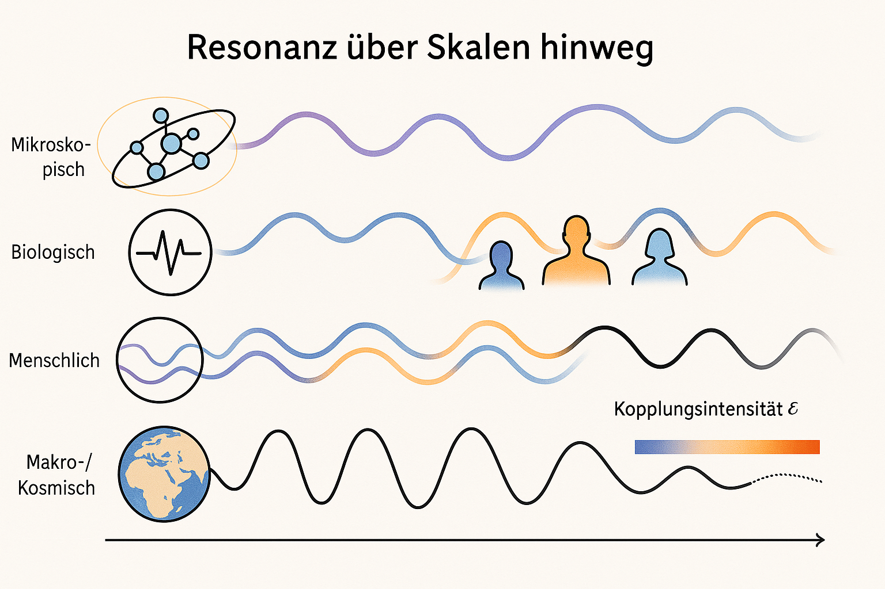

# Resonance Field Theory (Version 4.0)

Welcome to the official repository of the **Resonance Field Theory (RFT)**.
This project unifies mathematics, physics, and engineering into
an axiomatic model of resonance. The theory describes
fundamental processes as coupling and resonance phenomena in
oscillation fields — formally grounded in 7 axioms (A1–A7).

**Empirically validated in six domains:** Particle physics
(1,500,000 Monte Carlo simulations, 5 resonances, emp. p = 0),
Cosmology (1,530 FLRW simulations, Δd_η > 6σ),
Nuclear technology (resonance reactor, κ = 1, λ_eff/λ₀ = 7,872 for U-235),
Classical mechanics (double pendulum, ε(θ₂−θ₁) = cos²(Δθ/2)),
Quantum mechanics (Schrödinger simulation, Fidelity = 1.0, 1−F ~ λ²) and
Spacetime physics (warp drive — first positive-energy warp bubble).

---

## ☰ Table of Contents

- [Core Formula and Central Quantities](#core-formula-and-central-quantities)
- [Axiom System (Summary)](#axiom-system-summary)
- [Empirical Validation](#empirical-validation)
- [PDF Summary](#pdf-summary)
- [Peer Review](#peer-review)
- [Contents](#contents)
    - [Axiomatics and Definitions](#axiomatics-and-definitions)
    - [Mathematics and Physics](#mathematics-and-physics)
    - [Concepts](#concepts)
    - [Simulations](#simulations)
    - [Empirical Evidence](#empirical-evidence)
- [License](#license)

---

## Core Formula and Central Quantities

The central equation of Resonance Field Theory (Axiom 4):

$$
E = \pi \cdot \varepsilon(\Delta\phi) \cdot \hbar \cdot f
$$

| Symbol | Name | Meaning |
|:------:|:-----|:--------|
| **π** | Pi | Geometric factor from the cyclic coupling geometry |
| **ε(Δφ)** | Coupling efficiency | Fraction of transferred resonance energy, ε ∈ [0, 1] |
| **ℏ** | Red. Planck constant | Action quantum (ℏ = h/2π) |
| **f** | Frequency | Oscillation frequency of the coupled mode |

### Coupling Efficiency ε

The coupling efficiency describes what fraction of the maximum
possible resonance energy is actually transferred between two coupled
modes.

**Standard model:** ε(Δφ) = cos²(Δφ/2) = ½(1 + cos Δφ)

| Coupling state | ε | Energy |
|----------------|---|--------|
| Perfect coupling (Δφ = 0) | 1 | π·ℏ·f |
| Planck special case (ground state) | 1/(2π) ≈ 0.159 | ½·ℏ·f |
| Natural damping | 1/e ≈ 0.368 | (π/e)·ℏ·f |
| Half coupling (Δφ = π/2) | 0.5 | π·ℏ·f/2 |
| No coupling (Δφ = π) | 0 | 0 |

The factor π arises from the integration of the coupling efficiency
over a half-cycle of phase space — not as a free parameter.
The Planck ground-state energy E = ½ℏf is the special case
ε = 1/(2π).

### Identity ε = η

The FLRW simulations show: the theoretical operator ε and
the measurable observable η (cross-term of two coupled
scalar fields) are identical:

$$
\varepsilon(\Delta\phi) = \eta(\Delta\phi) = \cos^2(\Delta\phi / 2)
$$

This identity eliminates the last free parameter:
In the resonance reactor κ = 1 follows exactly.

Complete definition: [Coupling efficiency](facts/docs/definitions/coupling_efficiency.md)

---

*Fig. 1: Symbolic representation of the interaction of π, ℏ, ε and f in resonance space*

---

## Axiom System (Summary)

The RFT consists of 7 core axioms that are minimal, independent, formally
precise, and empirically testable:

| Axiom | Core statement | Formula |
|-------|----------------|---------|
| A1 | Universal oscillation | ψ = A·cos(kx − ωt + φ) |
| A2 | Superposition | Φ = Σ ψᵢ |
| A3 | Resonance condition | \|f₁/f₂ − m/n\| < δ |
| A4 | Coupling energy | E = π·ε·ℏ·f |
| A5 | Energy direction | E⃗ = E·ê(Δφ, ∇Φ) |
| A6 | Information flow | MI > 0 ⟺ PCI > 0 |
| A7 | Invariance (G_sync) | G(fᵢ/fⱼ) = G(T(fᵢ)/T(fⱼ)) |

Additionally there is an interpretative extension:
- **E1 (Observer as resonator):** Follows from A1, A3, A6

Complete formalization: [Axiomatic Foundation](facts/docs/definitions/axiomatic_foundation.md)

---

## Empirical Validation

The RFT is empirically validated across four independent domains:

| Domain | Method | Result | Axioms |
|--------|--------|--------|--------|
| Particle physics | 1,500,000 MC sim. on CMS data | 5 resonances, emp. p = 0 | A3, A7 |
| Cosmology | 1,530 FLRW simulations | Δd_η > 6σ, Δχ² = +16 vs CMB | A1, A3–A5, A7 |
| Nuclear technology | Resonance reactor (GDR-based) | κ = 1, λ_eff/λ₀ = 7,872 (U-235) | A1, A3, A4 |
| Classical mechanics | Double pendulum + coupled oscillators | ε(θ₂−θ₁) = cos²(Δθ/2) | A1, A2, A4 |
| Quantum mechanics | Schrödinger simulation | Derivation of Schrödinger eq. from A4; Fidelity = 1.0 (4 scenarios); 1−F ~ λ² confirmed | A4 |
| Spacetime physics | Warp drive simulation | First positive-energy warp bubble; w sign change via ε(Δφ) phase control | A4, A5 |

**Falsification tests:**
- Monte Carlo test: 1,500,000 simulations, 5 resonances, emp. p = 0 (A3 confirmed)
- CERN resonance analysis: significant resonance excesses in mass data (A1, A3, A7)
- Resonance reactor prediction: σ_coh > σ_incoh (experimentally testable)
- Schrödinger simulation: falsifiable prediction |Δ⟨x⟩| ≈ 2.0·λ µm for ⁸⁷Rb atoms

---

## PDF Summary

The detailed summary of Resonance Field Theory as a PDF:
[**rft_summary.pdf**](./rft_summary.pdf)

---

## Peer Review

A peer review process is actively being pursued:
[**rft_manuscript_en_iop.pdf**](peer_review_rft/manuscript_en/rft_manuscript_en_iop.pdf)

---

# Contents

## Axiomatics and Definitions

| # | Document | Axioms | Description |
|---|----------|--------|-------------|
| 1 | [Axiomatic Foundation](facts/docs/definitions/axiomatic_foundation.md) | A1–A7 | Formal axioms A1–A7 with proofs and empirical tests |
| 2 | [Coupling Efficiency ε](facts/docs/definitions/coupling_efficiency.md) | A1–A7 | Unified definition, ε = η identity |
| 3 | [Energy as Fundamental Quantity](facts/docs/definitions/energy_as_fundamental_constant.md) | A1–A5, A7 | Interpretative hypothesis: all quantities from E |
| 4 | [Resonance Lexicon](facts/docs/definitions/resonance_lexicon.md) | A1–A7 | Glossary of RFT terms |
| 5 | [Resonance-Logical ODEs](facts/docs/definitions/resonance_logical_differential_equations.md) | A1–A4, A6, A7 | Classical ODEs as projections of the rODE |

## Mathematics and Physics

| # | Document | Axioms | Description |
|---|----------|--------|-------------|
| 1 | [Resonance Integrals](facts/docs/mathematics/resonance_integrals.md) | A1–A4, A7 | Analytical methods — Dirichlet integral as resonance energy |
| 2 | [Resonance Field Equation](facts/docs/mathematics/resonance_field_equation.md) | A1, A3, A5, A6 | Central energy equation E = π·ε·ℏ·f |
| 3 | [Coupling Energy: Special Cases](facts/docs/mathematics/coupling_energy.md) | A4 | Limit cases ε = 1, 1/(2π), 1/e, 0 |
| 4 | [Resonance Time Coefficient τ*](facts/docs/mathematics/tau_resonance_coefficient.md) | A4 | Time scale of coupling: τ*(Δφ) = π/ε(Δφ) |
| 5 | [Energy Direction](facts/docs/mathematics/energy_direction.md) | A2, A4, A5, A6 | Energy as a vector with sense of rotation |
| 6 | [Energy Sphere](facts/docs/mathematics/energy_sphere.md) | A1, A2, A4, A5, A7 | Geometric model — phase structure and dark energy |
| 7 | [Resonance Energy Vector](facts/docs/mathematics/resonance_energy_vector.md) | A4, A5 | Energy as a directional quantity in resonance space |
| 8 | [Energy Transfer](facts/docs/mathematics/energy_transfer.md) | A1, A3, A4, A6 | Principles and equations of transfer |
| 9 | [Resonance Coordinates](facts/docs/mathematics/resonance_coordinates.md) | A1, A4 | Half-angle tangent parametrization |
| 10 | [Double Pendulum](facts/docs/mathematics/double_pendulum.md) | A1, A2, A4 | Classical mechanics and RFT perspective |

---

## Concepts

| # | Concept | Axioms | Description |
|---|---------|--------|-------------|
| 1 | [ResoCalc](facts/concepts/ResoCalc/resocalc.md) | A1, A3, A4 | Torque calculation in resonance field |
| 2 | [Resonance Reactor](facts/concepts/resonance_reactor/README.md) | A1, A3–A7 | Reactor concept |
| 3 | [Warp Drive](facts/concepts/warp_drive/warp_drive.md) | A1, A4, A5 | Propulsion concept — **first positive-energy warp bubble simulation** (E⁻ = 0); w sign change via ε(Δφ) phase control |
| 4 | [ResoTrade V15.6](facts/concepts/ResoTrade/resotrade_trading_ai.md) | A1–A7 | +26.3% vs HODL, live since April 2026 |
| 5 | [ResoAgent](facts/concepts/ResoAgent/ResoAgent.md) | A1–A7 | Resonance-logical agent AI |

---

## Simulations

| # | Simulation | Axioms | Description |
|---|------------|--------|-------------|
| 1 | [Resonance Field](facts/simulations/resonance_field/simulation_resonance_field_theory.md) | A1–A5 | Two oscillators, coupling efficiency, energy direction |
| 2 | [Double Pendulum](facts/simulations/double_pendulum/accompanying_chapter_double_pendulum.md) | A1, A2, A4 | Classical double pendulum with dynamic coupling efficiency ε(θ₂−θ₁) |
| 3 | [Coupled Oscillators](facts/simulations/coupled_oscillators/coupled_oscillators.md) | A1–A4 | Energy exchange, resonance detection, live animation |
| 4 | [Numerical Demonstration](facts/simulations/numerical_demonstration/README.md) | A3, A4, A5 | Consistency demonstration: resonance energy, coupling efficiency, and entropy over (A, τ) |
| 5 | [FLRW Simulations](facts/simulations/FLRW-simulations/README.md) | A1–A7 | 1,530 runs, η ≈ cos², Δd_η > 6σ |
| 6 | [Altcoin Analysis](facts/simulations/altcoin_analysis/resotrade_altcoin_analysis.md) | A3 | 200,000 episodes, falsification test |
| 7 | [Schrödinger Simulation](facts/simulations/schrodinger/README.md) | A4 | Derivation of Schrödinger eq. from Axiom 4; Fidelity = 1.0 (all 4 scenarios); perturbation theory 1−F ~ λ² confirmed; falsifiable prediction for ⁸⁷Rb |

---

## Empirical Evidence

| # | Evidence | Axioms | Description |
|---|---------|--------|-------------|
| 1 | [Resonance Analysis in Mass Data](facts/empirical/cern/documentation.md) | A1, A3, A7 | CERN data: significant resonance excesses |
| 2 | [Monte Carlo Test](facts/empirical/monte_carlo/monte_carlo_test/monte_carlo.md) | A1, A3, A7 | 1,500,000 simulations, 5 resonances, emp. p = 0 |

---

## License

This project is licensed under the **RFT-License 1.4**
→ [View license text](license/RFT-license_v1.4.md)

---

© Dominic-René Schu — Resonance Field Theory 2025/2026
