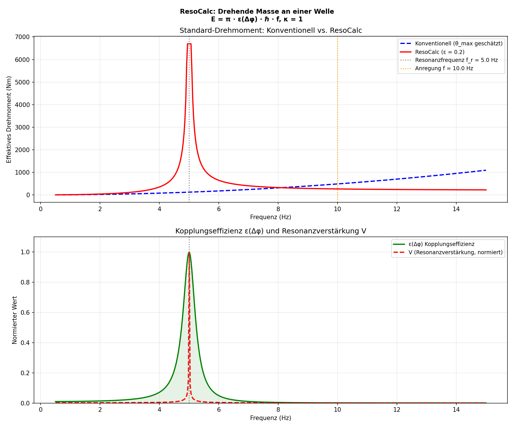

# ResoCalc – Resonance-Based Engineering Tool

> *"Conventional mechanics asks: How large is the deflection?*
> *Resonance Field Theory asks: How strong is the coupling?"*
> *(Dominic-René Schu)*

---

## Core Idea

Conventional engineering calculations are based on **arbitrary assumptions**. To calculate a torque, an engineer must *estimate* a maximum deflection. To calculate an oscillation, they must *assume* a damping value. To calculate a load, they must *choose* a safety factor.

The problem: These assumptions are not physical — they are **conventions**. Different engineers choose different values, and the result varies accordingly.

**ResoCalc** replaces arbitrary assumptions with the physical principle of **resonance coupling**:

```
CONVENTIONAL:
  Engineer estimates θ_max = 5° (why not 3°? or 8°?)
  → Result depends on the estimate
  → Different engineers → different results
  → No physical justification for the choice

RESOCALC:
  System has excitation frequency f and resonance frequency f_r
  → Coupling ε(Δφ) follows from the frequency ratio
  → Result is reproducible and unambiguous
  → Physically grounded, not estimated
```

---

## The Principle: ε(Δφ) Replaces θ_max

The central equation of Resonance Field Theory is:

$$
E = \pi \cdot \varepsilon(\Delta\varphi) \cdot \hbar \cdot f, \quad \kappa = 1
$$

In engineering mechanics this means:

$$
\varepsilon(\Delta\varphi) = \cos^2\!\left(\frac{\Delta\varphi}{2}\right)
$$

The **coupling efficiency ε** replaces the estimated parameter:

| Conventional | ResoCalc |
|--------------|----------|
| Maximum deflection θ_max (estimated) | Coupling efficiency ε(Δφ) (calculated) |
| Damping coefficient D (assumed) | Phase difference Δφ (measured/calculated) |
| Safety factor S (chosen) | Resonance amplification V (physical) |
| Result depends on the engineer | Result is reproducible |

---

## Application Example: Torque Calculation

### Initial Values

- Mass: $m = 2.0 \, \text{kg}$
- Length: $l = 1.0 \, \text{m}$
- Excitation frequency: $f = 10.0 \, \text{Hz}$
- Resonance frequency: $f_r = 5.0 \, \text{Hz}$
- Coupling factor: $0.2$

### 🔵 Conventional (classical)

$$
M_{\text{conv}} = J \cdot \omega^2 \cdot \frac{\theta_{\text{max}}}{\sqrt{2}} \quad \text{with} \quad J = m \cdot l^2
$$

The classical calculation depends on the **arbitrarily chosen maximum deflection** $\theta_{\text{max}}$. Here: $\theta_{\text{max}} = 5° = \frac{\pi}{36} \, \text{rad}$.

- Moment of inertia: $J = 2 \cdot 1^2 = 2.0 \, \text{kg·m}^2$
- Angular frequency: $\omega = 2\pi \cdot 10 = 62.83 \, \text{rad/s}$

$$
M_{\text{conv}} = 2 \cdot 62.83^2 \cdot \frac{\pi/36}{\sqrt{2}} \approx 558.3 \, \text{Nm}
$$

> **Problem:** If another engineer chooses θ_max = 10°, the result doubles.
> The physics has not changed — only the assumption.

### 🔴 ResoCalc (Resonance Field Theory)

$$
M_{\text{reso}} = \frac{1}{2} \cdot m \cdot l^2 \cdot (2\pi f)^2 \cdot \frac{1}{|1 - (f/f_r)^2|} \cdot \varepsilon
$$

No arbitrary deflection. Instead:

- **Resonance amplification** $V = \frac{1}{|1 - (f/f_r)^2|}$ — physically derived from the frequency ratio
- **Coupling efficiency** $\varepsilon$ — how strongly the system actually couples to the excitation

$$
M_{\text{reso}} = 0.5 \cdot 2 \cdot 1^2 \cdot (2\pi \cdot 10)^2 \cdot \frac{1}{|1 - (10/5)^2|} \cdot 0.2 \approx 2543 \, \text{Nm}
$$

### Result

| Method | Effective Torque | Based On |
|--------|-----------------|----------|
| Conventional | 558.3 Nm | Estimated deflection (θ_max = 5°) |
| ResoCalc | 2,543 Nm | Physical coupling (ε = 0.2) |

The conventional method **underestimates** the resonance torque by a factor of 4.5 — because it does not account for resonance amplification. This is why bridges can collapse at resonance even though the conventional calculation looks "safe".

### Visualization



---

## Why This Is a Fundamental Difference

```
CONVENTIONAL MECHANICS:
───────────────────────
"How large is the maximum deflection?"
→ Engineer estimates θ_max
→ Different engineers → different results
→ At resonance: deflection goes to infinity → formula breaks down
→ Solution: add safety factors (1.5x ... 3x)
→ Result: Over-dimensioned OR underestimated

RESOCALC:
─────────
"How strongly does the system couple to the excitation?"
→ Frequency ratio f/f_r → resonance amplification V
→ Coupling efficiency ε → physically bounded (0 ≤ ε ≤ 1)
→ At resonance: V grows large, but ε limits energy transfer
→ Result: Realistic, reproducible, physically grounded

THE PARADIGM SHIFT:
───────────────────
Conventional: "We estimate and add safety margins."
ResoCalc:     "We calculate what actually happens."

This is like the difference between:
  "I guess it will rain tomorrow" (Conventional)
  "The barometer reads 980 hPa" (ResoCalc)
```

---

## Application Areas

```
MECHANICAL ENGINEERING:
  → Torque calculation under resonance conditions
  → Oscillation analysis of rotating systems
  → Design of shafts, bearings, couplings
  → Resonance avoidance in drivetrains

CIVIL ENGINEERING:
  → Bridges under periodic loading (wind, traffic)
  → Skyscrapers during earthquakes (resonance coupling to ground oscillation)
  → Foundations under machine loads

AUTOMOTIVE ENGINEERING:
  → Drivetrain resonances
  → Suspension oscillations
  → NVH analysis (Noise, Vibration, Harshness)

ENERGY ENGINEERING:
  → Turbine blades under flow excitation
  → Wind turbines (rotor blade resonance)
  → Generator shafts during grid frequency fluctuations

GENERAL:
  Every system with oscillations benefits from ResoCalc.
  Wherever estimates are made today, ResoCalc can calculate.
```

---

## Connection to Resonance Field Theory

ResoCalc is not an isolated application — it is the **engineering instance** of the universal resonance logic:

```
Resonance Field Theory   E = π · ε(Δφ) · ℏ · f, κ = 1
  │
  ├→ ResoTrade           ε controls trade size (financial market)
  ├→ ResoMusic           ε controls accompaniment volume (music)
  ├→ ResoOS              ε controls intervention strength (operating system)
  └→ ResoCalc            ε controls resonance amplification (engineering)

In every system:
  ε = 1:  Full coupling → Maximum effect
  ε = 0:  No coupling → No effect
  0 < ε < 1: Partial coupling → Scaled effect

The equation is universal.
The application domain determines the interpretation.
```

---

## Interactive Simulation

The included Python simulation ([resocalc.py](resocalc.py)) allows interactive exploration:

- Vary **mass, length, resonance frequency**
- Adjust **coupling factor** and observe the effect
- Direct comparison: Conventional vs. ResoCalc across the entire frequency range
- Visualize the resonance peak

```bash
pip install numpy matplotlib ipywidgets
python resocalc.py
```

---

## Technology Stack

| Component | Technology | Status |
|-----------|-----------|--------|
| Calculation | Python + NumPy | ✅ Operational |
| Visualization | Matplotlib | ✅ Operational |
| Interaction | Jupyter + ipywidgets | ✅ Operational |
| Web Application | resoshift.com | ✅ Online |
| Extension | Multi-domain module | 🔜 Planned |

---

## Outlook: From Calculator to Resonance Field Engineer

```
TODAY (ResoCalc V1):
  Single calculation: "Give me f, f_r, m, l, ε → here is M_reso"
  → Replaces the calculator

NEXT STEP (ResoCalc V2):
  Multi-component: "Here is my drivetrain with 5 elements"
  → Each element has its own resonance frequency
  → System calculates coupling chains automatically
  → Identifies critical resonance points

VISION (ResoCalc in ResoOS):
  "Computer, analyze the drivetrain."
  → System loads CAD data
  → Calculates all natural frequencies
  → Identifies resonance couplings
  → "Elements 3 and 5 couple at 47 Hz. Critical.
     Suggestion: Increase stiffness of element 4 by 15%."
  → Engineer: "Do it."
  → System modifies parameters, recalculates
  → "Resonance resolved. New safety factor: ε = 0.12."
```

---

## Conclusion

**ResoCalc replaces the classical calculation approach with a physically grounded, automatic computation.**

Where estimates are made today, ResoCalc calculates.
Where safety factors are added today, ResoCalc shows the actual coupling.
Where different engineers obtain different results today, ResoCalc delivers a reproducible result.

> Limits remain realistic. The result is reproducible.
> Immediately usable for engineers.

---

© Dominic-René Schu — Resonance Field Theory 2025/2026

---

## Cross-Confirmation within RFT

This result confirms and is confirmed by independent results from other domains:

| Result here | Confirmed by | Domain | Link |
|---|---|---|---|
| Torque as a special case of oscillator coupling | Coupled oscillators: direct correspondence — coupling between two systems | Classical mechanics | [→ Coupled oscillators](../../simulations/coupled_oscillators/coupled_oscillators.md) |
| Coupling efficiency in the macroscopic domain | Resonance reactor: same coupling efficiency at nuclear-physics scale | Nuclear physics | [→ Resonance reactor](../resonance_reactor/resonance_reactor.md) |
| E = π·ε·ℏ·f as computational foundation | Coupling energy document: geometric derivation of the fundamental formula | Mathematics | [→ Coupling energy](../../docs/mathematics/coupling_energy.md) |

> **One equation — E = π·ε(Δφ)·ℏ·f — confirmed across quantum mechanics, cosmology, nuclear physics, and spacetime geometry.**

---

[Back to overview](../../../README.md)
