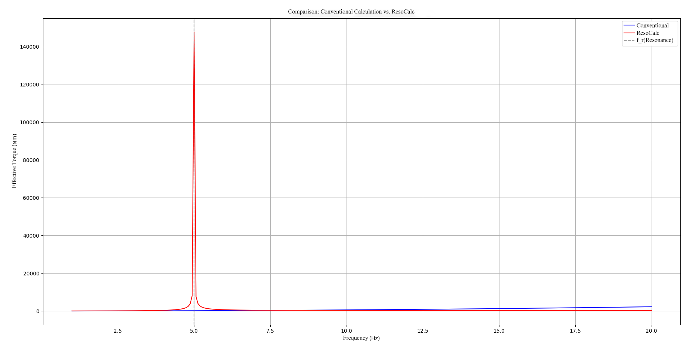

# Comparison: Conventional Torque Calculation vs. ResoCalc (Resonance Field Theory)

In this section, we compare the classical mechanical calculation of effective torque with the new method based on Resonance Field Theory (ResoCalc).

👉 **Go directly to the application:**  

### Initial Values:
- Mass $$m = 2.0\,\mathrm{kg}$$  
- Length $$l = 1.0\,\mathrm{m}$$  
- Excitation frequency $$f = 10.0\,\mathrm{Hz}$$  
- Resonance frequency $$f_r = 5.0\,\mathrm{Hz}$$  
- Coupling factor: 0.2

### Calculation Approaches:

#### 🔵 Conventional (Classical):  
Effective torque:

$$
M_{\text{conv}} = J \cdot \omega^2 \cdot \frac{\theta_{\text{max}}}{\sqrt{2}} \quad \text{where} \quad J = m \cdot l^2
$$

The classical calculation depends on the **arbitrarily set maximum deflection** $$\theta_{\text{max}}$$, which is often assumed as an example value. In this case, we assume $$\theta_{\text{max}} = 5^\circ = \frac{\pi}{36} \,\text{rad}$$.

- Moment of inertia: $$J = 2 \cdot 1^2 = 2.0\,\mathrm{kg \cdot m^2}$$
- Angular frequency: $$\omega = 2\pi \cdot f = 2\pi \cdot 10 = 62.83\,\mathrm{rad/s}$$

Thus, we obtain:

$$
M_{\text{conv}} = 2 \cdot 62.83^2 \cdot \frac{\frac{\pi}{36}}{\sqrt{2}} \approx 558.3 \,\mathrm{Nm}
$$

#### 🔴 ResoCalc (Resonance Field Theory):

In the ResoCalc method, the **torque under resonance conditions** is calculated. Instead of an arbitrary deflection, we use the ratio of frequencies $$\frac{f}{f_r}$$ and the **coupling factor**:

$$
M_{\text{reso}} = 0.5 \cdot m \cdot l^2 \cdot (2\pi f)^2 \cdot \frac{1}{|1 - (f / f_r)^2|} \cdot \text{Coupling}
$$

Explanation of the formula:
- **Coupling factor:** This quantity accounts for how strongly energy is transferred between oscillations.
- **Resonance amplification:** The ratio $$\frac{f}{f_r}$$ controls the amplification of the system at resonance.

Inserting the given values:
- $$m = 2.0\,\mathrm{kg}$$
- $$l = 1.0\,\mathrm{m}$$
- $$f = 10.0\,\mathrm{Hz}$$
- $$f_r = 5.0\,\mathrm{Hz}$$
- Coupling factor: 0.2

Calculation:

$$
M_{\text{reso}} = 0.5 \cdot 2 \cdot 1^2 \cdot (2\pi \cdot 10)^2 \cdot \frac{1}{|1 - (10 / 5)^2|} \cdot 0.2
$$

This yields:

$$
M_{\text{reso}} \approx 2543.03\,\mathrm{Nm}
$$

### Result:
| Method        | Effective Torque      |
|--------------|----------------------|
| Conventional | 558.3 Nm             |
| ResoCalc     | 2543.03 Nm           |

The conventional method depends on the **arbitrarily chosen deflection** $$\theta_{\text{max}}$$, which can lead to unrealistically small values, especially at resonance.

The ResoCalc method, by contrast, uses the ratio $$f / f_r$$ and resonance amplification to calculate torque realistically and without arbitrary assumptions. The **coupling** ensures scaled energy transfer and much more precise modeling of real mechanics.

### Visualization:

### Conclusion:
**ResoCalc replaces the classical calculation method with a physically intuitive, automatic calculation at the push of a button.**  
Limits remain realistic, the result is reproducible—and immediately usable for engineers.

---

© Dominic-René Schu – Resonance Field Theory 2025

---

[Back to Overview](../../../README.en.md)