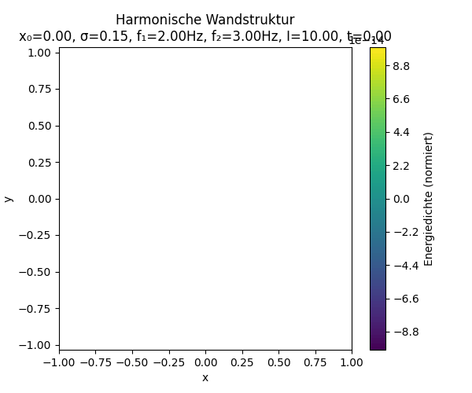

# Interactive Resonance Field Animation with Export Function

## Introduction

This notebook/script enables the **interactive simulation, visualization, and export** of a harmonic resonance field structure with a movable wall.  
Users can live-control the wall position, wall width, coupling intensity, frequencies, color scheme, and frame rate (FPS) – and export the animation as either a GIF or MP4. The tool thus serves both didactic purposes for conveying resonance field principles as well as research and presentation needs.

---

<p align="center">
  
</p>

---

## Requirements

- **Python 3.7+**
- Required packages:
  - `numpy`
  - `matplotlib`
  - `ipywidgets`
  - `IPython`
- For GIF export: `pillow`
- For MP4 export: `ffmpeg` (installed system-wide, e.g., via `apt`, `brew`, `conda`)

### Example installation with pip

```bash
pip install numpy matplotlib ipywidgets pillow
```

For Jupyter Notebook/Lab:

```bash
pip install notebook
jupyter nbextension enable --py widgetsnbextension
```

For MP4 export (Linux/macOS):

```bash
# Linux
sudo apt-get install ffmpeg

# macOS (Homebrew)
brew install ffmpeg
```

---

## Usage

1. Open the notebook (e.g., in JupyterLab, Jupyter Notebook, or VSCode)
2. Execute all cells (code from `wall_animation_ultimate.py`)
3. Adjust parameters:
   - **Wall position (x₀)**
   - **Wall width (σ)**
   - **Intensity**
   - **Frequencies (f₁, f₂)**
   - **Color scheme**
   - **FPS**
4. Start the preview
5. Choose export format (`gif` or `mp4`) and click **Export**  
   After completion, a download link will be provided.

---

## Notes

- High FPS, many frames, or large resolution will increase export duration.
- Missing dependencies or errors are shown in the output field.
- The export file name includes the chosen parameter values for better traceability.

---

## Source Code

Paste the complete Python code from `wall_animation_ultimate.py` into a notebook cell.  
Adjust the parameters or the user interface as needed.

---

© Dominic-René Schu – Resonance Field Theory 2025

---

[Back to Overview](../../../README.en.md)