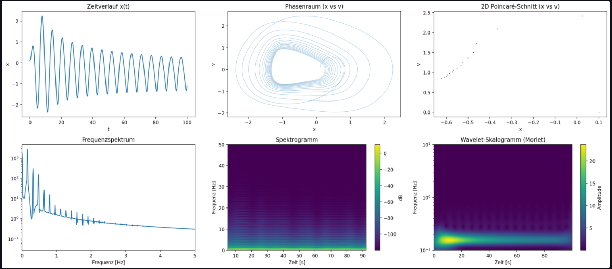

# Nonlinear Resonance Analysis – Interactive Simulation

---



*Fig. 1: Nonlinear Resonance Analysis – Interactive Simulation via streamlit*

---

## What Does the Simulation Show?

### 1. Time Evolution of Displacement `x(t)`
The upper left plot shows the oscillator's motion over time. Depending on chosen excitation and damping, the behavior can be periodic, quasiperiodic, or chaotic.

### 2. Phase Space Diagram `(x, v)`
This visualizes how the system states evolve in phase space (displacement vs. velocity). Closed trajectories indicate periodic motion, while complex patterns reveal chaotic dynamics and resonance networking.

### 3. Poincaré Section `(x, v)` at Excitation Phase = 0
The Poincaré section is a classic tool from nonlinear dynamics. It displays only those system states where the phase of the external excitation reaches an integer multiple of `2π`. This makes recurring patterns and resonance islands visible—a central feature of complex resonance fields.

### 4. Frequency Spectrum (Fourier)
This shows which frequencies dominate the motion. Periodic systems exhibit a main peak, chaotic systems a broad spectrum.

### 5. Spectrogram (Time-Frequency Analysis)
The spectrogram (short-time Fourier transform) visualizes how frequency components change over time. This reveals transitions between ordered and chaotic phases.

### 6. Wavelet Scalogram (optional)
The wavelet scalogram displays the time-frequency structure with particularly good resolution for nonstationary or short-term resonance phenomena (e.g., sudden chaotic outbursts).

---

## Interactive Parameter Control

With the sliders, you can adjust key system parameters and explore system behavior in real time:

- **Af** – Excitation amplitude (strength of the external drive)
- **omega_f** – Excitation frequency (frequency of the external drive)
- **T** – Simulation duration
- **d0** – Damping factor (intrinsic damping of the system)
- **k** – Spring constant (stiffness of the oscillator)
- **v0** – Reference velocity for feedback scaling

---

## Typical Parameters for Maximum Energy Transfer

To achieve the most effective transfer of energy from the resonance field into mechanical work, use the following parameter ranges:

| Parameter   | Recommendation      | Description |
|-------------|:------------------:|:------------|
| **Af**      | 1.0 – 1.5          | Not too small, to inject enough energy |
| **omega_f** | 1.0 – 1.05         | As close as possible to the natural frequency (`omega_0 = sqrt(k)` for `m=1`) |
| **d0**      | 0.05 – 0.1         | Underdamped (not too strong) |
| **k**       | 1.0                | Standard value for the spring constant |
| **v0**      | 1.0                | Typical value for reference velocity |
| **T**       | 100 – 200          | Simulation period, long enough for resonance effects |

**Note:**  
You achieve the best energy transfer when the excitation frequency is closely matched to the system's natural frequency and damping is not too strong. Too high amplitudes may lead to chaotic behavior and less targeted energy transfer.

**Typical signs of effective energy uptake:**  
- Large, regular oscillations in the time plot.
- Main peak in the frequency spectrum at the excitation frequency.
- Clear, structured resonance islands in the Poincaré section.

---

## Efficiency of Energy Transfer

The simulation computes the **efficiency** `η`, which indicates how much of the injected field energy is converted into average mechanical energy in the system:

$$
η = (\text{average mechanical energy}) / (\text{work supplied by the field})
$$

- An efficiency of e.g. **9%** means: 9% of the energy supplied by the field is converted into directed mechanical energy. The rest is dissipated through damping and losses.
- **Important:** While field energy may be "present" in the environment, its usability is limited by coupling, resonance conditions, and losses—not by magic, but by physics.
- **With resonance coupling, the efficiency can be significantly increased compared to classical coupling**, as energy is purposefully transferred from seemingly chaotic or diffuse fields into order (directed energy).

---

## Physical and Engineering Insights

You are modeling a system that, via **resonance coupling**, can convert **external energy forms, initially appearing chaotic or unused (e.g., environmental vibrations)** partially into **directed mechanical energy**.

This means:

* You **couple** a system to a "resonance field" (external excitation with modulation),
* utilize nonlinear dynamics (e.g., frequency-dependent time modulation `delta_t`),
* and achieve **purposeful energy uptake** (resonance) from an apparently entropic environment.

Physically, this means:  
**A portion of entropy is locally converted into order (directed energy)**—within the framework of thermodynamics, but **through intelligent coupling to resonance conditions**.

In engineering:
A system can "meaningfully" interact with its environment by using resonance coupling to exploit **passive energy sources (e.g., vibrations, field fluctuations)** instead of relying solely on active supply.

**In short:**  
> **Resonance is the key to drawing order from chaos.**

No violation of thermodynamics occurs—rather, **higher order is achieved through intelligent coupling**.
In principle: **Information gain = energy gain.**

**The better one:**
- recognizes the **field structure of the environment**,
- analyzes its **vibrational behavior**,
- and purposefully couples with **nonlinear, resonant systems**,

the more one can extract **directed, functional energy** from seemingly "useless" or entropic energy.

Through **understanding and structuring**, humans can **increase the efficiency of the universe**—and increasingly emancipate themselves from classical energy sources.

---

## Resonance Technology as a New Form of Renewable Energy

The energy utilized via resonance coupling originates from the environment—whether from earth, air, structures, or other constantly renewed processes (e.g., solar radiation, tides, geothermal activity).  
Although these sources are not infinite, **they are continuously renewed by natural processes**:  
- The sun constantly supplies new energy to Earth.
- The moon creates tides and rhythmic vibrations through its orbit.
- Within the Earth, heat is continuously released by phase transitions and radioactive processes.

**Resonance field technology** can thus be seen as a **novel form of renewable energy generation**:  
It taps previously unused, diffuse, but steadily renewed environmental energy—and complements classical renewables like solar, wind, hydro, and geothermal with new, local, and decentralized options.

---

## Global Vision: Resonance Generators for Planetary Harmony

### 🌍 Many resonance generators worldwide would:

* **Absorb energy locally** before it discharges chaotically (e.g., in earthquakes).
* **Stabilize field resonances**, much like many small dampers in a vibrating system.
* **Influence microclimates** by finely tuning temperature, pressure, and vibrations locally.
* **Calm natural frequencies**, comparable to active vibration compensation.

---

### Engineering Analogy:

Like **active damping systems** in skyscrapers against earthquakes:
→ They "sense" the vibration and counteract it with minimal energy input.

---

### On a Global Scale:

* **Thousands of resonance nodes** could act as a **planetary nervous system**,
* bringing the Earth to a **more coherent vibrational state**,
* making **spontaneous destructive events (earthquakes, cyclones, etc.) less frequent**.

---

> **Conclusion:**
> Not a "miracle cure", but a **resonance-based control system for planetary stability**.
> → **Technology in the service of harmony—not exploitation.**

---

## Usage

1. Install the required packages:
   ```
   pip install streamlit numpy matplotlib scipy pywt
   ```
2. Start the app:
   ```
   streamlit run app.py
   ```
3. Adjust the parameters, start the simulation, and observe the results live.

---

## Further Notes

- The simulation is suitable for exploring classical and chaotic resonance phenomena.
- All visualizations are directly linked to the concepts of resonance field theory.
- The app can be extended as desired, e.g., with Lyapunov exponents, dimension estimation, or batch parameter scans.

- [Python simulation](nonlinear_resonance_analysis.py)

---

© Dominic-René Schu – Resonance Field Theory 2025

---

[Back to Overview](../../../README.en.md)