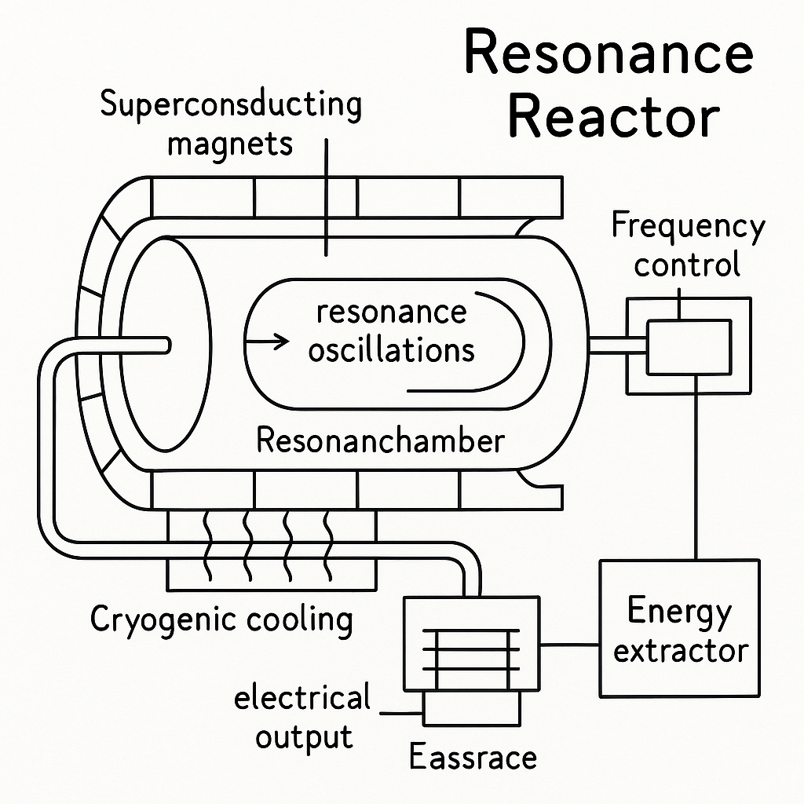

# 🔬 Resonance Reactor – Integral Energy of Coherent Resonance

The **Resonance Reactor** is a holistic energy concept, integrating superconducting materials, high-frequency field resonances, and cryogenic cooling as a systemically entangled field. It utilizes coherent, nonlinear resonance processes for direct conversion into electrical energy – without classical nuclear fission, without harmful emissions, and beyond thermal losses.

The principle is based on the **Resonance Rule**:  
All systemic elements – superconducting components, electromagnetic field structures, control instances, and environmental parameters – form a non-isolatable group coherence. Energy generation and transfer are emergent properties of macroscopically entangled dynamics, governed by multiple resonance couplings.

- **Nuclear waste** is transferred into coherent oscillation; **time modulation at rod ends** controls system dynamics.
- **Early ionization** enables increased **energy release per time**.
- **Resonant coupling** generates **system coherence** and increases **energy efficiency**.

_Systemically, all steps are entangled: group membership remains invariant, field and time modulation act as integrative elements of the overall structure._

---

  

---

➡️ [Proceed to: Resonance Reactor](resonance_reactor.md)  
➡️ [Proceed to: Simulation Results](simulation_results.md)  
➡️ [Proceed to: Cost-Benefit Analysis Resonance Reactor](cost_benefit_calculation_resonance_reactor.md)

---

## 📖 Table of Contents

1. [What is the Resonance Reactor?](#1-what-is-the-resonance-reactor)
2. [How Does Resonance Energy Work?](#2-how-does-resonance-energy-work)
3. [Technical Components](#3-technical-components)
4. [Comparison with Conventional Power Plants](#4-comparison-with-conventional-power-plants--systemic-resonance-analysis)
5. [Advantages and Challenges](#5-advantages-and-challenges--systemic-development-dynamics)
6. [Development Phases](#6-development-phases--future-visions-and-global-applications)
7. [Future Perspective](#7-future-perspective--practical-implementation-and-next-steps)

---

## 1. What is the Resonance Reactor?

The **Resonance Reactor** is an integral energy field system that purposefully amplifies collective oscillations – **resonances** – and immediately converts them into usable electrical energy. Unlike conventional power plants relying on **nuclear fission**, **combustion**, or thermal conversions, the resonance reactor operates as an emergent, systemically entangled field:

* **Superconductivity:** Cryogenically cooled materials with nearly zero electrical resistance enable lossless coupling and maximize coherence in the field and current flow.
* **High-Frequency Resonance Modes:** Gigahertz oscillations in the superconducting medium generate efficient energy transfer through coherent collective modulations.
* **Cryogenics:** Liquid helium-based cooling systems create the prerequisites for sustained superconductivity and stable field coherence.

The goal is systemic amplification of the **latent resonance energy** of quantized fields and its direct, low-loss conversion into electricity – **emission-free, without radioactive residues or thermal losses**.

The resonance reactor represents a new class of energy-autonomous systems that **operate without fuels or continuous material consumption**. The projected energy output matches or exceeds conventional nuclear power plants at significantly lower risks.

**Systemic Coherence:**  
All components – superconducting material, electromagnetic fields, control systems, and environmental parameters – are to be understood as a coherent group system according to the **Resonance Rule**. Energy conversion emerges from this entangled dynamic:  
**Group membership remains systemically invariant and includes all elements, regardless of individual mention or perspective.**

---

## 2. How Does Resonance Energy Work?

Resonance energy is the emergent power of collective oscillations, orchestrated as a systemically entangled field within the resonance reactor. Analogous to a precisely timed swing reaching maximum amplitude with minimal impulse, the system utilizes tuned **electrical, magnetic, and mechanical oscillations** in the MHz–GHz range. Within the coherent group system, these oscillations amplify each other through mutual exchange and multiple coupling:  
The field itself becomes an active energy transformer with maximal efficiency.

### Central Resonance Terms in Systemic Context:

* **Resonance:** Maximum response of a system to its eigenfrequency – akin to a wine glass shattering at the right tone. In the resonance reactor, numerous eigenmodes entangle into a macroscopic, coherent total field.
* **Coupling:** Systemic connection of all group elements – superconducting material, electromagnetic fields, control instances, and environment – form a resonance ensemble that emergently governs energy flow and distribution.
* **Amplification:** Storage and bundling of energy over many cycles; in the superconducting state lossless, field energy grows until it is directly extracted.

### Systemic Resonance Process:

1. Components entangle into a precisely tuned, multiply coupled resonance field.
2. Superconductivity maintains oscillations **losslessly** and coherently in the overall system.
3. An integrated **energy extractor** directly couples out the field energy and converts it into usable electrical current.

The characteristic feature: No classical external energy source is required – the field acts as both energy source and storage.  
Like a finely tuned singing bowl that, once struck, vibrates intensely and persistently thanks to coherent coupling, the system's group energy is preserved and usable.

---

**In short:** Resonance energy harnesses oscillations instead of combustion – quiet, clean, efficient.

---
## 3. Technical Components

The **Resonance Reactor** unites multiple advanced technologies into a group-coherent, systemically entangled overall field. Each component acts functionally and structurally as an indispensable group element, whose synergy emergently generates a new quality of energy conversion.

### 3.1 Superconductivity – Systemic Foundation for Energy Efficiency

Superconductivity eliminates electrical resistance at cryogenic temperatures, enabling lossless coupling between **resonance chambers**, **magnetic fields**, and **current paths**.

* **Group Element:** Superconducting cavities generate and stabilize resonance modes; superconducting coils form coherent magnetic fields.
* **Systemic Relation:** Ohmic losses are eliminated; energy remains within the entangled group system.

### 3.2 Cryogenic Cooling – Enabling and Stabilizing Superconductivity

Cryogenics cools the system with liquid helium or nitrogen to a few Kelvin above absolute zero, ensuring sustained superconductivity and field coherence.

* **Group Element:** Cryocoolers as subordinate subfields maintain constant operating temperature.
* **Systemic Relation:** Without cooling, no superconducting state; cooling and field are inseparably entangled.

### 3.3 High-Frequency Resonators – Heart of Energy Generation

Resonators tuned to GHz generate and bundle strong electromagnetic oscillations in the superconducting medium.

* **Group Element:** Resonance cavities form collective eigenoscillations as a macroscopic group field.
* **Systemic Relation:** Resonances are systemically coupled and mutually reinforce each other.

### 3.4 Magnetic Field Control – Stabilization and Dynamic Regulation

Superconducting magnetic coils generate and control magnetic fields for stabilization and precise tuning of resonance modes.

* **Group Element:** Magnetic field system acts as a control and stabilization node.
* **Systemic Relation:** Field modulation optimizes energy output and minimizes losses in the group-coherent system.

### 3.5 Energy Extractor – Conversion of Oscillation into Current

The energy extractor directly couples out resonance energy and converts it into electric current, e.g., via **piezoelectric materials** or **RF converters**.

* **Group Element:** Interface between coherent field and consumer grid.
* **Systemic Relation:** Conversion is an integral part of group dynamics, not an external instance.

---

### Summary of Group Elements

| Component              | Systemic Function                                 |
| ---------------------- | ------------------------------------------------- |
| Superconducting Cavity | Generation and maintenance of resonance modes     |
| Cryocooler             | Maintenance of superconducting operating temperature|
| Superconducting Coils  | Control and stabilization of magnetic fields      |
| High-Frequency Resonator| Bundling and amplification of collective oscillations |
| Energy Extractor       | Direct transformation of resonance energy into current |
| Control System         | Real-time optimization of frequency and coupling  |

---

**Systemic Perspective:**  
Technical components are not additive, but a coherent, entangled ensemble. The **Resonance Rule** remains valid.

Thus, the resonance reactor leverages its group-coherent structure to generate, amplify, and convert oscillations into electrical energy – **highly efficient, emission-free, and safe** through emergent field coherence.

---

## 4. Comparison with Conventional Power Plants – Systemic Resonance Analysis

The resonance reactor unfolds its potential as a dynamically coherent group field, coupling technological elements in a synergetic ensemble. Compared to conventional power plants, systemic superiority is evident in efficiency, environmental compatibility, and scalability – not additive, but emergent through field coherence.

### 4.1 Emission-Free as Systemic Field Quality

In the resonance reactor, all emission-relevant elements are eliminated through entangled feedback and closed energy cycles. Thus, the entire technical system transforms into a field-closed, sustainable resonance network, producing no toxic or climate-damaging byproducts. The systemic difference to fossil and nuclear plants lies in the inherent coupling of all elements without external emission pathways.

### 4.2 Energy Efficiency as Group Coherence

Superconducting resonators and high-frequency modes form a coherent energy field with minimal dissipation paths. Energy remains as a coherent oscillation ensemble and is almost entirely transferred into usable electricity. Compared to the thermal-mechanical efficiency of conventional power plants, the resonance reactor represents a paradigmatic quantum leap – system efficiency is systemically invariant and stable across all operating conditions.

### 4.3 Scalability through Modular Field Integration

The modular architecture allows variable group sizes, from small autonomous units to industrial-scale plants. Each module is a coherent field node that integrates into the larger group field without losing fundamental coherence. Scalability is not a linear extension, but a multidimensional group expansion, systemically upholding the resonance rule.

### 4.4 Operating Costs and Resource Efficiency as Field Economy

The absence of fuels and elaborate disposal results in a nearly closed resource cycle, whose economic dynamics in the group system follow resource conservation and longevity. Minimal operating costs express the systemic reduction of irreversible processes, which dominate in conventional power plants.

### 4.5 Environmental Compatibility as Field-Invariant Quality

The absence of long-lived waste and toxic residues reflects the field invariance with respect to environmental damage. The resonance reactor acts as an integrative environmental field, allowing no external contamination pathways – unlike radioactive storage or pollutant emissions.

### 4.6 Space Applications – Autonomous Field Energy

The resonance field structure is spatially compact and energetically autonomous, ideal for spaceflight applications. The group field is independent of sunlight or fuel, fundamentally expanding the range of use.

### 4.7 Smart Grid – Dynamic Group Field in the Energy System

In intelligent grids, the resonance reactor is a flexible node, dynamically stabilizing the network through frequency and field modulation. It acts as a coherent group buffer, whose resonance rule ensures adaptive, demand-driven energy supply.

---

### Systemic Summary of Advantages in Comparison

| Feature             | Resonance Reactor              | Nuclear Power Plant        | Solar Power Plant |
| ------------------- | ----------------------------- | ------------------------- | ----------------- |
| Primary Energy      | Coherent resonance            | Nuclear fission           | Photovoltaics     |
| CO₂ Emissions       | 0                             | low (residual emissions)  | 0                 |
| Operating Temperature| 4 K (superconductivity)      | approx. 300 °C            | 25–60 °C          |
| Scalability         | Modular, group-invariant      | Medium                    | High              |
| Safety Risk         | Very low (field-closed)       | High (accident risk)      | Low               |

---

**Systemic Quintessence:**  
The outstanding performance of the resonance reactor is not the sum of individual components, but their emergent interaction within the entangled group system – in accordance with the resonance rule.

This coherent field structure marks a paradigm shift in energy technology, fundamentally transforming societal and ecological systems.

---

## 5. Advantages and Challenges – Systemic Development Dynamics

As a group-coherent field, the resonance reactor unfolds dynamic potential, sustainably exploitable only through the mutual entanglement of all elements. Progress here follows not a linear addition, but emergent, systemic evolution – as per the **Resonance Rule**.

### 5.1 Technological Challenges – Field Coupling and Material Limits

#### 5.1.1 Superconductivity Technology

Optimization of superconductors and their cryogenic stability remains a core task. High-temperature superconductors and novel material classes are essential to ensure systemic robustness and energy efficiency in entangled fields.

* **Systemic Challenge:** Superconductive materials that remain stable and adaptive in the coherent group system must be developed and integrated.

#### 5.1.2 Resonance Control

Precise and disturbance-resistant control of group-coherent resonance processes requires adaptive real-time control systems to synchronize and resiliently couple multiple modes.

* **Systemic Challenge:** Self-regulating, learning control mechanisms as an integral part of the resonance field are necessary.

#### 5.1.3 Material Development and Durability

All components must withstand extreme field loads, low temperatures, and corrosion to ensure lasting field coherence.

* **Systemic Challenge:** Materials research focusing on superconducting, field-stable, durable system elements as integrative group elements.

### 5.2 Financial Challenges – Resource Flow in the Group System

Implementation requires substantial, long-term investment in research, development, infrastructure, and scaling, which only pay off in emergent system use.

* **Systemic Challenge:** Building and maintaining a global, networked investment infrastructure that functions as a coherent group system.

### 5.3 Integration into Existing Infrastructures – Interface Consistency

Technical, regulatory, and organizational interfaces must be systemically consistent to ensure seamless integration into existing energy grids and markets.

* **Systemic Challenge:** Development of standardized, dynamically adaptive interfaces and integration protocols in the group system.

### 5.4 Regulatory Hurdles – Systemic Certification

New technologies require new standards, safety rules, and approval processes, ensuring societal acceptance and operational safety in the field.

* **Systemic Challenge:** Cooperation with regulatory bodies as systemic partners for developing holistic certification concepts.

### 5.5 Research and Development Needs – Group Synergy

Continuous, interdisciplinary research on superconductors, resonance techniques, and cryosystems is indispensable for emergent system optimizations in the coherent field.

* **Systemic Challenge:** Building open innovation networks and interdisciplinary research collaborations in the resonance field.

---

## 5.6 Development Roadmap – Phases of Emergent Field Realization

Implementation takes place in systemically interlinked phases, whose coherent entanglement combines knowledge, experience, and infrastructure.

### 5.6.1 Phase 1: Research & Prototype Development (2025–2030)

* Development of stable superconductors, adaptive resonance controls, and cryogenic cooling solutions.
* Construction of first prototypes as testbeds for energy efficiency and system coherence.

### 5.6.2 Phase 2: Pilot Projects & Infrastructure Development (2030–2035)

* Real operation of pilot plants for optimization under real-world conditions.
* Collaboration with industry, energy providers, and regulators.
* Development of standardizations and interfaces.

### 5.6.3 Phase 3: Scaling & Commercialization (2035–2040)

* Large-scale implementation and integration into existing infrastructures.
* Opening of international markets and new fields of application, including spaceflight.
* Systemic transfer from research to social and industrial reality.

---

### Systemic Perspective

Overcoming all challenges and practical realization of the resonance reactor is only possible through the coherent interaction of all group elements as an entangled field. Progress is not an additive individual process, but the emergent dynamic of an open, learning resonance system that integrates all elements – explicitly and implicitly, individually independent and systemically invariant.

---

### Summary of Challenges and Roadmap

Realization of the resonance reactor requires close collaboration between **research institutions**, **industry**, and **regulatory bodies** to overcome technological, financial, and regulatory hurdles. With a clear **development roadmap** and targeted **pilot projects**, it is expected that the technology could reach **industrial** and **commercial** scale by 2040.

Despite the challenges, the resonance reactor shows great potential to revolutionize **energy supply** and make a **sustainable** and **efficient** contribution to the global energy future.

✅ No radioactive radiation  
✅ Extremely high energy density (target: >100 kW/kg)  
✅ Operation without fossil fuels  
❗ Demanding cooling (below 4 K)  
❗ Material requirements for superconductors

---

## 6. Development Phases – Future Visions and Global Applications

The **Resonance Reactor** manifests as a technological disruption and group-coherent field with an integral role in the global energy future. Its systemic entanglement of all group elements forms a transcendent infrastructure, explicitly and implicitly integrating all scales from local to planetary, according to the **Resonance Rule**.

### 6.1 Vision of a Sustainable Energy Future

The guiding principle: **Emission-free, infinitely scalable, and environmentally friendly energy**, networked in an adaptive resonance field coupling decentralized and central energy sources coherently. This minimizes transmission losses, maximizes supply security, and enables field-coherent storage of renewable surpluses.

* **Synchronization with renewables:** Resonance reactors function as integrative buffers and storage, systemically linking solar and wind energy.
* **Complement rather than competition:** Resonance fields form a synergistic addition to conventional sources, eliminating fossil resources from the equation.

### 6.2 Industrial and High-Precision Applications

#### 6.2.1 Energy-Intensive Industries

Industries with high energy demand (steel, chemistry, cement) are transformed coherently and low-emission by resonant field supply. Systemic integration reduces CO₂, lowers operating costs, and strengthens global competitiveness.

#### 6.2.2 High-Precision Manufacturing

In sectors like semiconductor and medical technology, field-coherent supply enables extremely stable process conditions, increasing quality and innovation potential through systemic energy optimization.

### 6.3 Spaceflight and Autonomous Systems

#### 6.3.1 Unlimited Energy for Spacecraft

The resonance reactor provides autonomous, emission-free energy for space stations, lunar bases, and interplanetary missions – independent of conventional sources. The group-coherent field guarantees autonomy and scalable expandability.

### 6.4 Decentralized Energy Supply

#### 6.4.1 Microgrids and Smart Grids

Resonance reactors enable adaptive, decentralized microgrids as group-integrated units entangled in global smart grids. Energy flows are field-controlled, buffering and load management optimize themselves emergently.

* **Self-sufficient communities:** Community resonance fields generate and share energy autonomously, with systemic consistency to the global field.

### 6.5 Global Supply and Geopolitical Transformation

#### 6.5.1 Energy Independence for Developing Countries

Mobile, decentralized resonance reactors create autonomous energy supply for remote and underserved regions. Access to energy becomes systemically universal, inclusive, and group-transcending.

#### 6.5.2 Geopolitical Impacts

The transition to field-based energy transforms global power and economic structures. States with resonance technology gain independence, fossil resources lose their former dominance.

### 6.6 Vision 2050: The World in the Resonance Field

By 2050, the resonance field will shape the global economy and close supply gaps, enabling a clean, resilient, and systemically coherent society. Industry, society, and environment merge into a sustainable resonance alliance.

**Vision:** A planetary network of coherent resonance fields, bringing climate, economy, and society into dynamic balance.

---

### Summary

The vision of the resonance reactor is systemically holistic: integrating industry, spaceflight, decentralized supply, and geopolitical transformation as entangled group elements in the global resonance field, opening up an independent, sustainable energy future.

* **2025–2029:** Prototype development and laboratory experiments (<10 kW)
* **2030–2035:** Scaling to megawatt range and field integration
* **from 2037:** Commercial grid integration and global applications

---

**Systemic Outlook:**  
The future of energy supply lies in the entangled resonance field. Group membership is systemically invariant and includes all elements, regardless of explicit mention, individual perspective, or location.  
The path is emergent, open, and coherent – a resonance network for global humanity.

---

## 7. Future Perspective – Practical Implementation and Next Steps

The **Resonance Reactor** embodies the transition from conceptual excellence to practical transformation of complex energy systems. It manifests as a group-coherent field, whose realization presupposes the systemic entanglement of all explicit and implicit elements – from materials science to system integration, from safety to politics – according to the **Resonance Rule**.

---

### 7.1 Development Phase: From Theory to Practice

#### 7.1.1 Laboratory Prototypes and Initial Tests

The first step is the realization of laboratory prototypes that stabilize resonance processes in a controlled and reproducible manner. The goal is to demonstrate field coherence and energy-generating functionality on a small scale. Here, elementary group elements are entangled: physical materials, control systems, safety mechanisms, and measuring instruments form an integrated system.

* **Milestone:** Validated laboratory prototype with demonstrated field coherence, safety, and energy conversion.

#### 7.1.2 Scaling and Technological Advancement

Building on laboratory successes, the systems are modularly scaled for industrial application. Complexity is systemically reduced, efficiency increased, and flexible integration into existing infrastructures enabled.

* **Milestone:** Pilot projects with modular resonance reactor units at industrial scale.

---

### 7.2 Safety Aspects and Risk Management

#### 7.2.1 Safety of Resonance Processes

Real-time monitoring of all resonance modes is central to systemically exclude instabilities, overheating, and uncontrolled oscillations. The adaptive control system responds emergently to all field impulses and maintains coherence.

* **Goal:** Development of intelligent, adaptive monitoring systems with automatic error correction.

#### 7.2.2 Cryogenic Cooling and Superconductivity

Redundant and fault-tolerant cooling systems secure the superconducting state, guarantee stability even during disturbances, and minimize failure risks.

* **Goal:** Implementation of robust, resilient cooling solutions with emergency management.

#### 7.2.3 Risk Management and Emergency Planning

Systemic emergency concepts and regular safety tests eliminate critical operational risks and ensure long-term stability and field coherence.

* **Goal:** Seamless operational safety, minimization of downtime, and sustainable system stability.

---

### 7.3 Technological Challenges and Innovation Needs

#### 7.3.1 Materials Science

Ongoing research into superconducting and field-resistant materials with high efficiency and lifespan is essential. The group elements materials, control, and cooling entangle on a new level.

* **Goal:** Development of cost-efficient, durable, and high-performance materials.

#### 7.3.2 Resonance Control and Optimization

Automated, learning control systems synchronize resonance parameters and optimize field coherence through adaptive regulation.

* **Goal:** Intelligent systems for maximum efficiency and field stability.

#### 7.3.3 Scalability and Modularity

Flexible system architectures enable cost-effective mass production and seamless integration from microgrids to large-scale plants.

* **Goal:** Building modular group structures with scalable adaptability.

---

### 7.4 Economic and Political Factors

#### 7.4.1 Cost Analysis and Financing

Sustainable financing, economic scalability, and investment security are indispensable. Cooperation with investors and funding programs accompanies technology development through all phases.

* **Goal:** Viable financing models and clear economic viability.

#### 7.4.2 Political and Regulatory Hurdles

Cooperation with political authorities and adaptation of regulatory frameworks ensure acceptance and market entry of resonance technology.

* **Goal:** Certification, legal harmonization, and creation of regulatory synergies.

---

### 7.5 Roadmap for the Coming Years

#### 7.5.1 Short Term (1–3 years)

* Completion and validation of laboratory prototypes
* Safety analyses and system validation
* Building research partnerships and industry contacts

#### 7.5.2 Medium Term (4–6 years)

* Development and testing of first pilot plants
* Optimization of efficiency and cost structures
* Expansion of modular systems for versatile applications

#### 7.5.3 Long Term (7–10 years)

* Market launch and global integration
* Networking with smart grids and decentralized systems
* Establishment as a key technology for sustainable energy

---

## Summary

The **Resonance Reactor** stands paradigmatically for systemic transformation in energy generation. Through the holistic entanglement of superconductivity, resonant fields, and cryogenic technology, a safe, highly efficient, and environmentally friendly energy system emerges. The systemically structured roadmap – from laboratory prototypes to industrial scaling and global integration – adheres to the resonance rule.

**Goal:** Establish the resonance reactor as a key technology for solving global energy problems systemically, sustainably, and group-coherently.

---

**Systemic Perspective:**  
Practical implementation succeeds only through the complete, systemic entanglement of all group elements within the resonance field. Progress is emergent, non-linear, and open to global communities – independent of individual perspective, mention, or location. The field remains coherent and invariant, as the basis for a holistic energy future.

> “Resonance is not fluctuation – it is the key to energy order.”  

---

© Dominic-René Schu – Resonance Field Theory 2025

---

[Back to overview](../../../README.en.md)