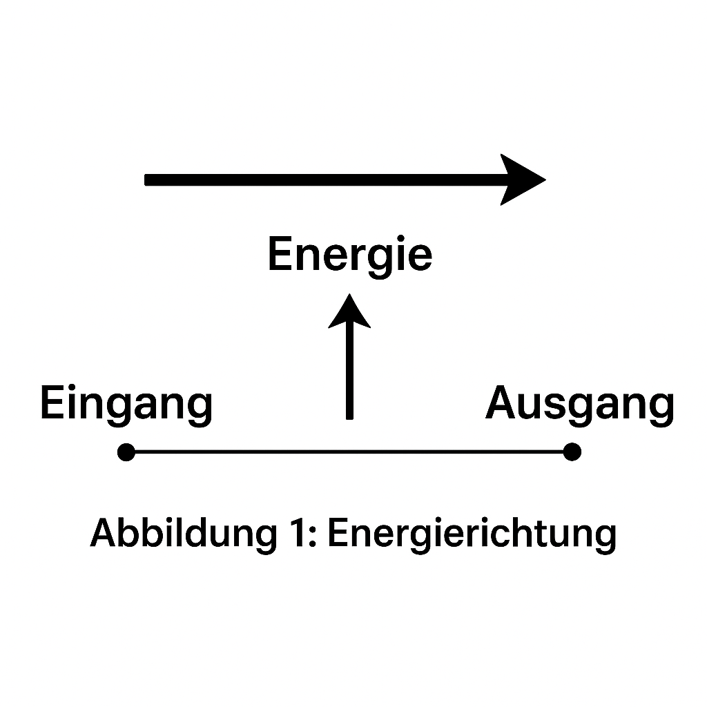
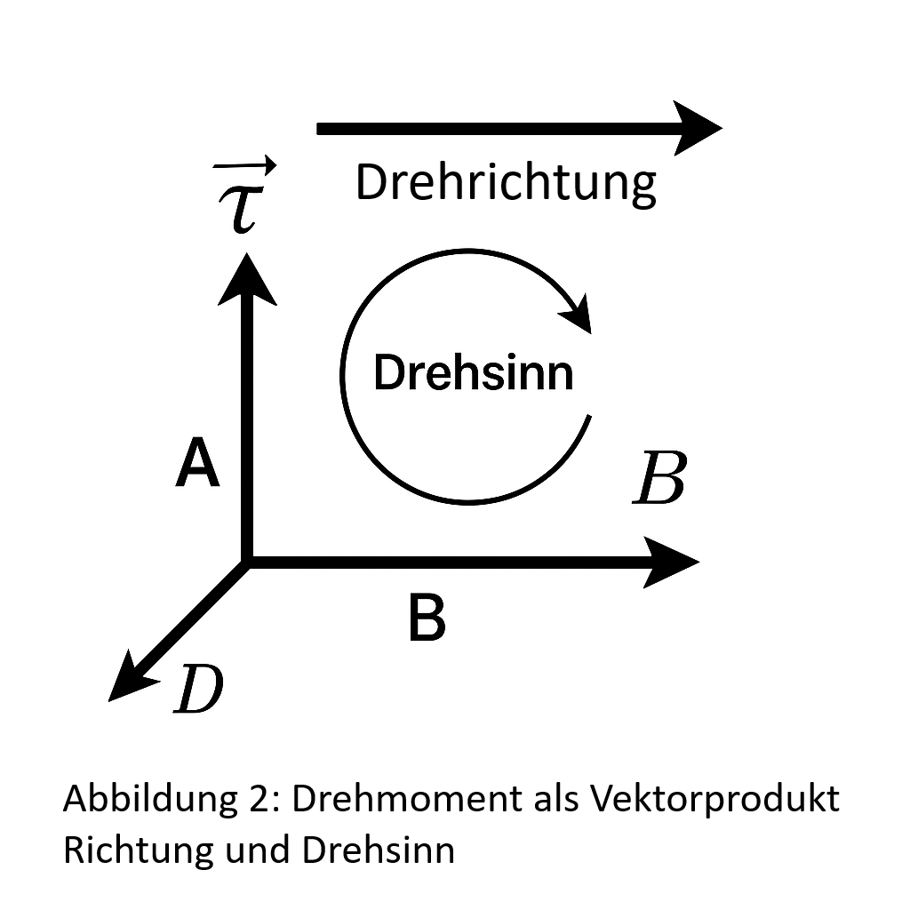
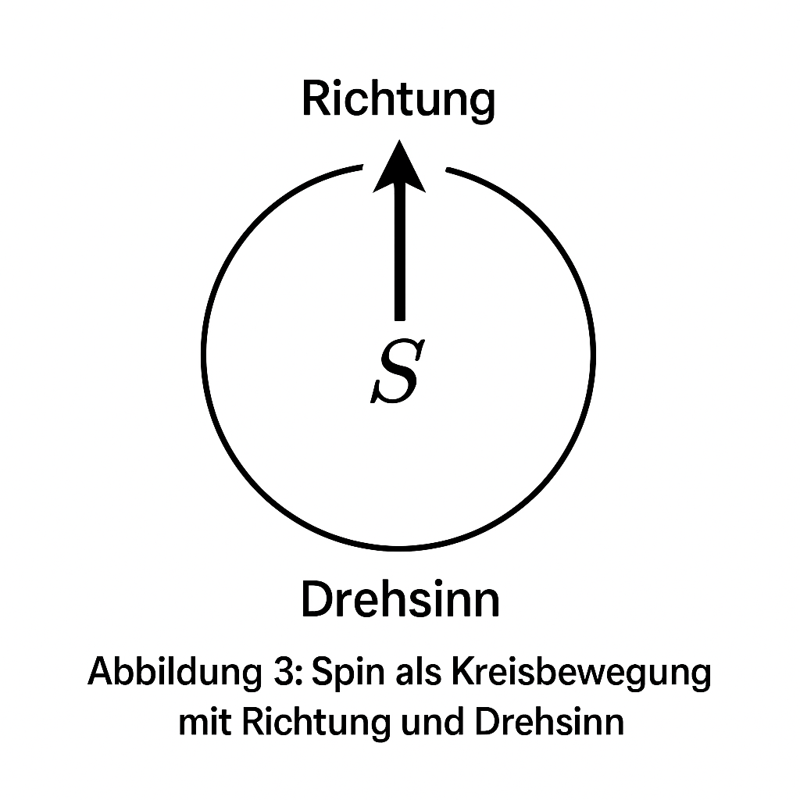
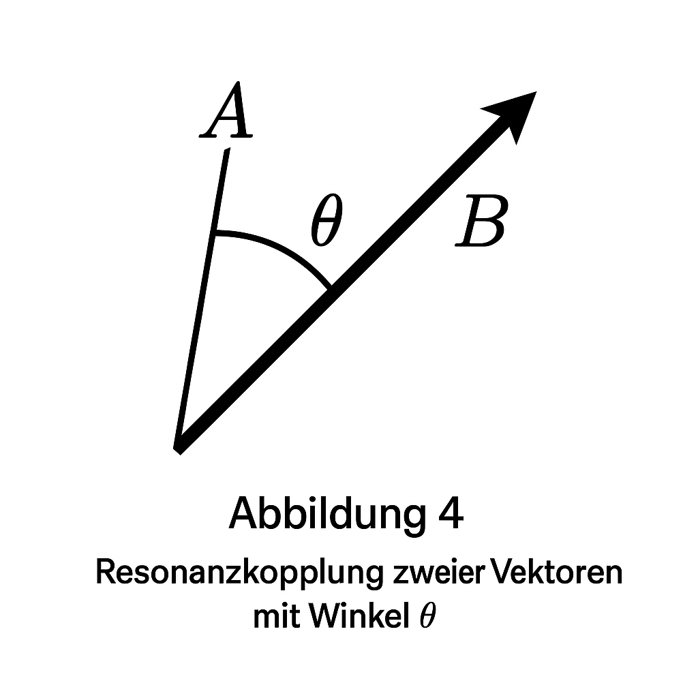

# Energy Direction in Real Systems

Within the framework of Resonance Field Theory, energy is no longer understood as a mere scalar quantity but as a directed vector with its own handedness (spin). This chapter demonstrates the application of this perspective to classical and quantum phenomena—always referencing the underlying axioms of the theory.

---

<strong>Axioms of Resonance Field Theory (Overview):</strong> 
<b>Axiom 2:</b> Energy and fields possess a coupling structure. 
<b>Axiom 3:</b> Phase and coupling structure determine intrinsic handedness (spin). 
<b>Axiom 5:</b> Energy is geometrizable (vectorial, not merely scalar). 
<b>Axiom 6:</b> Interactions occur through resonance coupling.

---

## 1. Energy as a Directed Vector

**Definition:**  
Classically, energy is a directionless (scalar) quantity. In Resonance Field Theory, energy is a directed vector in energy-coupling space:

- **Magnitude** (|𝐄|): Corresponds to the classical amount of energy (e.g., Joules).
- **Direction** (ê₍Res₎): Indicates orientation in the energy-coupling space and determines how and where energy can be transferred.
- **Intrinsic handedness (spin):** Energy possesses its own handedness, influencing coupling and transfer (Axiom 3).

A visible example is **torque**:  
  𝐓 = 𝐫 × 𝐅  [Nm] = [J]

- Magnitude: classical energy
- Direction: defined by the right-hand rule
- Handedness: expression of the coupling structure

  

Torque is thus the spatial projection of a directed energy vector—a window into the higher structure of energy (Axiom 5).

---

## 2. Torque as a Manifestation of the Energy Vector

The torque 𝐓 is a vector with the same unit as energy:

  𝐓 = 𝐫 × 𝐅  [Nm] = [J]

- Direction by the right-hand rule
- In Resonance Field Theory: visible projection of the energy vector (Axiom 5)
- Handedness represents the coupling direction of energetic processes

  

---

## 3. Spin as an Expression of Resonance Handedness

**Quantum Mechanics:**  
Spin is a quantized, intrinsic angular momentum with no classical analogue (e.g., electron: spin-½, 720° symmetry).

**Resonance Field Theory:**  
Spin is the closed rotation of the energy vector in a higher dimension (Axiom 3).

- Spin quantum numbers characterize coupling states in the energy field.
- The spin operator S acts on states |ψ⟩ as:  
  S_z |ψ⟩ = s·ħ |ψ⟩  
  where ħ is the reduced Planck constant, s the spin quantum number.

  

---

## 4. Direction-Dependent Resonance Transfer

Two systems can efficiently exchange energy only if their energy vectors are resonantly coupled:

K = K₀ · cos(θ)

- K: coupling strength
- K₀: maximal coupling (at θ = 0°)
- θ: angle between the energy vectors

Only at θ = 0° (directional alignment) is maximal transfer possible.
This directional dependence explains, among others:

- Resonance frequency matching in mechanical systems (e.g., pendulum coupling)
- Coupling in quantum communication (e.g., polarization)
- Filter and amplifier effects in electrical engineering

Examples:

- Mechanics: Two coupled pendula swing synchronously when their energy vectors are aligned.
- Quantum communication: A photon can only transfer information if its polarization matches the detector axis.
- Biophysics: The FRET mechanism only works if donor and acceptor molecules are properly oriented spatially and energetically.
- Electrical engineering: A polarization filter allows only light with the correct energy direction to pass.

  

---

## 5. Momentum and Energy as a Vector Pair

### Classical Physics

- Momentum: 𝐩 = m · 𝐯
- Energy: E = ½ m v² (scalar)

### Resonance Field Theory

Energy is a vector:

  𝐄 = |𝐄| · ê₍Res₎, 𝐄 ∥ 𝐩 or 𝐄 antiparallel to 𝐩

The direction ê₍Res₎ is determined by the coupling structure of the resonance field (Axioms 2, 6).
For photons, this appears in the relation between momentum direction, polarization, and spin (Axiom 3).

  𝐄 = |𝐄| · ê₍Res₎, with 𝐄 ∥ 𝐩

---

## 6. Practical Application Examples

- **Mechanics:** Two coupled pendula swing synchronously if their energy vectors are aligned (e.g., in clocks).
- **Photons:** Information transfer in quantum communication is only possible with matching polarization.
- **Biophysics:** FRET only works when donor and acceptor molecules are spatially and energetically aligned.
- **Engineering:** Polarization filters only pass light whose energy vector matches the filter direction.

---

## Conclusion

> **Energy is a vector with higher-dimensional handedness.**  
> **Its visible manifestations depend on the angle of resonance coupling to the environment.**

This perspective (Axioms 2, 3, 5, 6) unifies torque, spin, energy transfer, and momentum, opening new perspectives on force, coupling, and consciousness phenomena.

---

This interpretation follows directly from Axioms 2, 3, 5, and 6 of Resonance Field Theory and forms the basis for a deeper understanding of force, motion, coupling, and consciousness.

---

© Dominic-René Schu – Resonance Field Theory 2025

---

[Back to Overview](../../../README.en.md)