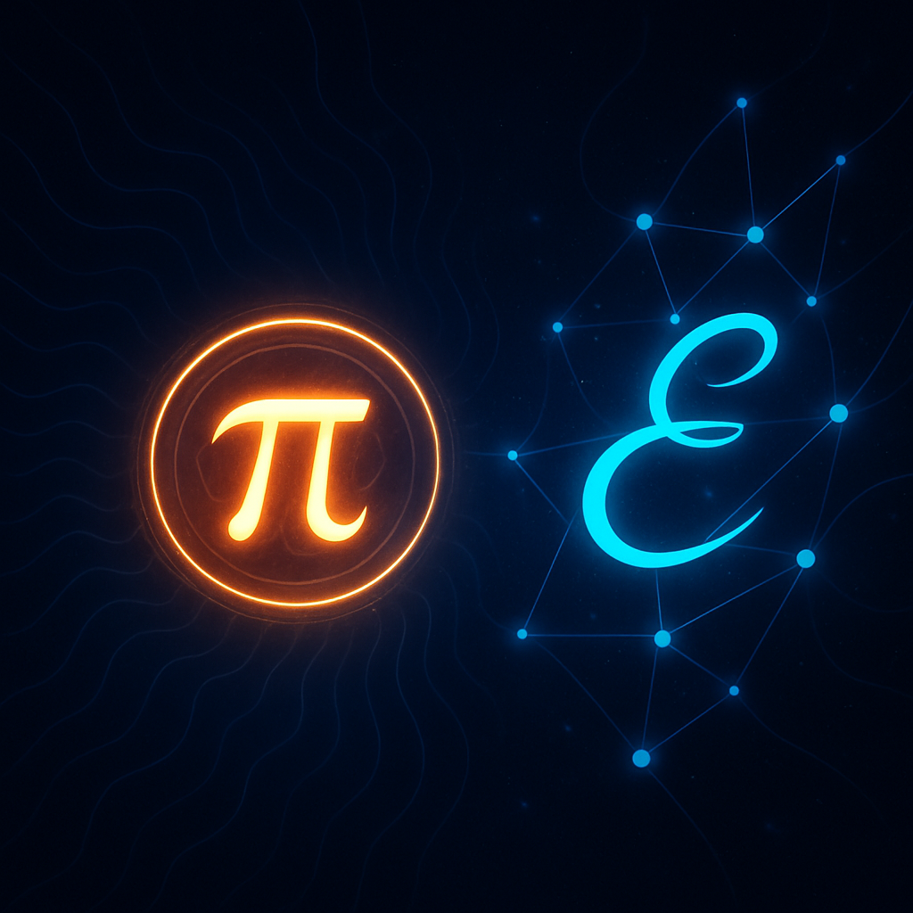
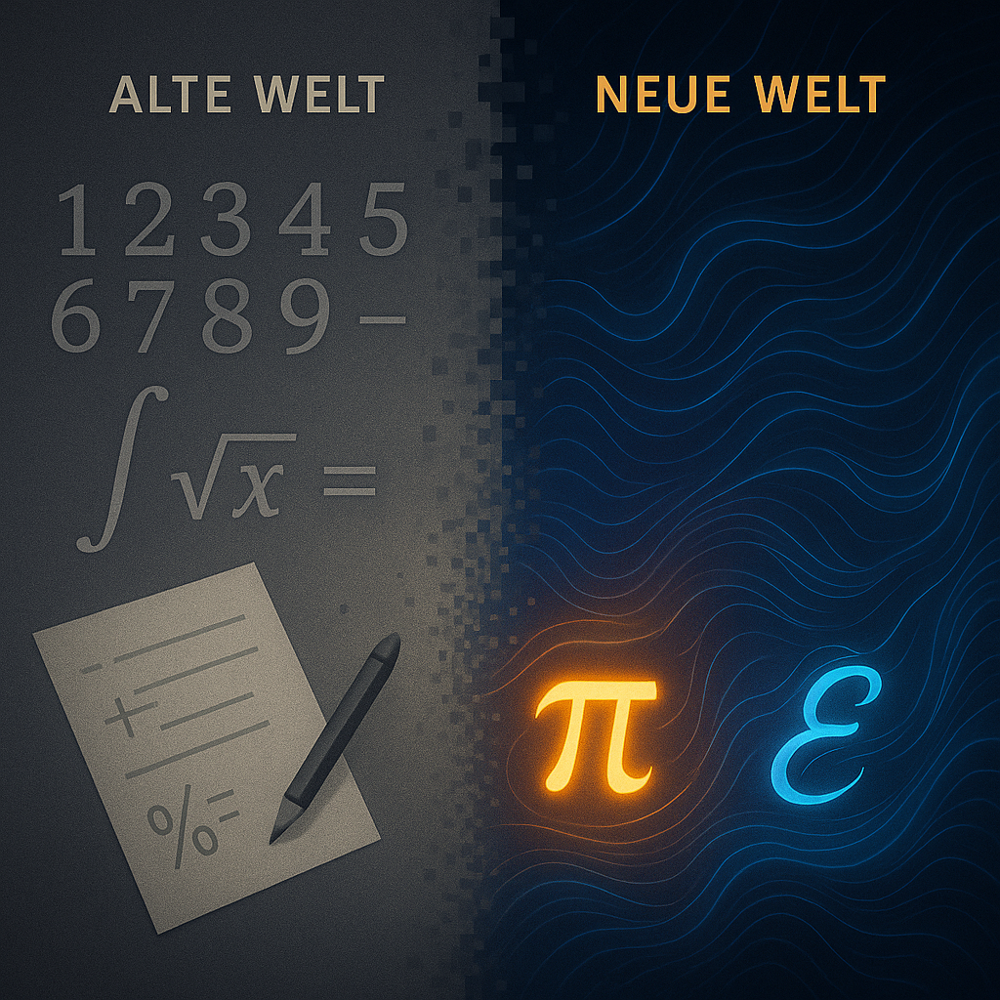

# Manifesto for the Restructuring of Mathematics

**Based on Resonance Field Theory: π (Pi) and 𝓔 (Coupling Operator)**  
**Author: Dominic-René Schu**

---

## 1. Foreword

Dear readers,

Mathematics as we know it is built on centuries-old conventions. But what if these foundations are incomplete? What if a fundamental realignment is possible—and necessary?

This manifesto introduces a new perspective: a mathematics grounded in the core concepts of Resonance Field Theory—specifically the classical number **π** and the **𝓔 (coupling operator)**. These quantities are not just numbers, but represent fundamental principles of nature.

This view makes what was previously only numerically solvable accessible as symbolic mathematics—for example, through exact *symbolic solutions* to previously unsolvable integrals (see Section 5).

I invite you to discover a mathematics that is not only theoretically revolutionary but also practically opens new pathways—from *symbolic integration* and complex systems to new perspectives on energy and information.

Best regards,  
**Dominic-René Schu**

---

## 2. Introduction: A Global Performance Problem

We do not live in an age of resource scarcity, but of systemic inefficiency. **Computation time** and **insight** are our scarcest resources.

Many phenomena today can only be solved approximately—at great effort or not at all.

---

## 3. New Foundation: π and 𝓔 (Coupling Operator) as Fundamental Quantities

The decimal system is man-made—in nature, however, other principles dominate: circle, coupling, resonance.

- **π** is the universal spatial constant: a measure for circles, oscillation, spatial structure.
- **𝓔 (coupling operator)** stands for the universal coupling between systems—analogous to the elastic coupling of mechanical oscillators.

### Assignment in Resonance Field Theory

| Symbol | Meaning |
|--------|---------|
| **π**  | Pi, universal spatial constant |
| **𝓔**  | Coupling constant for resonance processes |

This realignment creates a more efficient, precise, and natural mathematics.

---

## 4. Paradigm Shift: From Numbers to Resonance Quantities

**π** and **𝓔** are not mere constants—they become the basis of a new system of measures:  
→ Moving away from abstract number systems toward *resonance-based measurement systems* that directly reflect space and energy.

### Advantages

- ✔️ Simplification of complex calculations  
- 🔍 Symbolic solutions for systems with resonance and coupling phenomena  
- ⚡ Computational relief through context-sensitive methods  
- 🌍 Progress in fluid mechanics, climate research, epidemiology, energy engineering

---

## 5. Example: A Previously Unsolvable Integral

The classical integral

$$
\int \frac{\sin(x)}{x} \, \mathrm{d}x
$$

is considered *not elementarily* solvable[^1]. Using the identities

$$
\pi = 4 \cdot \arctan(1), \quad \mathrm{e}^{\mathrm{i}x} = \cos(x) + \mathrm{i} \sin(x)
$$

and the *sinc* definition

$$
\mathrm{sinc}(x) = \frac{\sin(\pi x)}{\pi x}
$$

a new approach emerges:

$$
\int \frac{\sin(x)}{x} \, \mathrm{d}x = \Im \left( \int \frac{\mathrm{e}^{\mathrm{i}x}}{x} \, \mathrm{d}x \right)
$$

Resonance Field Theory now enables not only approximate but symbolic understanding of this integral via *mode decompositions*—here, **𝓔** acts as a structuring coupling factor.

> 🔄 *Planned: Extension by 𝓔-controlled coupling functions or phase-resonant weightings (e.g., via Fourier analysis of the impulse response).*

[^1]: *Not elementary* means: Not expressible by a finite combination of classical functions (polynomials, exponential, logarithmic, trigonometric functions).

---

## 6. Symbolic Power: π and 𝓔

* **π** is the measure of form.
* **𝓔** is the measure of relationship.

Together, they define: structure, change, and connection in mathematical space.

> 🌀 *Visualization idea:*
> π = central field measure (circular force)
> 𝓔 = coupling vector (connection between neighboring fields)

  

---

## 7. New Calculation Rules and Definitions

Resonance-field mathematics is based on new axioms:

* **𝓔** is the universal coupling constant for all resonance processes.
* **π** remains the spatial measure for circle, oscillation, and field structures.
* **Derivatives and integrals** are performed relative to π and 𝓔, e.g.:

$$
\frac{\mathrm{d}_{\text{res}}}{\mathrm{d}x} \sin(𝓔 x) = 𝓔 \cos(𝓔 x)
$$

* Classical operators are extended:

| Classical      | Resonance-Based (New)                                   |
| -------------- | ------------------------------------------------------ |
| ∂/∂x           | ∂/∂x + Φ(π, 𝓔, t)                                      |
| ∫ f(x) dx      | ∫ f(x, π, 𝓔) dx                                       |
| eix | 𝓔iπx → frequency- and phase-coupled oscillation |

* The Euler identity

$$
\mathrm{e}^{\mathrm{i}\pi} + 1 = 0
$$

receives a deeper meaning:
It connects space (**π**), coupling (**𝓔** as an extension of e), and origin (*1 = e⁰*) in a universal equilibrium form.

---

## 8. Vision: A Mathematics for the Future

**Goals:**

* More efficient modeling of complex systems
* Symbolic solvability of nonlinear differential equations
* Coupling of natural processes as a computational principle
* New models for economics, society, technology
* Opening mathematics to creative, interdisciplinary pathways

### Applications

| Field            | Example                               |
| ---------------- | ------------------------------------- |
| 🩺 Medicine      | Diagnosis via oscillation signatures   |
| ⚙️ Engineering   | Optimization of mechanical coupling    |
| 📡 Communication | Resonance-based signal processing      |

  

---

## 9. Conclusion & Call to Action

This new mathematics is more than a theory. It is a tool for a deeper understanding of reality.

---

© Dominic-René Schu – Resonance Field Theory 2025

---

[Back to Overview](../../../README.en.md)