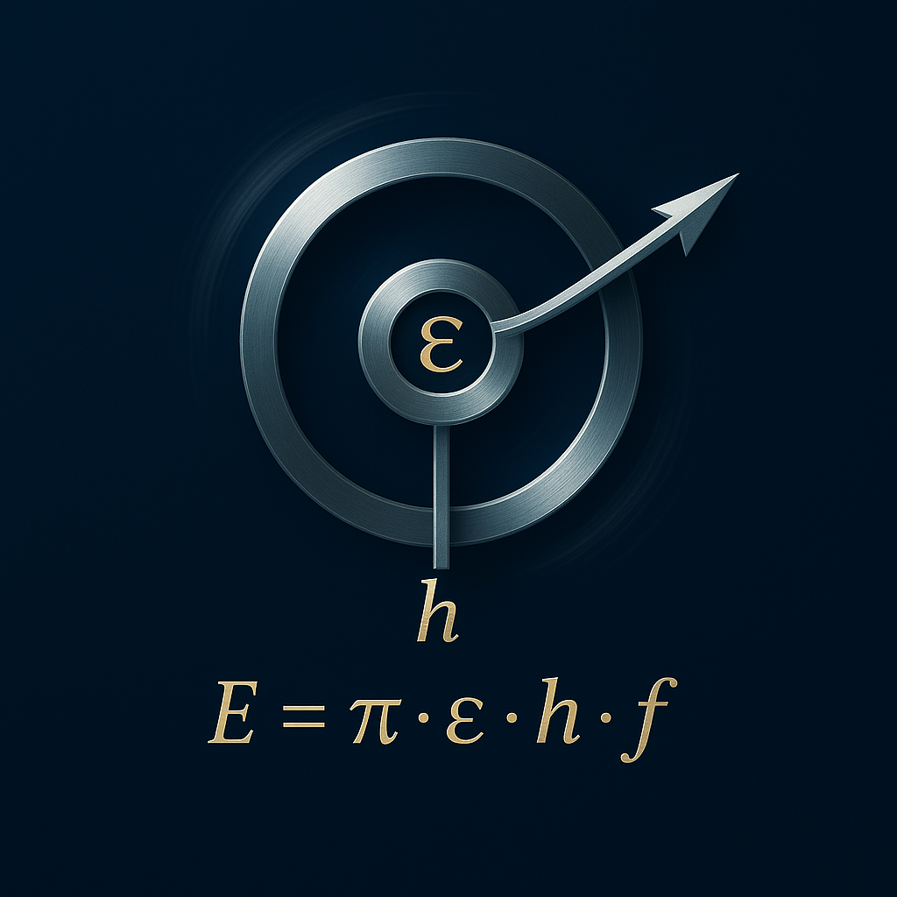

# The Resonance Field Equation and Its Application in Energy Conversion

---

  

---

## 1. Introduction

The Resonance Field Equation links resonance frequency, entropy change, and energy flow into an extended energy model. It incorporates field dynamics, frequency coupling, and phase shift based on Axioms 1, 2, 3, 5, and 6 of Resonance Field Theory.

---

## 1.1 Extended Form: Phase-Modulated Resonance Field Equation

$$
\boxed{
\mathbf{E} = \pi \cdot 𝓔 \cdot h \cdot f \cdot \mathrm{e}^{\mathrm{i} \alpha}
}
$$

- 𝓔: Coupling operator (central coupling constant of Resonance Field Theory; see definition in the Resonance Field paper)
- π: Pi, universal measure for space and oscillation
- h: Planck constant
- f: Frequency
- α: Phase angle between observer time and field time
- Phase modulation enables explicit evaluation of time entanglement (Axiom 6).

---

## 1.2 Frequency Dependence

- For f → 0: Energy negligible
- Linear increase with f at resonance (Axiom 1)
- Transition at harmonic ratio to eigenfrequency (Axiom 5)

---

## 1.3 Usable Energy

$$
\Delta E(f) = \pi \cdot 𝓔 \cdot h \cdot f - \mathrm{e}^{-\pi f}
$$

- The loss term vanishes at high frequencies (Axiom 2)

---

## 1.4 Power

$$
P(f_1, f_2) = \int_{f_1}^{f_2} \left( \pi 𝓔 h f - \mathrm{e}^{-\pi f} \right) \mathrm{d}f
$$

yields

$$
P = \frac{1}{2} \pi 𝓔 h (f_2^2 - f_1^2) + \frac{1}{\pi} \left( \mathrm{e}^{-\pi f_1} - \mathrm{e}^{-\pi f_2} \right)
$$

- Application of Axiom 5 (geometrization)

---

## 1.5 Comparison to Classical Energy Systems

- Classical systems: energy from pressure, height, or temperature differences
- Resonance Field Equation: description on the frequency scale and in the resonance field for higher efficiency and stronger gradients
- Full explanation is only possible within Resonance Field Theory (Axioms 2, 3, 5)

---

## 1.6 Illustration for Laypersons

- Water wheel with small drop = classical technology
- Resonance Field Equation = "waterfall gradient" in the resonance field of time

**Consequences:**

- Higher efficiency
- Controllable entropy
- Energy sources appear "free", but are always bound to π, 𝓔, h, f, α

---

## 1.7 Practical Applications and Technical Details

### Applications

- Resonance-based energy harvesting: exploiting specific frequency ranges to maximize energy yield, e.g., in oscillatory systems or electromagnetic fields (Axioms 1, 2, 5)
- Efficient energy storage: control of phase shifts (α) to minimize losses and optimize storage systems (Axiom 3)
- Resonance field generators: devices that deliberately utilize frequency coupling and field time dynamics to convert energy with minimal environmental impact (Axioms 2, 5, 6)
- Measurement and control technology: integration of phase modulation for real-time monitoring and regulation of energy flows (Axiom 6)

---

### Technical Details

- Parameter determination: The coupling operator 𝓔 is determined experimentally from field dynamics measurements (Axiom 2)
- Frequency ranges: Optimal when f is in harmonic ratio to system eigenfrequencies (Axiom 5)
- Phase angle α: Measurable via sensors, allows correction of time shifts for optimal coupling (Axiom 3)
- Implementation: Simulations use numerical integration of the power equation to model real systems (Axioms 5, 6)

---

**Conclusion:**  
All formulas and statements are based on Axioms 1, 2, 3, 5, and 6 of Resonance Field Theory, especially on resonance, complex time structure, and geometric energy.

---

© Dominic-René Schu – Resonance Field Theory 2025

---

[Back to Overview](../../../README.en.md)