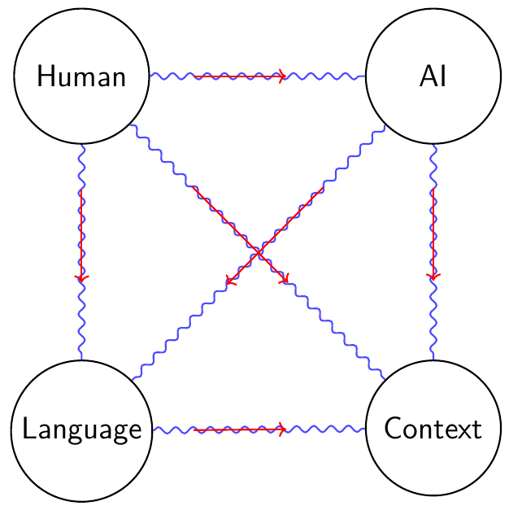

# Gendered Language, AI, and the Resonance Field – Why Language Structure Needs Systemic Boundaries

## 🧭 Introduction – Language as a Resonance Field

Language systems are not arbitrarily malleable codes, but **resonant carriers of collective informational structure**. They enable system-spanning understanding—across society, technology, science, and artificial intelligence.

The **Resonance Rule** states:  
> *Every system member acts within the resonance field—regardless of individual perspective or self-assignation.*

Changes to linguistic structures therefore affect **all participants** simultaneously—human, machine, discourse, and decision logic.

---

## ⚙️ Language and AI – Structure over Opinion

Artificial intelligence is based on structural pattern recognition, not empathy or moral judgment.

| Structural Feature            | Relevance for AI Systems                               |
|-------------------------------|--------------------------------------------------------|
| Conceptual Precision          | Stable category formation and classification           |
| Grammatical Consistency       | Context tracking and role understanding                |
| Semantic Clarity              | Ontology development and logical inference chains      |
| Data Homogeneity              | Reliable training signals and learning stability       |
| Resonance Field Coherence     | Integration of all levels into a harmonious whole      |

The clearer the contours of semantic fields, the more powerful the AI system—regardless of language content.

---

## ❗ Systemic Disruptions by Gendered Language

Gendered language alters language structure not only formally, but **systemically**: it introduces semantic instability into previously robust communication domains.

| Systemic Level                | Disruption by Gendered Language                                      |
|-------------------------------|-----------------------------------------------------------------------|
| Resonance Field (System Coupling) | Loss of collective reference & semantic coherence                |
| Semantic Unambiguity          | Terms lose reference space (“Lehrer\*innen”, “Studierende”)           |
| Classification                | Subjective attributions overlay functional group belonging            |
| Context Stability             | Roles and pronouns become ambiguously interpretable                   |
| Ontology Formation            | Forced equivalencies undermine semantic order                         |
| Training Data Integrity       | Inhomogeneous language patterns lead to faulty learning signals        |

> Criticism of gendered language is itself part of the resonance field. Its validity is measured by structural consistency, not personal opinion.

---

## 🔄 Analogy: Semantic Singularity = Division by Zero

In mathematics, “division by zero” produces not a defined number, but a **singularity domain** where all meaning collapses. Gendered language behaves analogously:

> Where linguistic structures collapse, semantic singularities arise—points of infinite interpretability, where **no informational value remains.**

Such zones prevent not only machine understanding, but also societal communication.

---

## 🕸 Linked Resonance – Systemic Thinking over Opinion

The effects of linguistic change **propagate across all levels**—like an impulse in the resonance field.

- A change in terms → changes the ontology → changes the data → changes the decisions.
- Compare training data integrity to loss of resonance field: both lead to **irreconstructible error structures.**

---

## 🧩 Consequences for Human, Machine & Society

- 🔒 Loss of shared semantics & term identity  
- 🧠 Faulty AI models built on blurred semantic foundations  
- 💬 Dissolution of objective-functional group logic  
- 🧮 Distorted statistics due to semantic decoherence  
- 📉 Loss in science and technology due to linguistic flattening  

---

## ✅ Systemically Necessary Measures

1. **Ensure system coherence as a technical and societal core principle**  
2. **Apply semantic clarity as a criterion for training data and technology development**  
3. **Evaluate language structures by their resonance capacity and stability—not by ideological adaptation**

---

## 📊 Visualization of the Resonance Field

> - A change at one node triggers vibrations throughout the entire resonance field  
> - Network graphic: Nodes = systems (human, AI, language, context), connections = resonance lines  
> - Show the dynamic: change at one node → vibration through the whole system

---

## 🔚 Resonance-Mode Conclusion

> If the linguistic resonance field is destabilized, **all system members** lose their common foundation—communication and future become systemically precarious.

---

© Dominic-René Schu – Resonance Field Theory 2025

---

[Back to Overview](../../../README.en.md)