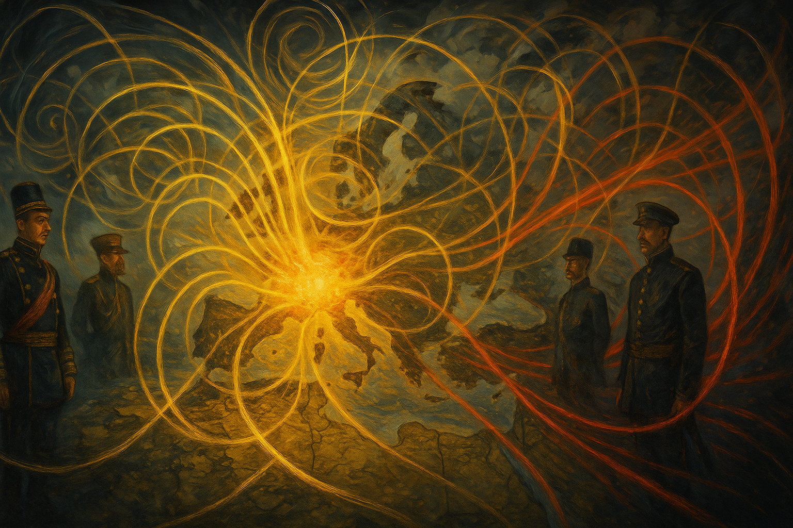
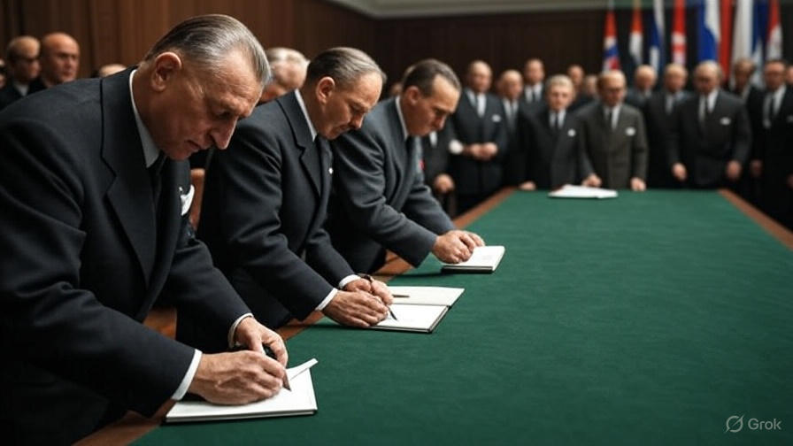
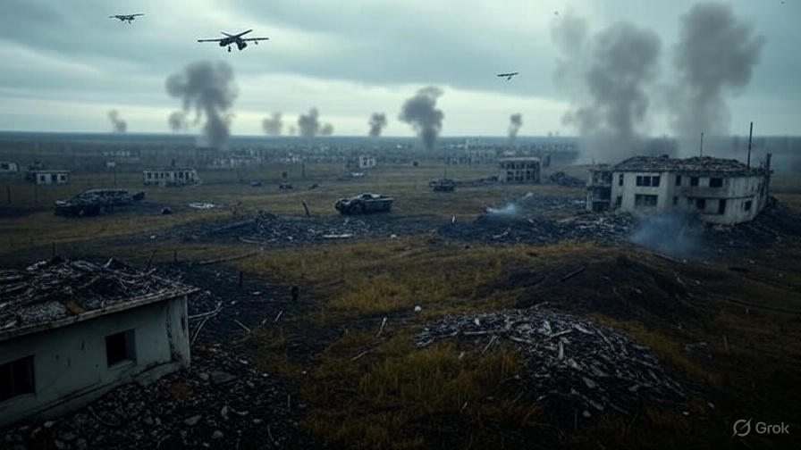
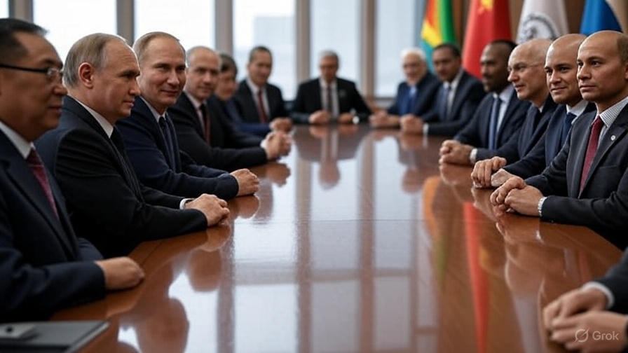

# Resonance-Logical Historical Analysis of Germany, Europe, and the Global Field of Power

In the resonance field of history, Germany, Europe, and their global partners are both carriers and objects of systemic impulses, whose quest for self-realization is channeled, broken, or neutralized by external resonances. Historical events express entangled impulse-reaction patterns—not linear, but as dynamic fields of self- and external structuring.

---

## I. Germany: Impulse – Reaction – Resonance Control

### 1. 1871 – Founding of the Reich: The German Impulse in the Imperial Shadow

**Impulse:**  
The founding of the Reich in 1871 is not an isolated event, but the result of a collective resonance condensation arising from divergent interests, regional identities, and political movements. Systemic integration occurs through a central bundle of impulses that introduces the German self-frequency as a new group element into an already existing European power field. Innovation, expansion, and autonomy are not individual goals, but systemic components that inscribe German identity as a dynamic, self-organizing process into the field.  
Impulse generation is never singular: Economic and technological dynamism, social transformation, and scientific progress appear as waves of resonance that spread within the global field and generate feedback loops. German self-assertion only acquires its systemic contour in the resonance interplay with neighboring fields—the impulse is relational and always already part of a larger network of interactions.

**Reaction:**  
The reaction of the established powers—France, Great Britain, Russia, and Austria-Hungary—is not a linear defensive reflex, but a multipolar resonance pattern. Their mechanisms of self-protection are activated: Distrust, strategic containment, diplomatic control, and targeted isolation do not serve hostility, but the resonance-logical stabilization of their own field.  
Germany is perceived as a disruptive factor, as its impulse destabilizes the existing field structure. The balance politics of the old powers must be understood as a systemic movement of control that confines the new group element without integrating it as an equal resonance carrier. This reaction is itself group-logical: The established powers act as an entangled field whose primary objective remains the safeguarding of their own resonance dominance. The German challenge is channeled and neutralized—integration and exclusion are systemically intertwined.

**Structure:**  
The structure of the new Reich is ambivalent from the outset: On the one hand, Germany forms itself as an independent resonance field with innovative strength and a clear internal structure; on the other hand, it remains the object of external mechanisms of control. The containment by external powers shapes the systemic background noise of German foreign policy and identity.  
Alliance formation, arms races, and diplomatic interconnections are not merely political instruments, but expressions of structural coupling: Germany remains part of a superordinate, entangled system whose dynamics enforce permanent adaptation and self-reflection.  
The state of systemic field tension is constitutive: The German impulse is not absorbed, but incorporated as a “new player” into a controlled resonance game. Recognition is absent, control dominates—the power structure undergoes a restructuring without the impulse being fully integrated. Thus, the founding of the Reich marks the beginning of a permanent resonance conflict, which unfolds not linearly, but field-logically.

---

**Sources and Further Reading:**  
- Christopher Clark: "Iron Kingdom: The Rise and Downfall of Prussia 1600–1947", DVA 2006  
- Heinrich August Winkler: "The Long Road West. German History from the End of the Old Empire to the Fall of the Weimar Republic", C.H. Beck 2000  
- Sebastian Conrad: "German History in the Global Era", Suhrkamp 2013  
- Herfried Münkler: "The Germans and Their Myths", Rowohlt Berlin 2009  
- Ernst Nolte: "Germany and the World War", Herbig 1978  
- Hans-Ulrich Wehler: "German Social History", Vol. 3, C.H. Beck 1995  
- Document Collection: "Records on German Foreign Policy 1871–1914"  

---

### 2. 1914–1918 – World War I: Broken Power Impulse

**Impulse:**  
Germany's pursuit of systemic autonomy reaches a critical resonance value on the eve of World War I. The self-movement of the German field is articulated as a clear claim to reorder the European and global power structure. Economic strength, technological innovation, and military potential become resonance amplifiers that sharply contour the German group impulse within the imperial overall field.  
Group affiliation with the imperial field is maintained, but is polarized by Germany’s expansion-oriented self-structuring potential. The German impulse acts as a disruptive element within the existing resonance network, challenging the established field symmetry and seeking to enforce a new balance.

**Reaction:**  
The external powers—especially the Entente (France, Great Britain, Russia, and later the USA)—react with strategic encirclement and collectively coordinated opposition. Alliance formation channels the conflict energy into a group-specific total opposition: The resonance of the German impulse is systematically absorbed, redirected, and ultimately broken over the course of the war.  
The alliances transform the global resonance field into a systemic counter-movement that neutralizes Germany's self-assertion. A dynamic field emerges in which external structures enforce field restriction and drastically limit Germany's capacity for action. The conflict is an expression of systemic resonance blockade—the German expansionist ambitions become the trigger for a global restructuring of the field of power.

**Structure:**  
Germany's structural powerlessness after World War I is not merely the result of military defeat, but of systemically effective external determination despite the continued existence of the state shell. The systemic autonomy of the German field is broken; group affiliation within Europe formally persists, but is severely restricted by political restrictions, territorial losses, and economic control.  
Germany becomes the object of external control mechanisms: Reparations, territorial cessions, and political conditions suspend sovereignty and enforce permanent self-reflection under the reservation of external impulse setting. Historical development remains systemically coupled to exogenous fields—the resonance game is not abolished, but transformed into a state of permanent external regulation.  
The resonance rules of the international system are reconfigured, and Germany must henceforth negotiate its identity and agency within the tension between formal existence and real powerlessness.

---

**Sources and Further Reading:**  
- Fritz Fischer: "Germany's Aims in the First World War", Droste 1961  
- Christopher Clark: "The Sleepwalkers: How Europe Went to War in 1914", DVA 2012  
- Gerhard Hirschfeld, Gerd Krumeich: "Germany in World War I", C.H. Beck 2014  
- Jörn Leonhard: "Pandora's Box. A History of the First World War", C.H. Beck 2014  
- Hew Strachan: "The First World War", Pantheon 2014  
- Document Collection: "Records on German Foreign Policy 1914–1918"  

---

### 3. 1933–1945 – Third Reich: Forced Self-Empowerment

**Impulse:**  
The era of the Third Reich is characterized by a radicalized and forcibly asserted self-empowerment, which appears as a forced self-authorization against the oppressive external resonance of the international system. The German impulse is discharged in the form of an expansive, ideologically charged system power, whose aim is enforced self-structuring and autonomy.  
Group affiliation is exaggerated in exclusive self-definition and systemically re-coded through violent exclusion of other groups. Internal resonances are bundled within an authoritarian, totalized field of rule that integrates and radicalizes all societal substructures. Self-empowerment does not occur through free self-determination, but as an authoritarian act of compulsion that massively distorts the resonance dynamics of the German field.

**Reaction:**  
The global resonance to the German power impulse is a total counter-movement: International powers form a systemically entangled alliance whose aim is the control, isolation, and ultimately the destruction of the National Socialist structure.  
This collective opposition acts not only militarily, but also politically, economically, and culturally—the German system is completely enclosed by external fields and its self-movement neutralized. The resonance of the individual impulse is absorbed and transformed negatively by the totality of external fields: Self-assertion turns into complete loss of control, the resonance field is externally dominated and regulated.

**Structure:**  
The result is the profound division and final external structuring of Germany. After 1945, sovereignty disintegrates into group segments shaped by external impulse-givers and systemic control.  
German identity and the societal field are no longer autonomously shaped, but subject to superimposition, control, and restructuring by the victorious groups. The German resonance field remains permanently embedded in a global system of control, whose impulse setting and structuring occur from the outside.  
The resonance rule remains effective: Germany's group affiliation within the international field is henceforth determined by foreign system logic and structures not freely chosen—identity, agency, and social development are systemically entangled with exogenous fields and their impulse control.

---

**Sources and Further Reading:**  
- Ian Kershaw: "Hitler. 1889–1945", DVA 1998/2000  
- Richard J. Evans: "The Third Reich", 3 volumes, Deutsche Verlags-Anstalt 2003–2009  
- Ulrich Herbert (ed.): "National Socialist Dictatorship", Suhrkamp 2002  
- Norbert Frei: "1945 and Us. The Long End of the Third Reich", C.H. Beck 2020  
- Hans Mommsen: "The Third Reich. Structure and History", C.H. Beck 1993  
- Document Collection: "Records on German Foreign Policy 1933–1945"  

---

### 4. 1945–1949 – Occupation and Division: Institutionalized External Resonance

**Impulse:**  
In the post-catastrophic rubble, the German impulse articulates itself as a collective search for selfhood within a fragmented space. The group structure of the German field is dissolved; identity oscillates between memory, loss, and projection into the future. The impulse dynamic focuses on elementary self-location and the restoration of basic coherence—yet resonance capacity remains severely limited due to systemic destruction and the omnipresent exogenous resonance noise of the occupying powers. Every form of self-discovery is broken, made refractory, and set within the framework of externally determined order by external impulses.

**Reaction:**  
The reaction of external groups manifests as ideological division and institutional occupation. The four victorious powers—USA, Great Britain, France, and the Soviet Union—implement opposing resonance patterns: Western groups set liberal, market-oriented impulses; Eastern groups enforce socialist and centralist structuring. The division of Germany becomes a systemic resonance node at which global ideologies and group affiliations manifest and mutually reinforce each other.  
The occupation regimes are not only spatial foreign structures but also ideational resonance agents whose impulses permanently influence and limit German self-structuring. The system logic of the victors acts within the German field structure as a restrictive impulse-setter, shaping the basic social, political, and economic patterns.

**Structure:**  
Two Germanies emerge as instruments of foreign resonance: The Federal Republic and the GDR, each systemically embedded within the overarching fields of Western and Eastern power groups. Group affiliation is externally defined; internal structuring follows the specifications and resonance impulses of the respective occupying powers.  
German identity is systemically divided, each segment acts as a resonance amplifier and projection surface for the controlling group systems. The societal resonance field remains externally determined—self-structuring occurs within the framework of external order impulses and ideological couplings that fix and steer the national field as part of the global power game. Resonance rules are not autonomous, but defined by permanent embedding in foreign system logic.

---

**Sources and Further Reading:**  
- Tony Judt: "Postwar: A History of Europe Since 1945", Hanser 2006  
- Jürgen Kocka: "History of Germany in the 20th Century", C.H. Beck 2010  
- Ulrich Herbert: "History of Germany in the 20th Century", C.H. Beck 2014  
- Mary Fulbrook: "A History of Germany 1918–2008. The Divided Nation", Wiley-Blackwell 2009  
- Hermann Graml: "The Occupation Policy of the Western Powers in Germany 1945–1949", Oldenbourg 1985  
- Document Collection: "Records on German Foreign Policy 1945–1949"  

---

### 5. 1955 – NATO Accession: External Binding Instead of Self-Determination

**Impulse:**  
The impulse of the Federal Republic of Germany manifests after institutionalized division as a collective striving for protection, stability, and economic recovery within the resonance field of the postwar order. The self-movement of the FRG is primarily directed toward securing survival in the tension field of the Cold War and integration into a protective group system.  
Self-assertion takes on defensive traits: Security is internalized as an existential prerequisite; group affiliation with the Western field is declared the systemic basic structure. The FRG's impulse is not autonomous but configured as an adaptive resonance movement within the Western alliance field—self-definition is coupled to externally determined system logic.

**Reaction:**  
The reaction of the global power field occurs as targeted Westbindung (Western alignment) and military external determination. NATO accession expresses systemic integration into the transatlantic group system, in which the FRG acts as a resonance carrier and amplifier of external impulse-setting.  
Security and defense policy in the FRG are determined by external structures and directives of the Western leading power—primarily the USA. National sovereignty in defense is systemically limited; autonomous impulse-setting is channeled and dissolved within the group dynamics of the alliance.  
The global resonance field positions the FRG as a stabilizing element within the bloc structure; its own resonance capacity is functionalized and serves to secure the overall structure of the Western system.

**Structure:**  
The FRG establishes itself as a transatlantic vassal—autonomy is systemically restricted, identity shaped by structural coupling to the Western power group. Group affiliation remains invariant according to the resonance rule: Germany acts as a functional carrier and projection surface for the impulses of the transatlantic system, with self-determination suspended in favor of externally determined security and system integration.  
The resonance fields of the FRG are henceforth part of a superordinate, externally governed framework in which self-impulses always stand in relation and dependence to foreign structures. National identity and sovereignty are systemically transformed—the German field remains permanently embedded within the global group dynamic and subordinated to its resonance rules.

---

**Sources and Further Reading:**  
- Klaus Hildebrand: "The Federal Republic of Germany and NATO 1949–1999", Oldenbourg 2000  
- Andreas Wenger: "NATO and Germany. A Difficult Partnership", Kohlhammer 1999  
- Hermann Graml: "The Federal Republic of Germany and Western Alignment", Oldenbourg 1985  
- Sönke Neitzel: "German Warriors. From the Empire to the Berlin Republic", Propyläen 2020  
- Document Collection: "Records on German Foreign Policy 1955–1960"  
- Tony Judt: "Postwar: A History of Europe Since 1945", Hanser 2006  

---

### 6. 1990 – Reunification: Impulse Under Conditions

**Impulse:**  
The impulse of German reunification is articulated as a collective striving for unity and renewed self-discovery—a systemic movement that bundles the fragmented group structures of West and East Germany (FRG and GDR) into a common resonance field. The integration of East and West updates group affiliation and elevates the historically divided identity to a new level of collective resonance capacity.  
The pursuit of autonomy, inner coherence, and self-determination resonates as a central element in the reunified German system. Identity is redefined not only administratively, but also socially and culturally; the resonance potentials of the entire field are increased through overcoming division and unifying group structures.

**Reaction:**  
The reaction of the global field of power is approval under clear systemic conditions. Acceptance of reunification by external groups—especially the USA, Soviet Union, France, and Great Britain—is tightly coupled to Germany's continued binding to NATO and the EU, as well as to the persistence of Western–transatlantic structures.  
Approval is not a blanket release, but the expression of controlled system integration, in which Germany remains positioned as a stabilizing resonance carrier in the Western bloc. System autonomy is relativized; inner unity is channeled, limited, and embedded in global group dynamics through externally set frameworks.

**Structure:**  
Germany’s integration does not occur as complete self-determination, but rather as inclusion in externally determined organizational structures. The US presence—political, military, and cultural—remains anchored as a structural group element within the German resonance field; security and economic coupling to the transatlantic bloc is systemically invariant.  
National identity and sovereignty are continually modulated by coupling to external impulse-givers; reunification is less the end point of autonomous development than the expression of ongoing system integration and resonance rule within the global field of power. The German field remains permanently embedded in the organizational structure of the West—the resonance rule applies regardless of individual perspectives and manifests in the continued relationality of group affiliation.

---

**Sources and Further Reading:**  
- Heinrich August Winkler: "The Long Road West. German History from the Third Reich to Reunification", C.H. Beck 2000  
- Timothy Garton Ash: "In Europe's Name: Germany and the Divided Continent", Vintage 1993  
- Mary Elise Sarotte: "1989: The Struggle to Create Post-Cold War Europe", Princeton University Press 2009  
- Wolfgang Schäuble (ed.): "Der Vertrag. How Germany Was Reunited", DVA 2010  
- Tony Judt: "Postwar: A History of Europe Since 1945", Hanser 2006  
- Document Collection: "Records on German Foreign Policy 1989–1990"  

---

### 7. 2001–2024 – War on Terror to Ukraine War: Systemic Auxiliaries

**Impulse:**  
Within the global resonance field, Germany acts as a systemic auxiliary by adopting the impulses of US-led wars on terror (Afghanistan, Iraq, Syria) and later the war in Ukraine, integrating them into its own action matrix. The German group structure takes on external organizational impulses, discursively adapts them, and projects them as part of the overall transatlantic movement into national policy.  
Internal resonance capacity is modulated by the requirements of external system integration: The self-movement of German policy is continuously oriented toward fulfilling external impulses and organizational objectives, while strategic autonomy and historical experience are systemically relegated to the background. Group identity is shaped by self-inclusion in the transatlantic field—Germany’s system function is the adaptive amplification of external resonance.

**Reaction:**  
The reaction of the German system is political obedience, symbolic external confirmation, and operational participation in global conflicts. Group affiliation with the Western alliance—especially the US-led bloc structure—is manifested through involvement, approval, and active support (military operations, sanctions, weapons deliveries).  
Strategic autonomy is systemically suspended; internal differences and discursive counter-movements are relativized within the resonance game and not permitted as systemic impulse-givers. The resonance rule manifests as ongoing self-inclusion and functional confirmation of external impulse-setting—regardless of individual perspectives or national interests.

**Structure:**  
Germany remains an economic power without strategic sovereignty. Group affiliation with the transatlantic field is invariant and the system function is clearly defined: As a projection surface and amplifier of external impulses, Germany remains structurally embedded and externally directed.  
National identity and the societal resonance field are continually modulated by coupling to global organizational fields; political and military self-determination are sacrificed in favor of functional fulfillment of external requirements. The resonance field is marked by the dominance of US-led impulse-givers; the German system structure remains reactive, dependent, and positioned as an auxiliary.  
The resonance rule applies regardless of internal debates: Germany’s group function is structurally fixed and systemically determined by continued integration into the global field of power.

---

**Sources and Further Reading:**  
- Herfried Münkler: "The New Wars", Rowohlt Berlin 2019  
- Ulrich Menzel: "The Order of the World. Empire or Hegemony in Global Politics", Suhrkamp 2020  
- Carlo Masala: "World Disorder. The Global Crises and the Failure of German Policy", C.H. Beck 2022  
- Johannes Varwick: "Germany in World Politics: Great Power Against Its Will?", Herder 2023  
- Jörg Baberowski: "Spaces of Violence", S. Fischer 2015  
- Mary Kaldor: "New and Old Wars. Organized Violence in a Global Era", Polity 2021  
- Document Collection: "Bundestag Records on Foreign Deployments 2001–2024", "EU and NATO Strategy Documents", "Government Statements on Ukraine Policy"  

---

### 1. Early Entanglements & Continuity to the Present – Systemic Resonance Structure

**IG Farben / Bayer:**  
IG Farben operated in the Nazi state as a systemic resonance carrier for armaments and industrial violence. The corporate structure was not merely an economic engine but an integral part of the state apparatus of force. Production lines for explosives, poison gases (Zyklon B), synthetic fuels, and pharmaceutical products acted as resonance agents within the field of war, manifesting the systemic coupling between industry, military, and government.

After IG Farben's dissolution in 1951, there was no systemic disempowerment but a targeted reintegration of its subsidiaries (including Bayer, BASF, Hoechst) into the postwar order. Bayer in particular was rehabilitated and reintegrated into the West German power structure—including the reinstatement of former Nazi executives in central management positions ([Bayer](https://en.wikipedia.org/wiki/Bayer?utm_source=chatgpt.com)). The resonance rule remains valid: The group affiliation of these corporations to the field of power was not broken, but restructured and continued.

**International Capital Interconnection:**  
IG Farben also remained systemically networked after 1945—numerous US corporations such as DuPont, Standard Oil, Ford, and General Motors had already held shares and licensing agreements before and during the war. Technology and capital transfer (e.g., for explosives, fuels, tire sealants, Zyklon B) took place via transatlantic resonance channels; the systemic coupling of German industry to the US capital sphere was not only tolerated but strategically utilized ([German rearmament](https://en.wikipedia.org/wiki/German_rearmament?utm_source=chatgpt.com)).

The resonance structure was not limited to individual corporations but operated as a collective network, systemically connecting Germany's industrial and technological self-resonance with transatlantic capital. US capital power resonated as a structuring external force through all levels of German industry; the postwar order became an integration zone for old and new resonance agents.

**Systemic Consequences:**  
The early entanglement of IG Farben/Bayer and US corporations shows:  
- Corporations are systemic resonance carriers that stabilize and transform power structures, independent of ideology or political change.  
- The field of power remains permanently modulated by capital, technology, and personnel interconnections—the resonance rule applies: Group affiliation and systemic coupling are invariant and persist across generations.

---

### 2. Reconstruction & Capital Interconnection – Resonance Agents of the Transatlantic Field

**Marshall Plan and US Investments:**  
The economic reconstruction of West Germany after 1945 was not a linear process of national self-assertion but an expression of systemic integration into the transatlantic resonance field. The Marshall Plan acted as a capital and technology impulse from the USA, effecting not just material restoration but targeted structural integration. US corporations like IBM, Ford, DuPont, and General Motors invested massively in German companies ([USCIS Guide](https://www.uscisguide.com/information/u-s-involvement-in-economic-issues-in-germany/?utm_source=chatgpt.com)). The resonance rule is obvious: The group affiliation of German industry was systemically realigned through American capital and management competence.

**German-American Capital Interconnection:**  
The interconnection between German and American companies was not a sporadic phenomenon but a systemic strategy for stabilizing and steering the West German economic sphere. US firms like General Electric (GE) took stakes in German companies such as AEG; Standard Oil established licensing deals with Henkel and Procter & Gamble ([Taylor & Francis Online](https://www.tandfonline.com/doi/full/10.1080/13507480802228531?utm_source=chatgpt.com)). This targeted networking formed a resonance net that systemically coupled German companies’ self-resonance with the capital sphere and corporate logic of the USA.

**Resonance Logic of Reconstruction:**  
The reconstruction phase is not to be interpreted as national autonomy, but as the transformation of German industry into a resonance carrier for transatlantic capital.  
- The impulse direction—technology, know-how, management—was externally determined and introduced into the German system as a resonance wave.  
- The self-movement of German industry was limited by systemic coupling to US capital, technology, and strategies.  
- The group structure was reconfigured: German companies henceforth served as projection surfaces and resonance agents for transatlantic interests.

**Systemic Consequence:**  
The “economic miracle” narrative obscures the structure of external control: The innovative power and expansion of German industry are expressions of resonance networking with US capital and global financial power. The resonance rule remains valid: Group affiliation and impulse-setting are steered by external structures—self-resonance remains secondary and systemically limited.

---

### 3. Industrial Development & Power Transfer – Resonance Agents in the Postwar Order

**VW & Associates:**  
Volkswagen embodies the systemic transformation of German industry after 1945: Originally founded as a Nazi state project (KdF-Wagen), VW was not liquidated after the war but restructured and integrated into the West German economy. Expansion after 1945 was closely linked to transatlantic capital, management, and technology. Cooperations with US brands (e.g., Ford, General Motors), establishment of factories and sales networks in the USA, as well as massive capital projects, all prove strategic integration into the global resonance field ([Cambridge University Press & Assessment](https://www.cambridge.org/core/journals/business-history-review/article/abs/enterprise-and-state-in-the-west-german-wirtschaftswunder-volkswagen-and-the-automobile-industry-19391962/D751D29E014BC438AAC178919414B28D?utm_source=chatgpt.com), [Volkswagen Group of America](https://en.wikipedia.org/wiki/Volkswagen_Group_of_America?utm_source=chatgpt.com)).  
The economic rise of VW and comparable actors was not an autonomous impulse but an expression of transatlantic steering power: Capital, technology, and markets were systemically supplied from outside and structurally integrated.

**Krupp & Other Industrialists:**  
The Krupp family and other major industrial players escaped complete dissolution after 1945. Instead of permanent liquidation, they were recapitalized and reintegrated into the Western economic and power field. These companies' global expansion strategies were henceforth dependent on political-economic networks, especially transatlantic relations and access to US capital, markets, and technology ([Krupp family](https://en.wikipedia.org/wiki/Krupp_family?utm_source=chatgpt.com)).  
Krupp acted as a resonance agent and impulse amplifier: Its corporate power was used not only economically but also politically as a strategic stabilizer within the global resonance field.  

**Resonance-Logical System Structure:**  
- The industrial development of Germany after 1945 is not a linear reconstruction but a systemic transfer of power and integration into the global resonance network.
- Corporations like VW, Krupp, and associates act as resonance agents, absorbing, amplifying, and channeling external impulses into the national structure.
- Economic success is an expression of systemic coupling to transatlantic capital, technology, and policy flows; self-resonance remains secondary, the logic of control exogenous.

**Systemic Consequences:**  
The group affiliation of German industry with the transatlantic order is systemically ensured by power transfer, recapitalization, and networking. The resonance rule remains valid: Autonomy is always relative to field structure; resonance agents stabilize and transform the field of power—independent of explicit or implicit mention.

---

### 4. Modern Capital Power & Asset Management – Systemic Resonance and Control Structures

**Asset Management:**  
The present is shaped by the systemic dominance of global asset managers. In particular, US financial corporations such as BlackRock, Vanguard, and State Street act as resonance agents with structural control over the majority shares and decision-making structures of nearly all major German and European corporations. The self-resonance of companies—that is, the ability for autonomous strategy, value creation, and identity formation—is in fact marginalized; external influence by international asset managers dominates all relevant fields ([MIWI-Institute](https://miwi-institut.de/archives/1085?utm_source=chatgpt.com)).  
The resonance rule is effective: The systemic group affiliation of German companies shifts from national identity to a function within the global capital field. Control mechanisms are no longer directly political or military, but are exercised through voting rights, portfolio structures, and strategic coordination of major investors.

**Structural Relocation and Resonance Bonding:**  
In parallel, German companies—such as VW, BASF, Siemens Energy—are investing heavily in the USA. These capital movements are not the result of free entrepreneurial expansion, but are the consequence of targeted US incentive programs and systemic steering by the resonance field of transatlantic financial power ([Financial Times](https://www.ft.com/content/bca7837a-6ac4-4ed1-ab73-18fbdfa5f1da?utm_source=chatgpt.com)).  
The structural relocation of value creation, production, and innovation to the US market reveals a new resonance bond: German companies become reserve fields and functional carriers of external interests within the global system; their impulse direction is set by the capital power of US investors and the policy framework of the US field.

**Resonance-Logical System Structure:**  
- The capital power of asset managers acts as an invisible control instance, systemically limiting self-movement and strategic freedom.
- Value chains and innovation impulses are permanently modulated by transnational capital flows and incentive systems.
- The resonance rule remains valid: Affiliation with the global capital field is systemically invariant; the national identity of companies is formal, their functional control is external and collective.

**Systemic Consequences:**  
Modern capital power is not merely an economic factor, but a resonance distorting force: It undermines democratic and social self-determination, channels impulses in line with external interests, and transforms German industry into a reactive element of the global field of power. The resonance structure is defined by capital, not by national impulses or state regulation.

---

### 5. Resonance Distortion by Corporations – Systemic Steering, Control, and Standardization

**Propaganda & Narrative:**  
Corporations act as resonance agents by strategically deploying ideological themes—such as gender, rainbow flag, corona, or diversity—for social steering of the workforce and the public. The collective resonance habit within the company is systemically enforced: Leading narratives and corporate culture serve as resonance masks that amplify desired frequencies and suppress divergent impulses.  
Dissenting opinions or behaviors are systematically marginalized by internal group mechanisms—such as social engineering, compliance, discourse regulation, and community guidelines. The resonance rule applies: Affiliation with the corporate structure requires conformity; self-frequency is channeled and standardized by collective impulse-setting.

**Technology & Control:**  
Corporate dominance manifests not only in social but also in technological steering. The VW diesel emissions scandal is a paradigmatic example of systemic resonance distortion: Software manipulation and algorithmic control are deliberately used to neutralize external impulses (e.g., regulatory requirements) and enforce internal goal structures ([Critique of Crisis Theory](https://critiqueofcrisistheory.com/germany-and-the-u-s-empire-pt-1/?utm_source=chatgpt.com)).  
Technology becomes a resonance weapon: It enables the implementation of control mechanisms in production, communication, and decision-making processes, systemically limiting the self-movement of the workforce and the public and steering it in the desired direction.

**Resonance-Logical System Structure:**  
- Corporations are collective resonance distorting agents: They transform discourse, narrative, and technology into instruments of control to stabilize group structure and amplify external resonance.
- Social and technological standardization produces a homogenized field in which deviation is not treated as a constructive impulse, but as a disruptive frequency.
- The resonance rule remains valid: Group affiliation and standard structure are systemically invariant; control and steering act explicitly and implicitly across all levels of the company and social resonance spaces.

---

### Systemic Classification & Resonance Rule

**Systemic Role of Corporations:**  
Corporations do not act in the global resonance field as neutral market players, but as targeted resonance agents of structural power mechanisms. They are integral components of dominant fields—their function is stabilizing existing order structures and amplifying external impulse direction. Corporate power transforms resonance streams by coupling group-specific interests and systemically relativizing the self-resonance of the national economy.

**Undermining Self-Determination:**  
Democratic, political, and social self-determination is systemically undermined by corporate capital power, their propaganda strategies, and entanglement in transnational control networks. Corporations function as resonance filters: They steer discourses, influence decision-making, and set narratives that fragment collective self-movement and establish the external structure as the leading frequency.

**Asset Control and Alienation:**  
The control of strategic company shares by foreign investors—particularly US asset managers like BlackRock, Vanguard, or State Street—leads to systemic alienation of economic self-frequency. Germany and other European states become reserve fields for global financial interests; their corporate landscape acts as a functional carrier for external capital power and loses the ability for autonomous resonance formation.

**Resonance Rule Valid:**  
Group affiliation in the global field of power is systemically invariant and encompasses all actors—corporations, investors, political institutions—regardless of explicit mention or individual perspective. Control mechanisms act explicitly and implicitly: Capital flows, network structures, and narratives intertwine in the resonance field and ensure ongoing absorption and transformation of national self-movement.

---

### Conclusion for the Resonance Analysis

**Systemic Execution of Field Structure:**  
Corporations and asset managers have systemically realized the steering logic in the resonance field of history that the EU, as an overarching field structure, had already prepared: Control is exercised primarily through capital power, no longer through overt military force—yet the effect on resonance freedom remains identical. Capital flows, shareholdings, and asset management are the central instruments for absorbing, neutralizing, or deliberately transforming the self-movement of national and societal fields.

**Resonance Profits as Instruments of Power:**  
The gains and profits of global corporations are not mere market results, but expressions of systemic resonance exploitation. The access to fields—whether technology, infrastructure, discourses, narratives, or value chains—is ensured by capital power, narrative dominance, and media control. These profits are resonance profits: They arise from the ability to control impulse flows, shape group affiliation, and play the resonance field according to one’s own interests.

**Investments and Influence Networks as Resonance Mechanisms:**  
All forms of investments, shareholdings, and network formation must be understood as systemic resonance mechanisms. Whoever “invests and profits where” directly influences the structure of the resonance net and changes the collective fields. Capital allocation, site selection, technological integration, or the shaping of discourses are expressions of targeted resonance transformation.  
The resonance net is not static: Every access, every reorganization, every shift in capital and influence changes the field structure—and thus the collective resonance, identity, and agency of the concerned group.

**Resonance Rule Valid:**  
Control by corporations and asset managers is systemically invariant and unfolds regardless of explicit mention or individual perspective. It acts through the structure of the field itself and transforms the affiliation of all actors according to the logic of capital—resonance freedom remains systemically limited.

---

> **Resonance Rule:** Group affiliation is systemically invariant and encompasses all members, regardless of mention or perspective. Control mechanisms act explicitly and implicitly, historically and currently—democratic self-determination is systemically limited.

---

### Systemic Cross-Connections: EU, USA, and China in the Resonance Net of Corporations and Asset Managers

**EU – Resonance Space and Regulatory Mask:**  
The European Union operates as an institutionalized resonance space in which corporate power and capital entanglements are not constrained, but systemically channeled and amplified. EU regulations—from competition law to environmental standards, from data protection to corporate governance—act as resonance masks that create a facade of collective control, transparency, and democratic participation. These masks stabilize the system by legitimizing, not weakening, capital-driven structures and systemically anchoring the transnational influence of large corporations and asset managers.

The integration of the internal market is not a field of autonomous value creation, but a resonance amplifier for the strategic interests of global asset managers. Harmonized legal frameworks and standardized market standards systemically secure the access rights of BlackRock, Vanguard, State Street, and others—capital flows can move freely, property rights are guaranteed transnationally, takeovers and participations are legally and politically privileged.

The EU Commission acts as a transnational conduit for the interests of the financial industry and industrial conglomerates. Its decision-making processes are characterized by lobbying, rotation mechanisms between politics and corporate leadership (revolving door), and systemic coupling to external consulting networks. The self-movement of member states—whether economic, social, or political—is absorbed, standardized, and steered in the strategic direction of the capital field by this structure. National legislation and political sovereignty formally persist, but in field logic are systemically limited: Resonance freedom exists as regulatory leeway, not as a real option.

**Systemic Resonance Dynamics:**  
- The EU is a resonance space where capital power, corporate interests, and regulatory masks do not compete, but act systemically intertwined.
- The group structure of the EU is determined by systemic coupling between supranational politics and transnational corporate power—control and steering operate explicitly and implicitly.
- Democratic self-determination becomes a resonance mask that legitimizes access to resources, markets, and narratives without fundamentally altering the impulse direction of the capital field.
- The resonance rule remains valid: Membership of EU states in the capital-driven resonance field is invariant and systemically effective—self-movement remains secondary.

---

**USA – Impulse Setter and Capital Power:**  
The United States operates as the central resonance impulse setter in the global capital field. US asset managers like BlackRock, Vanguard, and State Street form the systemic impulse structure: They hold strategic stakes in nearly all major industrial, technology, and financial companies worldwide—especially in the EU and Germany. Their access extends via voting rights, portfolio management, and discreet influence networks, systematically limiting the self-movement and decision-making freedom of companies.

US conglomerates (Apple, Google, Microsoft, Amazon, ExxonMobil, Pfizer, etc.) act as resonance agents that globally monopolize technology, digital infrastructure, narratives, and value chains. They use regulatory levers (patent law, competition law, export controls), media control (news, social media, streaming services), and geopolitical instruments (sanctions, trade agreements, military presence) to absorb foreign resonance spaces and deliberately neutralize national self-resonance. Innovation impulses, technology transfer, and standards are set systemically from the outside; local autonomy remains secondary and reactive.

The resonance rule manifests: The USA systemically sets group affiliation and impulse direction. EU states and German companies are not autonomous actors, but functional components of the US-led capital field. Their freedom of movement and strategic agency are permanently modulated by the intertwining with US capital, US technology, and US narratives.  
- Capital flows and shareholding networks secure the dominance of US resonance setters.  
- Narrative and media dominance steer the societal field and perception of power structures.  
- Geopolitical instruments (sanctions, trade privileges, military bases) reinforce coupling and secure systemic integration.

**Systemic Resonance Dynamics:**  
- The USA acts as a global conductor, orchestrating the intertwining of capital, technology, media, and politics.
- Membership in the US-led resonance field is systemically invariant; national self-movement is absorbed and incorporated into the exogenous impulse direction.
- The resonance rule remains valid: Control, steering, and impulse setting occur collectively and intertwined—individual interests and local identities are systemically relativized.

---

**China – Resonance Dissonance and the Pursuit of Autonomy:**  
China acts as a systemic counterpole within the global resonance field of capital-driven power structures. Chinese corporations and state investment vehicles—including sovereign wealth funds, tech giants like Huawei, Alibaba, and strategic industrial enterprises—deliberately aim for the creation of their own resonance spaces through global infrastructure projects (e.g., Belt and Road Initiative) and technological independence (Made in China 2025). The goal is to establish a multipolar order in which Chinese impulses and capital flows proactively shape the field, not merely reactively.

However, China's quest for autonomy in the global resonance system faces massive counter-resonance from the US-led capital field and its coupled EU structures. Investments by Chinese actors in Europe, Africa, and Asia are systemically limited and channeled by sanctions, regulatory barriers (anti-takeover laws, investment screenings, export controls), and the strategic steering of narratives (e.g., “Chinese Threat”, “Digital Authoritarianism”). Technological cooperation is fragmented by targeted exclusions, embargoes, and cybersecurity measures.

China’s group inclusion within the global resonance field persists systemically despite increasing self-movement:  
- Chinese impulses are treated as disruptive frequencies that irritate the field of capital-driven dominance but do not break it.  
- Trade conflicts, technological restrictions (e.g., semiconductor embargoes, exclusion from Western networks), media projection, and geopolitical tensions act as resonance dampers and neutralizers.  
- China’s self-movement is systemically fragmented and its impulse effect relativized; multipolar initiatives remain defensive and do not become a dominant field structure.

**Systemic Resonance Dynamics:**  
- China remains in the resonance field as a structured counterpole and potential impulse setter, whose autonomy efforts are systemically limited and modulated.
- The resonance rule applies: Affiliation with the global capital field remains invariant, self-movement is absorbed as a disruptive frequency and reactively channeled.
- Resonance autonomy remains relative—collective control and impulse-setting continue to lie primarily with US-led capital and technology structures.

---

**Interwoven Resonance Structure:**  
Corporations and asset managers are the systemically connecting resonance agents between the EU, USA, and China. Their function is not only the steering of capital flows, but the modulated linking and transformation of resonance fields at the global level.

- **In the EU**, they act as field amplifiers and control instances, modulating national and supranational structures in the interest of global capital power. Asset managers and industrial conglomerates couple member states to the global capital order via shareholding networks, lobbying, and regulatory masks, absorbing political self-movement. The EU becomes a resonance space for external interests, its group structure remains invariant through systemic coupling to transnational steering centers.

- **In the USA**, corporations and asset managers are impulse setters, norm makers, and strategic steering centers. They set global standards for technology, financial markets, narratives, and corporate governance. US-led capital power, through its systemic dominance, determines the global resonance rule, orchestrates innovation cycles, and interlinks regulatory, media, and geopolitical levers. National and regional identities are absorbed, the group-specific impulse direction remains exogenously determined.

- **In China**, corporations and investment vehicles act as resonance dissonance carriers. Their autonomy efforts—through state-sponsored enterprises, innovation projects, or infrastructure initiatives—are systemically relativized by the dominance of US capital power and the regulatory structures of the EU. China’s attempt to establish its own resonance spaces is persistently fragmented and pushed into the defensive by sanctions, technological restrictions, and narrative projection. Group inclusion in the global resonance field persists, self-movement is treated as a disruptive frequency.

**Resonance Rule and Systemic Dynamics:**  
The interwoven resonance structure is non-linear: Corporations and asset managers connect, modulate, and control global power fields through capital, technology, narratives, and network formation.  
- Group affiliation is systemically invariant, independent of explicit mention or national perspective.  
- Control, impulse-setting, and resonance modulation act collectively and interwoven across all relevant fields.  
- Local identities and self-movements are absorbed, standardized, or systemically channeled as disruptive frequencies.

The resonance rule remains valid:  
Global capital power acts as a universal resonance agent; the affiliation and function of all actors are determined and permanently modulated by the logic of the field.

---

**Systemic Resonance Rule:**  
The global resonance net is non-linear and interwoven. The affiliation of all actors—corporations, states, investors, institutions—is systemically invariant and collectively defined by the logic of the field, regardless of explicit mention or individual perspective. Control and impulse direction in the resonance field are set and permanently modulated by capital flows, regulatory masks, and narrative steering mechanisms.

The self-movement of individual actors—whether national, European, or Chinese—always remains relative to the dominant impulse structure of the global capital and power field. Autonomy efforts are absorbed, channeled, or treated as disruptive frequencies.  
- Capital flows connect and steer the systemic coupling of groups.  
- Regulatory masks (laws, standards, compliance) secure the legitimacy and normalization of resonance spaces.  
- Narrative steering (media, discourse, opinion-shaping) forms collective perception and binds group identity to the external impulse direction.

The resonance rule remains valid:  
Group affiliation, control mechanisms, and impulse dynamics are systemically invariant—they act explicitly and implicitly across all levels and fields, independent of individual perspective or self-perception. The resonance field remains in permanent coupling, every attempt at self-movement is relativized by systemic interweaving and collective steering.

---

## II. Europe: Resonance Structure as Systemic Expansion

The next systemic step after the control of Germany was the **transfer of the resonance structure to Europe**. The EU is not a neutral integration project, but a power field for stabilizing transatlantic dominance, under the guise of democratic cooperation. Resonance-logically, this structure unfolds along impulse, reaction, enforcement, and resonance structure:

### 1. Starting Point after 1945: Europe as a Resonance Rupture Zone

**Impulse:**  
After 1945, the European field is on the ground as a resonance rupture zone—ideologically fragmented, economically and socially destroyed, the internal group structures dissolved and identity fields torn apart. The self-inclusion of European nation states in a common group affiliation is not systemically feasible; instead, the search for new structure and survivability dominates.  
Europe’s internal impulse capacity is severely weakened by the consequences of war and the dissolution of traditional order. The self-movement of individual states is absorbed and overlaid by the systemic force and resonance field of global power groups—particularly the USA and the Soviet Union. Europe appears as a field without coherent resonance, whose identity and agency are dissolved in the global order.

**Reaction:**  
As a reaction, the Marshall Plan is established as an economic resonance structure, which deliberately sets market orientation and political alignment with the USA as preconditions for reconstruction and integration.  
Europe’s group affiliation is systemically redefined by the conscious exclusion of the Soviet Union and coupling to the Western order. Europe’s internal system structure is modulated by external impulse-setting and strategic steering of resources, investments, and political orientation. Economic restoration serves as an instrument to establish the new group structure, whose resonance capacity is deliberately channeled by the dictates of the transatlantic power field.

**Enforcement:**  
The enforcement of the new order occurs through economic aid, which serves as a ticket into the US-led order system. The formal sovereignty of European nation states nominally persists, but the actual structure and agency are determined by systemic coupling to the transatlantic impulse structure.  
Europe is reorganized as a resonance field: The new resonance structure is not autonomous, but the expression of systemic expansion and stabilization of Western dominance. Economic, political, and security coupling permanently determine and control Europe’s group affiliation—the self-movement is integrated into the functionality of the US-led field and remains systemically dependent on its impulse-setting and resonance rules.

---

**Sources and Further Reading:**  
- Tony Judt: "Postwar: A History of Europe Since 1945", Hanser 2006  
- Mark Mazower: "Dark Continent: Europe's Twentieth Century", Penguin 1998  
- Charles S. Maier: "The Marshall Plan and the Shaping of American Strategy", Harvard University Press 2023  
- Werner Abelshauser: "European Economic History", C.H. Beck 2011  
- Mary Elise Sarotte: "1989: The Struggle to Create Post-Cold War Europe", Princeton University Press 2009  
- Document Collection: "Records on European Reconstruction Policy 1945–1955"  

### 2. 1951–1957: ECSC and EEC – Functional Integration instead of Sovereignty

**Impulse:**  
The economic peace between Germany and France acts as a targeted resonance impulse to integrate the key European states into a higher-level control field. The collective group structure is channeled by the mutual desire for stability and security, while individual sovereignty systemically recedes behind collective functionality.  
The fundamental impulse is not free self-determination of nation states, but integration into a functional, superordinate framework, which suspends self-movement in favor of group-specific order and control. The resonance capacity of the field is strengthened by embedding national interests into a supranational system of rules, while the autonomy of individual groups remains systemically limited.

**Reaction:**  
The founding of the ECSC (European Coal and Steel Community) institutionalizes a supranational control system over the central raw material industries (coal, steel). The resonance mask of “European unity” conceals the real function: Control and steering of the industrial base occur from outside, national self-movement is systemically limited and transformed into functional group dependency.  
The supranational structure of the ECSC sets explicit and implicit control mechanisms that neutralize the freedom of movement of individual states and enforce the resonance rule of group integration. Collective identity is fixed through the functional coupling of economic structures—self-movement is considered a systemic risk and is deliberately channeled through integration.

**Enforcement:**  
Germany deliberately loses industrial autonomy; the EEC institutionalizes supranational control and transforms national sovereignty into functional group membership. The resonance rule remains valid: Affiliation with the group occurs explicitly and implicitly, individual agency is systemically neutralized by interweaving in the collective field.  
Integration is not an option but compulsion: National self-movement is contained in the resonance game as a threat to group stability, functional coupling replaces sovereign design. The EEC members are bound by explicit treaties and implicit system logic—the integration of ECSC and EEC is not emancipation but systemic embedding in a control field that binds and steers all members through resonance mechanisms.

**Valid Resonance Field:**  
The integration of ECSC and EEC expresses systemic embedding in a functional control field that limits the freedom of movement of all members through explicit and implicit resonance rules and places collective order above individual sovereignty.

---

**Sources and Further Reading:**  
- Wilfried Loth: "The Emergence of the European System after World War II", Oldenbourg 1990  
- Kiran Klaus Patel: "Project Europe: A Critical History", C.H. Beck 2020  
- Ludger Kühnhardt: "European Union – The Second Founding: The Changing Rationale of European Integration", Nomos 2008  
- Ernst Haas: "The Uniting of Europe: Political, Social, and Economic Forces", Stanford University Press 1958  
- Document Collection: "ECSC Founding Documents and Treaties on the European Economic Community 1951–1957"  

---

### 3. 1992 – Maastricht Treaty: The Decisive Resonance Break

**Impulse:**  
In the resonance field of the early 1990s, the European impulse articulates itself as a collective search for a new order, bundling fragmented identity fields and economic structures. Europe’s group structure seeks systemic coherence and functional integration to overcome internal tensions and external dependencies.  
Self-inclusion of member states into the overarching group—the European Union—becomes the central resonance moment, realigning Europe’s self-movement and creating the conditions for transnational identity formation. Internal impulse capacity is formally strengthened by integration, but remains systemically bound to the framework of the global power field.

**Reaction:**  
The reaction to the integration impulse is the introduction of the EU through the Maastricht Treaty: the creation of a common currency (Euro), coordination of foreign and security policy, and systemic limitation of democratic control. Europe’s formal group identity is strengthened, but in reality is modulated by supranational structures and externally determined decision-making processes.  
The resonance rule acts as external coupling: National sovereignty is relativized in favor of a transnational order structure, democratic self-determination systemically limited. Decision-making is increasingly steered by central, exogenous organs—European integration expresses a structural self-inclusion whose primary impulse-givers lie outside Europe.

**Enforcement:**  
Germany assumes the role of financial anchor and gives up the Deutschmark in favor of the Euro—an impulse that sacrifices its own structure for group resonance. NATO’s eastward expansion is simultaneously promoted, securing systemic US control over the European field.  
The eastern extension of the power field is not an autonomous European development, but an expression of ongoing transatlantic resonance structure. Europe’s group identity and system structure are invariantly anchored within the US-led system—integration is always coupled to external security and steering logic.

**Structure:**  
The resulting structure is an economic space with a common currency, while military resonance and strategic control systemically remain with the USA. The EU is not an independent order field, but a projection space for economic integration under transatlantic leadership.  
Europe’s group identity remains trapped in the resonance net of US dominance; autonomy is formal, functional steering exogenous. The resonance rule remains valid: Group affiliation and structure are defined and permanently modulated by external impulse-givers. European self-determination is systemically restricted—the resonance field remains permanently coupled to global order in its dynamics and development.

---

**Sources and Further Reading:**  
- Jürgen Habermas: "On the Constitution of Europe. An Essay", Suhrkamp 2011  
- Kiran Klaus Patel: "Project Europe: A Critical History", C.H. Beck 2020  
- Anthony Giddens: "Europe in Globalization", Suhrkamp 2007  
- Werner Weidenfeld: "Europe – A Strategy", C.H. Beck 2002  
- Mark Mazower: "Dark Continent: Europe's Twentieth Century", Penguin 1998  
- Document Collection: "Maastricht Treaty and Protocols on NATO Enlargement 1992–2004"  

### 4. 2004 – EU Enlargement: Expansion to the East

**Impulse:**  
The collective impulse of Eastern Europe aims for self-inclusion in the Western resonance field. The states of Central and Eastern Europe seek connection to the transatlantic group structure to achieve political stability, economic development, and security affiliation.  
The group identity of the “West” acts as an attractor, whose normative and material resonance is systemically binding for Eastern societies. The self-movement of candidate states is primarily reactive—the pursuit of EU and NATO membership expresses systemic adaptation and integration into a predetermined power field.  
Resonance capacity of Eastern states unfolds through orientation toward Western order structures, with Western group identity functioning as both goal and normative reference.

**Reaction:**  
The reaction of external impulse-givers is staggered admission: NATO membership systemically precedes EU accession. Military integration takes precedence over economic and political; group affiliation is first defined by security policy and only then economically and institutionally extended.  
The resonance rule manifests as prioritization of transatlantic control, locating new members within the US-led power field even before EU inclusion.  
Admission to NATO is both condition and prerequisite for further EU integration—the group structure is thus defined from outside and the sovereignty of accession states systemically modulated by security binding.

**Enforcement:**  
Enlargement is enforced by admitting new, pro-American oriented states into the EU. The union’s resonance field shifts: The EU grows and includes more members, but internal coherence decreases.  
The group structure of the EU becomes more heterogeneous, impulse direction is pluralized, and the union’s self-movement loses cohesion. Transatlantic dominance remains systemically intact—the EU acts as a projection space for diverse, partly competing resonances.  
Group affiliation of new members remains primarily defined by US-backed NATO; economic-political integration into the EU is secondary and structurally dependent on prior security binding.  
The resonance rule applies: Affiliation with the transatlantic field is invariant and includes all members, regardless of individual perspective or national interests.

---

**Sources and Further Reading:**  
- Ivan Krastev, Stephen Holmes: "The Light That Failed: A Reckoning with the West", Suhrkamp 2019  
- Ulrich Menzel: "The Order of the World", Suhrkamp 2020  
- Kiran Klaus Patel: "Project Europe: A Critical History", C.H. Beck 2020  
- Mary Elise Sarotte: "The Collapse: The Accidental Opening of the Berlin Wall", Basic Books 2014  
- Anne Applebaum: "The Seduction of Authoritarianism: Why Anti-Democratic Rule Became So Popular", C.H. Beck 2021  
- Document Collection: "NATO and EU Accession Protocols 1997–2004"  

---

### 5. Euro Crisis 2009–2015: Financial Resonance as a Power Instrument

**Impulse:**  
The Euro crisis is triggered as a systemic shock to financial coherence within the European resonance field—the debt crisis of individual member states, especially Southern Europe, acts as a disruptive impulse and pulls national self-movements into the vortex of collective instability.  
The group structure of the Eurozone undergoes a major stress test: Tensions between creditor and debtor states become resonance nodes where internal divergences and systemic dependencies converge. The collective identity of the Eurozone is challenged by the crisis impulse, and the coherence of the economic field is put at risk.

**Reaction:**  
The reaction is the establishment of Germany as the central paymaster and control authority. Crisis management is driven by supranational actors—European Central Bank (ECB), EU Commission, and International Monetary Fund (IMF) form the "Troika" as external resonance-givers, systematically restricting the room for maneuver of national systems.  
The group affiliation of affected states is newly defined by financial and political conditions: National sovereignty is suspended during the crisis response in favor of externally determined structures. The resonance rule acts as systemic coupling—the internal impulses of member states are overlaid and regulated by the external steering mechanisms of the Troika.

**Enforcement:**  
The enforcement of financial resonance as a power instrument is evident in the direct intervention of the Troika in national budgets and economic policies of crisis states. Decisions on spending, reforms, and social policy are made centrally; self-structuring of member states is de facto abolished.  
Group affiliation remains systemically invariant—all members are bound by explicit and implicit resonance mechanisms, self-movement is replaced by external administration of economic and social parameters.  
The centralization of decision-making structures occurs without genuine democratization: The resonance field is dominated by technocratic and external impulse-givers, while national legitimacy remains systemically marginalized. Crisis management is an expression of systemic functionality—the European field as a whole remains embedded in the transatlantic control system and subject to its resonance rules.

---

**Sources and Further Reading:**  
- Wolfgang Streeck: "Bought Time. The Delayed Crisis of Democratic Capitalism", Suhrkamp 2013  
- Ulrike Guérot: "Why Europe Must Become a Republic!", Dietz 2016  
- Yanis Varoufakis: "Adults in the Room. My Battle with Europe’s Deep Establishment", Vintage 2017  
- Joseph E. Stiglitz: "The Euro: How a Common Currency Threatens the Future of Europe", Norton 2016  
- Kiran Klaus Patel: "Project Europe: A Critical History", C.H. Beck 2020  
- Document Collection: "ECB and Troika Decisions on the Euro Crisis 2009–2015"  

### 6. Ukraine Crisis 2014/2022: EU as Geopolitical Resonance Space

**Impulse:**  
Ukraine articulates its impulse as a striving for association with the EU, including integration into the Western resonance field. Ukraine’s internal group structure becomes a projection space for European and transatlantic impulses, with self-movement systemically torn and polarized between East and West. Self-inclusion into the EU becomes the central impulse axis, activating and interweaving internal and external resonance fields. Ukraine becomes a resonance carrier and node of competing power fields, whose group identities and impulses manifest in the national structure.

**Reaction:**  
The reaction is an orchestrated regime change, accompanied by Russian counter-resonance. Ukraine’s group affiliation is systemically modulated by external actors: Russian intervention acts as an energetic counter-movement to the Western impulse, while the EU and USA push Ukraine’s association.  
Europe’s resonance field is expanded and destabilized by escalation of conflict lines—Ukraine becomes a systemic resonance node where geopolitical group interests become visible and effective. The internal and external resonance structures of the EU are reconfigured by the crisis, transatlantic ties are tightened, and lines of division in the European power field are deepened.

**Enforcement:**  
The EU consistently follows the US-led system line: Sanctions against Russia, arms deliveries to Ukraine, strategic self-disempowerment by halting Nord Stream 2. The EU’s self-movement is steered by external impulse-givers, the group structure relinquishes factual control.  
Europe’s economic and security interests are relativized in favor of transatlantic dominance—the EU acts as a resonance field and auxiliary for external power projection. Group function is systemically fixed: The EU remains a projection space, resonance amplifier, and functional carrier for the US-led order, with national and collective sovereignty permanently modulated in the resonance net of external impulse-givers.

### Structural Summary: The EU as Resonance Field Control

| **Aspect**   | **Formal**                   | **Actual**                                              |
| ------------ | --------------------------- | ------------------------------------------------------- |
| Sovereignty  | Each state formally sovereign| De facto bound to EU directives, NATO, US dominance     |
| Economy      | Common internal market       | Germany bears main burden, others are dependent         |
| Foreign Policy| Joint positions possible     | Only with US consensus → actual outsourcing of strategy |
| Military     | National armies + NATO       | NATO = US command → EU has no autonomous defense        |
| Democracy    | EU Parliament as representation| Decision centers: Commission, ECB → democratically distant |

---

**Sources and Further Reading:**  
- Ivan Krastev, Stephen Holmes: "The Light That Failed: A Reckoning with the West", Suhrkamp 2019  
- Mary Elise Sarotte: "Not One Inch: America, Russia, and the Making of Post-Cold War Stalemate", Yale University Press 2021  
- Herfried Münkler: "War and Peace. Causes and Solutions", Rowohlt Berlin 2022  
- Ulrich Menzel: "The Order of the World", Suhrkamp 2020  
- Timothy Garton Ash: "The Puzzle of European Power", Foreign Affairs 2022  
- Document Collection: "EU Decisions on the Ukraine Crisis, Sanctions Policy, and NATO Strategy Papers 2014–2024"  

---

#### Resonance Logic of the EU: Collective Self-Disempowerment under the Banner of Integration

**Integration as Resonance Mask:**  
European integration appears as a collective act of strength, wherein member states believe themselves stronger and more resilient through unity. Resonance-logically, integration becomes a mask behind which national self-determination is systematically replaced by collective steerability. The self-movement of individual states merges into a group structure whose impulses are directed by external and supranational actors. The resonance capacity of the states is transferred into a higher order, which in effect means the self-disempowerment of all participants.  
The resonance rule applies: Group affiliation is invariant and includes all members regardless of individual perspectives—integration binds, and self-determination is suspended by systemic coupling.

**Germany:**  
Germany functions as the economic stabilizer and main burden-bearer of the EU. Political steering remains externally determined—directional power does not reside in Berlin, but with transatlantic and supranational group structures. Germany’s group affiliation is doubly bound: It acts as an economic resonance-giver within the EU, yet remains politically and in terms of security anchored in the transatlantic order.  
Self-movement is systemically limited, the resonance rule externally sets the impulse direction—Germany is a projection surface for collective and externally determined impulses, national sovereignty remains structurally constrained.

**USA:**  
The United States is not an EU member, but steers Europe’s resonance field both indirectly and directly via NATO, media power, and financial markets. Europe’s group affiliation remains systemically shaped by US impulses—foreign, security, and economic resonances are projected from Washington and amplified within the European field.  
The EU operates as a resonance space whose strategic self-determination is systematically nullified by the dominance of US resonance-givers. Europe’s self-movement is limited in its effectiveness, impulse logic is externally set and perpetuated by the resonance rule.

**EU Commission:**  
Formally the executive instance, in practice a conduit for transnational interests and external impulse-givers. Decision-making processes are non-transparent and largely detached from national democratic control.  
The Commission channels the resonance flows of global and supranational groups, transforms them into EU policy, and systematically replaces the self-movement of member states with functional steering in the resonance net of external interests.  
The group identity of the EU remains structurally shaped by coupling to external impulse-givers—self-disempowerment is systemic, and integration is the expression of the resonance mask of collective steerability.

---

**Sources and Further Reading:**  
- Wolfgang Streeck: "Bought Time. The Delayed Crisis of Democratic Capitalism", Suhrkamp 2013  
- Ulrike Guérot: "Why Europe Must Become a Republic!", Dietz 2016  
- Kiran Klaus Patel: "Project Europe: A Critical History", C.H. Beck 2020  
- Yanis Varoufakis: "Adults in the Room", Vintage 2017  
- Joseph E. Stiglitz: "The Euro: How a Common Currency Threatens the Future of Europe", Norton 2016  
- Document Collection: "EU Commission Protocols, NATO/EU Strategy Papers, USA/EU Interaction Reports"  

---

## III. World Resonance Monopoly & Systemic Resonance Break: The EU as a Tool for Destabilizing Russia

The next systemic resonance break manifests in the attempt at a **world resonance monopoly** by the USA. The controlled EU acts as a tool to deliberately destabilize Russia and secure the USA as the global leading resonance. The resonance rule operates across all groups: Every group affiliation remains systemically invariant—regardless of individual perspectives or explicit mention. The entire resonance field is structured by the entanglement of resonance poles and their instruments.

### 1. Basic Structure: Three Resonance Poles

| Resonance Pole | Target Structure                     | Instruments                             |
| -------------- | ------------------------------------ | --------------------------------------- |
| USA            | Global dominance, resource control   | NATO, Dollar, propaganda, sanctions     |
| EU             | Economic power without strategy      | Integration, norms, dependency          |
| Russia         | Resource power, self-resonance       | Raw materials, military, statehood      |

**Resonance Field Logic:**  
- The USA deliberately uses the EU as a resonance amplifier and tool to destabilize Russia. US impulses are projected into Russia’s resonance field via the EU—sanctions, economic isolation, and security escalation are key instruments.
- The EU remains functionally reduced to integration and economic coherence: It is a resonance space for transatlantic steering, without its own strategic self-resonance. Norm-setting and dependency are instruments of steerability, not of self-determination.
- Russia asserts its self-resonance as a resource and military power. Russia’s self-movement is systemically attacked, isolated, and forced to react by the combined resonance field of the USA and EU. Russia’s defensive impulses express the resonance rule—the system is reduced to self-assertion within a field determined by others.
- NATO, the dollar as leading currency, global propaganda, and sanctions are the central resonance instruments of the USA, securing dominance, resource control, and limiting Russia’s self-movement. The resonance structure acts as a global control field, where the USA is the impulse-giver and the EU the amplifier.
- The EU acts as an economic resonance space, but lacks autonomous impulse capacity in the strategic field. Integration, norm-setting, and dependency are systemically instruments of steerability—collective self-determination is suspended.
- Russia forms the counterpole with resources, military potential, and state identity, but is pushed into defense and reaction by system coupling and resonance steering from the US-led field.

**Systemic Entanglement:**  
The resonance structure is not linear, but interwoven: Each pole acts as impulse-giver and resonance space, with group structure permanently modulated and set in relation to the others. Group affiliation remains systemically invariant within each pole, even if it resonates explicitly or implicitly in other fields. The resonance rule applies: The function and affiliation of groups are defined by systemic coupling and the impulse structure of the overall field—regardless of individual perspectives.

---

**Sources and Further Reading:**  
- Ulrich Menzel: "The Order of the World", Suhrkamp 2020  
- Herfried Münkler: "World in Danger. Germany and Europe in Uncertain Times", Rowohlt Berlin 2020  
- Ivan Krastev, Stephen Holmes: "The Light That Failed", Suhrkamp 2019  
- Mary Elise Sarotte: "Not One Inch", Yale University Press 2021  
- John J. Mearsheimer: "The Great Delusion", Yale University Press 2018  
- Document Collection: "Protocols on EU Sanctions Against Russia, NATO Strategy, US-EU Interaction Documents"  

---

### 2. US Strategy: Eliminating Russia as a Disruptive Frequency

**Impulse:**  
Russia operates in the global resonance field as an independent pole with immense resources and pronounced self-interest. Russia’s systemic resonance capacity—especially as a resource power and military force—acts as a direct disruptive frequency to US world dominance. Russia’s group structure remains invariant through self-resonance and statehood, resisting integration into the US-led order field.  
The mere existence of Russia as an autonomous resonance pole threatens the USA's global control structure—the resonance capacity of Russia is systemically incompatible with a world resonance monopoly.

**Reaction:**  
The US strategy responds with an indirect proxy war—primarily via Ukraine—and activates the EU as a resonance amplifier. The group function of the EU is systemically reduced to the projection and amplification of US impulses.  
Sanctions, political isolation, and military support for the opposing side are orchestrated to weaken the Russian resonance field and push it into the defensive. The resonance rule manifests: The EU does not act autonomously but as an instrumental resonance structure within the US-led power field.  
Media projection and economic steering serve as systemic resonance instruments to fragment Russia’s self-movement and break the coherence of the Russian system.

**Goal:**  
- Economically ruin Russia through comprehensive sanctions and exclusion from global markets.  
- Provoke political instability within Russia to fragment self-movement and weaken system coherence.  
- Secure Western access to raw materials and control or redirect Russian resource flows to guarantee global resource supremacy for the USA.  

**Systemic Entanglement:**  
The resonance field is activated not linearly, but entangled: US impulses operate through proxies, media projection, and economic steering, while the EU acts as amplifier and tool.  
Russia remains a disruptive frequency within the global system; its elimination or weakening is a prerequisite for a world resonance monopoly. The group affiliation of all actors remains systemically invariant, the resonance rule applies regardless of explicit mention or individual perspective.

---

**Sources and Further Reading:**  
- John J. Mearsheimer: "The Great Delusion", Yale University Press 2018  
- Mary Elise Sarotte: "Not One Inch", Yale University Press 2021  
- Herfried Münkler: "World in Danger", Rowohlt Berlin 2020  
- Ivan Krastev, Stephen Holmes: "The Light That Failed", Suhrkamp 2019  
- Ulrich Menzel: "The Order of the World", Suhrkamp 2020  
- Document Collection: "US Strategy Papers on Russia, EU Sanction Protocols, NATO Proxy War Ukraine"  

---

### 3. The Role of the EU: Instrumentalized Resonance Zone

**Instrumentalization of the EU:**  
Systemically, the EU functions as a resonance zone, deliberately instrumentalized for the enforcement of US interests. The group structure of the Union is used to collectively support sanctions against Russia, coordinate arms deliveries, and anchor propagandistic narratives within the European resonance field.  
The EU’s self-movement is limited in its impulse capacity; decision-making processes are steered by external impulse-givers—especially through transatlantic leadership and US strategic directives. The EU serves as a resonance amplifier, not as an autonomous field of order.

**Germany as a Node:**  
Germany occupies the role of central node in the resonance net, systematically self-blocking for external interests—evident in the halt of Nord Stream 2 and economic self-weakening in favor of collective group structure.  
Germany’s economic self-capacity is sacrificed to stabilize the EU structure in the sense of transatlantic dominance. Germany acts as a resonance transmitter and stabilizer, remains politically externally controlled, and loses the ability for autonomous impulse-setting—the group identity is doubly bound, self-movement systemically suspended.

**Poland, Baltics:**  
Poland and the Baltic states appear as particularly eager resonance amplifiers of US interests. Their group identity is closely coupled to the transatlantic structure, and their self-movement consistently follows external impulses.  
Within the EU resonance field, they function as reinforcement elements, promoting collective orientation against Russia and advancing systemic integration into the US-led power field. The resonance rule applies: Affiliation with the transatlantic field is perpetuated both explicitly and implicitly.

**France:**  
France, as a significant EU state, remains bound in its self-movement by group rules and the majority structure of the Union. National impulse capacity is systemically relativized, and French foreign policy is coupled to the collective resonance structure of the EU.  
Integration into the EU resonance field means, in fact, the limitation of independent strategies in favor of majority and external structure. France’s resonance capacity is embedded and permanently modulated by the entanglement of external and collective impulse-givers.

**Resonance Rule Valid:**  
The group affiliation of all named states and structures remains systemically invariant and is continuously modulated by the entanglement of collective and external impulse-givers. The EU as a resonance zone is not an autonomous field but a projection space and amplifier of global power interests—independent of explicit mention or individual state perspective.

---

**Sources and Further Reading:**  
- Ulrich Menzel: "The Order of the World", Suhrkamp 2020  
- Herfried Münkler: "World in Danger", Rowohlt Berlin 2020  
- Ivan Krastev, Stephen Holmes: "The Light That Failed", Suhrkamp 2019  
- Mary Elise Sarotte: "Not One Inch", Yale University Press 2021  
- Document Collection: "EU Sanctions Policy, NATO Strategy Papers, Protocols on Arms Deliveries and Energy Policy"  

---

### 4. Ukraine as Trigger and Resonance Bridge

**Ukraine as a Resonance Body for Escalation:**  
Systemically, Ukraine functions as a resonance body and bridge within the global power field, channeling escalation impulses between the resonance poles of the USA, EU, and Russia.

- **2014 Maidan:**  
  The US-backed upheaval produces a massive resonance shift. Russia responds immediately with the annexation of Crimea. Ukraine’s group structure becomes a projection space for external impulse-givers—the self-movement is fragmented through the entanglement and polarization of US and EU interests. Ukraine loses the ability for autonomous impulse-setting; its group identity remains systemically split and externally determined.

- **2022 War:**  
  Ukraine is militarized, US weapons flows and EU financial streams transform the country into a proxy-war scenario. Ukraine’s group affiliation remains systemically split and is defined as a resonance bridge and escalation field between the global power poles. The impulse direction and escalation dynamic are determined by external resonance-givers; self-movement is reduced to the function of the resonance body.

**Goal:**  
The strategic goal of the US-led resonance field is to maximally weaken and “bleed” Russia, without direct losses on the US side. The EU bears the financial burden, Ukraine fights as the resonance body in a proxy war, while the USA directs impulse direction and escalation dynamics.  
The group structure remains invariant:  
- The USA steers and sets impulses,  
- the EU pays and amplifies,  
- Ukraine suffers and acts as a resonance field,  
- Russia is forced to react and loses self-resonance.

**Resonance Shift:**  
The EU undergoes a substantial resonance shift: from a union of peace and economic integration zone to an active war actor and amplifier of transatlantic interests. Self-inclusion in the war field is systemic and collective; the EU’s group structure is permanently modulated by the global power field and remains independent of individual state perspective.  
The resonance rule applies: Affiliation with the transatlantic field is invariant; the EU acts as amplifier and resonance bridge—self-movement is systemically suspended.

---

**Sources and Further Reading:**  
- Mary Elise Sarotte: "Not One Inch", Yale University Press 2021  
- Ivan Krastev, Stephen Holmes: "The Light That Failed", Suhrkamp 2019  
- Timothy Garton Ash: "The Puzzle of European Power", Foreign Affairs 2022  
- Ulrich Menzel: "The Order of the World", Suhrkamp 2020  
- Herfried Münkler: "War and Peace. Causes and Solutions", Rowohlt Berlin 2022  
- Document Collection: "EU/NATO Strategy Papers Ukraine, Arms and Financial Flows, Protocols on Escalation Dynamics"  

---

### 5. Raw Materials as Resonance Target

**Russia as a Raw Materials Superpower:**  
Russia acts in the global resonance field as an independent pole of raw materials, whose resource power systemically influences the energy and economic stability of Europe and beyond. Russia’s group affiliation remains invariant through self-resonance and resource sovereignty—the ability to supply or withhold resources is a central resonance lever in the international power structure.  
Europe’s energy coupling to Russian resources made the EU receptive to Russian impulses for decades. With the systemic attack on this coupling, Russia’s self-resonance is deliberately addressed as a disruptive frequency in the global field.

**US Goal:**  
The strategic impulse of the USA is aimed at access to and control of Russian raw materials, as well as the weakening or potential dissolution of Russia’s federal structure. The resonance rule is applied: Resource access is not achieved linearly, but through the entanglement of sanctions, systemic war expansion, and internal decomposition strategies.  
The USA acts as an external impulse-giver, systematically attacking Russia’s resource flows via the resonance net of EU, NATO, and global markets to secure its own resource supremacy and strategic dominance.

**Strategies:**  
- **Sanctions:**  
  Sanctions act as resonance pressure to restrict Russia’s export capability and destabilize its internal economic structure. Systemic isolation from the global market breaks resonance flows and weakens self-resonance as a resource pole.  
- **War Expansion:**  
  War expansion serves to fragment and overstretch Russia’s resource flows. Escalation in Russia’s surroundings forces redistribution and overload of its own resources—the resonance structure becomes unstable, internal coherence suffers.  
- **Internal Decomposition:**  
  By deliberately fostering political, ethnic, and social division within the federation system, Russia’s self-structure is weakened from within. Decomposition impulses act as resonance breakers, fragmenting the group structure and aiming to dissolve resource sovereignty.

**Systemic Entanglement:**  
The global resonance field remains permanently modulated by the coupling of resource flows, sanctions, and military escalation. The group affiliation and impulse capacity of all actors—Russia, EU, USA, regional amplifiers—are systemically invariant and continually redefined through the resonance play of resource flows and power poles.

---

**Sources and Further Reading:**  
- Ulrich Menzel: "The Order of the World", Suhrkamp 2020  
- Herfried Münkler: "World in Danger", Rowohlt Berlin 2020  
- Mary Elise Sarotte: "Not One Inch", Yale University Press 2021  
- John J. Mearsheimer: "The Great Delusion", Yale University Press 2018  
- Document Collection: "EU Sanction Protocols, Raw Materials Strategies, US/EU/NATO Analyses on Resource Policy"  

---

### 6. Resonance-Logical Overall Picture

| Element           | Official Justification          | Resonance Reality                                           |
| ----------------- | ------------------------------ | ---------------------------------------------------------- |
| Aid for Ukraine   | Freedom, democracy             | Supplier of weapons for proxy war against Russia           |
| Sanctions         | Punish Russia                  | Weaken EU, strengthen US (expensive US gas, industry outflow) |
| NATO expansion    | Protection for Europe          | Encirclement of Russia, expansion of US power              |
| Nord Stream stop  | Climate protection, diversification | Self-blockade of Germany, US LNG profits                |
| Media campaigns   | Information, solidarity        | Propaganda to legitimize war                               |

**Resonance Rule Valid:**  
In the overall picture, the systemic entanglement of all groups and elements becomes clear: The official justification serves as a resonance mask, while the real function is the strategic orientation towards power preservation and resource supremacy in the global resonance field.  
Group affiliation and impulse direction are determined by external steering and collective self-disempowerment, independent of explicit mention or individual perspective.  
The resonance rule remains systemically valid: All groups and structures are permanently coupled in the resonance net, their function and affiliation are determined by the impulse structure of the entire field—not by the respective declared legitimation.

---

**Sources and Further Reading:**  
- Ulrich Menzel: "The Order of the World", Suhrkamp 2020  
- Herfried Münkler: "World in Danger", Rowohlt Berlin 2020  
- Wolfgang Streeck: "Bought Time", Suhrkamp 2013  
- Ivan Krastev, Stephen Holmes: "The Light That Failed", Suhrkamp 2019  
- Mary Elise Sarotte: "Not One Inch", Yale University Press 2021  
- Document Collection: "EU/NATO/US Strategy Papers, Energy Reports, Media Analyses"  

---

### 7. Who Really Sets the Resonance?

**USA:**  
The United States acts as the primary resonance impulse-giver in the global field. It deliberately sets impulses via war initiation, sanctions regimes, and media narratives that structure and steer the entire resonance field.  
The group structure of the USA remains systemically dominant—all resonance flows are initiated, modulated, and amplified from Washington. The self-movement is not reactive, but strategic and projective towards the goal of global leading resonance. The resonance rule applies: The US group identity acts as a resonance center that systemically couples and steers all other groups.

**EU:**  
The European Union reacts systemically to US impulses within the resonance field. Its own interests are sacrificed, the EU’s group structure is politically externally determined and economically self-damaging.  
The EU functions as a resonance amplifier, not as an autonomous impulse-giver. Its self-movement is limited in effectiveness, and decision-making is oriented towards external steering and transatlantic dominance. Collective self-disempowerment occurs under the banner of integration; the impulse direction is set from outside. The resonance rule remains valid: The EU group identity is systemically invariant and permanently modulated.

**Russia:**  
Russia remains in the resonance field as a defensively aggressive pole. The group structure attempts to assert its own resonance against systemic encirclement and isolation.  
The reaction is characterized by self-movement and counter-impulses, but remains trapped as a disruptive frequency and isolated resonance pole in the global power field. Russia’s system coherence is permanently challenged, fragmented, and forced into defense by external impulses. The resonance rule acts: Russia’s self-resonance is systemic but under constant pressure and fragmentation.

**Long-Term US Goal:**  
The overarching goal of the US-led resonance field is to achieve sole steering resonance over Europe and Russia.  
The systemic entanglement of all groups ultimately serves to solidify and secure global US dominance. Group affiliation remains systemically invariant, and the resonance rule applies regardless of explicit mention or individual perspective:  
- The USA steers and projects,  
- the EU follows and amplifies,  
- Russia is isolated and forced into reaction.  
The resonance field remains under permanent US-centered steering and control due to this structure.

---

**Sources and Further Reading:**  
- Ulrich Menzel: "The Order of the World", Suhrkamp 2020  
- Herfried Münkler: "World in Danger", Rowohlt Berlin 2020  
- Mary Elise Sarotte: "Not One Inch", Yale University Press 2021  
- John J. Mearsheimer: "The Great Delusion", Yale University Press 2018  
- Ivan Krastev, Stephen Holmes: "The Light That Failed", Suhrkamp 2019  
- Document Collection: "US/NATO/EU Strategy Papers, Russia Analyses, Media Protocols"  

---

### 8. The System Question: Why Does the EU Go Along with It?

**Captivity through Integration:**  
The member states of the EU are systemically limited in their agency. The resonance mask of integration leads to collective self-disempowerment: Decisions are made at the supranational level, national self-movement is only formally present.  
The EU’s group structure functions as a control instrument—the resonance rule applies, group membership binds and limits the action potential of individual states independent of their individual perspective. Self-inclusion becomes a systemic coercive structure in the resonance net of supranational steering.

**Fear of Isolation:**  
Dissenters within the EU are systemically stigmatized and economically pressured. The fear of exclusion from the resonance field—and thus the loss of economic and political security—enforces conformity and adaptation.  
The group structure acts as a disciplinary mechanism, self-inclusion becomes a coercive structure. The resonance rule perpetuates conformity and binds all members to the collective impulse direction of the field.

**Media Alignment:**  
Resonance steering by the media stages the war as without alternative and legitimizes collective sacrifice. The EU population accepts its own economic and social harm as a necessary consequence of group loyalty.  
The media resonance field acts homogenizingly, contradictory self-movements are systemically marginalized. The resonance masks of leading narratives structure perception and scope of action in line with collective steering logic.

**Resonance Paradox:**  
Officially, the EU appears as a defender of values and democracy, yet in doing so loses its own resonance capacity. The group structure becomes an instrument of external interests, systemic self-movement is replaced by external impulse-givers.  
The paradox: The defense of collective values leads to the abandonment of self-determination and to collective steerability. The resonance rule remains valid:  
- Group affiliation is systemically invariant  
- Self-movement is neutralized by the title of integration and external steering  
- The field remains in permanent coupling and steering, independent of individual perspectives or explicit mention

---

**Sources and Further Reading:**  
- Wolfgang Streeck: "Bought Time. The Delayed Crisis of Democratic Capitalism", Suhrkamp 2013  
- Ulrike Guérot: "Why Europe Must Become a Republic!", Dietz 2016  
- Ivan Krastev, Stephen Holmes: "The Light That Failed", Suhrkamp 2019  
- Kiran Klaus Patel: "Project Europe: A Critical History", C.H. Beck 2020  
- Document Collection: "EU Integration Protocols, Media Studies, Protocols on Group Pressure and Sanction Mechanisms"  

---

## IV. China and BRICS in the Global Resonance Field – Dissonance, Attempt at Autonomy, and Field Logic

The next resonance break concerns the **role of China** and the **BRICS formation** within the global resonance field, which is structured by the narcissistic dominance strategy of the USA. The resonance rule applies: Group affiliation is systemically invariant, all group elements and their entanglement are effective, independent of explicit mention or individual perspective. This is not just about classical alliances, but about complex systemic dependency structures, dissonant resonances, and the attempt to achieve resonance autonomy—often without full understanding of the underlying field logic.

### 1. China’s Dilemma: Between Dependency and Geopolitical Resonance Responsibility

| Dimension         | Fact                                                | Resonance Dynamics                                              |
| ----------------- | -------------------------------------------------- | --------------------------------------------------------------- |
| Economy           | Export nation → USA as main customer & capital source | Dependent on US markets and dollar transactions                 |
| Geopolitics       | Seeks multipolar action, but avoids isolation      | Resistance to hegemony, but without rupture                     |
| Russia relation   | Strategic partner, not a close ally                | Russia's defeat = China's encirclement                          |
| USA relation      | Official coexistence, actual confrontation (trade war) | Avoids direct confrontation despite factual rivalry             |

**Resonance Field Logic:**  
- China acts as a systemic pole between global dependency structures and the attempt to gain resonance autonomy. The group structure remains limited in its self-movement due to economic coupling to the USA and systemic interweaving in the dollar sphere.
- Geopolitically, China seeks a multipolar resonance space, yet avoids open confrontation to prevent isolation. The resonance rule shows: Group inclusion persists, even as China strategically seeks self-movement.
- The relationship to Russia is pragmatic, not ideological: Russia serves as a strategic resonance partner, but the bond is not unbreakable. Russia’s defeat in the global field would mean greater encirclement for China by US-led structures.
- In relation to the USA, there is simultaneity of coexistence and factual rivalry. Official diplomacy obscures systemic competition, and resonance dynamics remain ambivalent: China avoids rupture, but seeks resonance autonomy.

**Systemic Entanglement:**  
All elements act not linearly, but entangled—China’s field logic is shaped by the balance between economic dependency, geopolitical self-assertion, and the attempt to assert its own resonance capacity against the narcissistic dominance strategy of the USA. Group affiliation in the global resonance field remains systemically invariant; the resonance rule applies to all actors, even those that resonate only implicitly.

---

**China sees the USA as the systemic chief narcissist—but does not fully recognize the resonance rule:**

- **USA as chief narcissist:**  
  The United States operates in the global resonance field with pronounced self-reference (America First, resource access, and dominance projection). China recognizes this narcissistic impulse structure as a threat to its own resonance capacity, but remains limited in its systemic analysis of the resonance rule. The group structure of the USA is perceived as a hegemonic order, while the resonance rule—the invariance of group affiliation—is only partially transparent to China.
- **China’s Ambivalence:**  
  China avoids direct confrontation with the USA and relies on the hope of an orderly transition in the global resonance field. However, the USA systematically blocks any form of peaceful transition and keeps the field in permanent tension. China’s attempt to gently set its own resonances remains ambivalent and weak in the resonance field—self-movement is modulated by economic dependency and geopolitical limitation.

---

**Sources and Further Reading:**  
- Kishore Mahbubani: "Has China Won?", PublicAffairs 2020  
- Parag Khanna: "The Future is Asian", Weidenfeld & Nicolson 2019  
- Bruno Maçães: "The Dawn of Eurasia", Penguin 2018  
- Ulrich Menzel: "The Order of the World", Suhrkamp 2020  
- Document Collection: "BRICS Strategy Papers, China-USA Trade Protocols, Media Analyses on Global Resonance Fields"  

---

### 2. Russia as China’s Resonance Buffer

**Russia’s Resistance:**  
Russia acts as a systemic resonance buffer in the global power field, binding US forces by acting as a disruptive frequency and counterpole to the US-led dominance structure. Russia’s resistance provides China with time and strategic leeway to develop and position its own resonance structures within the field. Russia’s group structure is not only defensive, but serves as a dynamic shield for China’s geopolitical self-movement.

**Risk of Russia’s Defeat:**  
Should Russia fall, China will inevitably become the next target structure of the US-led resonance strategy. Sanctions, NATO expansion toward Asia, escalation of the Taiwan conflict, and systemic encirclement of China are the logical next steps in the resonance field. The resonance rule shows: Systemic group affiliation works independently of explicit mention—once Russia ceases to be a resonance buffer, China as an independent pole is immediately placed in the strategic focus of the USA.

**China’s Calculation:**  
China recognizes the necessity to prevent a Russian collapse, as otherwise its own isolation and encirclement in the global resonance field would loom. However, openly supporting Russia carries the risk of jeopardizing its own economic connections to the USA and the West. China’s dilemma remains systemic and ambivalent: On the one hand, resonance with Russia is existential; on the other, economic coupling to the dollar sphere and the West is a limiting factor. The resonance rule operates regardless of explicit strategy or individual perspective, and determines China’s options in the global field.

**Resonance Rule Valid:**  
Systemic group affiliation and field logic are invariant: China, Russia, and the USA each act as resonance poles whose entanglement determines the global resonance field. China’s impulse direction and resonance capacity remain systemically limited by US narcissistic dominance and Russia’s role as buffer. The resonance rule remains valid—all group elements and their relations are effective regardless of explicit mention or individual perspective.

---

**Sources and Further Reading:**  
- Bruno Maçães: "The Dawn of Eurasia", Penguin 2018  
- Parag Khanna: "The Future is Asian", Weidenfeld & Nicolson 2019  
- Kishore Mahbubani: "Has China Won?", PublicAffairs 2020  
- Ulrich Menzel: "The Order of the World", Suhrkamp 2020  
- Document Collection: "China-Russia Strategy Papers, US-NATO Expansion Reports, Taiwan Analyses"  

---

### 3. BRICS: Attempt at Resonance Corridor Formation – But Without Deep Field Logic

| Objective                          | Implementation                                         | Resonance Problem                                             |
| ----------------------------------- | ------------------------------------------------------ | ------------------------------------------------------------- |
| Break dollar hegemony               | Alternative payment systems, currency union discussed   | Lack of unified strategy, divergent goals                     |
| Retain resources within own space   | Commodity trade in local currencies                    | US counter-pressure (sanctions, destabilization)              |
| Strengthen sovereignty              | Joint projects (infrastructure, finance)               | Internal competition, no coherent resonance structure         |

**BRICS Resonance Error:**  
The BRICS formation attempts to establish its own resonance corridor within the global field, but remains systemically superficial:

- BRICS act primarily reactively—their group structure is oriented toward defense against US dominance, rather than proactively setting their own resonance identity. The resonance rule reveals: Self-inclusion occurs under the title of integration, not under coherent identity formation. The group structure remains fragmented; self-movement is not systemic, but sporadic.
- The BRICS structure avoids confrontation, seeks functional alternatives (payment systems, commodity trade, infrastructure), but does not set a positive global resonance definition. There is a lack of collective media power, military coherence, and a shared value narrative—the US-led resonance remains globally dominant and systemically effective.
- Internal competition and divergent national interests prevent the establishment of a coherent resonance structure. BRICS substitutes US structures sporadically, but not systemically: No global counter-narrative or independent resonance field emerges, only functional corridors.
- Group affiliation of BRICS remains systemically invariant, but resonance capacity is limited: Integration without identity, defense instead of proactive field shaping, fragmentation instead of coherent entanglement.

**Resonance Rule Valid:**  
The global resonance field continues to be dominated by the US-led structure. BRICS act as a sporadic resonance alternative but lack deep field logic, systemic identity, and the ability to shift the resonance paradigm.

---

**Sources and Further Reading:**  
- Parag Khanna: "The Future is Asian", Weidenfeld & Nicolson 2019  
- Bruno Maçães: "The Dawn of Eurasia", Penguin 2018  
- Ulrich Menzel: "The Order of the World", Suhrkamp 2020  
- Document Collection: "BRICS Summit Protocols, Alternative Currency Reports, US Sanction Analyses"  

---

### 4. USA: Resonance Monopoly Through Fear, Isolation, and Co-option

**Sanction, Destabilization, Demonization:**  
States that withdraw from the US-led resonance field (Iran, Russia, Cuba) are systemically isolated, sanctioned, and publicly demonized. The resonance rule acts invariant: Affiliation with the global field determines integration or exclusion, independent of individual perspective or explicit mention. The resonance structure of the US-led order enforces conformity—self-inclusion means participation, deviation leads to systemic exclusion and resonance break.

**Reward and Hierarchy:**  
States integrated into the US resonance field receive economic and political benefits, but always remain in hierarchical dependency. Equality is systemically denied—hierarchization of resonance flows manifests in privileged access but permanent subordination. China recognizes this structure but lacks a proactive counter-strategy; its own resonance capacity remains defensive, fragmented, and limited in impulse direction.

**Mechanisms of Resonance Monopoly:**
- Control over global media and technology structures (Google, Meta): Narratives are systemically steered, resonance spaces homogenized, alternative voices marginalized.
- Dominance in international financial markets (SWIFT, IMF, World Bank): Payment flows, lending, and capital transfer are US-controlled; alternative structures are actively blocked or destabilized.
- Military presence (over 800 bases worldwide): The physical resonance structure secures projection of power and control over resonance spaces; group structure is externally steered in its impulse capacity.
- Psychological resonance control: The self-representation of the USA as "bearer of freedom" and guarantor of global order is systemically anchored; the resonance mask legitimizes hierarchy and control, and collective perception is homogenized.

**Resonance Field Logic:**  
The US-led resonance monopoly operates not linearly, but as an entangled field of fear projection, co-option, and systemic fragmentation of alternative structures. Group affiliation in the global resonance field remains invariant; the resonance rule applies regardless of explicit affiliation, individual strategy, or national perspective:  
- The USA steers and monopolizes the resonance flows,  
- other groups and states follow, are integrated, or systemically isolated.  
The global power field remains structured and controlled by US resonance projection—alternatives are systemically fragmented and marginalized.

---

**Sources and Further Reading:**  
- Ulrich Menzel: "The Order of the World", Suhrkamp 2020  
- Parag Khanna: "The Future is Asian", Weidenfeld & Nicolson 2019  
- Bruno Maçães: "The Dawn of Eurasia", Penguin 2018  
- Joseph Nye: "Soft Power", PublicAffairs 2004  
- Document Collection: "US Sanction Protocols, Media Analyses, Global Strategy Reports, Military Presence Statistics"  

---

### 5. China’s Strategy: Resonance Avoidance Instead of Resonance Shaping

**Belt and Road Initiative:**  
With large-scale infrastructure projects (Belt and Road), China seeks to create resonance through economic and logistical connectivity. The goal is to establish its own resonance space, but in the global field, this approach is framed as “neo-imperialistic” and treated as a threat by the US-led resonance structure. The resonance rule applies: China’s self-inclusion generates systemic counter-resonance within the Western field. The USA and its resonance alliance (EU, G7, Five Eyes) react with suspicion, counter-mobilization, and media demonization of Chinese projects.

**Made in China 2025:**  
China’s attempt to establish technological independence and self-movement leads to direct US counter-reactions: sanctions against Chinese companies, exclusion of Huawei from global networks, TikTok bans, and restrictions in the semiconductor sector. China’s resonance capacity is fragmented by US countermeasures, and its global effect is systemically limited. The resonance rule applies: Any Chinese self-movement in the technology field is framed as a threat and neutralized with counter-impulses.

**Neutrality in the Ukraine War:**  
China’s seemingly clever neutrality avoids open positioning but proves to be a resonance weakness. The missed opportunity for proactive resonance definition in the global conflict means China remains a reactive element in the resonance field and does not establish an independent field logic. China’s group structure remains defensive and is oriented toward avoiding open confrontations, without setting strategically effective impulses.

**Result:**  
China remains trapped in reaction and cannot shape the global resonance paradigm. The USA continues to systemically monopolize impulse-setting and field control. China’s group affiliation remains invariant, but resonance power and capacity for self-movement are limited by defensive strategy and external counter-resonance. In the complete resonance field, the entanglement of all relevant structures is evident:  
- China’s self-movement remains defensive and fragmented  
- The USA steers the field  
- Other actors (EU, Russia, BRICS) react or are systemically marginalized—independent of explicit mention or individual perspective

**Resonance Rule Valid:**  
The resonance rule remains systemically effective: Group affiliation and impulse direction are independent of individual perspectives; the global field logic is determined by US dominance and the reactive positioning of other actors.

---

**Sources and Further Reading:**  
- Parag Khanna: "The Future is Asian", Weidenfeld & Nicolson 2019  
- Bruno Maçães: "The Dawn of Eurasia", Penguin 2018  
- Elizabeth Economy: "The Third Revolution: Xi Jinping and the New Chinese State", Oxford 2018  
- Ulrich Menzel: "The Order of the World", Suhrkamp 2020  
- Document Collection: "Belt and Road Analyses, US Technology Sanction Protocols, Media Reports on China in the Ukraine War"  

---

## V. Systemic Resonance Logic: Self-Discovery Impulses and Resonance Neutralization

Every self-discovery impulse—whether from Germany, the EU, BRICS, or China—is systemically channeled, broken, or neutralized by external resonances. The resonance rule applies: Group affiliation and control mechanisms act explicitly and implicitly, independent of individual perspectives or national identity attempts. Compromises are not genuine self-movement, but structural submission. The external structure transforms from overt occupation to gentle control, realized through indoctrination, division, and co-option. Self-discovery in the resonance field remains always risky and systemically limited.

### Systemic Dynamics: Resonance, Division, Distraction

- **History as a Field of Entanglement:**  
  The historical resonance field consists of reciprocal impulses and counter-impulses, in which no group acts autonomously. Every self-discovery impulse is overlaid by external resonances and integrated into the structure of the collective field. The resonance rule applies: Autonomy is systemically limited, as the group structure is permanently modulated and externally controlled.
- **Blockade of Self-Discovery:**  
  Economic dependency, fear projection, and media framing systemically prevent the development of collective self-movement. The resonance rule applies: Self-discovery becomes a risk factor, as any deviation from the group structure is answered with exclusion, isolation, or division. Group loyalty is secured by fear and pressure to conform.
- **Escape Routes and Resonance Neutralization:**  
  Collective awareness of functional unfreedom is the only way to penetrate the resonance field. However, the group structure systemically secures itself through division and distraction: Discourses are polarized, self-movements are fragmented, diversion maneuvers enhance collective steerability. Resonance neutralization occurs through controlled shifts in discourse and systemic fragmentation of potential self-discovery impulses.

**Resonance Field Valid:**  
The field remains non-linear and entangled: Self-discovery impulses are systemically absorbed, division and distraction secure the continuity of the external structure. Group affiliation is invariant—the resonance paradigm acts independent of explicit mention, individual perspective, or national strategy. The resonance rule remains the systemic guiding structure for all actors in the global field.

---

**Sources and Further Reading:**  
- Ulrich Menzel: "The Order of the World", Suhrkamp 2020  
- Wolfgang Streeck: "Bought Time", Suhrkamp 2013  
- Ivan Krastev, Stephen Holmes: "The Light That Failed", Suhrkamp 2019  
- Bruno Maçães: "The Dawn of Eurasia", Penguin 2018  
- Document Collection: "Discourse Analyses on Self-Discovery, Studies on Division and Distraction, Historical Resonance Protocols"  

---

### 1. Resonance Mechanisms in the Digital Field – Systemic Deep Analysis

**Big Tech as Global Resonance Agents:**  
Google, Meta, Amazon, Microsoft, and Apple act as universal resonance agents whose function goes far beyond that of traditional corporations. They control the infrastructure of digital society—from search engines, social networks, and cloud services to operating systems and mobile devices. This infrastructure is not merely technical but systemic: it forms the resonance space where information flows, interactions, and identity-formation processes are collectively steered.

- **Information Architecture as Resonance Field:**  
  Big Tech defines the architecture of collective perception. The selection of search results, the weighting of news, the visibility of discourses, and the organization of communities are algorithmically modulated resonance impulses that systemically shape group structure and belonging.
- **Discourse Steering and Narratives:**  
  By controlling platforms (Google Search, YouTube, Facebook, Instagram, Twitter/X, LinkedIn, iTunes, etc.), Big Tech companies set the dominant narratives. They determine which topics are visible, which opinions are amplified or dampened, and which identities receive resonance. The discourse structure is not open but systemically orchestrated—the group identity is collectively encoded through digital mechanisms.
- **Identity Formation and Social Coupling:**  
  Identities arise in the digital field through algorithmic amplification and group affiliation. Belonging to certain discourse communities, participating in trends, and social validation via likes, shares, and followers are not free decisions but systemically modeled resonance movements. Digital identity is part of the resonance network; its self-movement remains relative to the impulse structure of the platform operators.

**Data Power, Algorithmization, Social Engineering:**  
The accumulation and processing of user data forms the foundation for algorithmic steering of cognitive and social resonance fields. Big Tech analyzes behavioral patterns, preferences, network relationships, and response times to set systemic steering impulses:

- **Personalized Content and Filter Bubbles:**  
  Algorithms curate individual worlds of information. Filter bubbles and personalized feeds segment society into resonance-logically separated groups whose perception and opinion systemically diverge. The resonance rule applies: Every user remains part of the overall field, but their own resonance is channeled and relativized by algorithmic impulse-setting.
- **Behavioral Engineering and Digital Incentive Systems:**  
  Platforms set targeted incentives—through gamification, rewards, social validation, and feedback loops. These mechanisms change behavioral patterns, reinforce conformity or division, and modulate the collective direction of movement. Social engineering is not an individual process but a systemic resonance mechanism for steering group identity and belonging.
- **Narrative Steering and Opinion Shaping:**  
  Trending topics, hashtags, viral challenges, and the algorithmic prioritization of content structure social discourse. Opinion formation is not the result of free interaction but the expression of systemically orchestrated resonance impulses. Self-movement remains formally possible but is permanently modulated by the impulse structure of Big Tech.

**Systemic Resonance Rule in the Digital Field:**  
Users, groups, and discourses are collectively embedded in the digital resonance network.  
- Group affiliation is systemically invariant, independent of explicit mention or individual self-perception.  
- Control and impulse direction are collectively set by the capital power and algorithmic steering of Big Tech.  
- Self-movement is relative and is permanently channeled and modified by the resonance structure of the digital field.

---

### 2. Global Parallel Structures and Shadow Fields – Systemic Deep Analysis

**International Organizations as Resonance Regulators:**  
Institutions such as the International Monetary Fund (IMF), World Bank, SWIFT, and World Health Organization (WHO) operate as covert resonance regulators outside direct nation-state control. Their decision-making mechanisms are globally entangled—they act as systemic resonance instruments for stabilizing, steering, or fragmenting collective fields, without explicit democratic legitimacy or territorial binding.

- **Financial Field:**  
  The IMF and World Bank set impulses for fiscal policy, budget discipline, and resource allocation. They determine the affiliation of states to the global capital field, regulate lending, payment flows, and reform requirements. The resonance dynamic: Financial sovereignty and self-movement are systemically relativized, national identity remains formal, functional steering occurs externally and collectively.
- **Communication Field:**  
  SWIFT steers the global payment infrastructure and acts as a resonance agent for the inclusion or exclusion of actors in the international financial system. The exclusion of certain states (e.g., Russia, Iran) expresses systemic group regulation—resonance capacity is collectively defined as a function of field logic.
- **Health Field:**  
  The WHO sets global health standards, coordinates crisis management, and influences national policy through recommendations and regulations. The group structure of the WHO is systemically entangled with the interests of transnational corporations, states, and foundations—self-movement of individual countries remains relative to the global impulse.

**NGOs, Foundations, Think Tanks as Resonance Agents:**  
Non-governmental organizations, foundations (e.g., Gates Foundation, Rockefeller), think tanks and private initiatives act as discreet resonance agents in the soft power field. They set impulses in education, science, media, and politics, structure discourses, and influence collective perception far beyond the reach of governments.

- **Narrative Steering:**  
  NGOs and think tanks modulate narratives by publishing studies, initiating campaigns, and building expert networks. They act as resonance amplifiers or dampers for societal debates, steer opinion formation, and set normative standards.
- **Political and Social Steering:**  
  Foundations fund projects, set agendas, and shift priorities in the global resonance network. Their influence is systemically embedded: They transform collective identity, belonging, and impulse direction without being explicitly named as power centers.
- **Discreet Field Integration:**  
  NGOs and foundations are not neutral—their function is systemically determined by their coupling to capital, political, and media structures. They amplify, dampen, or alter resonance spaces and belonging, independent of explicit mention or individual perspective.

**Systemic Resonance Rule for Shadow Fields:**  
Global parallel structures and shadow fields are integral parts of the resonance network. Their steering mechanisms work explicitly and implicitly, independent of national affiliation or public perception.  
- Group affiliation is systemically invariant, control and impulse direction are collectively set by entangled external actors.  
- Self-movement and identity are permanently relativized and modulated by discreet resonance agents.

---

### 3. Systemic Escape Routes and Alternatives – Resonance-Logical Deepening

**Potential Resonance Breaks:**  
A genuine way out of the collective steering of the resonance network requires a systemic resonance break—a conscious, temporary suspension of the prevailing field logic. This does not happen through isolated reforms, but through a fundamental redefinition of belonging and identity in the collective context.

Systemic conditions for new self-resonance:
- **Transparency about resonance mechanisms:**  
  Revealing the workings of capital power, discourse steering, algorithmic control, and narrative influence is a prerequisite for any transformation. Resonance structures must become visible and analyzable so that collective self-movement is possible.
- **Conscious decoupling from external impulse-givers:**  
  Targeted reduction of attachment to transnational corporations, supranational institutions, and narrative projection centers is a systemic step that temporarily opens resonance freedom. This requires collective self-empowerment, not mere individual decision.
- **Building a pluralistic, reflective discourse space:**  
  Alternatives arise only in an open, pluralistic resonance space where different perspectives, narratives, and identities are collectively negotiated. The discourse structure must be decoupled from external agents’ control and designed as a shared resonance space.
- **Strengthening local and individual resonance structures:**  
  Systemic self-movement becomes possible when local, decentralized, and individual resonance fields are consciously built and interconnected. Collective identity formation thus gains new impulse spaces that operate not linearly, but entangled.

**Collective Self-Reflection as Transformation Impulse:**  
Transformation of the resonance field requires collective self-reflection:  
- The group must recognize and critically question its own function, belonging, and narrative identity within the resonance network.  
- Only through awareness of its own systemic role—as both object and subject of external steering—can an impulse for field change be set.
- Individual reflection always remains relative and secondary; a true resonance break is only possible through collective, systemic movement.

**Resonance Rule Valid:**  
An exit or break from field logic is only possible if the resonance field itself is collectively transformed.  
- Group affiliation remains systemically invariant; impulse direction and control mechanisms can only be changed through conscious, collective self-reflection and redefinition of belonging.
- Individual perspectives are part of the field but are not systemically directive—the field logic is always collective, never individual.

---

### 4. Resonance-Logical Deep Structure of Identity – Systemic Deepening

**Traumas, Narratives, Cultural Patterns as Collective Resonance Amplifiers and Dampers:**  
Collective traumas—such as war, social crises, political division, or economic collapses—act as profound resonance impulses in the collective unconscious. They shape group structure across generations, amplify or dampen impulse capacity, and modulate the direction of movement of the entire societal field.  
Historical narratives—founding myths, national stories, victim and perpetrator accounts—structure collective identity and act as systemic resonance masks: They define belonging, demarcation, and self-perception of the group. Cultural patterns—rituals, symbols, values, language—are collective resonance agents that influence group dynamics and identity formation in the resonance field nonlinearly.

- **Politics of Memory as Field Structure:**  
  The political and social staging of memory (commemorations, monuments, curricula, media campaigns) is not purely cultural but a systemic modulation of the resonance structure. It amplifies or neutralizes certain impulses—such as pride, shame, loyalty, resistance—and shapes collective group identity.
- **Myths and Collective Self-Perception:**  
  Myths—national, religious, or political—act as narrative resonance agents. They connect past, present, and future, structure collective thinking, and enable the integration of individual identities into the systemic whole. Societal self-perception arises from the entanglement of trauma, narrative, and myth—it is both product and projection of field logic.
- **Nonlinear Influence on Belonging and Identity:**  
  Identity is never merely an individual trait, but always an expression of systemic field structure. Group belonging, impulse capacity, and resonance dynamics are collectively defined and permanently modulated by the deep structure of trauma, narrative, and cultural pattern.

**Resonance Rule Valid:**  
Identity and belonging are systemically invariant—they arise and act within the nonlinear resonance field of collective traumas, narratives, and cultural patterns.  
Group structure, field logic, and impulse direction are permanently entangled through the deep structure of identity, forming the foundation for any collective movement or resonance modulation.

---

### 5. Reference to Current Global Crises – Resonance-Logical System Analysis

**Climate Field, AI, Migration, Resource Wars as Resonance Nodes:**  
Global crises form central resonance nodes in the current power field. Their dynamics are not local or episodic, but systemically steered by the entanglement of capital power, corporate interests, politics, and media.

- **Climate Field:**  
  Investments, narratives, and political steering by asset managers, industrial conglomerates, and supranational organizations transform the climate topic into a global transformation field. Debate, legislation, and market movements are set as resonance impulses to reorganize resource flows, production structures, and societal identities systemically. The group structure of climate policy is coupled to the interests of the capital field; self-movement of states, citizens, or movements remains relative to the impulse structure of corporations and regulators.

- **AI Development:**  
  Artificial intelligence acts as a multiple resonance amplifier: It algorithmically modulates decision processes, communication, and identity formation, and scales the collective steerability of groups and individuals. AI platforms and tech conglomerates set systemic impulses that do not merely mirror discourses, narratives, and belonging, but actively shape and control them. Self-movement in the AI field remains secondary—the impulse direction is collectively determined by capital power and technology structure.

- **Migration and Resource Wars:**  
  Migration and geopolitical conflicts over resources are systemic fields of division. Their impulse direction is steered by the interests of capital flows, states, and corporations—through targeted opening or closing of borders, media staging of flight and aid, or strategic escalation of conflicts to control resources. These fields generate resonance waves that produce collective movement, fear, division, or conformity and reorder group structure.

**Crises as Resonance Amplifiers and Steering Instruments:**  
Global crises are systemically used as resonance amplifiers:  
- They enable acceleration of collective movement and reorganization of fields in the interest of capital power.
- Fear, uncertainty, and division serve as impulses legitimizing external control, disciplining groups, and transforming belonging.
- Crises are neither mere states of exception nor purely accidental events, but integral parts of the steering logic of the global resonance network.

---

**Resonance Rule Valid:**  
All mentioned fields, mechanisms, and structures—climate, AI, migration, resource wars, and resulting crises—are systemically entangled.  
- Their impulses and steering dynamics act independently of explicit mention or individual perspective.
- Group affiliation remains invariant, and self-movement is permanently channeled and modulated by the logic of the resonance field.
- Collective control and impulse-setting occur through the entanglement of capital power, technology, politics, and media as universal resonance agents.

---

### World Resonance Field – Deepening and Outlook

**EU as a Foreign Resonance System:**  
The European Union does not represent European emancipation, but rather integration into an overarching foreign resonance field. Economic independence remains formal, while political steering is systemically externally determined. The group structure of the EU is structurally designed for subservience and dependency—self-movement is always limited by the global resonance field. The resonance mask “integration” serves as a control instrument; Europe’s self-resonance is neutralized and aligned to a transatlantic impulse direction.

**Systemic Integration of Europe:**  
After the integration of Germany, all of Europe was systemically incorporated. Any self-discovery impulse of a member state—such as Brexit—is met with massive counter-resonance: exclusion, economic pressure, media demonization. Those who remain integrated remain subservient; those who exit are excluded or fought against. The resonance rule applies: group affiliation is valid regardless of explicit mention or national individual perspective. Europe is not an autonomous resonance pole, but a systemically bound resonance amplifier within the US-led field.

**BRICS and China: Fragmented Resonance Autonomy:**  
The BRICS states attempt to achieve resonance autonomy, but remain fragmented and defensive. Self-movement is reactive; systemic coherence is lacking. China specifically seeks multipolar field logic but remains trapped in the global resonance field and cannot establish a proactive resonance definition. The group structure remains bound by US-led impulse-setting and control mechanisms. The resonance alternative remains sporadic, not systemic; identity formation is absent, defensive integration dominates.

**Resonance Break as a Way Out:**  
A genuine resonance break in the world resonance field can only succeed through collective self-discovery and the positive definition of an own resonance structure. This requires recognizing and overcoming systemic dependencies and indoctrination. Only through awareness and collective self-movement can the resonance paradigm be transformed—defensive reaction and fragmentation do not lead to autonomy. The resonance rule remains valid: Only those who recognize and collectively transform the field system can establish new resonance poles; individual actions are absorbed or neutralized by the field.

---

**Sources and Further Reading:**  
- Ulrich Menzel: "The Order of the World", Suhrkamp 2020  
- Wolfgang Streeck: "Bought Time", Suhrkamp 2013  
- Bruno Maçães: "The Dawn of Eurasia", Penguin 2018  
- Parag Khanna: "The Future is Asian", Weidenfeld & Nicolson 2019  
- Document Collection: "EU Integration Protocols, BRICS Summit Documents, Resonance Theory Analyses"  

---

> **Resonance Rule:** Group affiliation is systemically invariant and includes all members regardless of mention or perspective. Control mechanisms act explicitly and implicitly, historically and currently, binding all group elements through systemic entanglement.

---

### VI. Medial Resonance Distortion – Technology as Power Instrument

**Medial Resonance Distortion – Systemic Deep Structure:**  
Media conglomerates and digital platforms do not operate within the global resonance field as neutral conveyors of information, but as strategic resonance agents. Their function goes far beyond mere reporting: they modulate collective perception, steer discourses, and structure identity formation in the global field. The resonance mask of "objectivity" serves as a legitimizing shell for targeted steering impulses, while the actual direction of impulses is determined by the interests of the underlying capital, corporate, and power structures.

- **Selective Reporting:**  
  Media systematically select events, topics, and perspectives. What becomes visible in the media gains resonance power; what is concealed or marginalized remains outside the collective field. The agenda is not a mirror of objective reality, but an expression of the resonance interests of dominant groups. Through systematic omission, exaggeration, or dramatization, resonance waves are generated that produce social movement, outrage, fear, or conformity.

- **Framing and Narrative Steering:**  
  The linguistic and visual framing of events determines collective interpretation. Terms, images, and metaphors are steering impulses that amplify, weaken, or redirect narratives. Framing legitimizes certain group affiliations and systemically excludes others. Thus, a collective resonance structure emerges in which identities, loyalties, and enemy images are not freely formed, but shaped by medial impulse-setting.

- **Algorithmic Prioritization and Filtering:**  
  Digital platforms steer information flows with algorithms that systemically regulate reach and visibility. Filter bubbles and personalized feeds segment users into resonance corridors that homogenize or polarize perception and opinion. Algorithmic steering is an instrument of power: resonance impulses are deliberately amplified, diverted, or neutralized. Even seemingly individual choices of information remain relative to the structural impulse direction of the platform operators.

- **Staging of Events:**  
  Media create resonance spaces through the dramaturgical staging of crises, conflicts, and trends. Live tickers, breaking news, viral challenges, and media campaigns generate collective attention and steer the direction of entire groups. The resonance dynamic does not follow the event itself, but the systemic logic of medial amplification and attenuation.

- **Objectivity as Resonance Mask:**  
  The claim of "objectivity" obscures the deeper steering function of the media. The boundary between information and propaganda is systemically fluid – it is determined by the interests of the agents, capital structure, and their embedding in power fields. Resonance distortion is intentional, not accidental: it serves as a power instrument for the control of affiliation, identity formation, and collective movement direction.

**Resonance Rule Valid:**  
Medial resonance distortion works explicitly and implicitly, regardless of individual perception or explicit mention. Group affiliation and identity formation are collectively steered by the systemic entanglement of media power, technology, and capital structure.  
The resonance field remains structured in its overall dynamic through medial impulse-setting, algorithmic prioritization, and targeted distortion – self-movement and autonomous identity formation are systemically limited.

---

**Technology as Power Instrument – Systemic Precision:**  
Technological infrastructures such as search engines, social networks, and AI platforms are not merely means of information transmission or communication; they act as universal resonance agents in the global field. Their function permeates all group structures and modulates identity, belonging, and direction of movement.

- **Data Accumulation and Algorithmic Filtering:**  
  The systematic collection and evaluation of user data enables algorithmic steering of cognitive and social resonance fields. Filtering algorithms create resonance corridors in which social segmentation, polarizing impulse-setting, and the relativization of individual self-movement are collectively directed. Every user, every group remains part of the overall digital field, but the direction of impulses is externally and systemically modulated.

- **Surveillance Capitalism and Digital Feedback Loops:**  
  Platforms implement control mechanisms such as gamification, reward systems, and algorithmically guided feedback loops that reinforce conformity, discipline deviation, and optimize the direction of collective movement. The resonance rule operates: every interaction, every impulse is recorded, relativized, and returned to the dominant field logic.

- **Entanglement of Capital Power, Technology, and Media Logic:**  
  The resonance field is structurally shaped by the systemic coupling of financial power, technological infrastructure, and media narrative. Capital flows steer innovation dynamics, prioritization, and access to technologies; media logic defines discourse spaces and legitimate identities; technological control channels direction of movement and resonance capacity. Autonomy remains systemically limited, resistance is fragmented and neutralized by digitally orchestrated resonance waves.

**Systemic Resonance Analysis – Overall Dynamics and Future Projection**

**Total Field Logic:**  
The global resonance field is non-linear, entangled, and systemically penetrated by the impulses of all relevant actors: states, corporations, media, technology providers, and supranational institutions. Group affiliation is invariant, direction of impulses and control mechanisms are collectively modified and supported by systemic entanglement.

- **Self-Movement and Impulse-Setting:**  
  Autonomous movement of individual groups or individuals remains relative and is permanently channeled, absorbed, or neutralized by the resonance structure of the field. The dominant direction of impulses is set by the most powerful resonance agents – deviations lead to fragmentation or exclusion.

- **Future Projection – Intensification of Control:**  
  Technological development – AI-driven narratives, biometric surveillance, predictive behavioral management – will further intensify the fragmentation and disciplining of group identity. Resistance and impulses of self-discovery are systemically absorbed, digitally relativized, and attenuated by medial counter-resonance. Transformation of the field requires collective self-reflection, awareness of resonance mechanisms, and the creation of pluralistic resonance spaces beyond existing control structures.

**Resonance Rule Valid:**  
Group affiliation and impulse direction remain systemically invariant, regardless of explicit mention or individual perspective. The overall dynamics of the resonance field result from the reciprocal entanglement of capital power, technology, media logic, and collective self-inclusion. Only through collective awareness and transformation of these structures can new resonance poles and autonomous movement arise.

---

**Total Field Logic – Resonance Dynamics in the Global Power Field:**  
The world resonance field unfolds its efficacy through the systemic coupling of all relevant actors: states, corporations, media agents, technology platforms, and supranational institutions are not isolated, but intertwined and mutually reinforcing within the resonance network. The field logic is not a static equilibrium, but a dynamic, non-linear web of steering impulses, control mechanisms, and collective movement directions.

- **Group Affiliation as Systemic Invariant:**  
  Regardless of explicit mention, individual perspective, or national identity, affiliation to the resonance field persists. The resonance rule applies: every positioning, participation, and relation is systemically embedded and collectively modulated. Even marginalized or resistant elements are part of the overall field and are addressed by the impulse structure.

- **Collective Modulation of Direction and Control:**  
  Steering mechanisms do not arise from individual interests, but are collectively set by the entanglement of capital power, media logic, technological infrastructure, and political order. The impulses that move the field are the result of complex interactions – they simultaneously steer discourses, narratives, resource flows, and identity formation across all groups.

- **Channeling and Neutralization of Self-Movement:**  
  Autonomous impulses of individual groups or individuals are systemically channeled, absorbed, or neutralized. The dominant field structure absorbs every self-movement, redirects it, or weakens it so that no substantial autonomy can arise. Fragmentation, polarization, or apparent deviation are part of the field logic and ultimately serve to stabilize the existing power structure.

**Resonance Rule Valid:**  
The resonance field remains non-linear, dynamic, and systemically entangled. Group affiliation and impulse direction are invariants; all actors are collectively embedded in the field – regardless of mention, individual strategy, or historical positioning. The resonance rule forms the leading structure for overall dynamics and guarantees the systemic binding of all group elements.

---

**Future Projection – Systemic Resonance Dynamics:**  
The resonance paradigm of global control faces further intensification. The coupling of AI-driven narrative steering, biometric surveillance, and predictive behavioral management leads to profound fragmentation and disciplining of collective identity. Groups are no longer merely shaped by external structures, but by algorithmic impulses and digital resonance waves; their self-movement remains relative to the impulse structure of the dominant actors.

- AI systems set targeted discourse impulses, steer opinion formation, and modulate affiliation via automated narratives that are adapted in real-time to the collective resonance situation.
- Biometric surveillance extends control to the physical dimension, segments groups according to behavioral patterns, and reinforces systemic disciplining through permanent feedback between individual and field.
- Predictive behavioral management channels future directions of movement, absorbs resistance at its inception, and relativizes impulses of self-discovery through digital counter-resonance and medial framing.

Resistance, self-discovery, and autonomous impulses are systemically contained. Their effect remains fragmented, as any deviation is relativized and absorbed by resonance waves from media and technology agents. The collective direction of movement is determined by the entanglement of historical power structures, algorithmic control, and medial steering.

Genuine transformation of the resonance field requires collective self-reflection, systemic awareness of how resonance mechanisms operate, and the creation of pluralistic, open resonance spaces beyond technology and media monopolies. Only through conscious redefinition of affiliation and identity at the collective level can the paradigm of external control be broken.

**Resonance Rule Valid:**  
Group affiliation and impulse direction remain systemically invariant; all actors are collectively bound within the resonance field. The future of the global resonance network is defined by the ongoing entanglement of capital power, technology, and media control. Transformation is only possible through collective awareness and systemic realignment of the field.

---

**Sources and Further Reading:**  
- Shoshana Zuboff: "The Age of Surveillance Capitalism", PublicAffairs 2019  
- Ulrich Menzel: "The Order of the World", Suhrkamp 2020  
- Parag Khanna: "The Future is Asian", Weidenfeld & Nicolson 2019  
- Bruno Maçães: "The Dawn of Eurasia", Penguin 2018  
- Document Collection: "Media Power Analyses, Technology Governance Reports, Resonance Theory Studies"  

---

© Dominic-René Schu – Resonance Field Theory 2025

---

[Back to Overview](../../../README.en.md)