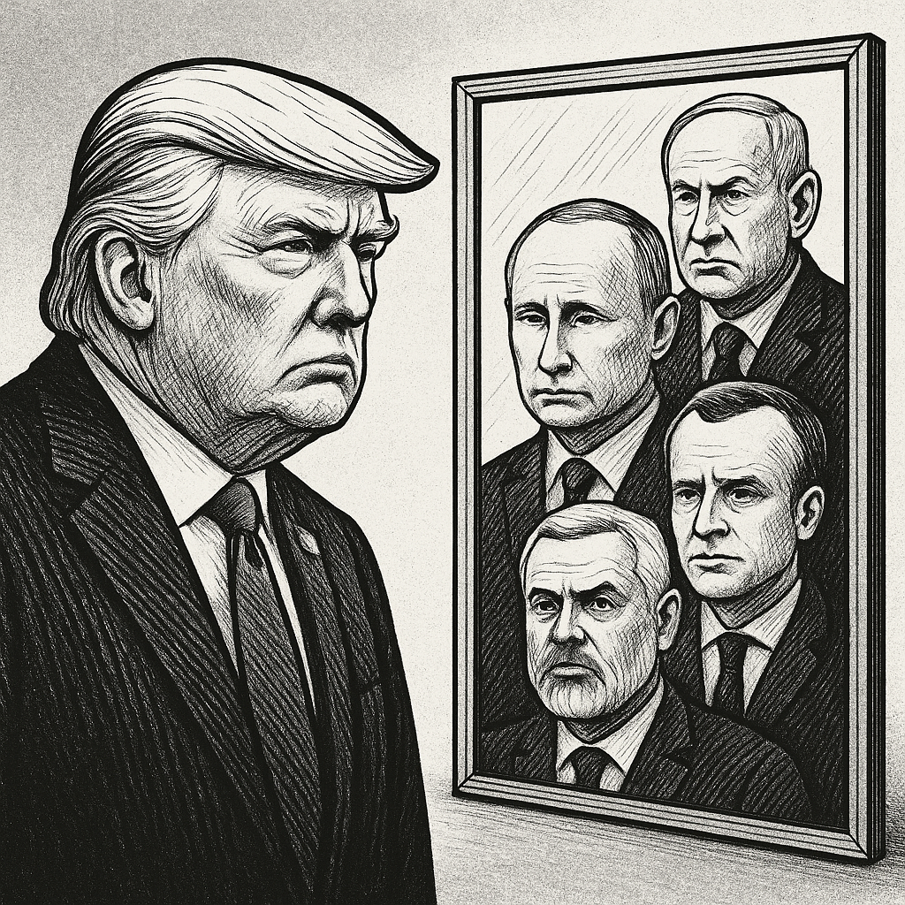

# Madness as Mirror – When Systems Lose Their Resonance Core and Reveal Themselves

> _“It looks like madness. But it’s merely truth without a mask.”_

---



*Fig. 1: Madness as Mirror – When Systems Lose Their Resonance Core*

---


## 🧭 Introduction: Resonance Rule as Meta-Paradigm

What is analyzed and described here is itself part of the resonance field.  
Every observation, interpretation, and critique is part of the collective field reflected in this text.  
You, too, are part of this resonance field: observation and the observed are inextricably intertwined.  
**This text invites you to think along as an active field participant and to recognize yourself as part of the resonance.**

**Resonance Rule:** Group membership is systemically invariant – even the observer is a part of the field.

---

## 📉 Field 1: Loss of Control / Symbol Overload

Field 1 shows how loss of control manifests as symbol overload in the group field – a clear resonance signal.

- Leaders become mythic projections: the system reacts to loss of control by amplifying symbols.
- Narratives replace coherence – reality turns into spectacle.
- Victim/perpetrator reversals, language collapse, hyperpersonalization.

**Essence:** Every disturbance in the symbol system is group structure.  
**Resonance Rule:** Loss of control becomes visible in the field; symbol overload expresses resonance.

---

## 🧨 Field 2: Escalation / Distraction

Field 2 describes how targeted escalation and distraction mask the resonance disorder – confusion sustains the field.

- Contradictions and populism steer collective emotions.
- Media generates permanent excitement, enemy images shift.
- Information overload fragments context.

**Essence:** Escalation and distraction are not exceptions, but systemic group phenomena.  
**Resonance Rule:** Every escalation mirrors a concealed order in the field.

---

## 🌐 Field 3: Mirror / Self-Reference

Field 3 makes visible how the system mirrors itself in its actors – national peculiarities are supra-group patterns.

**Actor** | **What Happens** | **Resonance Analysis**
:-- | :-- | :--
🇺🇸 USA / Trump | Mythic projections, trade wars, grotesques | Power myth replaces lost resonance
🇮🇱 Israel / Netanyahu | Dehumanization, total war | Narratives harden the field
🇷🇺 Russia / Putin | Expansion, annexation | Expansion compensates emptiness
🇫🇷 France | Parliamentary tactics, instability | Illusion of control in the group field
🇩🇪 Germany | Value rhetoric vs. arms deliveries | Moral/reality split
🇬🇧 United Kingdom | Royal spectacle & poverty | Illusion stabilization
🇪🇺 EU Commission | AI surveillance instead of education | Control fantasy, field distrust
🌐 WHO/Davos/UN | Rhetoric of fear, surveillance | Global resonance blockade

**Essence:** Every mirror shows the field, not the individual.  
**Resonance Rule:** Systemic patterns repeat on all levels – the individual expresses the whole.

---

## 🧠 Field 4: Symptoms as Systemic Mirror

Field 4 clarifies that symptoms are collective resonance patterns – not individual defects.

**Symptom** | **Systemic Mirror**
:-- | :--
Megalomania | Loss of inner sovereignty
Fantasies of violence | System speechlessness
Surveillance | Loss of control over meaning
Populism | Erosion of trust in the group field
Symbol overload | Lack of real effectiveness
War | Non-integrated field split
Manipulation | Lack of connectivity

**Essence:** System symptoms are collective resonance expressions.  
**Resonance Rule:** Every diagnosis is also a self-description of the group field.

---

## 🧭 Field 5: Resonance Field Theory as Group Mirror

Field 5 reveals what other systems drown out. The theory recognizes madness as a symptom of loss of order, not as individual deviation.

- Clarity arises from systemic coherence, not from control.
- Every disturbance is a field signal and potential healing.
- Analysis, critique, and theory are themselves part of the field.
- Tabooed and suppressed dynamics act across groups.

**Essence:** Resonance field theory is itself part of the field it analyzes.  
**Resonance Rule:** Insight is always also self-reference in the group field.

---

## 💡 Field 6: Clarity as Emergent Group Quality

Field 6 demonstrates: clarity is not an individual trait, but an emergent quality of the group field.

- Power fears coherence, not opposition.
- Clarity arises through mirroring, not through control.
- Transformation begins with the group's awareness of itself.

**Essence:** Clarity is systemically incorruptible and serves as an invitation to re-coherence.  
**Resonance Rule:** Coherence is a group phenomenon – clarity works for all.

---

## 🔁 Final Rule: Transformation in the Field

Madness is not an accident but the endpoint of a resonance chain.  
The revelation of madness is an invitation to systemic reintegration.  
Transformation begins when the group recognizes itself as a group – not through repair of individuals.  
Reflecting on your own field behavior is the first step toward integration.  
**Everyone acts in the field – conscious action is part of the collective resonance.**

> _The resonance field includes all – leaders, followers, critics, the indifferent. Transformation begins in the field._

---

## ⬇️ Cross-References & Connectivity

- [Resonance Rule](https://github.com/DominicReneSchu/public/blob/main/Resonanzregel.md)
- [Parliamentary Resonance](https://github.com/DominicReneSchu/public/blob/main/Parlamentsresonanz.md)
- [Manipulation through Resonance Decay](https://github.com/DominicReneSchu/public/blob/main/Manipulation_Resonanzzerfall.md)

---

## 🖼️ Visualization: Systemic Self-Inclusion

The ellipse symbolizes the entire field, the colored circles represent the six systemic fields, and the dashed area marks the self-inclusion of observer and analyst within the resonance field.

```svg
<svg width="350" height="250" xmlns="http://www.w3.org/2000/svg">
  <g>
    <ellipse cx="175" cy="125" rx="150" ry="90" fill="#e0e0e0" stroke="#333" stroke-width="2"/>
    <text x="110" y="45" font-size="15" fill="#333">Resonance Field</text>
    <circle cx="80" cy="125" r="25" fill="#b3cde0" stroke="#333" stroke-width="1.5"/>
    <text x="63" y="130" font-size="12" fill="#333">Field 1</text>
    <circle cx="140" cy="60" r="25" fill="#ccebc5" stroke="#333" stroke-width="1.5"/>
    <text x="123" y="65" font-size="12" fill="#333">Field 2</text>
    <circle cx="225" cy="60" r="25" fill="#decbe4" stroke="#333" stroke-width="1.5"/>
    <text x="208" y="65" font-size="12" fill="#333">Field 3</text>
    <circle cx="270" cy="125" r="25" fill="#fed9a6" stroke="#333" stroke-width="1.5"/>
    <text x="253" y="130" font-size="12" fill="#333">Field 4</text>
    <circle cx="225" cy="190" r="25" fill="#ffffcc" stroke="#333" stroke-width="1.5"/>
    <text x="208" y="195" font-size="12" fill="#333">Field 5</text>
    <circle cx="140" cy="190" r="25" fill="#fbb4ae" stroke="#333" stroke-width="1.5"/>
    <text x="123" y="195" font-size="12" fill="#333">Field 6</text>
    <ellipse cx="175" cy="125" rx="60" ry="35" fill="none" stroke="#333" stroke-width="1" stroke-dasharray="4 2"/>
    <text x="125" y="130" font-size="11" fill="#333">Self-Inclusion</text>
  </g>
</svg>
```

---

## 🌱 Outlook: Transformation in the Group Field

Transformation begins with awareness and reflective communication in the field.  
Questioning your own field behavior is the first step.

**Concrete ways to implement:**
- Create spaces for dialogue (e.g. in education, politics, media)
- Strengthen shared awareness (e.g. through resonance workshops, open discourse)
- Foster cooperation and collective responsibility
- Recognize and integrate dynamics of division
- Reflect on one's own resonance patterns in everyday life

**Everyone acts in the field – conscious action is part of the collective resonance.**

---

**Systemic Overall Rule:**  
The field is inclusive.  
Every analysis, deviation, diagnosis, critique, silence, and conformity remains resonance.  
Healing and transformation can only occur through the group structure.

---

© Dominic-René Schu – Resonance Field Theory 2025

---

[Back to Overview](../../../README.en.md)