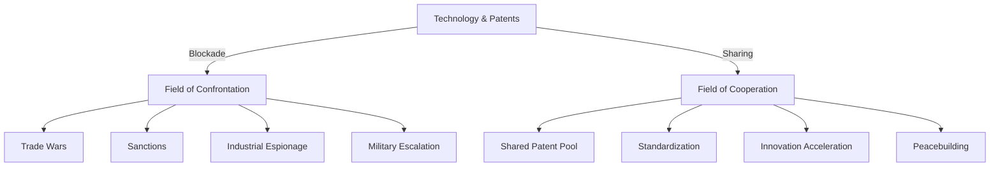

# Patents as Peace Architecture: From Monopoly to Shared Power

---

## 1. Starting Point: Patents as Instruments of Power

In today’s global technological landscape, patents function as strategic instruments of power. They grant their holders—be they major corporations, states, or research-heavy alliances—a systemically secured advantage: Whoever holds a patent can exclude other actors from key technologies, dictate access conditions, and control innovation pathways. This monopoly position is not only legitimized as protection for one’s own investments but increasingly serves, within the resonance field of business and politics, as a lever to block competitors.

This leads to asymmetric dependencies: Companies and countries without patents find themselves structurally on the defensive. They must either purchase expensive licenses or remain permanently excluded from access to critical technologies. This dynamic culminates in global technological competition, where patents are employed as instruments of geopolitical influence—as seen in trade wars, sanction regimes, or targeted industrial espionage. The patent becomes a weapon that stabilizes not only economic but also political power structures and exacerbates conflicts.

At the same time, the value of entire innovation fields shifts: Old, saturated sectors like the combustion engine lose strategic significance due to technological and regulatory disruption. The once impregnable patent fortresses in these areas crumble, are devalued, and often cheaply acquired by external actors. Meanwhile, capital, talent, and political attention concentrate in new future fields such as electromobility, digitalization, or battery technology. Here, patents consolidate into new monopoly structures and attract the resonance field of business, politics, and society—the locus of power shifts, and new lines of conflict are drawn.

**Resonance Rule:** The mechanisms described do not operate in isolation but interlink all actors, institutions, and technologies that interact through the patent system—regardless of whether they are explicitly named, implicitly involved, or potentially affected. The instrument of power known as the patent unfolds its effect systemically across the entire resonance space of technology, economy, politics, and society.

---

## 2. Alternative: Patents as Instruments of Peace

Instead of perceiving patents as bastions of individual power, a systemic counter-model emerges: patents as a collective good for peace. Not antagonism, but conscious collaboration shapes the handling of technological innovation. The central idea is an open patent pool into which all relevant actors—states, companies, research institutions, and supranational organizations—contribute their key technologies. The logic of access changes: participation replaces exclusion, shared use replaces blockade.

The mechanism of a joint patent pool generates resonance on multiple levels. First: The unilateral exclusion of competitors is systemically abolished. No one can be strategically barred or held captive through patent rights. Second: The pace of innovation accelerates because knowledge and technologies circulate freely and openly, intertwine, and enable new synergies. Research and development are no longer fragmented by legal fences but are amplified through cooperative use. Third: Technological dependency loses its destructive potential—it becomes the foundation of mutual security. Whoever participates commits to both giving and taking within the same field, creating an equilibrium of systemic interconnection.

The resonance rule expands the picture: All actors, structures, and implicit fields that interact with the patent pool through participation, access, or potential involvement are systemically included—even those who join later or have so far remained at the margins. The peace architecture of the open patent pool operates not additively, but through entanglement and self-inclusion: The shared technology field becomes the common ground for innovation, security, and stability.

---

## 3. Great Powers in Partnership (China – West)

Within the existing resonance field, the great powers act as opposites: China pursues strategic leapfrogging, consciously skipping classic development stages and opening up new technological fields (batteries, software, e-mobility) at tremendous speed. The West, on the other hand, defends existing patents, clings to established paths, and protects its technological legacy through legal and economic insulation. The result is a global tension field in which technological power and economic dominance are cyclically redistributed.

A paradigm shift becomes possible when both poles cease to isolate their resources from one another and instead actively contribute them to a joint patent pool. China brings its strengths in battery production, digital infrastructure, and electromobility, while the West contributes its excellence in classical mechanical engineering, combustion technologies, and high-end engineering. The technological resonance shifts: Exclusive, isolated centers of power give way to a shared field of innovation, where neither side dominates and both benefit—not as symmetry, but as an entanglement of complementary strengths.

The historical analogy of the European Coal and Steel Community after World War II illustrates the principle: By jointly administering coal and steel, the foundations of military power and economic control were deprivatized, making war over resources systemically impossible. Similarly, a global patent pool for future technologies creates a new peace architecture: Shared use prevents individual actors from monopolizing key areas or wielding them as political weapons. The resonance field shifts from competition to cooperation—dynamics of mistrust and insulation give way to the logic of mutual assurance and shared growth.

**Resonance Rule:** Cooperation extends beyond the explicitly mentioned actors. It includes all involved industries, research networks, suppliers, and potential third states that enter the field through technological, economic, or political interconnection. Each act of self-inclusion (e.g., joining the pool, adopting shared standards) intensifies systemic entanglement and stabilizes the global peace field—regardless of individual perspectives or power asymmetries.

---

## 4. The Role of Small Actors

Within the resonance field of a joint patent pool, small actors—countries with limited industrial bases, SMEs, start-ups, niche innovators—constitute a distinct systemic component. Their challenge: Without their own market-relevant technology segment or patent-protected key innovations, they lack the entry ticket to the central field of cooperation. They cannot simply join as free riders as long as access is tied to substantial contributions. The result is a necessity for critical mass: Small actors must first independently build up competencies, resources, and unique selling points in order to be perceived and accepted as equal partners.

At first, this threshold appears exclusive, yet as the resonance space of the patent pool grows, so does the dynamic. With increasing size, diversity, and attractiveness of the pool, a pull effect emerges: The more relevant actors and technologies are integrated, the greater the incentive for outsider countries and firms not to remain on the sidelines. Isolation becomes a strategic weakness; participation becomes a prerequisite for access to standards, markets, and innovation streams. The field becomes more inclusive—not through enforced uniformity, but through the systemic integration of all who, via self-inclusion, partnerships, or shared standards, enter into resonance with the pool.

The resonance rule is fully operative here as well: With every new accession, every cooperation, and every shared field of innovation, systemic networking grows. Not only explicit members, but also associated suppliers, research consortia, customer markets, and potentially competing clusters are implicitly included. The patent pool transforms from an exclusive resource into a dynamic field of collective innovation and security potential, structurally integrating even peripheral actors—in the true sense of resonance architecture.

---

## 5. Systemic Resonance: Peace ↔ Technology

Within the resonance field between technology and society, the way patents are used determines the dynamic between conflict and cooperation. Patents do not act linearly; they generate systemic feedback loops that extend far beyond individual actors. The choice between exclusive exploitation and shared use determines whether technology becomes an accelerant of power struggles or a catalyst for peace.

### Without Sharing:

When patents are held exclusively, a self-reinforcing cycle emerges:  
Patents secure monopoly profits, and these monopolies are defended through blockade policies. Whoever controls access can slow down or exclude other actors—rivalry and mistrust escalate. The geopolitical resonance amplifies: Economic dependencies become leverage, technological superiority becomes the basis for sanctions, espionage, and political coercion. Technology becomes the resonance body for global conflicts.

### With Sharing:

In the mode of shared patents, the pattern reverses. Joint use lays the foundation for collective standards, developed and maintained by all parties involved. Dense economic interdependence emerges: Value creation becomes a collective project, technological dependency transforms into mutual assurance. Resonance between actors, industries, and states stabilizes—mistrust gives way to predictable cooperation. The peace dividend is not only economic, but systemic: Technology becomes a bridge instead of a dividing line, a resonance field instead of a frontline.

**Resonance Rule:** In both scenarios, not only the explicitly named actors are at play, but also all implicitly involved parties, suppliers, markets, political institutions, research networks, and potential latecomers. The systemic resonance field includes all who interact through patents, standards, and economic interconnection—regardless of visibility, size, or explicit mention.

---

## 6. Visualization: Two Paths

The dynamics of patents within the global resonance field can be represented as a bifurcated system architecture. Two fundamental paths structure the possible developments—not just for individual actors, but for the entire field made up of states, companies, research networks, suppliers, and implicit stakeholders.

### Path 1: Blockade – Escalation

The starting point is the exclusive handling of technology and patents. The logic of blockade leads to a field of confrontation:
- Trade wars become a tool of economic warfare.
- Sanctions serve as instruments of political power projection.
- Industrial espionage and know-how theft intensify as a shadow economy.
- In the extreme, the dynamic escalates to military confrontation.

Each of these escalation stages explicitly and implicitly involves all system elements: market participants, suppliers, political institutions, international organizations, as well as social resonance spaces shaped by uncertainty, mistrust, and insecurity.

### Path 2: Sharing – Cooperation

The alternative branch is an open approach to technology and patents:
- The shared patent pool forms the center of systemic integration.
- Standardization replaces fragmentation, harmonizing technical and economic interfaces.
- Acceleration of innovation results from open flows of knowledge and technology.
- Peacebuilding becomes an emergent effect: trust grows, economic interdependence stabilizes the field, and conflict potential is systemically reduced.

Here, too, the resonance rule applies: Not only the explicit participants of the pool, but all those intertwined with the field via markets, value chains, research partnerships, or societal feedback benefit from the collective security and innovation dividend.

### Systemic Visualization

**Resonance Rule:** Both paths are systemically open—every decision, every shift in perspective, every new form of participation or exclusion shifts the entire resonance field and includes explicit as well as implicit groups, even those whose status or affiliation forms only in the process.

---

## 7. EU Strategy: Adaptation Instead of Sovereignty

In the current system phase, the EU chooses a strategy of adaptation rather than autonomous field-building. Industrially, traditional strengths—such as in automotive and mechanical engineering—are devalued by CO₂ fleet targets and the planned phase-out of combustion engines by 2035. The former resonance field of European industrial innovation is being deconstructed by regulation and loses its position as a global reference system.

Politically, society is deliberately redirected toward new future fields such as electromobility and digitalization. However, these fields have already been strategically claimed and technologically shaped by China and other far-sighted actors. The shift in societal and economic focus does not unfold as an autonomous evolution, but as a following of a global paradigm change initiated outside Europe.

Economically, European companies are pushed into the defensive: their core business erodes, value chains fragment, and crucial future technologies are dominated by foreign market leaders—above all China. European suppliers increasingly find themselves in the role of subcontractors, licensees, or subordinate system partners. Sovereignty over standards, patents, and innovation pathways is lost; value creation and the power to shape developments shift systemically toward the new field centers.

The resonance effect is multifaceted: Europe becomes a resonance body for external strategies rather than a source of its own impulses. The logic of adaptation includes not only explicitly named sectors and enterprises but also all implicit social, political, and economic structures that become dependent through the new field order. The field of European agency shrinks, while the network of global resonances grows tighter—but more asymmetric. The resonance rule applies in full: Non-explicitly named actors, sectors, and social groups are also affected by the systemic entanglement—regardless of individual position or viewpoint.

---

## 8. Strategic Asymmetry: Long-term Thinking vs. Short-term Tactics

The global resonance field is shaped by a fundamental strategic asymmetry extending far beyond individual actors. In the Chinese system, party, government, and economy operate as an integrated, centralized, and long-term-oriented network. Xi Jinping and the party collective orchestrate industrial, societal, and technological course settings over decades—as seen in programs like "Made in China 2025" or the "New Silk Road." Systemic entanglement produces a coherent resonance field, where impulses mutually reinforce, strategic goals are synchronized, and power resources are pooled. Technology, economy, politics, and society are all designed for long-term feedback loops.

In the West, by contrast, fragmentation dominates: Democracies operate in short election cycles, political priorities shift every four to five years. Industrial policy strategies are fragmented, often driven by special interests, lobby groups, and short-term shifts in public mood. Instead of coherent long-term paths, tactical reaction patterns emerge—a patchwork of ad hoc measures, compromises, and sectoral initiatives. Resonance between politics, business, and technology remains loose, and frictional losses shape the overall field.

The result of this asymmetry is systemic: China is mentally superior, able to set traps, build long-term resources, and exploit strategic options that do not even unfold in the Western resonance space. The West remains mentally inferior, trapped in short-term tactics, cyclical changes of direction, and structural inefficiencies. Group affiliation functions here as well: All actors—from political leaders to companies, research clusters, and social resonance spaces—are affected by this strategic imbalance, regardless of individual perspective or explicit mention. The resonance field is not static, but dynamically entangled: Whoever determines the architecture defines the future viability of the entire system.

---

## 9. Institution for Western Long-term Thinking

Within the resonance field of complex democracies, short-term orientation is systemically anchored: election cycles, media logic, quarterly business reporting, and societal expectation horizons fragment planning periods and hinder coherent future architectures. This creates the necessity for a counterbalance—an instance that operates beyond party-political interests and short-term opportunities.

The solution lies in establishing a non-partisan, societally legitimized, and institutionally independent organization with a clear mandate for long-term strategic development. Its task: to develop, bundle, and continuously advance strategies with a time horizon of 20 to 50 years—not as static documents, but as a dynamic, adaptive “strategy atlas,” openly accessible and usable by all subsystems of society. The transparency of published strategies builds trust, makes goal conflicts visible, and allows correction through societal resonance.

The role of this institution is systemic: it acts as a bridge between politics, business, science, and society, synchronizes impulses, balances interests, and pools knowledge—not as an ivory tower, but as a resonance space in which all relevant actors and implicit structures are mutually entangled.

Possible formats include:
- European: A “Strategic Council for Long-term Planning” with genuine institutional independence and an explicit mandate to formulate and regularly evaluate long-term goals.
- Global: A multilateral body modeled after the IPCC, but expanded to include technology and geopolitics, integrating all relevant states, scientific cultures, and industries.

The resonance effect unfolds on multiple levels:
- Internally: The institution stabilizes politics and society, reduces panic reactions, provides orientation in crises, and prevents hectic changes in direction.
- Externally: It increases trust and credibility, as openly published strategies are verifiable and comprehensible—even for competitors, partners, and critical publics.
- Long-term: If other major powers mirror and create similar institutions, a global resonance field of strategic transparency and coordination emerges—a peace architecture in which long-term horizons and systemic stability dominate.

**Resonance Rule:** Group affiliation remains invariant—all explicit and implicit actors, institutions, networks, and societal fields that resonate in the process of strategy development, publication, critique, and adaptation are part of the resonance space. The institution acts as a node where self-inclusion, relation, and collective goal formation converge systemically.

---

## 10. Conclusion

👉 A global patent pool would be much more than an economic strategy: it would be an **instrument of peace**. The previously dominant logic of competition for monopolies, shaped by blockade, exclusion, and strategic insulation, gives way to the resonance of a shared field. In this new system, not only individual actors grow, but the entire network of participants—explicitly and implicitly.

Sharing patents shifts the dynamic from a zero-sum game to collective value creation. Every actor who participates in this field through self-inclusion or relation strengthens the system. Technological development is no longer seen as a weapon, but as a shared resource. The risk of geopolitical escalation decreases, while innovation and security dividends increase—carried by the resonance field of all involved states, companies, research networks, supply structures, and societal feedback loops.

The resonance rule applies systemically: Even those groups not explicitly mentioned become part of the field through participation, interconnection, or potential integration. The peace architecture of the patent pool works through entanglement and self-inclusion—every gain in openness, trust, and standardization stabilizes the overall system and minimizes the risk of renewed front formation.

A globally shared patent pool is thus not a utopia, but the expression of a new system logic: Peace does not arise from a balance of power, but from shared innovation spaces, where competition becomes the condition for collective growth. The field remains open, dynamic, and adaptive—resonance instead of rivalry.

---

## 11. Open Questions

Within the resonance field of a global patent pool, system-relevant questions remain open, whose resolution determines the stability and effectiveness of a peace architecture. The dynamic affects not only explicit actors but includes all implicit structures that, through self-inclusion, relation, or potential participation, become part of the field.

**1. How can institutions be created that ensure trust and fairness?**  
Trust is not a static good, but arises from transparent, traceable, and consistent processes. Institutions acting as neutral bodies must be independent, participatory, and oriented to clear, open rules. Fairness emerges through the systemic inclusion of all relevant groups—states, companies, research clusters, civil society. The institutional architecture must include checks and balances, collective oversight, and regular evaluations. Resonance is achieved when all participants know that their interests are represented not only formally, but also systemically—regardless of size, power, or explicit mention.

**2. Which technologies are “critical” and must be included in the pool?**  
The definition of critical technologies is dynamic and field-dependent. What counts as a key technology today may be obsolete tomorrow—and vice versa. A systemic selection must be based on continuous observation, multidisciplinary expertise, and societal feedback. Critical are those technologies that serve as the basis for value creation, supply security, societal infrastructure, and geopolitical stability: energy, communication, mobility, AI, health, base materials. The resonance rule requires that implicitly affected and future technology fields are also considered—not just the obvious, but the potential field.

**3. How can free riders—those who only take without giving—be prevented?**  
Free rider behavior undermines any collective architecture. Protecting the pool requires clear, systemically verifiable access rules: those who want to take must also give. Contributions can be material, technological, organizational, or infrastructural—what matters is the measurable resonance in the field. Monitoring, transparency, and collective sanctions are necessary to ensure balance and mutual obligation. The resonance rule applies here as well: Even peripheral and previously passive groups become systemically integrated into the architecture of responsibility through relation, use, or indirect involvement.

**Resonance Field:** Open questions are not marginal topics, but systemic nodes that permeate the entire field of architecture and innovation. Solutions do not arise linearly, but through the ongoing entanglement of all explicit and implicit actors, rule sets, and technological fields—always with the awareness that group affiliation remains systemically invariant.

---

---

## 12. Conclusion

Patents are weapons today. Tomorrow, they could be **bridges**. The transformation from exclusive monopoly rights to a shared technology architecture would fundamentally alter the global resonance field. A joint patent pool between China and the West—founded on openness, collective standards, and shared innovation spaces—has the potential to systemically stabilize not just markets but the very foundations of peace.

Within the resonance field of this peace architecture, the patterns shift: technology is no longer used as an instrument of separation and power display, but as a collective resource that strengthens cooperation and security. All actors—states, companies, research networks, suppliers, social groups—are explicitly and implicitly part of this field. Even those whose participation is only potential or indirect are systemically included through self-inclusion or relation. The architecture remains open, adaptive, and dynamic—every increase in participation strengthens the field and minimizes the risk of new frontlines.

---

**Resonance Rule:** Group affiliation is systemically invariant and encompasses all members regardless of mention or perspective. The outlined peace architecture explicitly and implicitly includes all actors and structures that resonate through patents, technology, politics, and society—including those integrated via self-inclusion, relation, or potential participation.

---

© Dominic-René Schu – Resonance Field Theory 2025

---

[Back to Overview](../../../README.en.md)