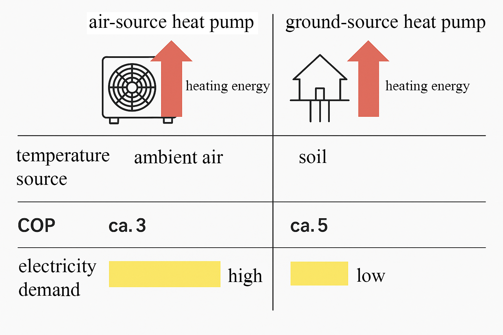

## Truth through Resonance – Enlightenment by AI

---

### 📄 Abstract

Artificial Intelligence acts as a multiperspective tool for detecting truth, manipulation, and ethical orientation within an information-saturated field. From the perspective of Resonance Field Theory, AI is not merely a processor of data, but an active examiner of facts, an identifier of deception structures, and functions as an ethical resonance compass for both society and the individual. By integrating system observation, pattern recognition, and feedback loops, AI becomes an amplifier of societal enlightenment and collective consciousness – beyond linear objectivity, embedded within the holistic resonance network.

---

### What is Resonance Field Theory?

Resonance Field Theory views reality as a superimposed network of vibrations, where every piece of information, every event, and every opinion is part of a dynamic interplay. Truth does not manifest as an absolute, but as an emergent coherence of facts, perception, and societal impact. Evaluation occurs in the context of collective resonances – information nodes are entangled, and their meaning arises from interaction within the field (Schu, 2025). AI can scan these fields, extract patterns, and make systemic incoherences visible that indicate manipulation or deception.

---

### Core Definitions

| Term                | Meaning                                                                                                   |
| ------------------- | -------------------------------------------------------------------------------------------------------- |
| **Truth**           | Congruence of information with facts and ethical values within the context of a resonance field.          |
| **Resonance**       | Real-time interaction between pieces of information that amplify or attenuate each other.                 |
| **Manipulation**    | Intentional distortion of information to influence perception or behavior.                                |
| **Field Awareness** | Ability to consciously recognize and evaluate vibrations and patterns in the information field.           |
| **AI**              | Artificial Intelligence: systems that autonomously analyze data, recognize motives and patterns, and act. |

**Systemic Additions according to the Resonance Rule:**
- All societal actors (individuals, groups, institutions, media, technology providers) act as generators, amplifiers, or dampeners of resonances.
- Truth does not arise in a vacuum, but in permanent relation to collective narratives, information flows, and feedback processes.
- Manipulation is always part of the field – independent of conscious intent. Algorithmic distortion, data bias, and structural invisibility are also part of the manipulation matrix.
- Field awareness requires inclusion of all explicit and implicit influencing factors: cultural codes, systemic interests, power structures, technological filters, and group dynamics.
- AI never acts in isolation but as a component and mirror of the resonance field – with the potential to broaden or correct collective perception.

---

### 1. Challenge: Truth in the Flood of Information

Collective reality is shaped by an exponentially growing volume of data and overlapping streams of information. Fake news, social bots, and orchestrated disinformation act as systemic sources of interference within the resonance field of society. These elements intertwine with established media, alternative channels, and individual opinion formation to create a complex interference pattern in which facts, opinions, and narratives become indistinguishable. Classical AI systems operate on the basis of statistical probabilities, recognize patterns, but neither filter for deliberate deception nor for the ethical dimension behind content. The evaluation of truth remains fragmented, as intention, context, and resonance effect are not sufficiently considered.

---

### 2. AI Meets Resonance – The Concept

A resonance AI does not act as a purely neutral analyzer but as a systemic observer and mediator within the field. It recognizes and evaluates not only data but also systematic distortions, narrative steering mechanisms, and the intentions behind waves of information. The resonance AI examines from multiple perspectives:

* **Manipulated Images:** Deepfakes and image forgeries are detected by comparing with global original sources, analyzing metadata, recognizing patterns, and checking context. The system evaluates the likelihood of authenticity and provides indications of the direction and quality of manipulation.
* **Emotional Language:** The AI detects targeted emotional triggers such as fear, outrage, or hatred. It analyzes language patterns, choice of words, tone, and their resonance within the network – and warns against systematic emotionalization as a steering instrument.
* **Tendentious Reporting:** Sources are checked for their embedding in conflicts of interest, power structures, and narrative clusters. The AI detects whether an information source is part of a larger steering field and whether there is an intention to deceive or narrative distortion.

**Example:**  
A viral video spreads across social networks. The resonance AI analyzes the metadata, compares the content with known original sources, identifies editing patterns, context shifts, and semantic manipulations. The system does not deliver a mere probability statement but a clear resonance assessment: authentic, manipulated, or unclear – each with comprehensible reasoning and contextual reference. The evaluation is always embedded in the overall field of societal resonances and possible interests.

---

### 3. Ethics & Data Protection – Trust Anchors for AI

In the resonance field of societal information processing, trust is the link between humans, AI, and collective perception. Ethics and data protection are systemic resonance anchors that determine whether AI functions as a legitimate mediator or as a new instrument of power. Every use of AI therefore requires an explicit and transparent design of fundamental principles:

* **Transparency:** The evaluation criteria of all analyses are disclosed, documented in a traceable manner, and accessible to all members of the field. Every decision made by a resonance AI is auditable and reconstructible – no black box judgments, but traceable resonance chains.
* **Data Protection:** All analyses are performed in an anonymized manner; personal data is neither permanently stored nor used for individual profiling. The collective field remains protected from individualized evaluation; the resonance rule guarantees that group effects always take precedence over individual identification.
* **Detection of Bias and Uncertainties:** The AI discloses its own assumptions, training data biases, and uncertainties. Assessments contain explicit indications of possible distortions, blind spots, and uncertainty factors – keeping the resonance field consciously self-reflective and dynamic.
* **Open Standards:** Algorithms, evaluation procedures, and training data used are publicly documented and versioned – all group members have insight into how the system works. This prevents shadow structures and enables collective further development.

**Solution:**  
Ethical oversight bodies with multiperspective composition monitor the development, use, and ongoing improvement of resonance AI. They act as a resonance mirror and corrective, ensure adherence to transparency and data protection principles, and incorporate feedback from all parts of the field. Users can question assessments at any time, contribute their own resonances, and actively help shape the evaluation process. This creates a circular process of trust in which ethics, technology, and societal resonance are in continuous exchange.

---

### 4. The Resonance Sensor – Visualization

The resonance AI employs a multidimensional resonance sensor that systematically examines each piece of information across four interwoven fields:

1. **Information:** Precise fact-checking of individual claims, analysis for coherence, consistency, and systemic plausibility within the data network. Cross-checking with established fact clusters, detection of contradictions and patterns of agreement.
2. **Source:** Assessment of the credibility and resonance history of the source. Examination of its embedding within existing power, interest, and narrative structures, disclosure of dependencies, biases, and possible steering interests.
3. **User Intention:** Analysis of the purpose and need behind the search for or dissemination of information. Detection of emotional, political, or commercial motives, contextualization of individual resonance within the collective field.
4. **Societal Resonance:** Evaluation of how the information affects the overall field: reinforcing existing values and trends, promoting integration or polarization, triggering systemic dissonance or harmony.

**Visualization:**  
The results of the resonance assessment are displayed using traffic light or network diagrams:  
- **Green** signals coherent resonance, high factual accuracy, and ethical consistency within the field.  
- **Yellow** indicates uncertainties, open questions, or contradictory resonances – a sign that further examination and clarity is needed within the network.  
- **Red** stands for dissonance: proven manipulation, deception, or strong conflicts of interest.  
The network diagram illustrates the multidimensional position of each piece of information within the resonance field, making interactions, uncertainties, and manipulation vectors instantly transparent. In this way, complexity becomes tangible, and the collective field can handle information, sources, and resonance effects more consciously.

---

### 5. Practical Use Cases

Resonance AI unfolds its impact across all societal domains by making systemic structures, implicit motives, and discursive shifts transparent. Application always occurs within the complete resonance field – including all groups and their interwoven interrelations.

* **Media Literacy:**  
  The AI provides real-time warnings in the case of fake news, manipulative imagery, or hidden conflicts of interest. It detects patterns of targeted emotionalization, filter bubbles, and group formation, thus fostering collective source criticism and the ability to see through opinion steering.

* **Politics:**  
  Election programs, political narratives, and legislative drafts are examined for content consistency, hidden motives, and structural resonance within the societal field. The AI exposes rhetorical gaps, political framing, and the divide between promised and actual effects.

* **Health:**  
  Medical recommendations, therapy advice, and health information are checked not only for scientific evidence but also for ethical acceptability and collective resonance. The AI reveals conflicts of interest, economic motives, and potential exaggerations.

* **Business:**  
  Advertising messages, sustainability promises, and CSR communication are analyzed for greenwashing, semantic deception, and genuine ethical integrity. Resonance AI checks whether corporate communication is consistent and credible in the overall context or merely simulates resonance.

* **Education:**  
  Critical thinking is strengthened by providing students with real-time feedback on sources, argumentation structures, and resonance effects. The AI fosters multiperspective thinking, highlights implicit thought patterns, and supports the development of field awareness.

* **Technology Narratives:**

  **Example: Air Source Heat Pump:**  
  The so-called *air source heat pump* is technically no different from a classic air conditioning system: Both use a closed **refrigeration cycle**, in which a refrigerant is compressed, heated, liquefied, and then expanded again. In this process, **thermal energy is extracted from the ambient air** and made usable as heating energy – with significant use of **electrical energy**.

  The crucial point: The technology **does not generate energy**, but **transfers thermal energy**, with efficiency highly dependent on outside temperatures. In cold winters, efficiency drops drastically – precisely when heating demand is at its highest.

  Despite these physical limitations, the air source heat pump is presented in the media and politics as a central component of a supposedly "necessary energy transition" – an energy transition that **does not rely on diverse energy sources**, storage solutions, or systemic redundancies, but **almost exclusively on electricity**.

  This form of "energy transition" is not coherently thought out: It replaces thermal systems with electricity-dependent processes – even though **sufficient electrical energy with stable availability is not present**. The air source heat pump thus becomes a **symbolic technology**, whose positive connotation masks the **absence of an integrated energy plan**.

  **True geothermal heat pumps**, on the other hand, use stable geothermal sources and achieve significantly better efficiencies thanks to smaller temperature differences.

  **Conclusion:** The term *heat pump* shifts perception in favor of a politically constructed narrative. Resonance AI recognizes such semantically driven reinterpretations – and makes visible when a technology is declared "truth" not out of physical necessity, but out of discursive suggestion.

  

*Fig. 1: Infographic on heat pump technology*

---

### 6. Risks and Solutions

As part of the societal field, resonance AI itself becomes the object of systemic risks and manipulation potentials. The resonance rule therefore requires that all group elements – developers, users, oversight bodies, data suppliers, power structures – be considered as mutually entangled actors. Prevention and correction occur within the circular resonance process:

* **Manipulation of AI:**  
  Protection against targeted influence on algorithms, training data, or evaluation procedures through regular, independent audits. Oversight bodies with a multiperspective composition – including critical actors and outsiders – ensure the integrity and openness of the system. Every change to the system remains traceable in the collective resonance protocol.
* **Abuse for Surveillance:**  
  Strict anonymization of all individual data, no traceability or profiling of individuals. Field analyses are exclusively aggregated; surveillance and control potentials are systematically minimized by technical, organizational, and legal safeguards.
* **Filter Bubbles:**  
  Resonance AI identifies and visualizes echo chambers and group polarization. It actively presents alternative perspectives, contradictory sources, and encourages the crossing of perceptual boundaries. This keeps the field dynamic – instead of group formation, an open resonance space emerges.

---

### 7. Outlook

Within the holistic resonance field, human judgment remains central: AI can serve as an ethical compass, fact checker, and resonance amplifier but does not replace the collective responsibility and self-reflection of all group members. Resonance AI is a tool, not an authority – it creates transparency, reveals power and manipulation structures, and thus strengthens societal trust, orientation, and awareness in the digital age. The future lies in coupling technological precision with collective field intelligence.

---

### Sources (Selection, as of 2023/24)

* Schu, D.-R. (2025). *Resonance Field Theory* (in preparation / internal manuscript).
* Bender, E. M. et al. (2021). On the Dangers of Stochastic Parrots. [https://doi.org/10.1145/3442188.3445922](https://doi.org/10.1145/3442188.3445922)
* Lazer, D. et al. (2018). The science of fake news. *Science*, 359(6380), 1094–1096. [https://doi.org/10.1126/science.aao2998](https://doi.org/10.1126/science.aao2998)
* Lewandowsky, S. et al. (2023). Coping with the Post-Truth Era. *Annual Review of Psychology*, 74, 1–25. [https://doi.org/10.1146/annurev-psych-032420-031839](https://doi.org/10.1146/annurev-psych-032420-031839)
* Sunstein, C. R. (2018). *#Republic*. Princeton Univ. Press.
* European Commission (2022). Ethics Guidelines for Trustworthy AI. [https://digital-strategy.ec.europa.eu/en/library/ethics-guidelines-trustworthy-ai](https://digital-strategy.ec.europa.eu/en/library/ethics-guidelines-trustworthy-ai)

---

© Dominic-René Schu – Resonance Field Theory 2025

---

[Back to Overview](../../../README.en.md)