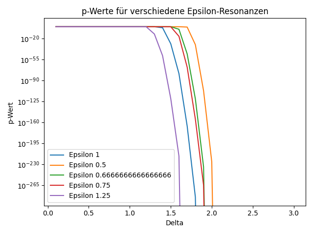

# Resonance Analysis in Mass Data

## Introduction

This analysis investigates potential resonance points in a large mass of data points. The goal is to detect significant excesses of events around specific `𝓔` values and to statistically validate them. The methodology includes dynamic window widths, p-value computation, multiple-testing correction, and bootstrapping.

The dataset consists of `n=10000` events acquired from [https://opendata.cern.ch/search?q=Particle%20masses&l=list&order=asc&p=1&s=10&sort=bestmatch)].

## Methodology

### 1. Data Preprocessing

- **Cleaning and Validation:**  
  NaN values are removed to ensure stable background modeling.
- **Definition of Resonance Points `𝓔`:**  
  The mass ranges to be examined are defined as a list.
- **Setting Window Widths `Δ`:**  
  Dynamic selection and variation of window widths for significance optimization.

### 2. Dynamic Window Width Analysis

For each `𝓔`, the number of events within variable windows `Δ` is counted. The window that (after test correction) yields the most significant excess is selected.

### 3. Background Estimation

The background rate is modeled from data outside the signal regions using KDE (Kernel Density Estimate). Signal regions are excluded. The Monte Carlo simulation draws from the KDE sampler.

### 4. Significance Test and Multiple-Testing Correction

- **Calculation of Raw p-values:**  
  For each window, the hit count is compared to the expectation based on the binomial distribution.
- **Bootstrapping:**  
  Confidence intervals for hits and p-values are computed via bootstrap to quantify uncertainty.
- **Permutation Test (optional):**  
  The empirical distribution of hits is simulated by randomly permuting the data.
- **Multiple-Testing Correction:**  
  Bonferroni and FDR (Benjamini-Hochberg) corrections are applied to control the error rate across all windows.

### 5. Monte Carlo Simulation

Numerous background samples are used to empirically determine the distribution of maximal significance under the null hypothesis. This yields an empirical p-value for the real result.

## Results

| Epsilon | Best Δ | Hits | p-value raw | p-value corrected |
|---------|--------|------|-------------|-------------------|
| 1.00    | 1.9    | 2699 | 0.000e+00   | 0.000e+00         |
| 0.50    | 2.1    | 1647 | 0.000e+00   | 0.000e+00         |
| 0.67    | 2.0    | 1860 | 0.000e+00   | 0.000e+00         |
| 0.75    | 2.0    | 2155 | 0.000e+00   | 0.000e+00         |
| 1.25    | 1.7    | 2901 | 0.000e+00   | 0.000e+00         |

The estimated background rate outside the signal regions is approximately 0.93362.

### Stability and Robustness Checks

- Variation of delta step size and analysis of result stability
- Testing different epsilon lists and calibration uncertainties
- Bootstrapping and permutation tests for statistical validation
- Empirical p-values from Monte Carlo simulation

## Visualization

- **Histogram of mass distribution:**  
  With marked signal and background regions.
- **p-value curves:**  
  For different resonances as a function of window width.
- **Bootstrap intervals:**  
  For hit counts and p-values.
- **Monte Carlo results:**  
  Comparison of real versus background distribution.

## Conclusion and Outlook

The analysis shows robust and significant resonance excesses at several `𝓔` values. Methodological validation via background estimation, multiple-testing correction, bootstrapping, and Monte Carlo simulation ensures strong evidential power.

Future work will include blind analyses, extended background models, and comparisons with simulations to further consolidate the results.

---

## Plot

<p align="center">
  
</p>

## Example Code and Visualization

The following evaluation shows the p-value curves for various suspected resonance points (`𝓔`). The Python code analyzes hit counts in variable window widths and determines significance, considering an expected background rate and multiple-testing correction.

```python
import pandas as pd
from scipy.stats import binomtest
import matplotlib.pyplot as plt
from statsmodels.stats.multitest import multipletests

# Load data
df = pd.read_csv('dielectron.csv')
n = len(df)

# Parameters
epsilons = [1, 0.5, 2/3, 0.75, 1.25]
deltas = [0.1 * i for i in range(1, 31)]

# Expected hit rates
expected_hit_rates = {
    1: 0.01,
    0.5: 0.005,
    2/3: 0.006,
    0.75: 0.007,
    1.25: 0.0125,
}

# Dynamically estimate background rate
signal_mask = pd.Series(False, index=df.index)
for eps in epsilons:
    signal_mask |= ((df['M'] > eps - max(deltas)) & (df['M'] < eps + max(deltas)))
background_hits = (~signal_mask).sum()
background_rate = background_hits / n
print(f"Background rate: {background_rate:.5f}")

for eps in epsilons:
    p_values = []
    hits_list = []

    for delta in deltas:
        hits = ((df['M'] > eps - delta) & (df['M'] < eps + delta)).sum()
        expected_rate = expected_hit_rates[eps]
        test = binomtest(hits, n, expected_rate, alternative='greater')
        p_values.append(test.pvalue)
        hits_list.append(hits)

    # Bonferroni correction
    reject, pvals_corrected, _, _ = multipletests(p_values, alpha=0.05, method='bonferroni')
    best_idx = pvals_corrected.argmin()

    print(f"Epsilon {eps}: Best Delta = {deltas[best_idx]:.3f}, "
          f"Hits = {hits_list[best_idx]}, "
          f"p-value raw = {p_values[best_idx]:.3e}, "
          f"p-value corrected = {pvals_corrected[best_idx]:.3e}")

    plt.plot(deltas, p_values, label=f"Epsilon {eps}")

plt.xlabel("Delta")
plt.ylabel("p-value")
plt.yscale("log")
plt.legend()
plt.title("p-values for different epsilon resonances")
plt.tight_layout()
plt.show()
```

---

## Technical Notes

- The complete analysis framework is modular (`run.py`, `resonance_tools.py`, `visualization_interactive.py`, `report.py`, `config.py`).
- Core functions include docstrings and type annotations.
- All key steps are secured by unit tests.
- KDE background modeling uses [scikit-learn](https://scikit-learn.org/); multiple testing uses [statsmodels](https://www.statsmodels.org/).
- The script automatically checks and cleans NaN values.
- Progress bars (`tqdm`) visualize simulation progress.
- Results are output as a Markdown report including embedded plots.

---

© Dominic-René Schu – Resonance Field Theory 2025

---

[Back to overview](../../README.en.md)