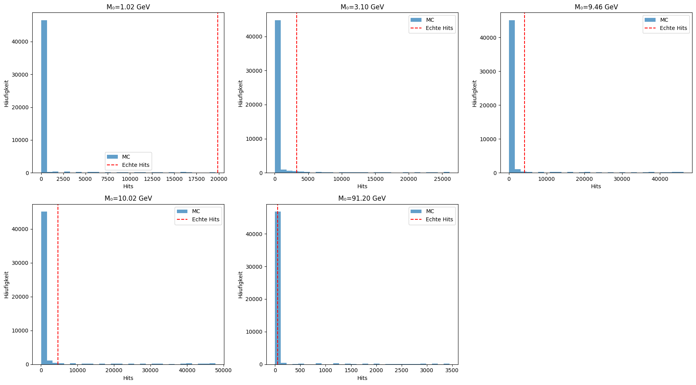
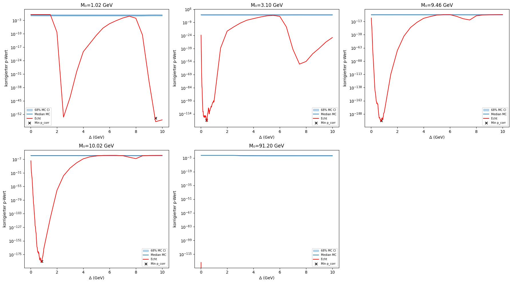
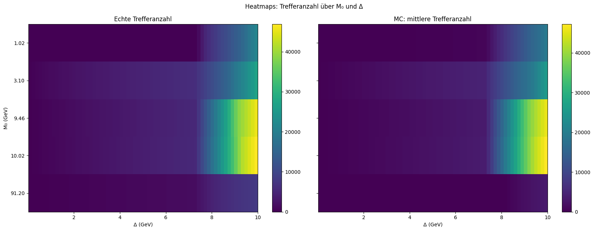

# Resonance Analysis Report
Created: 2026-02-27 17:51

## Overview of Key Metrics

| M₀ (GeV) | Δ (opt.) | Hits | [16%, 84%] | p_raw | p_corr | empir. p |
|----------|---------|------|------------|-------|--------|----------|
| 1.02 | 9.500 | 19869 | [19743, 19993] | 1.57e-56 | 1.07e-54 | 0 |
| 3.10 | 0.440 | 3256 | [3201, 3311] | 1.51e-123 | 1.02e-121 | 0 |
| 9.46 | 0.780 | 4186 | [4123, 4249] | 4.42e-203 | 3.01e-201 | 0 |
| 10.02 | 0.840 | 4625 | [4560, 4691] | 7.58e-190 | 5.16e-188 | 0 |
| 91.20 | 0.040 | 52 | [45, 59] | 0.00e+00 | 0.00e+00 | 0 |

### Monte Carlo Hits vs. Real Hits

### p-value Curves over Δ

### Heatmaps Hit Count

## Interpretation

- For M₀=1.02 GeV the empirical p-value is 0 (highly significant). Hits found: 19869 (background expectation: 19868.0 [16%: 19743, 84%: 19993]).
- For M₀=3.10 GeV the empirical p-value is 0 (highly significant). Hits found: 3256 (background expectation: 3256.0 [16%: 3201, 84%: 3311]).
- For M₀=9.46 GeV the empirical p-value is 0 (highly significant). Hits found: 4186 (background expectation: 4186.0 [16%: 4123, 84%: 4249]).
- For M₀=10.02 GeV the empirical p-value is 0 (highly significant). Hits found: 4625 (background expectation: 4626.0 [16%: 4560, 84%: 4691]).
- For M₀=91.20 GeV the empirical p-value is 0 (highly significant). Hits found: 52 (background expectation: 52.0 [16%: 45, 84%: 59]).
