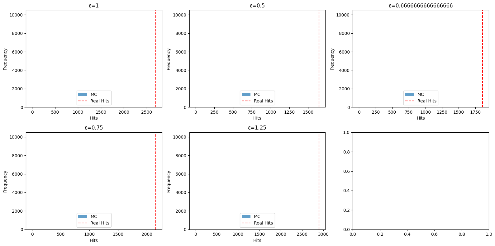
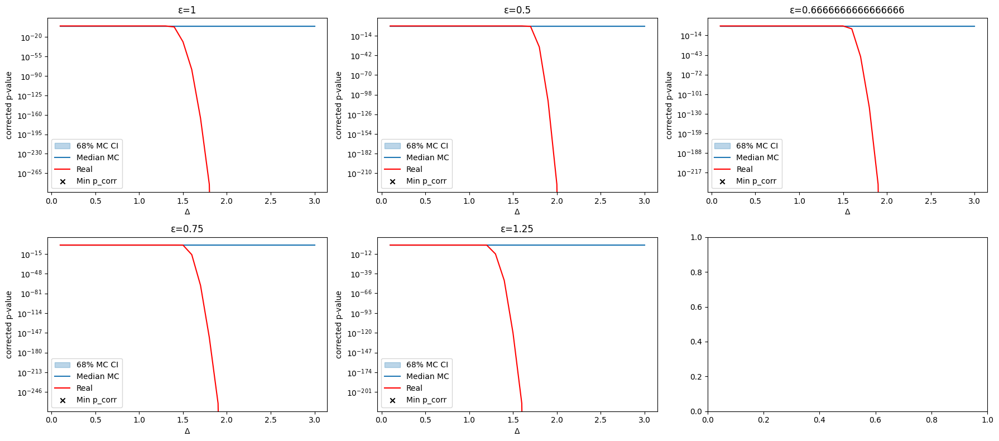
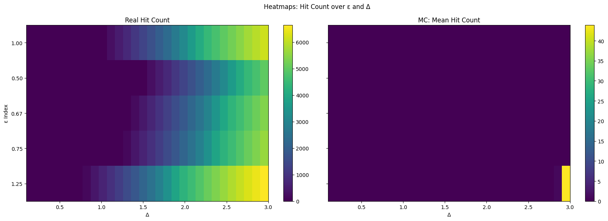

# Monte Carlo Simulation for Resonance Analysis

*[Detailed results and interpretation report → report_out/resonance_report.md](./report_out/resonance_report.md)*

## Introduction

The Monte Carlo simulation is a central tool in the statistical evaluation of scientific datasets. In this analysis, it is used to determine the probability that an observed excess of events in the region of a suspected resonance point (**𝓔**) could be explained purely by background fluctuations.

### Scientific Context

Monte Carlo tests are standard in modern physics, data science, and many other research fields whenever analytical solutions are too complex or not available. They provide a robust, empirical determination of significances, especially for adaptive or non-trivial search procedures as used in this resonance analysis.

## Objective

The objective is to quantify the empirical significance (p-value) of the observations by simulating many background scenarios and comparing them to the real data.

## Methodology

### Background Modeling

* The background distribution is extracted from the measurement data – explicitly excluding the signal regions (around the investigated **𝓔**).
* A kernel density estimator (KDE) is used to create a smooth probability distribution from this background.

### Conducting the Monte Carlo Simulation

* Many (e.g., 1,000–10,000) *pseudo-experiments* are performed, each drawing the same number of events as in the original dataset from the KDE model.
* For each *pseudo-experiment*, the full resonance analysis is repeated:
  * The number of hits in variable windows (**Δ**) around each **𝓔** is determined.
  * p-values are calculated using the same tests as for the original data.
  * The optimal window sizes are automatically determined for each case.
* The most extreme hit counts and p-values are recorded for each run.

### Determination of the Empirical p-Value

* The empirical p-value is the fraction of simulation runs in which an excess at least as extreme as in the real data is observed.
* Example: If the empirical p-value ≈ 0, then no simulation observed a signal as strong as the one found in the real data.

## Visualization of Results

### 1. Monte Carlo Hits vs. Real Hits

The histogram shows how often certain hit counts in the optimal window for each **𝓔** occur in the Monte Carlo simulation. The red line marks the value from the real data.



---

### 2. p-Value Curves over Window Width **Δ**

Here you see, for each resonance point **𝓔**, the p-values from the MC simulations (median and 68% interval) and the real data as a function of **Δ**.



---

### 3. Heatmaps: Hit Count over **𝓔** and **Δ**

The heatmaps show the hit counts for all combinations of **𝓔** and **Δ**, once for the real data and once as the mean of the Monte Carlo simulations.



---

## Interpretation

* The Monte Carlo simulation reveals how extraordinary the observed excesses are compared to the background.
* Empirical p-values < 0.01 – especially p ≈ 0 – indicate an extremely low probability that the findings are due to chance.
* The graphical comparison (histograms, p-value curves, heatmaps) vividly illustrates the difference between signal and background.

## Notes on the Code

* The simulation uses `scikit-learn` for KDE, `numpy` and `pandas` for data handling, and `matplotlib` for visualization.
* Progress bars (`tqdm`) display simulation progress.
* All key parameters such as **𝓔**, **Δ**, and the number of simulations are set centrally in `config.py`.
* The most important plots are automatically saved in the folder `report_out/figures` and are directly embedded here.

### Running the Simulation

To run the Monte Carlo simulation yourself, follow these steps:

1. Navigate to the project directory.
2. Ensure all required Python packages are installed (see `requirements.txt` if provided).
3. Start the main script, e.g., with:

   ```bash
   python fakten/empirisch/monte_carlo_test/run.py
   ```

   or run the accompanying Jupyter notebook, if available.

4. The generated results and plots can be found in the folder `report_out/figures`.

## Conclusion

The Monte Carlo method provides a robust way to statistically validate resonance effects. Through targeted background modeling and repeated random simulation, the significance of observations can be determined empirically and transparently.

Future extensions could integrate adaptive window sizes, multiple hypothesis testing, or Bayesian approaches.

---

© Dominic-René Schu – Resonance Field Theory 2025

---

[Back to overview](../../../README.en.md)