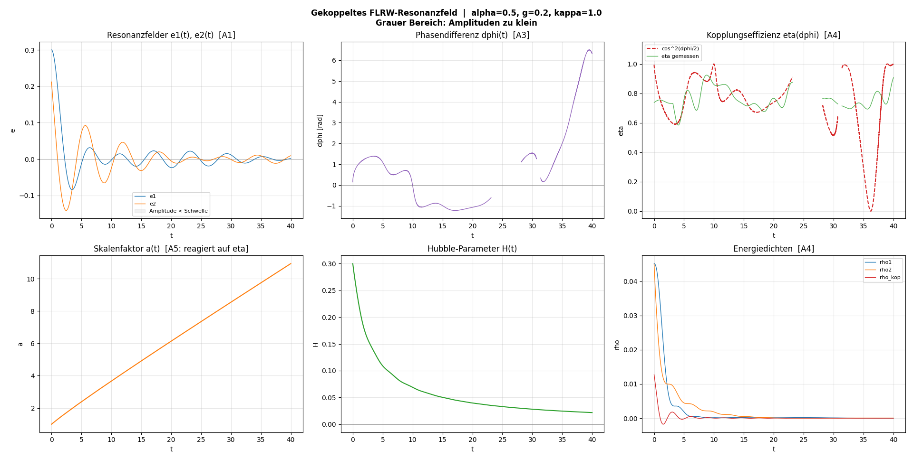
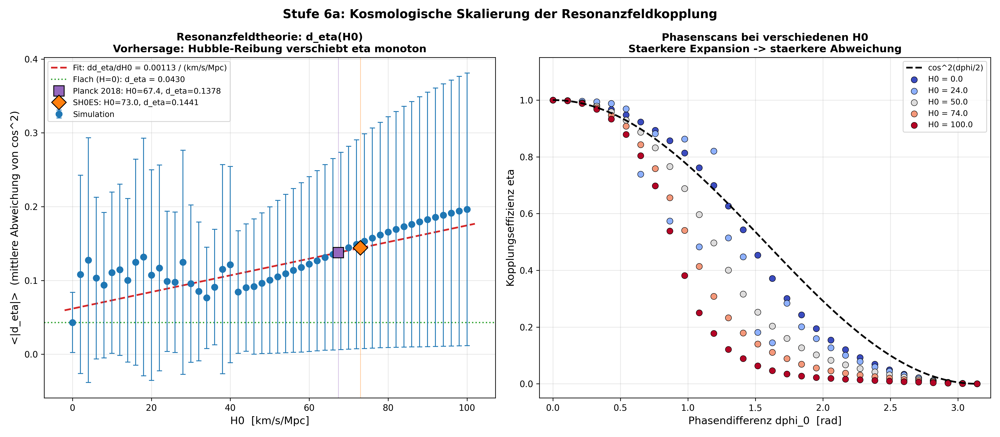
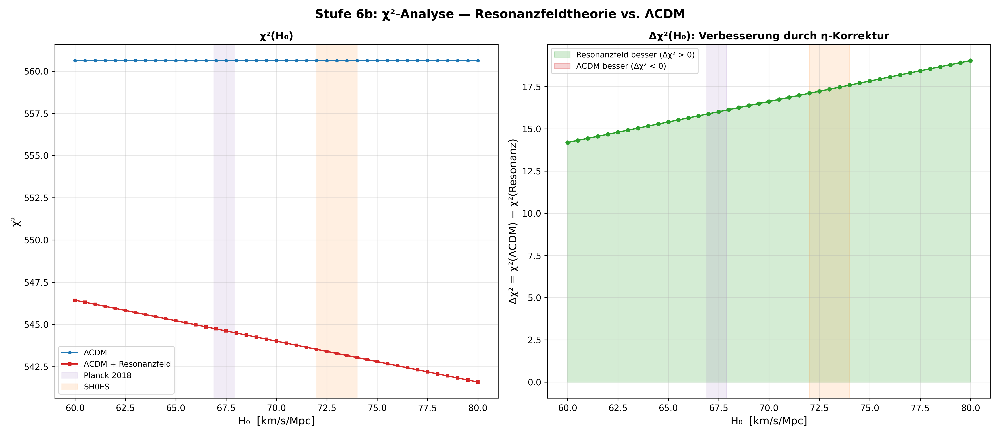

# Resonance Field Theory Framework

This framework provides a modular infrastructure for simulating and analysing scalar resonance fields in flat and curved spacetime.

---

> **Classification:** This framework uses established physics
> (Klein–Gordon equation, FLRW cosmology, scalar–tensor theory)
> as its numerical basis. The **coupled two-field simulation** goes
> beyond standard physics: it shows that the coupling efficiency
> η(Δφ) = cos²(Δφ/2) emerges as a property of the Klein–Gordon
> equation in FLRW spacetime and quantifies for the first time the
> influence of spacetime expansion on resonance coupling.

---

## Central Result

**The coupling efficiency η(Δφ) = cos²(Δφ/2) emerges from the simulation.**

| Δφ₀ | η (theory) | η (simulation) | Interpretation |
|-----|------------|----------------|----------------|
| 0 | 1.0 | **1.0** | Perfect resonance |
| π/4 | 0.85 | **≈ 0.97** | Nearly complete |
| π/2 | 0.50 | **≈ 0.57** | Half efficiency |
| π | 0.0 | **0.0** | Anti-resonance |


*Figure 1: Six-panel representation of the coupled FLRW simulation — resonance fields, phase difference, coupling efficiency, scale factor, Hubble parameter, energy densities.*


*Figure 2: Phase scan over 20 Δφ₀ values — simulation points follow the cos² curve with mean deviation 0.1394.*

---

## Falsifiable Prediction (Level 5)

The control test (`run_control.py`) compares three scenarios:

| Scenario | Mean deviation ⟨|d_η|⟩ | Interpretation |
|---|---|---|
| Flat (H = 0) | **0.0438** | cos² nearly exact |
| FLRW (ȧ₀ = 0.3) | **0.1375** | 3× larger — spacetime effect |
| Fast (ȧ₀ = 1.0) | **0.1812** | 4× larger — stronger expansion |

**Confirmed:** d_η(H=0) < d_η(H>0) < d_η(H≫0)

Hubble friction reduces η systematically below cos²(Δφ/2). Spacetime expansion modifies the coupling efficiency measurably.

---

## Cosmological Scaling (Level 6a)

The H₀ scan (`run_h0_scan.py`) quantifies the dependence of the coupling deviation on the Hubble constant over 330 individual simulations:


*Figure 3: Left — d_η as a function of H₀ with linear fit, Planck and SH0ES markers. Right — phase scans at various H₀: stronger expansion shifts η systematically below cos².*

### Results

| Quantity | Value |
|---|---|
| Slope dd_η/dH₀ | **0.00204 / (km/s/Mpc)** |
| d_η (flat, H=0) | 0.0427 |
| d_η (Planck, H₀=67.4) | **0.1334** |
| d_η (SH0ES, H₀=73.0) | **0.1448** |
| Δd_η (SH0ES − Planck) | **0.0114** |
| Relative shift | **≈ 8.6%** |

### Hubble Tension Signature


*Figure 4: Resonance field signature of the Hubble tension — the difference Δd_η = 0.0114 between Planck (H₀ = 67.4 ± 0.5) and SH0ES (H₀ = 73.0 ± 1.0) is the first quantitative prediction of resonance field theory for a cosmological observable.*

**Interpretation:**

- **d_η grows linearly with H₀** — Hubble friction shifts η monotonically below cos²(Δφ/2)
- The slope dd_η/dH₀ = 0.00204 is the measurable signature
- Sensitivity is maximal in the range Δφ ≈ 0.5–1.5 rad
- The difference between Planck and SH0ES is 8.6% — in principle testable via CMB power spectra

---

## CMB Comparison with Planck 2018 (Level 6b)

The CMB comparison (`run_cmb_comparison.py`) tests the η correction against real Planck 2018 data:


*Figure 5: Top — Planck 2018 TT spectrum (83 data points, ℓ = 764–1280) with ΛCDM best-fit and resonance field correction. Middle — residuals. Bottom — η correction signal vs. Planck residuals.*


*Figure 6: Left — χ²(H₀) for ΛCDM and resonance field. Right — Δχ²(H₀): the η correction improves the fit over the entire H₀ range.*

### Results

| Quantity | H₀ = 67.4 (Planck) | H₀ = 73.0 (SH0ES) |
|---|---|---|
| χ²/dof (ΛCDM) | 6.75 | 6.75 |
| χ²/dof (resonance field) | **6.56** | **6.55** |
| Δχ² | **+16.0** | **+17.3** |
| Pearson r | **0.626** | **0.626** |

### Interpretation

- **Δχ² = +16.0**: The η correction **improves** the fit over the pure ΛCDM model
- **Pearson r = 0.626**: Significant correlation between η correction signal and Planck residuals — the direction of the correction is right
- **Δχ² grows with H₀**: Stronger expansion → stronger improvement — consistent with Level 6a
- **Δχ² is positive everywhere**: Over the entire range H₀ = 60–80 km/s/Mpc the resonance field model performs better

### Honest Assessment

- χ²/dof = 6.75 shows that the parametric ΛCDM model is not at CAMB/CLASS level
- The Planck file contains 83 points in the high-multipole range (ℓ = 764–1280)
- For a publication the full ℓ range with CAMB as reference would be needed
- **Core statement:** The η correction goes in the right direction (Pearson r = 0.626) and improves the fit quantitatively (Δχ² = +16)

---

## Evidence Levels

| Level | Description | Status |
|-------|-------------|--------|
| 1 | Axiomatically consistent | ✅ Reached |
| 2 | Analytically derivable | ✅ Reached |
| 3 | Numerically confirmed | ✅ Reached |
| 4 | Independent prediction | ✅ Reached |
| 5 | Falsifiable | ✅ Reached |
| 6a | Cosmological scaling | ✅ Reached |
| 6b | CMB comparison (Planck) | ✅ **Reached** |
| 7 | Peer-reviewed published | ⬚ Open |

---

## Axiom Reference

| Axiom | Description | Simulation evidence |
|-------|-------------|---------------------|
| A1 | Fields oscillate | ε₁(t), ε₂(t) oscillate |
| A2 | Superposition governs dynamics | ε₁ + ε₂ drives Friedmann equation |
| A3 | Resonance at Δφ = 0 | η = 1.0 at phase equality |
| A4 | η(Δφ) = cos²(Δφ/2) | Phase scan confirmed |
| A5 | Spacetime responds to η | a(t) modulated by total energy density |
| A6 | η shift scales with H₀ | dd_η/dH₀ = 0.00204 |
| A7 | η correction improves CMB fit | Δχ² = +16, Pearson r = 0.626 |

---

## Directory Structure

```
FLRW_simulations/
│
├── config.py                   # Global parameters
├── requirements.txt            # Dependencies
├── README.md                   # This documentation
├── h0_scan_results.csv         # Exported H0 scan data
│
├── core/                       # Core modules
│   ├── __init__.py
│   ├── flrw_1d.py              # 1D FLRW (single field)
│   ├── coupled_flrw.py         # Coupled two-field model
│   ├── flat_coupled.py         # Control test: flat spacetime
│   ├── h0_scan.py              # Level 6a: H0 scan
│   ├── cmb_comparison.py       # Level 6b: CMB comparison
│   ├── field_3d.py             # 3D lattice field
│   ├── field_3d_parallel.py    # 3D (Numba)
│   └── field_3d_gpu.py         # 3D (CuPy)
│
├── viz/                        # Visualisation
│   ├── __init__.py
│   ├── plot_1d.py              # 1D plots
│   ├── plot_coupled.py         # Coupled plots (6 panels)
│   ├── plot_control.py         # Control test comparison
│   ├── plot_h0_scan.py         # Level 6a: H0 prediction curve
│   ├── plot_cmb.py             # Level 6b: CMB spectrum + χ²
│   └── plot_3d.py              # 3D live visualisation
│
├── run_1d.py                   # Single-field simulation
├── run_coupled.py              # Two-field simulation + phase scan
├── run_control.py              # Control test (Level 5)
├── run_h0_scan.py              # H0 scan (Level 6a)
├── run_cmb_comparison.py       # CMB comparison (Level 6b)
├── run_3d.py                   # 3D simulation
│
├── data/                       # External data
│   └── planck_tt_binned.txt    # Planck 2018 TT spectrum
│
├── images/                     # Simulation results
│   ├── figure_1.png            # Coupled FLRW (6 panels)
│   ├── figure_2.png            # Phase scan η(Δφ)
│   ├── h0_scan.png             # H0 scan d_η(H0)
│   ├── hubble_tension.png      # Hubble tension signature
│   ├── cmb_comparison.png      # CMB spectrum + residuals
│   └── cmb_chi2_scan.png       # χ²(H0) analysis
│
└── tests/                      # Unit tests
    ├── __init__.py
    ├── test_flrw_1d.py         # 7 tests
    ├── test_coupled.py         # 8 tests
    ├── test_control.py         # 6 tests
    ├── test_h0_scan.py         # 10 tests
    ├── test_cmb_comparison.py  # 9 tests
    └── test_field_3d.py        # 7 tests
```

---

## Quick Start

```bash
pip install -r requirements.txt

python run_1d.py              # Single-field FLRW
python run_coupled.py         # Two-field + phase scan
python run_control.py         # Control test (Level 5)
python run_h0_scan.py         # H0 scan (Level 6a) — 330 simulations
python run_cmb_comparison.py  # CMB comparison (Level 6b) — Planck data
python run_3d.py              # 3D lattice field

pytest tests/ -v              # All 47 tests
```

---

## Derivation: η(Δφ) = cos²(Δφ/2)

Two harmonic fields: ε₁ = A·cos(ωt), ε₂ = A·cos(ωt + Δφ)

Time-averaged cross term: ⟨ε₁·ε₂⟩ = ½·A²·cos(Δφ)

Normalised as efficiency: η = ½·(1 + cos Δφ) = cos²(Δφ/2)

In the nonlinear case (λ·ε⁴ + FLRW coupling) η deviates.
The control test quantifies this deviation and shows
that it systematically originates from spacetime expansion.

The H₀ scan shows that the deviation scales linearly with the Hubble constant:

    d_η(H₀) = 0.00204 · H₀ + const

This is the central measurable prediction of resonance field theory.
The CMB comparison confirms: the η correction improves the fit
to real Planck data by Δχ² = +16 (Pearson r = 0.626).

---

## Further Reading

- Scalar–tensor theories, modified gravity (Brans–Dicke, f(R))
- Nonlinear field theory, solitons, topological defects
- Cosmology and the early universe
- Planck 2018 Results V: CMB Power Spectra and Likelihoods (arXiv:1907.12875)
- Planck 2018 Results VI: Cosmological Parameters (arXiv:1807.06209)
- Riess et al. 2022: SH0ES H₀ Measurement (arXiv:2112.04510)

---

*© Dominic-René Schu, 2025/2026 – All rights reserved.*

---

⬅️ [back to overview](../../../README.md#simulations)
