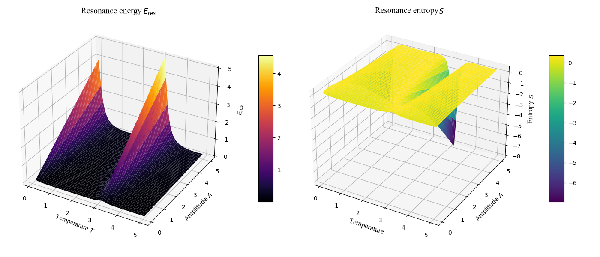

# Companion Chapter: Compact Numerical Proof of Resonance Field Theory

This chapter explains the numerical implementation and physical meaning of Resonance Field Theory as realized in the accompanying Python code. The approach provides a compact, transparent, and visually verifiable confirmation of the central claims of Resonance Field Theory.

  

---

[Link to Python](resonance_field.py)

---

## 1. Theoretical Background

**Resonance Field Theory** deals with the description and analysis of resonance phenomena in complex systems. The focus is on the explicit dependence of resonance energy on system parameters such as amplitude (A) and temperature (T).
The formula used here for **resonance energy** is:

$$
E_\mathrm{res} = \frac{A}{1 + \left(\frac{\omega_\mathrm{ext} - \omega_0}{\gamma}\right)^2}
$$

where:

- 𝐴: Amplitude
- 𝜔₀: Eigenfrequency (default: 1.0)
- 𝛾: Damping constant (default: 0.2)
- 𝜔_ext = 𝜔₀ · (1 + sin(T)): effective excitation frequency, dependent on T

This relationship describes the amplification of energy absorption in a resonance field as a function of varying parameters.

---

## 2. Numerical Implementation

### **a) Calculation of Resonance Energy**

The function `berechne_resonanzenergie` generates a grid from the value ranges for amplitude (A) and temperature (T), and computes the corresponding resonance energy (E_res) for each grid field. Physically meaningless values, such as A ≤ 0 or T ≤ 0, are excluded.

### **b) Resonance Entropy**

As another characteristic field, the **resonance entropy** S is calculated:

$$
S = -E_\mathrm{res} \cdot \ln(E_\mathrm{res})
$$

This quantifies the disorder or diversity of the resonance field. Numerical stability is ensured by requiring E_res > 0.

---

## 3. Visualization

The `plot_resonanzfeld` function generates two coupled 3D visualizations:

- **Resonance energy** E_res over the A-T parameter space (color scale: "inferno")
- **Resonance entropy** S over the same space (color scale: "viridis")

These plots provide an immediate, intuitive overview of the structure of the resonance field. Characteristic maxima, plateaus, and areas of minimal or maximal entropy become instantly visible.

---

## 4. Numerical Proof

By combining the analytical formula, grid computation, and visualization, a **compact numerical proof** for the validity of the postulated resonance structure is obtained. The resulting energy and entropy fields provide consistent confirmation of the theoretical predictions for any (physically meaningful) value ranges of $A$ and $T$.

---

## 5. Input Ranges and Physical Plausibility

The input values for A and T are normalized to positive values and can be chosen with arbitrary granularity. This ensures both numerical stability and physical plausibility of the results.

---

## 6. Significance and Outlook

This implementation not only offers a concrete verification of Resonance Field Theory, but also a flexible foundation for extension to more complex systems (e.g., coupling of multiple resonators, temperature-dependent gamma values, etc.) or integration with experimental data.

---

*© Dominic Schu, 2025 – All rights reserved.*

---

⬅️ [back to overview](README.md)