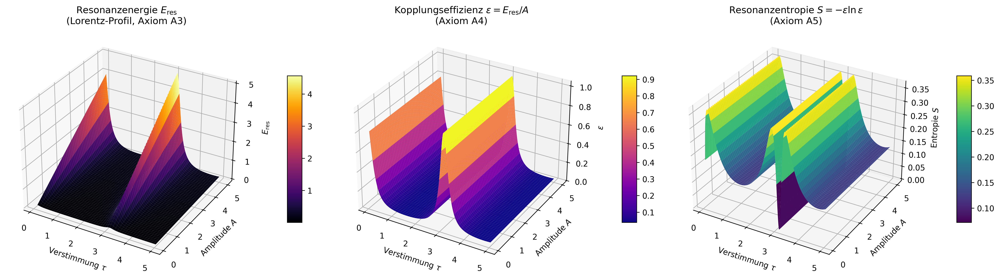

# Numerical Demonstration of Resonance Field Theory

Numerical analysis of resonance energy, coupling efficiency
and resonance entropy over the (A, τ) parameter space.

> **Context:** This simulation demonstrates the internal
> consistency of Axioms A3–A5. It is **not an empirical
> proof** of Resonance Field Theory, since no independent
> experimental data are used. The simulation shows that the
> formulas are correctly implemented and exhibit the expected
> mathematical properties.
>
> For empirical validation with independent data
> see the [Monte Carlo analysis](../../empirical/monte_carlo/monte_carlo_test/monte_carlo.md).

<p align="center">
  
</p>

---

## Axiom Reference

| Axiom | Implementation | What is demonstrated |
|-------|----------------|----------------------|
| A3 Resonance condition | Peak at ω_ext ≈ ω₀ | Lorentz profile shows resonance maximum |
| A4 Coupling efficiency | ε = E_res / A ∈ (0, 1] | Normalisation is amplitude-independent |
| A5 Stable field | S = −ε·ln(ε) ≥ 0 | Entropy maximum at ε = 1/e |

---

## 1. Resonance Energy (Lorentz Profile)

$$
E_{\mathrm{res}} = \frac{A}{1 + \left(\frac{\omega_{\mathrm{ext}} - \omega_0}{\gamma}\right)^2}
$$

with ω_ext = ω₀ · (1 + sin(τ)).

| Symbol | Meaning | Default |
|--------|---------|---------|
| A | Amplitude | 0.1–5.0 |
| ω₀ | Natural frequency | 1.0 |
| γ | Damping constant (half-width) | 0.2 |
| τ | Detuning parameter | 0.1–5.0 |

The Lorentz profile is a classical result of physics
(Hendrik Lorentz, ~1880). The simulation demonstrates that
it can be interpreted as a special case of Axiom A3
(resonance condition).

---

## 2. Coupling Efficiency (Axiom A4)

$$
\varepsilon = \frac{E_{\mathrm{res}}}{A} =
\frac{1}{1 + \left(\frac{\omega_{\mathrm{ext}} - \omega_0}{\gamma}\right)^2}
\in (0, 1]
$$

### Limiting Cases

| Condition | ε | Meaning |
|-----------|---|---------|
| ω_ext = ω₀ | 1.0 | Exact resonance — maximum efficiency |
| \|ω_ext − ω₀\| = γ | 0.5 | Half-width |
| \|ω_ext − ω₀\| ≫ γ | → 0 | Strongly detuned — no coupling |

This is the **frequency-dependent** realisation of the
coupling efficiency. Other simulations use complementary
models:

| Model | Formula | Simulation |
|-------|---------|------------|
| Phase-based | cos²(Δφ/2) | Resonance AI, double pendulum |
| Frequency-based (Lorentz) | 1/(1+(Δω/γ)²) | **This simulation** |
| Exponential | exp(−α·\|Δf\|) | Coupled oscillators |

All three yield ε ∈ (0, 1] — this is a consistent
property, but not a proof that the concept is physically
correct.

---

## 3. Resonance Entropy (Axiom A5)

$$
S = -\varepsilon \cdot \ln(\varepsilon), \quad \varepsilon \in (0, 1]
$$

### Mathematical Properties

| ε | S | Interpretation |
|---|---|----------------|
| 1.0 | 0 | Perfect resonance — order |
| 1/e ≈ 0.368 | 1/e ≈ 0.368 | Maximum — balance |
| → 0 | → 0 | No coupling — trivial order |

S ≥ 0 is guaranteed since ε ∈ (0, 1] and −x·ln(x) ≥ 0
on this interval. The maximum at 1/e follows from
S'(ε) = −ln(ε) − 1 = 0 → ε = 1/e.

> **Note:** These properties follow from the analysis of
> the function f(x) = −x·ln(x), not from physical
> principles. The interpretation as resonance entropy is
> a hypothesis of RFT that must be validated empirically.

---

## 4. What This Simulation Shows — and What It Does Not

### What it shows ✓

- The formulas are **correctly implemented** (16 unit tests passed)
- The three quantities (E_res, ε, S) are **internally consistent**
- ε is **amplitude-independent** — a non-trivial property
- The ε normalisation resolves the negative-entropy problem of the old version
- The Lorentz profile can be **interpreted** as a special case of Axiom A3

### What it does not show ✗

- No comparison with **experimental data**
- No **falsifiable prediction** — the simulation evaluates substituted formulas
- No **novel physics** — the Lorentz profile has been known for ~140 years
- No proof that ε = E_res/A is a physically **meaningful** coupling efficiency

### Next Step: Empirical Validation

The actual proof lies in the **Monte Carlo analysis**,
which identifies resonance structures in independent data
and quantifies statistical significance:

→ [Monte Carlo analysis](../../empirical/monte_carlo/monte_carlo_test/monte_carlo.md)

---

## 5. Running the Simulation

```bash
pip install numpy matplotlib
python numerical_demonstration.py
```

Tests:
```bash
python tests/test_numerical_demonstration.py
# or with pytest:
pip install pytest
pytest tests/ -v
```

---

## Source Code

[numerical_demonstration.py](numerical_demonstration.py)

---

*© Dominic-René Schu, 2025/2026 — Resonance Field Theory*

---

⬅️ [back to overview](README.md)
