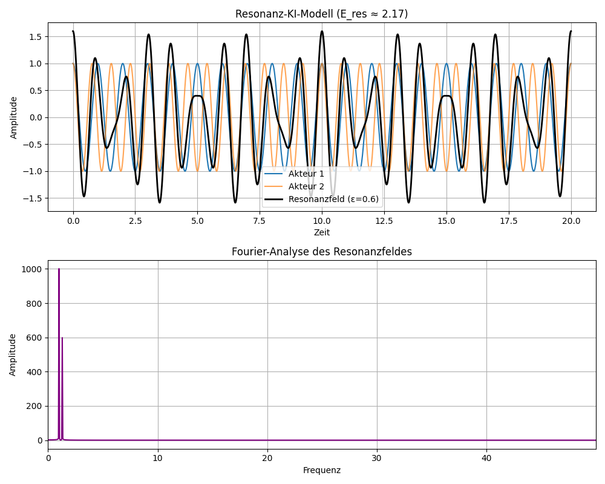

# Companion Chapter: Resonance AI Model – Two Coupled Agents and Field Analysis

This chapter explains the conceptual design, numerical implementation, and interpretation of the Resonance AI Model, which simulates the coupling of two oscillating "agents" within the framework of Resonance Field Theory. The numerical analysis links classical oscillation physics with modern signal processing and AI-related modeling.

  

---

[Link to Python](resonance_ai.py)

---

## 1. Model Concept and Physical Basis

The model considers **two agents** (e.g., oscillators, systems, or agents), each oscillating with its own frequency (f₁, f₂). Via a **coupling constant** (epsilon), they mutually influence each other. The coupling can represent many real-world applications, such as resonance phenomena in physics, biology, or social systems.

The **resonance field** is defined as a superposition of the individual oscillations:

$$
\psi_\mathrm{Res} = \psi_1 + \epsilon \psi_2
$$

with

$$
\psi_i = \cos(2\pi f_i t + \varphi_i)
$$

(φ_i: optional phase shift)

---

## 2. Calculation of Resonance Energy

The **resonance energy** E_res of the coupled system is analytically calculated as follows:

$$
E_\mathrm{res} = \pi \epsilon h \cdot \frac{f_1 + f_2}{2}
$$

Here, h denotes the normalized Planck constant.

---

## 3. Fourier Analysis

Fourier analysis of the resonance field provides insight into the frequency components present in the signal. This allows direct observation of how the coupling (epsilon) and the difference in agent frequencies influence the spectral composition of the field.

**Procedure:**
- Discrete Fourier Transform (`numpy.fft`) of the resonance field
- Visualization of the amplitude spectrum as a function of frequency

---

## 4. Visualization and Interpretation

The graphical output consists of two subplots:
1. **Time Domain:** The individual agent oscillations and the coupled resonance field over time.
2. **Frequency Analysis:** The amplitude spectrum of the resonance field, making dominant frequencies and modulations visible.

In this way, eigenfrequencies, coupling, and their effects on the overall system can be clearly understood.

---

## 5. Parameterization and Flexibility

All model parameters (frequencies, coupling, phases, time domain) are centrally configurable. This enables flexible adaptation to various scenarios, such as:
- Resonance vs. dissonance (close or distant frequencies)
- Strong vs. weak coupling
- Phase effects

---

## 6. Significance and Outlook

The Resonance AI Model demonstrates how simple coupling of individual systems can give rise to complex and emergent fields. The analysis provides a foundation for further simulations, e.g., with more than two agents, adaptive couplings, or AI-driven optimization of resonance conditions.

---

*© Dominic Schu, 2025 – All rights reserved.*

---

⬅️ [back to overview](../README.md)