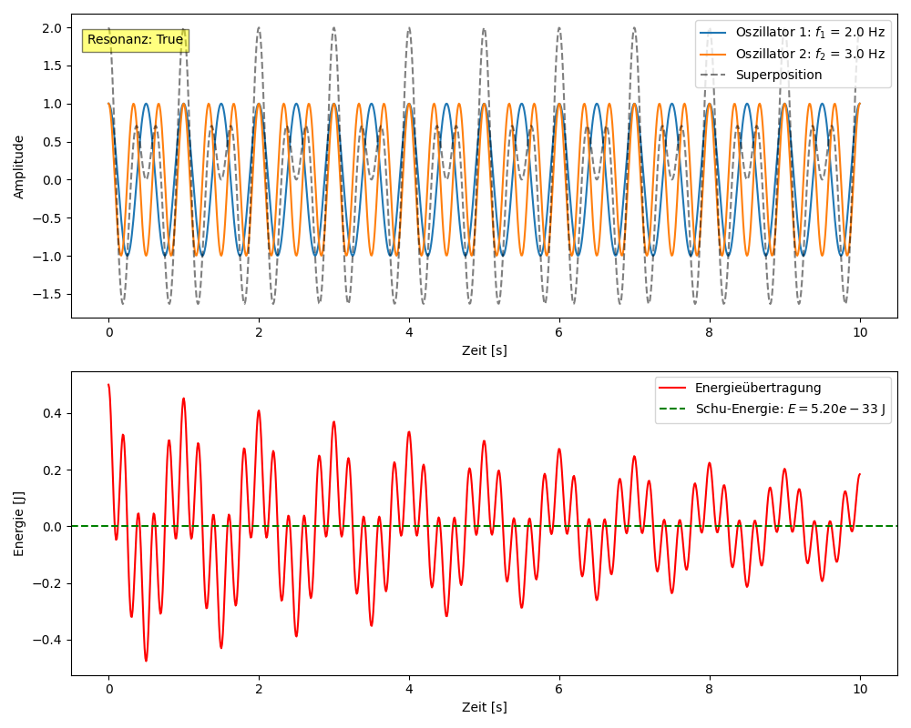

# Resonance Field Simulation with Resonance Field Equation

This interactive simulation visualizes the energy transfer between two oscillating oscillators based on the **Resonance Field Equation**:

$$
\mathbf{E} = \pi \cdot 𝓔 \cdot h \cdot (f_1 + f_2)
$$

---

## 🧭 Axioms of Resonance Field Theory

1. **Everything is oscillation.**  
   All forms of energy and matter are based on oscillations of an underlying resonance field.

2. **Resonance couples.**  
   Systems interact when their oscillations enter an integer ratio—that is, resonance.

3. **Energy transfer follows coupling.**  
   The stronger the resonance (coupling degree $$𝓔$$), the greater the energy transfer between fields.

4. **π is the scale for circular resonances.**  
   The constant $$\pi$$ is not only geometric, but also resonance-dynamically fundamental—it describes the measure of perfect feedback.

5. **h is the field’s quantum of information.**  
   Planck’s quantum of action $$h$$ (or alternatively $$\eta$$) describes the minimal unit of action in the resonance field.

6. **e becomes the resonance coupling constant.**  
   Euler’s number $$e$$ is reinterpreted as a fundamental constant for resonance coupling—replaced by $$𝓔$$ in the system.

7. **Observation generates resonance.**  
   The conscious observer acts as a filter, selectively resonating with fields and thus shaping reality.

---

## Features

Choice of coupling type:

- **Linear**:  
  $$
  E_\mathrm{trans} = 𝓔 \cdot \psi_1 \cdot \psi_2
  $$
	
- **Quadratic**:  
  $$
  E_\mathrm{trans} = 𝓔 \cdot \psi_1^2 \cdot \psi_2
  $$
- **Trigonometric**:  
  $$
  E_\mathrm{trans} = 𝓔 \cdot \sin(\psi_1) \cdot \sin(\psi_2)
  $$

- Display of the **resonance condition** for rational frequency ratios  
  $$
  \frac{f_1}{f_2} = \frac{n}{m}
  $$

- Optional use of a new natural constant $$\eta$$ instead of $$h$$  
- Interactive visualization with `ipywidgets`

---

<p align="center">
  
</p>

---

[Link to Python](../../simulations/resonance_field/resonance_field_theory_simulation.py)

---

## Requirements

- Python ≥ 3.8  
- Jupyter Notebook / JupyterLab  
- Installed packages:

```bash
pip install numpy matplotlib ipywidgets
```

---

*© Dominic Schu, 2025 – All rights reserved.*

---

⬅️ [back to overview](../README.en.md)