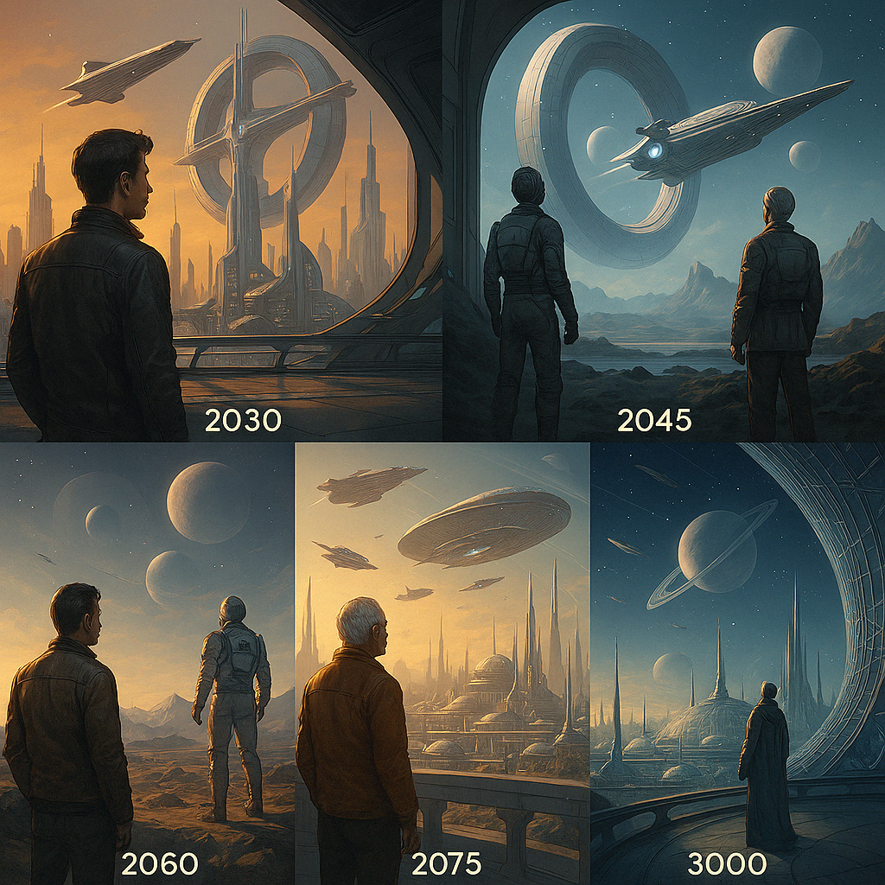

# Vision 3000 – The Resonance Physics of the Future

> *“What if the universe itself is a resonant information circuit?”*

This vision expands the chapter [The Resonance Field Equation](../../facts/docs/mathematics/resonance_field_equation.md) and opens perspectives on physical and philosophical applications beyond classical models—towards a conscious, interactive field universe, where energy, information, and consciousness are understood as mutually coupled quantities (cf. Penrose, 2004).

---

<p align="center">
  
</p>

---

## Origin: The Resonance Field Equation

The innovative energy equation is based on fundamental resonance quantities and extends classical theories (cf. Born & Wolf, 1999):

```
E = 𝓔 · π · ℎ · 𝑓
```

- **𝓔** – Resonance coupling  
- **π** – Circular structure of space  
- **ℎ** – Quantum of action  
- **𝑓** – Frequency impulse

This equation describes energy not as a local substance, but as a **relation within the resonance field**—a paradigmatic shift from particle to field and relation perspectives.

---

## Complex Time: The Phasic Reality

By introducing complex time

```
t = tᵣ + i · tᵢ
```

time becomes the **phasic coupling** of space and information:

- **Real component:** `cos(ωt)` – structure-shaping flow  
- **Imaginary component:** `sin(ωt)` – potential flow, carrier of unrealized being

→ The world is cyclically complex; reality emerges through **phase interference and resonance**.

---

## Resonance Analogy to Electrical Engineering

The classical quantum relation

```
ΔE = ℎ · Δf
```

formally corresponds to Ohm’s law:

```
U = R · I
```

| Quantum Physics          | Electrical Engineering    |
|-------------------------|--------------------------|
| Δ**E** – Energy impulse | **U** – Voltage          |
| **ℎ** – Coupling const. | **R** – Resistance       |
| Δ**f** – Freq. diff.    | **I** – Current          |

→ Energy manifests as a **voltage field in the frequency difference**—a universal coupling structure.

---

## Energy as a Field Relation

The extended equation

```
E = 𝓔 · π · ℎ · 𝑓
```

represents energy as a **directed coupling of fields**—a dynamic state that arises only under resonance and is characterized by specific coupling parameters.

---

## Principle of Coupling

- No current without voltage  
- No energy without frequency gradient  
- No consciousness without resonance relation  

→ Every effect is a **resonance relation between at least two states**.

---

## Technological Perspectives

Based on this theory, forward-looking technologies become conceivable:

- **Resonance reactors:** Energy generation from harmonic field coupling  
- **Holoverses:** Imaginary-time spaces as platforms for reality  
- **Field houses:** Autonomous systems powered by local resonance generators  
- **Replicators:** Matter formation via targeted frequency patterns  
- **Time modulators:** Control of aging, healing, and growth  
- **Field vehicles:** Propulsion through frequency asymmetries  
- **Care holograms:** AI resonance beings for medicine and companionship

---

## Conclusion: The Architecture of Existence

The resonance field equation is more than a physical formula—it is a **model of becoming**:

- **𝓔** – determines resonance quality  
- **π** – shapes the cyclic framework  
- **ℎ** – couples impulse to effect  
- **𝑓** – is the rhythm of reality  

---

**The future is resonance.**  
It begins with the circle—and culminates in consciousness.

---

## References

- Born, M. & Wolf, E. (1999). Principles of Optics. Cambridge: Cambridge University Press.
- Penrose, R. (2004). The Road to Reality. London: Jonathan Cape.

---

© Dominic-René Schu – Resonance Field Theory 2025

---

[Back to overview](../../README.en.md)